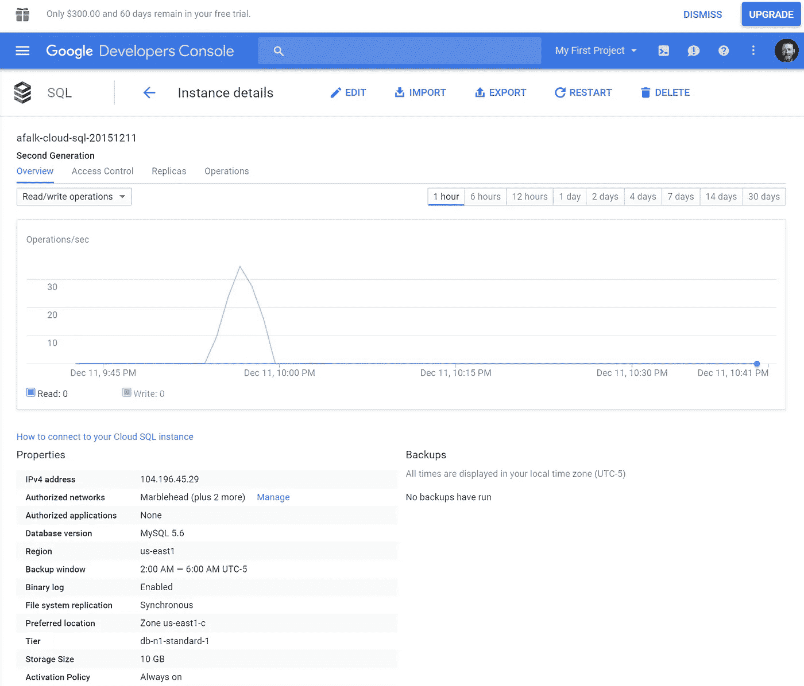
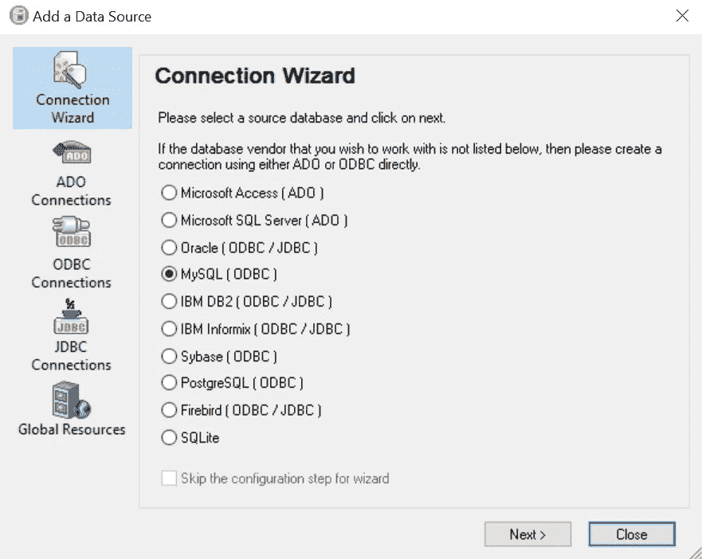
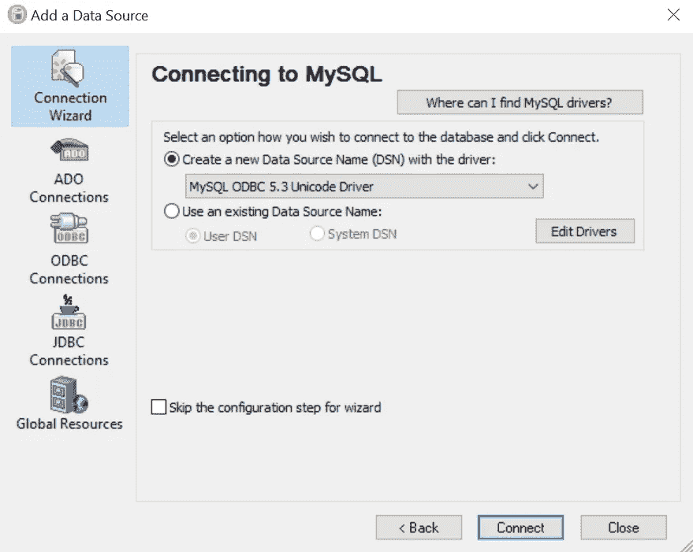
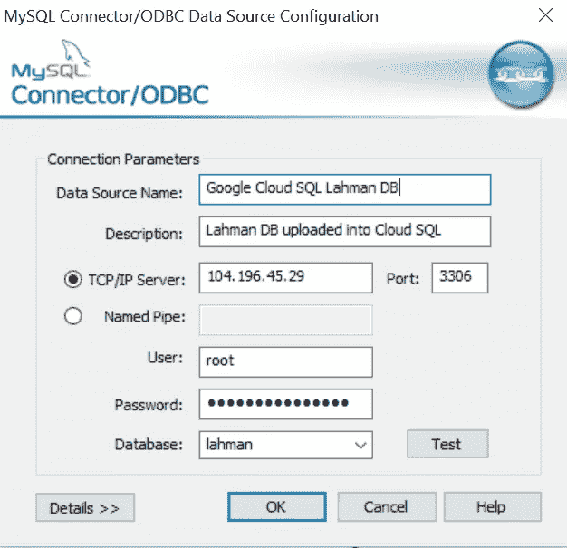
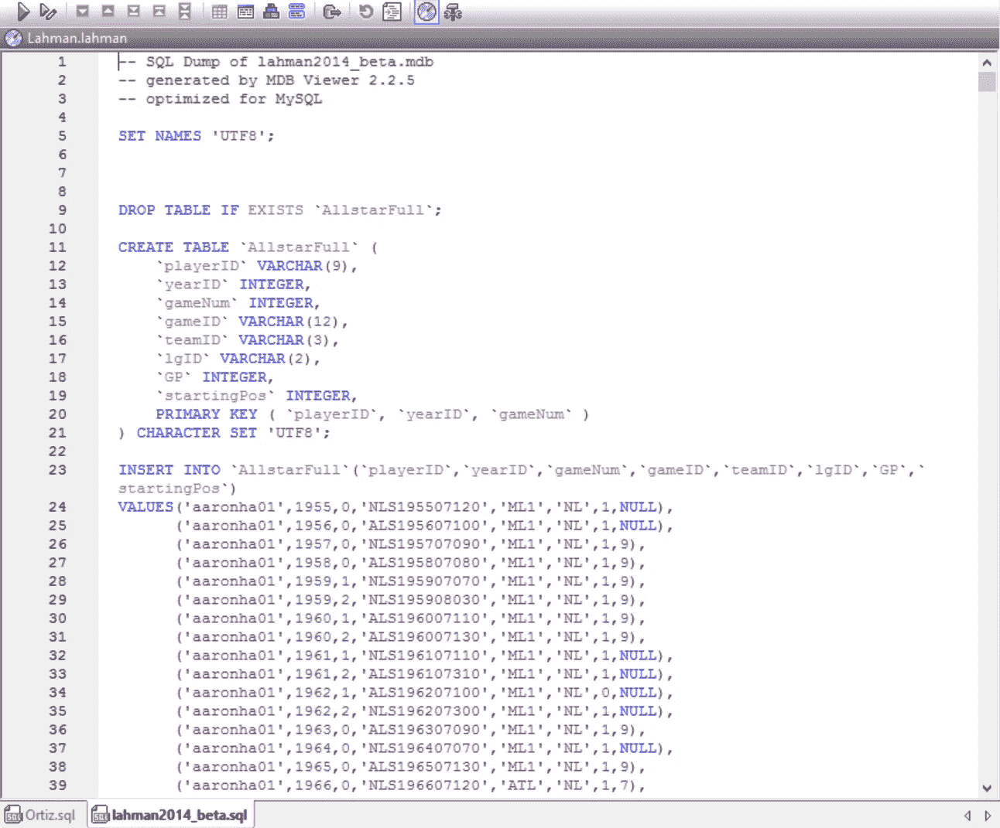
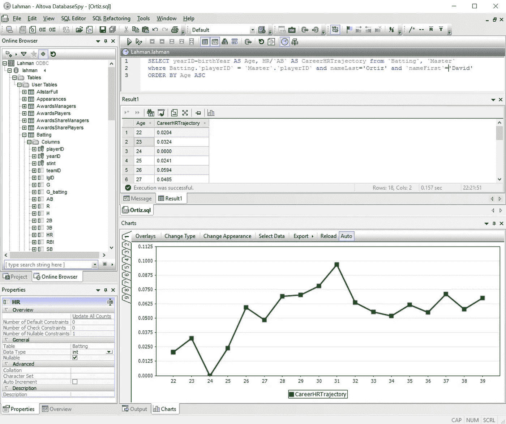

# 使用谷歌云 SQL

> 原文：<https://medium.com/google-cloud/using-google-cloud-sql-e3e4c123a89f?source=collection_archive---------0----------------------->


Google [最近宣布](http://googlecloudplatform.blogspot.com/2015/12/the-next-generation-of-managed-MySQL-offerings-on-Cloud-SQL.html)他们基于云 SQL 的下一代托管 MySQL 产品，所以我们想尝试一下，创建一个基于云的 SQL 数据库，然后我们可以利用它作为移动应用程序的后端，甚至从我们的桌面进行高级数据分析。

根据 Google 的说法，第二代云 SQL 的两个主要目标是更好的*性能*和*每美元的可伸缩性*。似乎他们成功实现了这些目标:第二代云 SQL 比第一代快 7 倍以上。它可以扩展到每个实例 10TB 的数据、15，000 IOPS 和 104GB 的 RAM，远远超过第一代产品。因此，它看起来像是移动应用程序的理想的、可扩展的基于云的数据库后端。

如果你按照谷歌博客文章上的说明去做，你首先要为谷歌云创建一个试用账户。然后，一旦您登录到 Google Developer 控制台，单击左上角的菜单按钮并选择 storage 部分下的 SQL。这将使您能够创建新的第二代云 SQL 实例:



强烈建议更改您的 root 密码，并仅允许从将托管您的开发人员计算机或您正在构建的移动应用程序的后端服务器的授权网络访问您的云实例。例如，如果在未来的博客文章中，我们将探索在这个数据库之上构建一个移动应用程序，而为我们的移动应用程序提供所有服务器功能和工作流的 [MobileTogether 后端服务器](http://www.altova.com/mobiletogether/server.html)将需要能够访问这个云 SQL 实例。

为了从您的桌面开发人员机器上使用云 SQL 实例，您需要[为您的机器下载 MySQL 工具](http://dev.mysql.com/downloads/)，这将使您能够使用 **mysql** 命令行工具。此外，要从您计算机上的其他应用程序使用云 SQL 数据库，您需要下载相应的 [MySQL 连接器](http://dev.mysql.com/downloads/connector/)。在这篇博客文章中，我们将使用 [Altova DatabaseSpy](http://www.altova.com/databasespy.html) 来访问 SQL 实例，上传一些数据，然后执行一些分析，因此您会想要[下载 MySQL Connector/ODBC for Windows](http://dev.mysql.com/downloads/connector/odbc/)。本质上，DatabaseSpy 类似于 Toad，但允许您同时连接到不同数据库服务器上的多个不同数据库实例。因此，您可以打开一个到云 SQL 的连接，一个到本地 SQL 服务器的连接，第三个到 Oracle 数据库的连接—所有这些都在一个工作区内完成。相当漂亮。

一个重要的注意事项:您需要确保下载了正确的连接器/ODBC 驱动程序。如果您使用 64 位版本的 DatabaseSpy，您还需要 64 位版本的 MySQL 连接器/ODBC 驱动程序。或者，更好的是，您可以下载 32 位和 64 位版本的 Connector/ODBC 并安装它们——然后您可以在您的机器上从 32 位和 64 位软件使用云 SQL。

为了用一些有用的数据填充我们的云 SQL 实例以进行实验和进一步分析，我们下载了优秀的[拉赫曼的棒球数据库](http://www.seanlahman.com/baseball-archive/statistics/)，它可以方便地作为压缩的 MySQL dump 获得。将它下载到我们的计算机上之后，我们就有了一个完整的 SQL 数据库表描述和所有数据——所有这些都在一个 SQL 文件中，因此可以很容易地上传到我们的云 SQL 实例中。

第一步是[在您的云 SQL](https://cloud.google.com/sql/docs/create-database) 实例中创建一个新数据库。您可以通过命令行 mysql 实用程序、Google Developer Console 或 cURL 来实现这一点——更多详细信息请参见本文开头的链接。我们将简单地称这个数据库为“拉赫曼”。

现在，我们可以从 DatabaseSpy 连接到这个数据库，方法是选择“Connect to a database”命令，并按照连接向导中的步骤进行操作。首先，我们选择 MySQL 作为数据库技术:



然后，我们确认使用了之前下载的 MySQL 连接器/ODBC 驱动程序:



最后，同样重要的是，我们指定云 SQL 实例的 IP 地址、用户名和密码，然后点击“Test”按钮来验证连接。如果可以的话，我们现在可以通过命名来创建一个数据源，并指定我们之前创建的“lahman”数据库:



现在我们准备将所有数据上传到新数据库的表格中。为此，我们只需打开先前下载并解压缩的 Lahman Baseball 数据库的 SQL 转储，在 DatabaseSpy 中如下所示:



如您所见，该数据库的 SQL 转储包含在新的云 SQL 实例上重新创建所有表所需的所有命令。所以我们现在要做的就是按下“执行”键，然后坐以待毙。根据您的互联网连接速度，这可能需要一点时间，因为您现在正在创建 24 个表，其中包含从 1871 年到 2014 年的非常详细的棒球统计数据，其中一些有超过 160，000 行。在我的情况下，大约需要 8 分钟才能完成。

现在，您可以在 DatabaseSpy 的在线数据库浏览器中点击“刷新”，然后浏览所有的表和其中包含的数据，以及 Lahman 数据库的[结构。而且你可以用这个数据库计算有趣的历史数据，做统计分析，应用其他常用于](http://seanlahman.com/files/database/readme2014.txt) [Sabermetrics](https://en.wikipedia.org/wiki/Sabermetrics) 的工具，更好的了解玩家的素质。

作为一个例子，我们将看看[大卫·奥尔蒂斯](http://www.baseball-reference.com/players/o/ortizda01.shtml)在他整个职业生涯中每一个击球手(AB)的本垒打百分比(HR)，并将它绘制成他年龄的函数。你会在“击球”表中找到一名球员的击球表现以及他的名字、出生日期等。，在“主”表中。在 SQL 中连接两个表并为 David Ortiz 选择数据很容易，然后我们可以简单地计算他的职业 HR 轨迹为 HR/AB，并根据他在给定年份的年龄绘制该轨迹:

```
SELECT yearID-birthYear AS Age, HR/AB AS CareerHRTrajectory FROM Batting, `Master` WHERE Batting.playerID = `Master`.playerID AND nameLast='Ortiz' AND nameFirst='David' ORDER BY Age ASC
```

一旦点击“Execute ”,该查询将被发送到云 SQL 实例，结果数据几乎立即以表格的形式返回。然后，您可以点击结果表视图中的“图表”按钮，以图表形式显示数据，并绘制其年龄范围内的职业 HR 轨迹:



正如你所看到的，从 [Altova DatabaseSpy](http://www.altova.com/databasespy.html) 或者从任何其他 [Altova](http://www.altova.com/) 开发工具，包括 [XMLSpy](http://www.altova.com/xmlspy.html) 、 [MapForce](http://www.altova.com/mapforce.html) 、 [MobileTogether](http://www.altova.com/mobiletogether.html) 、 [StyleVision](http://www.altova.com/stylevision.html) 和 [UModel](http://www.altova.com/umodel.html) ，连接和利用新的 Google Cloud SQL 实例非常容易。此外，您可以轻松利用来自 [MapForce server](http://www.altova.com/mapforce/mapforce-server.html) 的云 SQL 实例进行数据集成和转换项目。

在未来的博客文章中，我们将从移动应用程序连接到这个云 SQL 实例，并探索在 Lahman baseball 数据库的基础上构建一个方便的移动应用程序前端是多么容易。

*原载于 2016 年 1 月 6 日*[*blog.altova.com*](http://blog.altova.com/using-google-cloud-sql/)*。*