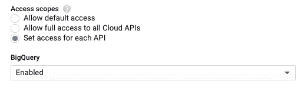
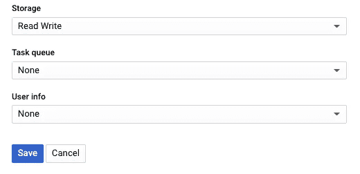

# 使用 Gsutils 和 Python 客户端库的云存储

> 原文：<https://medium.com/google-cloud/using-google-cloud-storage-5b9d3f570945?source=collection_archive---------0----------------------->


BLOB(二进制大对象)存储被恰当地命名。Google 云存储是一个 BLOB 存储解决方案，用于存储非结构化数据。这就像一个壁橱，你可以把一堆东西塞进去，而不必在放进去之前整理信息。它的大小非常灵活，这意味着它可以容纳任何东西，并且不需要任何特殊的处理来存储它。

我们大多数人需要对存储采取的关键行动是将数据放入存储和从中取出数据。这篇文章分享了使用 gsutils 和 Python 客户端库 google-cloud-storage 实现这一点的常用命令。但是首先，关于组织的一个说明。

# 组织

尽管您可以向 BLOB 存储中添加任何您想要的东西，但给它一些结构确实有所帮助。结构的初始层被称为存储桶，就像文件夹一样。您可以将音频文件等数据归入一个存储桶，将图像归入另一个存储桶。或者您可以将特定项目的所有数据放入一个存储桶中。

在定义存储桶名称时，有几点需要强调:

*   存储桶名称必须仅包含小写字母、数字、破折号、下划线和点
*   它们是全球性的，公开可见的
*   它们对于云存储命名空间必须是唯一的。其他任何人都不能使用相同的名称。
*   **不要**在名称中使用任何个人身份信息(如用户 id、电子邮件、项目名称、项目编号)
*   不要使用 IP 地址或类似的格式
*   避免连续文件名
*   [更多信息](https://cloud.google.com/storage/docs/naming)

在 bucket 中，您可以通过创建或上传文件夹来添加额外的结构。例如，如果您有一个照片存储桶，您可以添加按年份、地点或人物对照片进行分组的文件夹。确定需要多少结构和需要什么总是一种平衡，但在设置存储以使访问和定位您需要的数据变得更容易时，这是一件值得考虑的事情。

# Gsutil

为了在终端中与云存储通信，您需要[安装云 SDK](https://nyghtowl.com/first-contact-cloud-compute-engine-virtual-machine-setup-8d17ec55cfdf) ，这样您就可以使用 *gsutils* 命令。访问文件的常用命令如下。

列出存储桶。

```
gsutil ls 
```

列出存储桶内容。

```
gsutil ls gs://[BUCKET NAME]
```

获取存储桶中对象总数的计数。

```
gsutil ls -lR gs://[BUCKET NAME] | tail -n 1
```

做一个桶。

```
gsutil mb gs://[BUCKET NAME]
```

删除一个存储桶和存储桶中的所有内容。

```
gsutil rm -r gs://[BUCKET NAME]
```

删除存储桶中的所有内容，但不删除存储桶。

```
gsutil rm gs://[BUCKET NAME]/**
```

删除一个桶中的所有内容，并对桶进行并行处理。

```
gsutil -m rm -r gs://[BUCKET NAME]
```

删除存储桶中的所有内容，但不删除并行处理的存储桶。另外，使用安静模式，这样它就不会用 *-q* 列出它删除的所有文件。

```
gsutil -q -m rm gs://[BUCKET NAME]/**
```

将本地文件上传到存储器。

```
gsutil cp [LOCAL PATH/FILE NAME] gs://[BUCKET NAME]/[FILE NAME]
```

上传文件夹的所有内容。

```
gsutil cp -r [LOCAL FOLDER PATH] gs://[BUCKET NAME]
```

将文件从存储器下载到本地驱动器的当前位置。

```
gsutil cp gs://[BUCKET NAME]/[FILE NAME] .
```

关于如何使用 gsutils 处理存储，还有许多其他命令和选项，如本 [gsutil 文档](https://cloud.google.com/storage/docs/gsutil)中所述。

# 谷歌云存储| Python 客户端库

为了使用 Python 连接存储，您需要提供应用程序凭据，并安装和使用云 Python 客户端库 google-cloud-storage。

## *凭证/设置*

关于设置凭据，请确保在您的服务器上设置了以下环境变量。

```
GOOGLE_APPLICATION_CREDENTIALS=[GOOGLE_APPLICATION_CREDENTIALS]
```

或者，在控制台中编辑实例时，您可以将特定的 GCE 实例存储权限更改为*访问范围*下的*读写*。



请注意，您需要停止实例来进行此更改。

然后需要安装 GCS Python 客户端库包。

```
pip install google-cloud-storage
```

在 Python 脚本或解释器中，导入 GCS 包。

```
from google.cloud import storage
```

## 常见命令

设置完成后，访问文件的常用命令如下。

连接到存储客户端。

```
storage_client = storage.Client()
```

列出存储桶。

```
for bucket in storage_client.list_buckets():
    print(bucket)
```

注意 list_buckets()是一个函数，它返回一个生成器，您可以通过循环来获取所有的 bucket 名称。

获取特定的铲斗参考。

```
bucket = storage_client.get_bucket([BUCKET NAME])
```

列出存储桶内容。

```
for file in storage_client.list_blobs(bucket):
    print(file.name)
```

获取存储桶中对象总数的计数。

```
count = 0
for file in storage_client.list_blobs(bucket):
    count += 1
```

做一个桶。

```
bucket = storage_client.create_bucket([BUCKET NAME])
```

请注意，如果您没有如上所述设置权限，将会出现 400 错误。

删除一个存储桶和存储桶中的所有内容。

```
bucket.delete()
```

将本地文件上传到存储器。

```
blob = bucket.blob([REMOTE PATH/FILE NAME])
blob.upload_from_filename([LOCAL PATH/FILE NAME])
```

请注意，如果您没有如上所述设置权限，将会出现 403 错误。

上传文件夹的所有内容。

```
import os
for filename in os.listdir([FOLDER OR DIR PATH]):
    blob = bucket.blob([REMOTE PATH]/filename)
    blob.upload_from_filename(filename)
```

将文件从存储器下载到本地驱动器的当前位置。

```
blob = bucket.blob([FILE NAME in BUCKET])
blob.download_to_filename([LOCAL PATH/FILE NAME])
```

查看 [Python GCS 库文档](https://cloud.google.com/storage/docs/reference/libraries)了解更多关于如何设置和使用这个库的信息。另外，GitHub 上有一个关于 Python 客户端的[页面。](https://googleapis.dev/python/storage/latest/index.html)

# 包裹

上面的信息回顾了使用 gsutil 和 Python 客户端库 google-cloud-storage 与云存储交互的常用命令。如果您想深入了解，每个部分下都提供了链接。BLOB 存储是一种常用的工具，在构建应用程序时，理解如何设置它并与之交互是很有价值的。