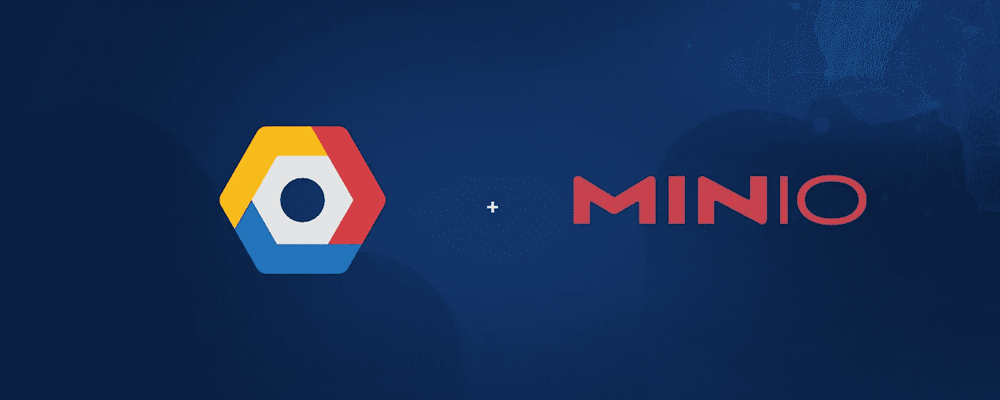
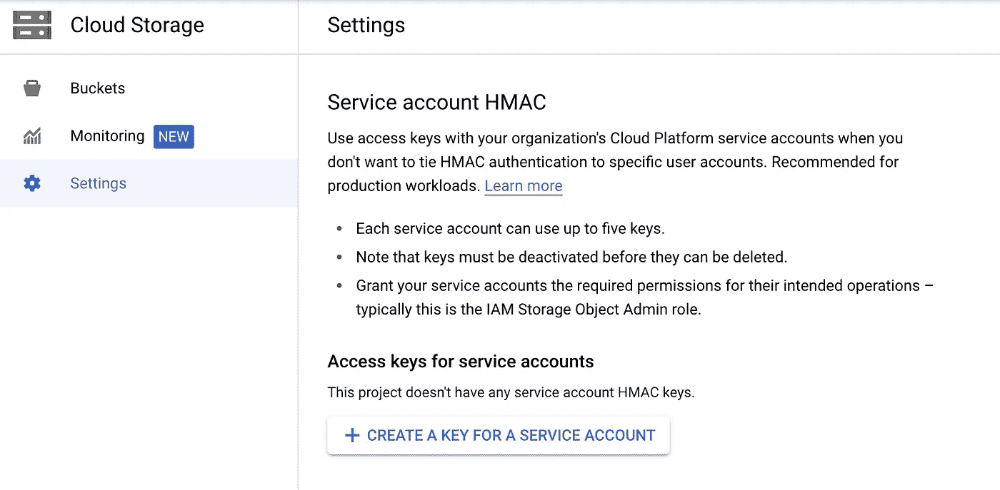
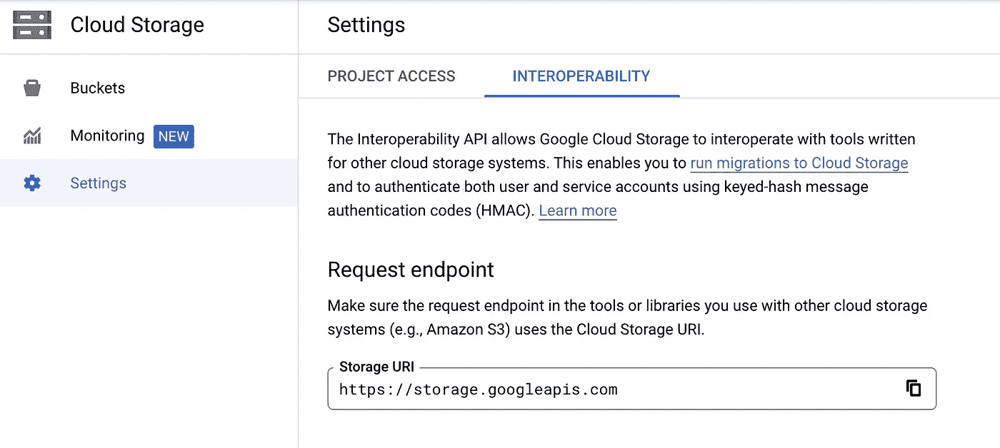

# 通过 MinIO 客户端使用 Google 云存储

> 原文：<https://medium.com/google-cloud/using-google-cloud-storage-with-minio-object-storage-c994fe4aab6b?source=collection_archive---------0----------------------->



MinIO 是一个开源软件定义的对象存储服务，被全球的开发者和 T2 企业使用。随着多重云的出现，作为本地目录公开的抽象层可以非常有助于管理您的应用程序和它所使用的各种云对象存储之间的接口——想想谷歌云存储、亚马逊 S3、Azure Blob 存储等。

> 在本文中，我将向您展示如何通过三个简单的步骤将您的 MinIO 客户端应用程序与 Google 云存储连接起来！Google 云存储有一个优秀的互操作性 API，允许您无缝地将 Google 云存储与客户端库、SDK 或任何 S3 兼容的 API 进行接口。事不宜迟，让我们立即开始，并找出如何开始！

## 方法如下:

>创建一个 [**服务帐户**](https://youtu.be/xXk1YlkKW_k) ，并为其分配适当的角色(想想您的应用程序需要对存储桶进行哪种访问？示例:您的应用程序是只读取桶中的文件，还是也写入文件？)

>创建 **HMAC 密钥**(云存储- >设置- >互操作性)，方法是点击“*为服务帐户创建密钥*，然后继续选择您在上一步中创建的服务帐户:



> [在此阅读更多关于 HMAC 密钥和最佳实践的信息:[https://cloud . Google . com/storage/docs/authentic ation/hmackeys](https://cloud.google.com/storage/docs/authentication/hmackeys)

HMAC 密钥创建完成后，下载并安全存储'*访问密钥* ' &'秘密'。

此外，在云存储- >设置- >互操作性中，记下用于 Google 云存储的*端点*(“存储 URI”):



>最后，更新您的应用程序的源代码，以允许 **MinIO 客户端连接到谷歌云存储**,使用:

***端点***=[https://storage.googleapis.com](https://storage.googleapis.com)

***访问 _ 密钥*** =从 HMAC 密钥获得的访问密钥

***秘密*** =从 HMAC 密钥中获得的秘密

例如，如果您的应用程序是用 Java 编写的，您将使用 MinioClient.builder()方法，如下所示:

```
MinioClient minioClient =
  MinioClient.builder()
    .endpoint("https://storage.googleapis.com")
    .credentials("YOUR_ACCESS_KEY", "YOUR_SECRET_KEY")
    .build();
```

对于其他客户端(Python，Node.js 等)，查看[这个](https://www.stackhero.io/en/services/MinIO/documentations/Getting-started)或者官方文档[这里](https://min.io/docs/minio/linux/developers/minio-drivers.html)。

> 和..你完了！您的应用程序现在可以使用 MinIO 客户端连接 Google 云存储:)

