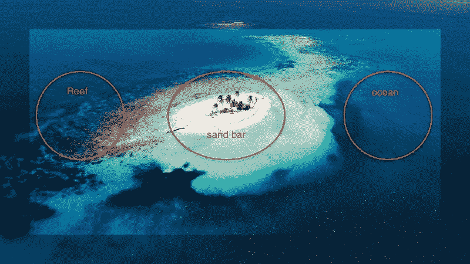

# 使用 Google Datalab 和 BigQuery 进行图像分类比较

> 原文：<https://medium.com/google-cloud/using-google-datalab-and-bigquery-for-image-classification-comparison-13b2ffb26e67?source=collection_archive---------0----------------------->

第 1 部分:样本数据，简单用法

Google Datalab 和 BigQuery 对于图像分类项目很有用。我们将从一个简单的项目开始。要事第一——**谷歌数据实验室**用于构建机器学习(ML)模型，运行在谷歌的云虚拟机上。 **BigQuery** 是基于云计算的大数据分析 web 服务，用于处理…