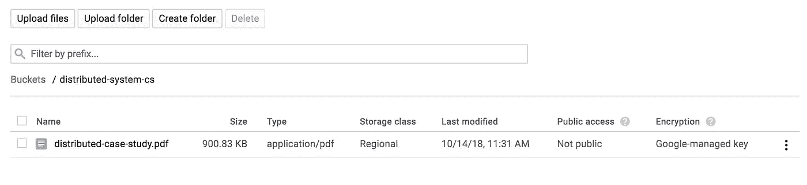

# 将谷歌集团和谷歌云 IAM 有效用于教育

> 原文：<https://medium.com/google-cloud/using-google-group-and-google-cloud-iam-effectively-for-education-9cddb8912de4?source=collection_archive---------0----------------------->

毫无疑问，Google Cloud 是一个更好的云平台，适用于成熟企业和初创企业，同时也是教育机构的下一代生产力工具。G Suite for Education，Google Classroom 提供无缝协作，通过更好的管理跟踪绩效。在本帖中，我们将介绍如何使用 Cloud IAM 对教育工作者和学生的云资源进行访问控制。

让我们通过几个案例来了解控制和授权访问云资源的需求:

1.  教育工作者需要与学生共享不应公开的资源(例如云存储桶对象)
2.  为一组学生提供浏览/访问云功能的权限
3.  允许将特定研究小组的研究项目提交到任何谷歌云平台，并进行进一步处理
4.  对云资源的精细控制(按班级、研究小组等)。)

控制可以通过两种方式实现，一种是使用云身份或 G Suite 域，另一种是使用 Google Groups。

g 套件域范围的电子邮件别名是有点乏味的维护，需要访问谷歌管理控制台，还必须手动更新每个组的电子邮件。此外，可能会有这样的情况，教育机构正在使用微软的电子邮件服务，但却连接到谷歌云平台进行研究和其他云资源。

谷歌集团和谷歌云平台(GCP)的整合可能是一个很好的契合和易于控制。现在，谷歌群组的成员可以访问云资源，而无需通过云 IAM 和手动添加每个用户。此外，普通 gmail 帐户用户可以访问特定资源。

我们来看一个场景。我是一个研究小组“分布式计算和系统研究小组”的教育工作者，我想与该小组的学生分享一个案例研究。我的机构没有使用 G Suite 服务。我们有时使用谷歌小组进行交流，但没有专门的研究小组。

## **是时候创建一个新的谷歌团队了**

进入 groups.google.com[的](https://groups.google.com/forum/#!creategroup)创建群组页面，创建一个新的群组，并输入详细信息。

经过几个选项和设置更新后，你会有一个准备好的新群，邮箱是 *@googlegroups.com* 。要向群组添加新成员，点击右上角的齿轮图标，然后进入**群组设置**。在左栏中，有**邀请成员**链接，它将带你进入邀请页面。可以向任何 gmail 和 gsuite 电子邮件地址发送加入群组的邀请。可以一次添加多个电子邮件地址，用逗号分隔。

## **在 Google 云存储上创建 Bucket 以共享案例研究材料**

进入谷歌云控制台，点击**存储- >浏览**登陆[云存储页面](https://console.cloud.google.com/storage/browser)。使用名称、地区和位置创建一个新的存储桶。

保存详细信息，然后添加一个案例研究的 pdf 文档。点击**上传文件**，可以上传本地文件。我有这个**distributed-case-study.pdf**文件，不公开

要为 google group 的所有成员添加只读权限，请点击文件链接右侧的**烤肉串菜单**，添加 Google Group 电子邮件作为读者&点击保存。

现在，谷歌组的成员可以访问该文件。我们可以分享 [*表单的链接 https://storage . cloud . Google . com/distributed-system-cs/distributed-case-study . pdf .*](https://storage.cloud.google.com/distributed-system-cs/distributed-case-study.pdf.)

同样，如果我们需要向成员授予创建计算引擎的权限，您可以在 Cloud IAM 上添加组电子邮件。为此，请转到 **Cloud IAM 和 Admin** 部分，添加可以访问特定资源的群组电子邮件。

通过这种方式，我们可以轻松地控制没有 G Suite 帐户的 google group 成员对 google 云平台资源的访问。