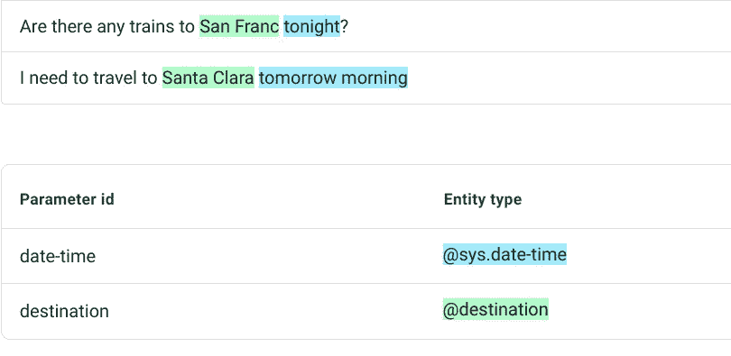
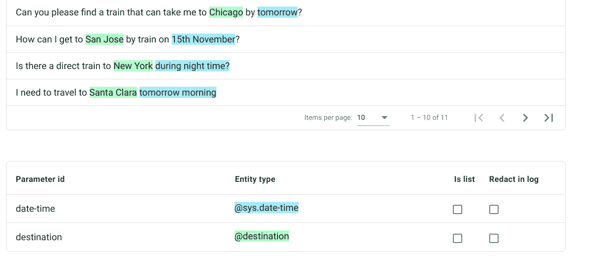
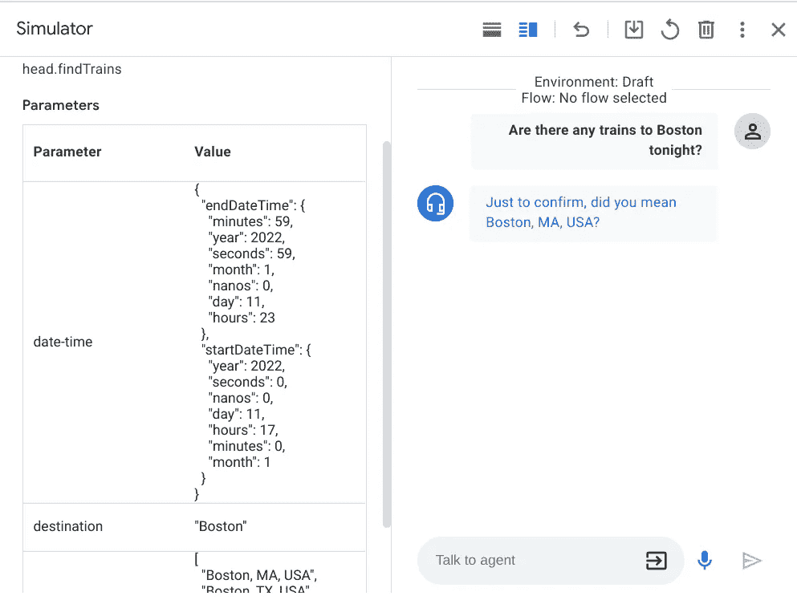
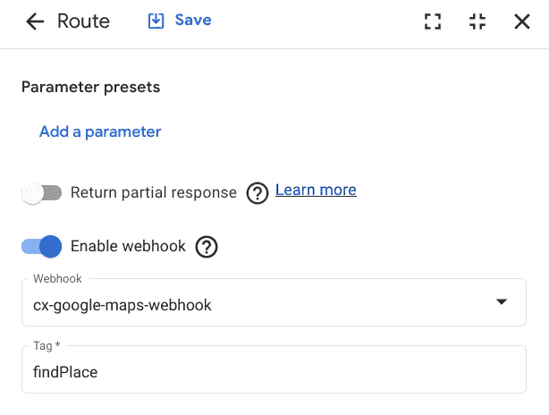
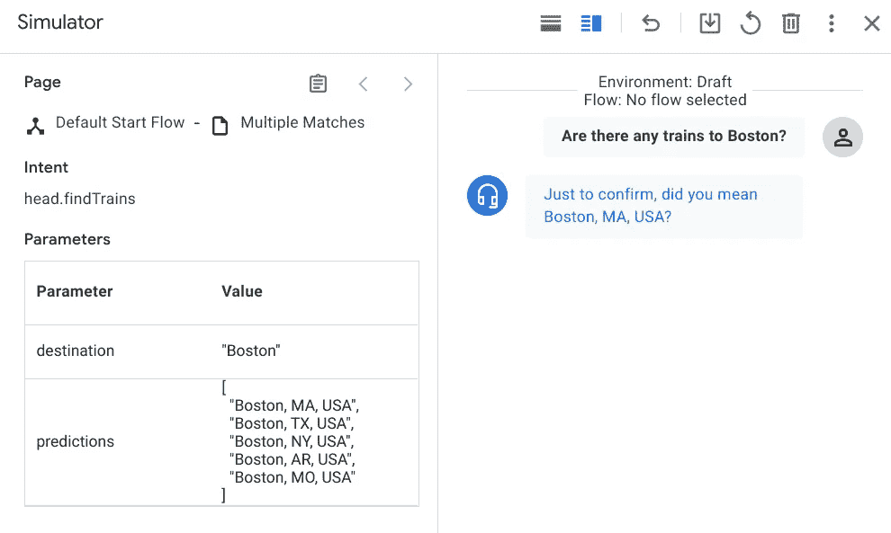
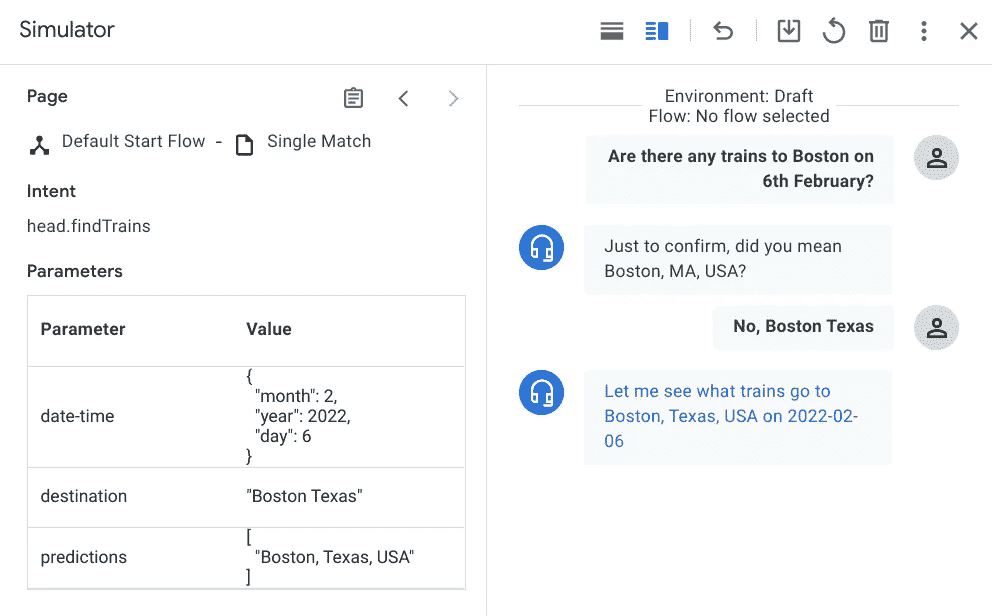
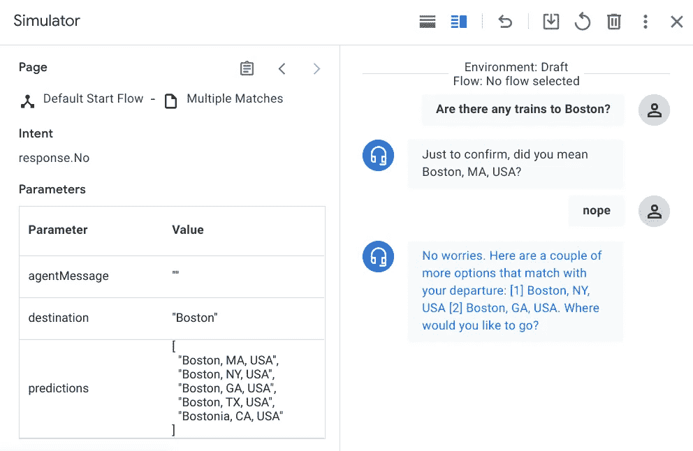

# 使用 Google Maps Places API 在与虚拟代理的对话中“验证”位置

> 原文：<https://medium.com/google-cloud/using-google-maps-places-api-to-validate-locations-during-a-conversation-with-a-virtual-agent-ebd5efcdf9e5?source=collection_archive---------2----------------------->

不到两个月前，我写了一篇[文章](/google-cloud/using-dialogflow-cx-composite-entities-to-work-around-system-entities-limitations-c6385df12f2b)来描述如何将 Dialogflow CX 系统实体`@sys.date`和`@sys.time`组合成定制的复合实体，以解决在意大利语中使用`@sys.date-time`时出现的问题。今天我想带你一起环游世界！不幸的是，我不会得到像`@sys.geo-city`和`@sys.location`这样的系统实体的帮助，因为它们在非美国和非全球地区还不可用。这意味着，对于部署在美国境外的代理，我们无法利用他们来匹配诸如邮政编码、完整地址、街道名称、城市、国家/地区、机场名称等信息。那么，我们如何解决这个问题？好吧，这就是谷歌地图的位置 API 发挥作用的时候了，所以请坐好，享受旅程吧！


尤其是我最喜欢的一个:-)

# 我们想达到什么目的？

> 嗨，今晚有去旧金山的火车吗？

简答:我们希望能够从上面的句子中提取字符串“San Franc”。实际上，让我后退一步:为了帮助我们的用户今晚到达旧金山，我们的代理应该首先解析意图，并根据上下文提取任何有意义的信息，如 **San Franc** 和 **tonight** 。这些是我们在自然语言理解中称之为*实体的东西，*你可以把它们看作主题专家或者简单的*槽*，我们需要用来自终端用户输入的特定部分的值来填充它们。

*实体类型*用于控制如何从最终用户输入中提取数据。Dialogflow 提供预定义的[系统实体](https://cloud.google.com/dialogflow/cx/docs/concept/entity-system)，可以匹配许多常见类型的数据。例如，有些系统实体用于匹配日期、时间、颜色、电子邮件地址，当然还有位置。如果我们必须构建一个代理来帮助用户在 Dialogflow CX 中查找/预订火车，我们将从创建意图开始 *head.findTrains.* 为了创建意图，我们必须提供一组训练短语(在 NLU 也称为话语)，它们是最终用户可能键入或说出的示例短语。当最终用户的输入类似于这些短语之一时，Dialogflow 匹配其意图。您可以通过*注释*部分训练短语来控制如何提取最终用户数据。当您注释部分训练短语时，Dialogflow 会识别出这些部分只是最终用户在运行时提供的实际值的示例。对于像“今晚有去圣法郎的火车吗？”Dialogflow 将从“今夜”中提取参数`date-time`,从“旧金山”中提取参数`destination`。



Dialogflow 如何标注训练短语

简单…如果`@sys.location`或`@sys.geo-city`在非美国&非全球地区也有；-)遗憾的是，在撰写本文时，它们仅适用于部署在美国的代理。因此，这正是我们试图解决的问题:我们需要提取“圣法郎”**并**验证它是一个合法的**城市。顺便说一下，你有没有注意到我没有说“旧金山”，而是用了澳大利亚版本的“旧金山”？同样，我也希望像“NYC”或“San Dieeego”这样的输入不会被忽略，因为它们与纽约市和圣地亚哥的原始名称不完全匹配。事实上，它们必须从用户语句中提取出来，并解析成它们的实际名称(纽约市和圣地亚哥)。除此之外，我出生在“阿斯科利皮切诺”,一个位于意大利中部的可爱城市，通常被称为“阿斯科利”。让事情变得稍微复杂一点的是，意大利还有一个地方叫做“阿斯科利·萨特里亚诺”。对于像“今晚有去阿斯科利的火车吗？”由合作原则驱动的完美用户体验希望代理跟进一个问题，如“你是指阿斯科里·皮切诺还是阿斯科里·萨特里亚诺”？**

像往常一样，解决问题的方法不止一种，我们至少可以想出两三种方法来满足所有这些需求。我们可以从美国所有城市的列表中创建一个复杂的自定义实体(不要忘记同义词……)，或者一旦我们从最终用户输入中提取了位置，我们就可以对记录系统执行“丢失搜索”(请记住这是自然语言，所以字符串匹配效果不好！).选项 3:我们可以利用地理系统实体在幕后实际使用的东西…谷歌地图！

# 介绍位置 API

Google Maps 平台为地图、路线和地点提供了一系列惊人的 SDK 和 API。具体来说，Places API & SDKs 允许开发人员将 Google 的位置细节、搜索和自动完成功能集成到他们的应用程序中。Places API 是一个使用 HTTP 请求返回位置信息的服务。在本 API 中，地点被定义为机构、地理位置或显著的兴趣点。Google Maps 平台产品通过将 API 调用限制在提供正确认证凭证的范围内来防止未经授权的使用。这些凭证采用 API 密钥的形式，这是一个唯一的标识符，用于验证与您的项目相关联的请求，以便使用和计费。查看这个[链接](https://developers.google.com/maps/documentation/javascript/get-api-key)，了解如何生成自己的 API 密钥，并将其包含在每个地图 JavaScript API 请求中。

位置自动完成服务是一个 web 服务，它返回位置预测以响应 HTTP 请求。该请求指定了文本搜索字符串和可选的地理界限。地点自动完成服务可以匹配完整的单词和子字符串，解析地名、地址、城市、代码等。您可以指示地点自动完成服务仅返回地理编码结果，而不是业务结果。您可以通过传递`types`参数将结果限制为某种类型，在就地自动完成请求支持的类型中，我们还找到了`(cities)`类型集合，它指示服务返回与`locality`或`administrative_area_level_3`匹配的结果。这种特定的类型(以及其他一些类型)不被 Find Place 等其他服务支持，因此我决定在我的用例中使用 Place Autocomplete 服务。

让我们看一个例子，一个包含字符串“Ascoli”的城市请求:

```
https://maps.googleapis.com/maps/api/place/autocomplete/json
  ?input=Ascoli
  &types=(cities)
  &language=it
  &components=country:it
  &key=YOUR_API_KEY
```

需要输入参数 p 来启动位置自动完成请求，它是要搜索的文本字符串。Place Autocomplete 服务将根据该字符串返回候选匹配项，并根据其感知的相关性对结果进行排序。如果您需要将结果限制在特定国家的范围内，还有其他可选参数，如返回结果的*语言*或国家列表。在本例中，我将结果限制为匹配字符串“Ascoli”的意大利城市。

下面是以 JSON 格式返回的响应片段(您可以在 JSON 和 XML 之间选择)。为简单起见，我只包括了前两个预测(3 个中的 2 个),并从回答中删除了一些部分。不出所料，Place Autocomplete 服务返回“Ascoli Piceno”，后跟“Ascoli Satriano”。

```
{
   "predictions" : [
      {
         "description" : "Ascoli Piceno, Province of Ascoli Piceno, Italy",
         "matched_substrings" : [
            {
               "length" : 6,
               "offset" : 0
            }
         ],
         ....
         "types" : [ "locality", "political", "geocode" ]
      },
      {
         "description" : "Ascoli Satriano, Province of Foggia, Italy",
         "matched_substrings" : [
            {
               "length" : 6,
               "offset" : 0
            }
         ],
       ....
   "status" : "OK"
}
```

您可以尽可能详细地添加您要查找的地区、州或城市的邮政编码(例如:“旧金山加利福尼亚”、“阿斯科利 63100”)。你可以使用像“NYC”这样的首字母缩写词，或者像“San Franc”这样的通俗名称，或者拼错“世界”:当使用自然语言时，它们都是可能的输入，我们的对话系统必须能够解析和验证它们。如果搜索成功，但是没有找到匹配，那么服务将返回`ZERO_RESULTS`状态代码。

# 网钩

我选择使用 Node.js 实现由代理调用的 webhook，并在 Google Cloud 函数上运行它。快速介绍， [*Webhooks*](https://cloud.google.com/dialogflow/cx/docs/concept/webhook) 是托管你的业务逻辑的服务。在会话期间，webhooks 允许您使用 Dialogflow 的自然语言处理提取的数据来生成动态响应、验证收集的数据或触发后端的操作。

这个 webhook 是做什么的？它调用 Places API 自动完成服务，在输入中传递由 Dialogflow 从最终用户输入中提取的目的地(我们将在下一段中研究如何从用户意图中提取位置)。来自 webhook 的预期“目的地”是由 Dialogflow 在 webhook 请求消息中设置的参数，作为调用的一部分。*参数*用于捕获和参考终端用户在会话期间提供的值。每个参数都有一个名称和一个实体类型。当意图匹配时，意图使用参数来提取由最终用户提供的数据，在这种特定的场景中，当最终用户输入在运行时匹配“head.findTrains”意图时，由关联训练短语的注释使用的任何参数由 Dialogflow 设置。为此，我们可以合理地预期用户想要去的目的地、出发地点以及日期和时间。对于此 PoC 的范围，我将只关注目的地，最终适用于目的地的逻辑也将适用于出发地。

在运行时，目的路线的实现设置函数从 webhook 请求接收和读取的“目的地”参数值:

```
if (!(req.body.intentInfo && req.body.intentInfo.parameters)) {
return res.status(404).send({ error: 'Not enough information.' });
}let destination = req.body.intentInfo.parameters['destination'].originalValue;
```

我们现在可以启动一个 Place Autocomplete 请求，作为下面形式的 HTTP URL。作为 URL 中的标准，所有参数都使用&符号(`&`)分隔。请注意，我们正在将搜索范围缩小到美国的城市，并且不要忘记用您自己的 API 键替换本例中的键，以便请求能够在您的应用程序中工作！

```
var config = {method: 'get',url: 'https://maps.googleapis.com/maps/api/place/autocomplete/json?    input=' + destination + '&types= (cities)&language=en&components=country:us&key=YOUR_API_KEY',headers: { }};
```

我使用 Axios 从节点应用程序发出 HTTPS 请求。Axios 是一个基于 [*承诺的*](https://javascript.info/promise-basics) HTTP 客户端，用于 node.js 和浏览器。是 [*同构*](https://www.lullabot.com/articles/what-is-an-isomorphic-application) (=可以在浏览器和 nodejs 中运行相同的代码库)。在服务器端，它使用 native node.js `http`模块，而在客户端(浏览器)它使用 XMLHttpRequests。要将 Axios 用于节点 I，首先使用 *npm install* 安装它，然后使用以下方法使用`require()`导入它:

> const axios = require(' axios ')；

为了使用 Axios 执行对 Place Autocomplete 服务的 GET 请求，我使用了以下方法:

```
axios(config)
 .then(function (response) { //handle success (including ZERO_RESULTS) })   
 .catch(function (error) {     

 // handle error })   
 .then(function () {     // always executed  
});
```

如果对 API 的调用成功，并且服务找到了给定输入的匹配项，我将使用 for 循环来遍历响应中返回的预测数组，并创建仅包含每个预测描述的第二个数组。

```
axios(config)
 .then(function (response) { //handle success (including ZERO_RESULTS)
 if(response.data.predictions.length > 0) { for(var i in response.data.predictions){
   var prediction = response.data.predictions[i].description;
   predictions.push(prediction);...
```

为什么我要创建第二个数组？嗯，解释有点长，但我保证，我会到达那里！首先，如果服务没有返回错误，我们需要处理三种可能的结果:

**情况 1:没有匹配** ( `ZERO_RESULTS`表示搜索成功，但没有返回结果。如果向搜索传递了一个不存在的位置，可能会出现这种情况)。用户体验应该是怎样的？*会话修正是指纠正误解、听错和发音错误以恢复会话的实践。通过展示代理正在倾听用户的请求，修复对话有助于建立用户的信任。*向用户重复问题，但用更简短的方式重新表述，以指出缺少的信息。我觉得这些都是第一个不匹配的有效提示:“不好意思，哪个城市？”，“不好意思，你要去哪个城市旅游？”。

**案例二:单配。**服务返回一个位置(我注意到当搜索传递邮政编码或城市所在的州而不是城市本身时会发生这种情况)。用户体验应该是怎样的？这里的单场比赛就像网球中的 acePlaces API 已经验证了目的地是合法的，作为下一步，代理将向客户提供列车时刻表以满足请求。

**情况三:多个匹配**(返回多个预测)。在我看来，第三种情况是最有可能的。根据自动完成服务文档

> Place Autocomplete 服务将根据该字符串返回候选匹配项，并根据其感知的相关性对结果进行排序。

基于此，我们可以很有把握地说，列表的第一个预测很可能是用户想去的城市。如果不是呢？如果用户说的“Ascoli”不是指“Ascoli Piceno”(列表中的第一个预测)，实际上他指的是“Ascoli Satriano”(第二个预测)。在这第三条道路上，什么是好的用户体验？我认为代理应该问用户一个明确的、可行的问题，比如“只是确认一下，你是指阿斯科里·皮切诺吗？”。他们可以通过说“不，Ascoli Satriano”(这第二个位置匹配数组中的第二个项目，循环是闭合的)或“不”(在这种情况下，代理应该通过提供其他可能的匹配来与用户合作)来确认或反驳代理的猜测。无论哪种方式，预测数组都有助于推进对话，这就是 webhook 应用程序创建第二个数组并将其写入会话(作为会话参数)的原因，我们可以在与用户对话的任何时候引用该数组。

总之，根据 Place Autocomplete 服务返回的输出，webhook 将预测数组添加到会话信息中，将不同的消息发送回代理(在履行响应中),并转换到不同的目标页面。

```
res.status(200).send({
 sessionInfo: {
  parameters: {
   predictions: predictions
  }
 },
 fulfillmentResponse: {
  messages: [{
   text: {
    text: [agentMessage]
   }
  }]
 },
 targetPage: targetPage
});
```

例如，如果服务返回一个以上的预测，流程将转换到“多个匹配”页面，并向用户显示以下消息。

```
targetPage = "projects/diaologflow-cx-playground/locations/us-central1/agents/5b0d10a9-8bca-49f2-bb17-50144df939e0/flows/00000000-0000-0000-0000-000000000000/pages/9d9b5bb1-2979-4462-b4bf-115513b1d6d5";agentMessage = "Just to confirm, did you mean " + predictions[0] + "?";
```

# 代理人

我们如何将它融入 CX 对话流？之前我解释过，当 Dialogflow 在运行时匹配“head.findTrains”意图时，发送到 Places API 的是它之前从最终用户输入中提取的内容。由注释用于意图的相关训练短语的任何参数由 Dialogflow 设置，并被添加到 webhook 的意图参数列表中。查看此[链接](http://You control how end-user data is extracted by annotating parts of your training phrases and configuring the associated parameters.)，了解如何在 CX 对话流中*注释*部分训练短语并配置相关参数。当您注释部分训练短语时，Dialogflow 会识别出这些部分只是最终用户在运行时提供的实际值的示例。对于像“*这样的最终用户输入，有明天可以带我去纽约的火车吗？*，Dialogflow 将从“明天”中提取`date-time`参数，从“纽约”中提取`destination`参数。当使用控制台构建代理时，当您添加包含可以与现有的[实体类型](https://cloud.google.com/dialogflow/cx/docs/concept/entity)匹配的部分的训练短语时，会自动为您创建大多数注释。这些部分会在控制台中为您突出显示。尽管“NY”无法与现有的`@sys.geo-city`系统实体相匹配(因为它在美国以外的地区不可用),但你仍然可以指示 Dialogflow 识别句子的这一部分。通过提供合理数量的训练短语并相应地对它们进行注释，你将训练 NLU 引擎不仅识别日期时间，还识别目的地作为关键词，并在运行时从最终用户输入中提取它们。



您可以通过对培训短语的*部分进行注释*来控制如何提取最终用户数据

Dialogflow CX 中的模拟器是一种很好的测试方式。让我们看看引擎从最终用户输入中提取了什么，比如“今晚有去波士顿的火车吗？”。忽略代理现在说的话，我们一会儿再看。我想在这里强调的是 Dialogflow 已经识别和提取的两个意图参数(日期-时间和目的地)。它们现在可以使用了；-)



模拟器，快速测试和调试的好方法！

当最终用户的输入在运行时与“head.findTrains”的意图相匹配时，我们希望触发对 webhook 的请求，所有的魔法都会随着云函数的实现而出现:-)



intent 路由将通过对运行在 GCF 中的 findPlace 函数的 webhook 调用来实现

那么现在会发生什么呢？当 webhook 接收到来自 Dialogflow 的请求时，它首先读取目标参数值，在修剪/删除任何无效字符/小写字母后，它调用 Place Autocomplete 服务。在我们的例子中，用户输入的目的地是波士顿，结果在美国有五个波士顿。webhook 解析出 Place Autocomplete 响应并找到五个预测，如*预测*数组所示。我们在“多个匹配”的场景中，虽然用户很有可能指的是马萨诸塞州的波士顿市，但我们不应该假设，因此我们想检查一下。完成后，webhook 向 Dialogflow 发送一个 200 OK 的履行响应，其中包含以下指令:转换到“多个匹配”页面，并向用户回复消息“只是为了确认，您是指预测[0]？”(翻译成“确认一下，你是指美国马萨诸塞州的波士顿吗？”).



我们永远不应该假设！

虽然用户的输入从来都是不可预测的，但我们可以试着思考在对话的这个阶段，用户**最有可能**说什么。“多重匹配”需要处理(至少)一个肯定回答、客户的跟进、否定回答和未解决的意图。肯定的回答将调用后端服务来满足用户请求。在我看来，其他输入，如“New Boston Texas”或“不，New Boston Texas”应该再次匹配“findTrains”意图。在下面的例子中，第二次调用 Places Autocomplete 服务返回了一个匹配项。



帮助对话自然展开

另一方面，如果用户的反应是否定的，没有提供进一步的信息，我认为这是一个好主意，合作和显示其他预测，而不是转移到不同的页面。最终目标是帮助消除歧义，推动对话向前发展，实现用户意图。



# 结论

如果你已经走到这一步了(除非你跳过了前面的段落！)我真的应该感谢你一直坚持到这篇相当长的博文结束。我希望你像我喜欢写作一样喜欢阅读，如果你有任何问题/反馈，请评论或联系。如果你热衷于查看 webhook 的实现，我的 GitHub 上有[代码](https://github.com/alessiasacchi/google-cloud-functions/tree/main/cx-google-maps-webhook)。期待收到你的来信！