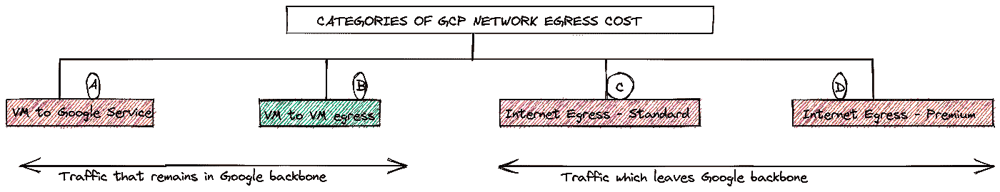
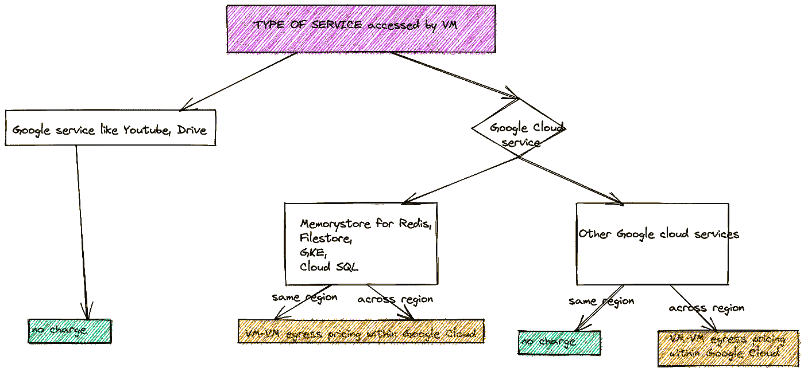
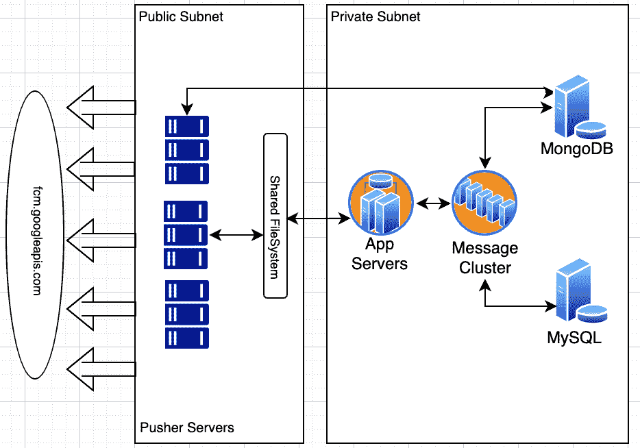

# 你的应用程序使用谷歌服务吗？为了节省成本和更好的性能，切换到 GCP！！

> 原文：<https://medium.com/google-cloud/using-google-services-switch-to-gcp-for-cost-savings-and-better-performance-d9b36aeeaa23?source=collection_archive---------0----------------------->

作者:高拉夫·马丹和纳库尔·甘达

**语境**

当谈到公共云的采用时，一些起决定性作用的因素是您选择的地区的服务可用性、用户体验、成本、操作简易性等。

从技术架构师/设计师的角度来看；我们倾向于专注于卓越的设计，并致力于通过以最佳方式安排云结构来实现所需的功能，以便我们能够为最终客户提供高价值。在进行这种艺术设计时，建筑师倾向于较少强调成本控制/成本优化参数，因为对大多数建筑师来说，卓越的设计在优先列表中占据更高的位置。本博客的目的是展示架构师如何处理复杂的应用程序设计&利用某些众所周知的谷歌服务，可以简单地忽略他们在 GCP 平台上的网络成本重点，并自动享受每月云支出中减少的网络出口支出。

**GCP 网络定价简介**

在我们深入了解客户特定的场景之前，让我们了解一下任何客户最终可能支付的网络出口支出的细微差别。

从高层次来看，任何离开 GCP 资源的流量都可以分类如下

1.  **内部流量**:又称骨干流量。这是我们主干网内的流量。示例包括—GCP 地区的 VM1 1 与 GCP 地区的 VM2 对话 2
2.  **外部流量**:这是离开谷歌网络的流量，通常以最终用户(通常是互联网)为目的地。

如果我们必须将流量类型与 GCP 的出口定价 SKU 对应起来，则 GCP 的出口支出将属于以下四大类别之一-

1.  Google 云中的虚拟机到虚拟机出口定价
2.  虚拟机到谷歌服务定价
3.  互联网出口定价—高级层
4.  互联网出口定价—标准层

上述**类别(B)** 的费用基于以下内容定价-

*   给定区域的同一分区中的源和目标虚拟机？
*   给定区域不同分区中的源和目标虚拟机？
*   源和目标虚拟机位于不同的区域，但仍然在同一个洲？
*   不同大陆的源和目标虚拟机？

标准层[**C 类** ]的互联网出口收费基于以下内容-

*   交通地理定位源(GCP 地区)
*   每月使用量

针对高级等级[**D 类** ]互联网出口的收费基于以下内容-

*   流量的源和目的地地理定位
*   每月使用量

这篇博客的重点是***A 类*** (虚拟机到谷歌服务)，我想在这里提出几个要点:

1.  如果像 VM 这样的 Google 云资源调用像 Youtube、drive、maps 这样的 Google 服务；此交易不收取出口费用
2.  如果像虚拟机这样的谷歌云资源调用其所在区域之外的谷歌云服务，则需要付费，这与谷歌云中的虚拟机到虚拟机出口费用相同
3.  使用外部 IP 地址/内部 IP 地址在**相同区域**内出口到某个 Google 云服务也不收取网络出口费用
4.  有一些服务像 Memorystore for Redis，Filestore，Cloud SQL，Google Kubernetes Engine 这吸引了外出成本，即使从相同区域内访问也是如此。成本将与 Google 云中虚拟机到虚拟机出口的成本相同

下面可以看到一个简单的视图

更详细的价格可在以下网址获得:【https://cloud.google.com/vpc/network-pricing。我强烈建议读者花些时间浏览上述网址，以理解其中的细微差别。除此之外，我还强烈建议读者阅读有关网络特定费用的信息，这些费用可能适用于您使用独立服务的情况，如 Google cloud storage bucket。例如:除了存储成本、数据处理成本之外，如果从您的 GCS 存储桶读取数据或在 GCS 存储桶之间移动数据，还会产生相关的网络成本。

**优化您的数据出口成本—迁移到谷歌云**

无论你是在上传大量视频到 youtube，调用谷歌地图 API 还是通过 Firebase 发送通知，谷歌云都可以从网络出口成本的角度为你提供服务。事实上，根据 GCP 在[的公开文件 https://cloud . Google . com/VPC/network-pricing # all-networking-pricing](https://cloud.google.com/vpc/network-pricing#all-networking-pricing)，

*访问特定的谷歌非云产品，如 YouTube、Maps、* [*双击*](https://developers.google.com/authorized-buyers/rtb/peer-guide#trading_locations) *和 Drive，无论是使用外部 IP 地址还是内部 IP 地址*访问谷歌云中的虚拟机**都是免费的。**

根据相同的 URL 如果你和你的源在同一个地区，谷歌云服务(如 Firebase)的出口也是免费的。

作为一个真实的例子，我们将展示一个使用案例，客户通过将其应用程序从当前的云提供商迁移到 GCP，可以节省 99%的出口费用(每年高达数十万美元)。

**客户场景**

该客户是一个纯粹的云端客户，内部没有基础架构。在 1000 英尺的高度；他们在公共云(非 GCP)中的基础设施由数百个向终端客户端发送通知的“推送服务器”组成，其中 99%的客户端由 Chrome 浏览器或 Android 手机组成。

由于使用谷歌的 firebase 通知服务是免费的，他们正在利用 Firebase 云消息(FCM)服务。
一个月内，他的云托管基础设施向 Firebase 服务发出了约 2500 亿次请求。

由于这些请求来自另一个云提供商(非 GCP)，每次调用[fcm.googleapis.com](http://fcm.googleapis.com/)(平均负载为 4KB)就有超过 30 TB 的数据流出互联网。因此，该客户向另一家云提供商(非 GCP)支付了超过 2.5 万美元的网络出口费用。

**客户改造后的设置**

在与客户接洽后，我们可以看到网络出口方面的巨大支出，这是我们想要解决的一个领域。FCM 是一个全局服务，因此基于工作负载调用 FCM 服务，我们可以节省大量的网络出口成本。如上所述，流量在 Google backbone 上的网络出口成本取决于源位置和目的位置。虽然 FCM 是一个全局服务，但是成本将取决于 FCM 服务的哪个单元是给定请求的服务源。

为了证明这一点，我们必须首先规划将调用 fcm 服务的工作负载的定位。作为 APAC 的大客户，我们对他们在 GCP(新加坡)东南亚 1 地区托管的呼叫 FCM 服务的工作负载进行了测试。通过这种设置，我们在一个月的时间内测试了 FCM 服务每天 70 亿次的点击。从 GCP 的角度来看，这与虚拟机到虚拟机的定价(新加坡区域内)或有时(新加坡区域内的区域内)收取相同的费用。这要追溯到本文开头的 GCP 网络定价部分..服务“fcm”是谷歌云服务；调用这个服务的主机也在 Google cloud 网络主干上。所以或多或少的流量都是谷歌云内部的。因此，我们必须找到合适的工作负载定位，以便将适用的网络费用降至最低(流量保持在区域内，如果流量保持在给定区域的某个区域内，效果会更好)。经过一个月的测试，我们在 GCP w.r.t .展示了他们目前每月在替代公共云提供商的出口上的支出下降了 99%。这意味着将整个应用程序迁移到 GCP 几乎可以消除客户目前在替代公共云提供商的“网络出口”上的支出。该 POC 帮助客户做出明智的决定，将其应用程序迁移到 GCP

**结论**

采用公共云背后的推动因素之一是成本，因此当谈到公共云支出时，“每一分钱都很重要”。因此，了解并回答诸如哪些服务工作负载将被消耗、我的工作负载将与哪些其他工作负载对话、访问我的工作负载的终端用户在哪里等问题，将有助于我们更好地规划工作负载的地理位置。

对于使用谷歌服务的应用程序，如地图、驾驶、youtube 在 GCP 平台上托管这样的应用程序是显而易见的，因为在 GCP 托管的应用程序访问这些谷歌服务的网络出口成本是零，这是客户可以节省很多钱的地方

也适用于使用谷歌云服务的应用程序；很容易得出这样结论:如果这样的应用程序托管在 GCP；客户的应用程序访问这些 Google 云服务的网络出口成本要么是免费的，要么是按照虚拟机到虚拟机的 SKU 定价收取的，这比备选云提供商的出口成本低得多，因为流量将离开备选云提供商的基础设施。这同样可以帮助客户节省大量资金。

**有用参考:**

https://cloud.google.com/products/calculator[GCP 定价计算器](https://cloud.google.com/products/calculator)

了解 https://cloud.google.com/vpc/pricing[GCP 网络定价](https://cloud.google.com/vpc/pricing)

**免责声明**:这是为了告知读者，文中表达的观点、想法和意见仅属于作者，不一定属于作者的雇主、组织、委员会或其他团体或个人。