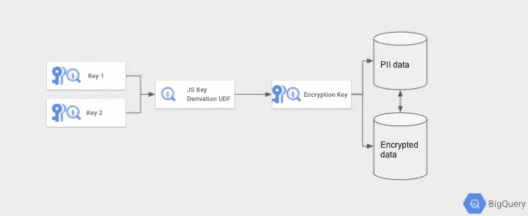

# 通过 UDF 在 BigQuery 中使用 HKDF 来提高安全性

> 原文：<https://medium.com/google-cloud/using-hkdf-in-bigquery-via-udfs-for-improved-security-hygiene-f0a4d5b2b6df?source=collection_archive---------0----------------------->

# **简介**

BigQuery 本身支持加密/解密[方法](https://cloud.google.com/bigquery/docs/reference/standard-sql/aead_encryption_functions)，这允许用户不用明文存储敏感数据/列。此外，随着数据保护法的出现，如 GDPR 的“被遗忘的权利”[条款](https://en.wikipedia.org/wiki/Right_to_be_forgotten)，这些功能允许通过[加密粉碎](/google-cloud/bigquery-encryption-functions-part-i-data-deletion-retention-with-crypto-shredding-7085ecf6e53f)轻松删除数据。

然而，使用 BigQuery 中的[crypto shredishing](/google-cloud/end-to-end-crypto-shredding-part-ii-data-deletion-retention-with-crypto-shredding-a67f5300a8c8)，用自己的密钥加密每个用户的数据存在一些挑战。即:

1.  加密密钥以明文 json 或字节存储。攻击者可以通过访问单个密钥并解密来访问用户的所有数据。
2.  即使使用密钥轮换，当 BQ 数据集中的用户数量很大时，为每个用户创建两个密钥并轮换它们也可能很难组织。

这个单密钥问题的解决方案如下:为每个数据集创建一个共享密钥，并使用接受两个密钥的密钥导出函数导出加密密钥。在我们的解决方案中，我们选择 [HKDF](https://en.wikipedia.org/wiki/HKDF) 作为我们的密钥派生函数，我们使用 BigQuery UDF 来计算密钥，因为此时没有本地 BigQuery 功能。

在我们等待本地 BigQuery 解决方案来进行密钥派生的同时，我们将使用 Javascript[UDF](https://cloud.google.com/bigquery/docs/reference/standard-sql/user-defined-functions#javascript-udf-structure)在 BigQuery 中提出一个短期的密钥派生解决方案。在密钥推导中，两个单独的密钥被组合/加密，以便创建最终密钥来执行加密/解密。这两个单独的键可以存储在单独的数据集/表中，用于单独的 IAM 权限。这样，就增加了一层额外的保护，并且主密钥不是以明文形式存储的。所述过程的示意图见下文。



使用 Javascript UDF 可以在 BigQuery 中实现密钥派生。位于不同表/数据集中的两个密钥可以被组合以导出最终的加密密钥。这增加了一层额外的保护，因为加密密钥不是以准备使用的明文形式存储的。

# **大查询 UDF 解决方案**

为了使用 Javascript UDF 实现密钥派生，我们利用 [webpack](https://webpack.js.org/) 来捆绑额外的节点依赖。方法在这个[博客](/swlh/how-to-package-a-javascript-library-for-use-in-bigquery-2bf91061f66f)里有详细介绍，而且相当有效。我们测试的密钥派生库可以在这里找到[。我们的`package.json`看起来如下:](https://www.npmjs.com/package/futoin-hkdf)

```
{
  “name”: “hkdf.js-bigquery”,
  “version”: “1.0.0”,
  “scripts”: {
    “build”: “webpack — config webpack.config.js”
  },
  “dependencies”: {
    “futoin-hkdf”: “^1.3.3”
  },
  “devDependencies”: {
    “webpack”: “^4.41.5”,
    “webpack-cli”: “^3.3.10”
  }
}
```

通过运行`npm install`，可以下载依赖项。

```
var path = require('path');module.exports = {
    entry: './node_modules/futoin-hkdf/hkdf.js',
    output: {
        path: path.resolve(__dirname, 'dist'),
        filename: 'hkdf.js',
        library: 'hkdf',
        libraryTarget: 'var',
    },
    mode: 'production',
};
```

然后我们运行`npm run-script build`来生成`hkdf.js`，然后可以将它上传到 GCS bucket 中，供 BigQuery 调用。

现在可以创建如下所示的密钥派生 UDF:

```
CREATE or replace FUNCTION theo_test.DERIVE_KEY(masterKey STRING, domainKey STRING) RETURNS STRINGLANGUAGE jsOPTIONS (library=["gs://theo-gcs/hkdf.js"])ASr"""const length = 32; //Needs to be 32 charactersconst info = 'optional-context';const hash = 'SHA-256';const encoding = 'base64';return hkdf(masterKey, length, {'salt': domainKey, 'info': info, 'hash': hash}).toString(encoding);""";
```

此外，需要编写一个 UDF 来创建 json，以便密钥派生的输出可以用作有效的 AesGcmKey Tink 密钥。

```
CREATE or replace FUNCTION theo_test.TO_TINK_no_json(keyId NUMERIC, key STRING ) RETURNS STRING AS (CONCAT("{\"key\": [{\"keyData\": {\"keyMaterialType\": \"SYMMETRIC\", \"typeUrl\": \"type.googleapis.com/google.crypto.tink.AesGcmKey\",\"value\": \"",key,"\"}, \"keyId\": ",keyId,",\"outputPrefixType\": \"RAW\", \"status\": \"ENABLED\"}],\"primaryKeyId\": ",keyId,"}"));
```

请注意，输出键的长度需要为 32 个字符，因为 BigQuery 中的 AesGcmKey 被识别为 34 字节的键。为了使这个键在 BigQuery 中作为 Tink 键使用，我们需要在一个 bytearray 中将[26，32]添加到 Derive Key 函数的输出中。关于制作有效 Tink 密钥的详细信息可以在这个 Stackoverflow [问题](https://stackoverflow.com/questions/67320913/how-to-pass-in-valid-values-into-cleartext-keyset-json-to-create-a-tink-key)中找到。现在可以用密钥派生来回加密和解密值了！

**加密:**

```
select AEAD.ENCRYPT(KEYS.KEYSET_FROM_JSON(theo_test.TO_TINK_no_json(100,to_base64((SELECT concat(CODE_POINTS_TO_BYTES([26,32]), from_base64(theo_test.DERIVE_KEY('my_key1','key_salt1'))))))),from_base64("test"), cast("foo" as Bytes));
```

**解密:**

将你的加密结果粘贴到`Paste your encrypted value here!!!`字段中。还要注意，加密的值是置换的，因此它不会总是确定地相同！：

```
select AEAD.DECRYPT_BYTES(KEYS.KEYSET_FROM_JSON(theo_test.TO_TINK_no_json(100,to_base64((SELECT concat(CODE_POINTS_TO_BYTES([26,32]), from_base64(theo_test.DERIVE_KEY('my_key1','key_salt1'))))))),from_base64("Paste your encrypted value here!!!"), cast("foo" as Bytes));
```

# 最后的想法

我们希望这个解决方案能在短期内帮助客户。虽然 UDF 解决方案适用于密钥派生，但我们仍在等待原生的 BigQuery 优化解决方案，因为在 UDF 中使用第三方库有一些缺点。即:

*   使用第三方开源库需要社区支持，并且可能需要审计来检查库的健壮性和安全性。此外，弄清楚如何将 javascript 库用于其他产品(如 Dataflow)可能需要更多的开销。
*   在密钥派生结果前添加字节是不明智的，否则可能无法向前兼容，尤其是对于 Tink 和 BigQuery 加密的未来版本。
*   UDF 是相当计算密集型的。我们建议通过域键进行聚类，看看这是否有助于扩展和计算大量的键派生。

请继续关注 BigQuery 加密的更多改进！

特别感谢 [Parviz Deyhim](https://pdeyhim.medium.com/) 的评论，它是 BQ 中与加密粉碎相关的所有内容的绝佳资源！