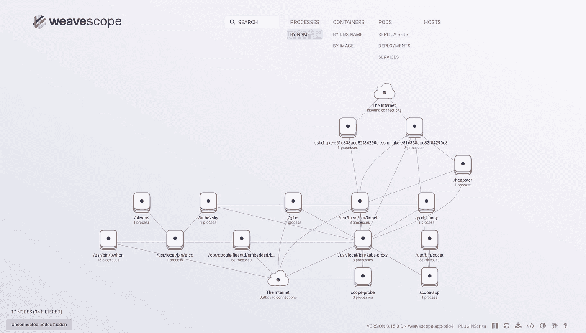

# 使用 kube-ui 和谷歌容器引擎编织范围

> 原文：<https://medium.com/google-cloud/using-kube-ui-and-weave-scope-with-google-container-engine-63fadf9656f?source=collection_archive---------1----------------------->

最近，有人告诉我，当他们在[谷歌容器引擎](https://cloud.google.com/container-engine/)上运行 kubernetes 集群时，很难访问 [kube-ui](http://kubernetes.io/docs/user-guide/ui/) 。

[官方文件](http://kubernetes.io/docs/user-guide/ui-access/)告诉我们去参观

```
https://<kubernetes-master>/ui
```

然而，使用这意味着你必须记住主机的 IP 地址，以及用户名和密码。另外，因为它使用自签名 SSL 证书，所以当您访问该页面时会收到一条难看的警告消息。对我来说那听起来不好玩…

所以这里有一个更好的方法:

## 第一步:认证

访问您的群集:

```
$ gcloud container clusters get-credentials <CLUSTER-NAME>
```

现在使用代理命令“登录”到 kubernetes 主服务器。这将在端口 8080 上运行一个 web 服务器。

```
$ kubectl proxy -p 8080
```

## 步骤 2:打开用户界面

```
http://localhost:8080/ui
```

完成了。


kube-ui 启动并运行

# 我们能做得更好吗？

在我看来，标准的 kube-ui 非常简单。它并不能让我很好地了解集群中的情况。

Weave Scope 是一个开源工具，可以帮助你监控和可视化你的集群。它目前还处于测试阶段，但我认为它有很大的潜力！

跑起来也超级轻松。

## 步骤 1:部署

```
$ kubectl apply -f \
    'https://scope.weave.works/launch/k8s/weavescope.yaml'
```

## 第二步:联系

```
$ kubectl port-forward \
    $(kubectl get pod \
    --selector=weave-scope-component=app -o \
    jsonpath={.items..metadata.name}) 4040
```

## 第三步:打开

```
http://localhost:4040/
```



你可以同时使用 Weave Scope 和 kube-ui！快乐 kubeing！