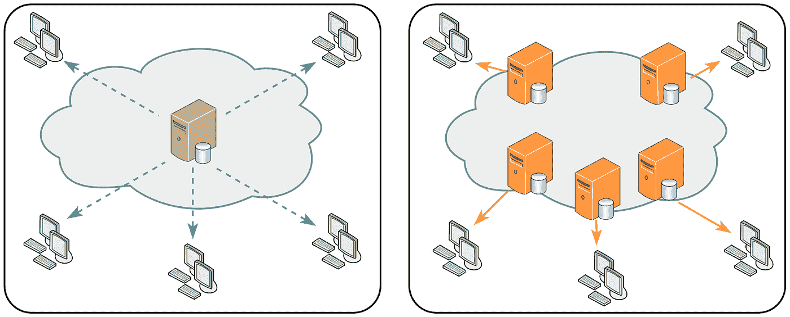

# 使用 GCP 媒体 CDN 和专用 AWS 存储桶

> 原文：<https://medium.com/google-cloud/using-media-cdn-with-private-aws-storage-buckets-e94187b93fb0?source=collection_archive---------4----------------------->

**语境**

谷歌的媒体 CDN 是谷歌云的媒体交付 CDN 平台，专为流媒体视频和大型对象下载而设计。有了这个平台；我们的客户在全球超过 206 个国家/地区和 1300 多个城市拥有广泛的覆盖面和影响力。关于媒体 CDN 的更多详情，请参考[此链接](https://cloud.google.com/media-cdn/docs)

而媒体 CDN 是一个交付平台；原点可以在任何地方/任何平台上。例子；来源可以是谷歌存储，也可以是 AWS S3 等。原始存储桶可以是公共存储桶或私有存储桶。客户倾向于将存储桶设为私有，以实现一些用例，如阻止大量公共请求进入存储桶或限制授权用户对媒体资产的访问。

本博客重点关注媒体 CDN 如何支持 AWS Signature 第 4 版 tp 连接到私有亚马逊简单存储服务(S3)桶。

# 本博客涵盖/未涵盖哪些内容

**盖过**

*   AWS 专用存储桶配置
*   GCP 媒体 CDN 源配置
*   GCP 媒体 CDN 服务配置

**未覆盖**

*   本博客不包括对 GCP 媒体 CDN 结构如服务、起源等的解释。
*   AWS 公共存储桶配置
*   媒体 CDN 服务配置的详细说明
*   其他私有桶(如 Google cloud 私有桶)
*   进行客户端 https 调用的证书设置

我把这个博客分成以下几个主要部分

第 1 节将介绍 AWS 侧配置。

第 2 节将介绍 GCP 侧的配置。

第 3 部分将介绍基本的验证细节。

让我们从真正的配置层面开始吧！！

# AWS 端配置步骤

# 第一步

***创建私有桶(如下例)***

这一步突出了在 AWS 中创建一个私有桶，它将保存由 GCP 媒体 CDN 提供的内容。这很简单..只需确保提及阻止所有公共访问的存储桶级别设置到位。

确保 bucket 中的对象不都是公共的

# 第二步

转到身份管理→用户选项卡→添加用户

*   不要将此用户添加到任何组
*   请继续(下一步并完成)
*   您应该会看到一个屏幕，显示以下 2 个键

(a)访问密钥 ID

(b)秘密访问密钥(请注意/保存，因为我们在稍后阶段需要它)

# 第三步

接下来，我们希望在上一步中创建的用户能够访问 bucket，并且只有权限为' s3。“GetObject”。为了完成此步骤，请返回到 AWS 私有 S3 存储桶并编辑存储桶策略。

下面是我写的样本策略

{

"版本":" 2012–10–17 "，

" Id ":"保单 1663216626024 "，

"声明":[

{

" Sid": "Stmt1663216609692 "，

“效果”:“允许”，

“委托人”:{

" AWS ":" arn:AWS:iam::100552525497:user/gaur av . Google "

},

" Action": "s3:GetObject "，

" Resource ":" arn:AWS:S3:::gaur av-Google-S3-private/* "

}

]

}

至此，我们完成了 AWS 端的配置，并准备好配置 GCP 媒体 CDN 级别的配置

# GCP 侧配置步骤

# 第四步

机密管理器配置

我们需要在 GCP 秘密管理器中上传 AWS 端秘密访问密钥(上面的步骤 2)

1.  去 GCP 秘密经理-创建秘密-给它任何名称

2.创建密码后—创建一个版本并上传/粘贴 AWS 密码访问密钥

你会看到你的版本被创建(请不要被下面的截图弄糊涂了..我有两个版本作为例子。在这篇博客中，我使用的是版本 2)

# 第五步

这一步的重点是创建 GCP 媒体 CDN 的起源。我正在使用 Google cloud shell 完成这一步。为此；我将创建一个带有所需参数的 YAML 文件，并导入这个 YAML 文件来创建原点。

示例源文件 YAML 格式如下所示

**名称:** < <摆放名称>

**原地址:**<<您的 aws 桶名> >

retryConditions: [HTTP_5XX，未找到]

议定书:HTTPS

**AWS v4 认证:**

**accessKeyId:** “你从 aws 控制台得到这个”

**secretaccesskey VERSION:**" projects/**GCP project**/secrets/**SECRET**/versions/**VERSION**

**origin region:**<<AWS 区域> >

# YAML 文件的示例如下→

名称:私人-S3-起源

原地址:“gaur av-Google-S3-private . S3 . AP-south-1 . Amazon AWS . com”

retryConditions: [HTTP_5XX，未找到]

议定书:HTTPS

AWS v4 身份验证:

accessKeyId: "ABCDEFGHIJKLMNOP "

secretaccesskey version:" projects/7142121/secrets/gauravmadan _ GCS _ access _ key/versions/2 "

origin region:“AP-south-1”

# 第六步

*   创建媒体 CDN 源
*   我们现在需要通过使用在步骤 5 中创建的 YAML 文件来创建媒体 CDN 源
*   在 GCP 命令上执行以下命令

# gcloud edge-cache origins 导入 private-S3-origin-source = name-of-YAML file . YAML

在 Google cloud 控制台 UI 中验证 origin 是按如下方式创建的

# 第七步

一旦创建了源，下一步就是创建媒体 CDN 服务。该服务将调用上一步中配置的原点。

虽然本博客不会涵盖在 GCP 平台上配置媒体服务所需的每一个配置参数的细节；不过，我将分享示例配置和配置步骤。你很快会发现一个关于这方面的详细博客！

媒体 CDN 服务配置示例 YAML 文件(***AWS-service . YAML)***

名称:GM-AWS-服务

路由:

主机规则:

-主机:

- ‘*’

路径匹配器:路径

路径匹配器:

-名称:路线

routeRules:

-优先级:1

匹配规则:

- prefixMatch: /

**原点:私有-S3-原点**

路由操作:

urlRewrite:

主机重写:**gaurav-google-s3-private.s3.ap-south-1.amazonaws.com**

路径前缀重写:"/"

cdn 策略:

cacheMode: CACHE_ALL_STATIC

默认 TTL:3600 秒

headerAction:

responseHeadersToAdd:

- headerName: "x 缓存状态"

头值:“{cdn_cache_status}”

使用以下 Google cloud 命令调用这个 YAML 文件来配置媒体 CDN 服务

# gcloud edge-cache 服务导入 AWS-service-source = AWS-service . YAML

媒体 CDN 服务也可以使用 GCP 控制台用户界面进行配置，但是我举了一个通过 YAML 文件进行配置的例子。读者也可以利用 GUI 做同样的事情。

# 第八步

由于媒体 CDN 服务将从 GCP“机密管理器”读取，请确保媒体 CDN 的服务帐户具有“机密管理器机密访问者”的 IAM 角色

# 验证步骤

这里有几个命令可以用来验证配置是否正常

# gcloud edge-cache 起源描述<name-of-your-origin></name-of-your-origin>

# g 云边缘缓存服务描述<name-of-service></name-of-service>

从功能角度来看；使用以下格式浏览到私有 S3 存储桶中的对象

http:// <media cdn="" ip="">/</media>

*   成功配置后，您将从命令 g cloud edge-cache services describe<name-of-service>的输出中获得媒体 CDN IP，也可以从 GCP 控制台 UI 中获得相同的内容。</name-of-service>
*   如果您想使用域名而不是媒体 CDN 的 IP 地址进行访问，请随意更改您的 DNS
*   我在这里使用 http，因为在这个博客中，我没有设置 https 访问，但这不会以任何形式改变媒体 CDN 的功能

如果你仔细注意过这个例子中的服务 YAML 文件；我添加了一个自定义的响应头，如下所示-

- headerName: "x 缓存状态"

头值:“{cdn_cache_status}”

因此，用户应该能够看到在提供的响应中添加了这个头。您可能会看到如下内容(基于您的位置和内容)

暂时就这样吧！希望这是有用的，你能够/将能够配置 GCP 媒体 CDN 从私人 AWS S3 桶获取内容

**有用的参考资料**

[https://cloud . Google . com/media-cdn/docs/connect-to-S3-compatible-buckets](https://cloud.google.com/media-cdn/docs/connect-to-s3-compatible-buckets)

**免责声明**:这是为了告知读者，文中表达的观点、想法、意见仅属于作者，不一定属于作者的雇主、组织、委员会或其他团体或个人。