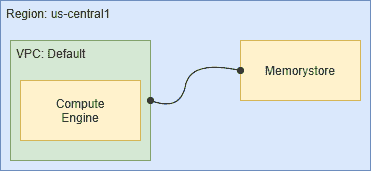
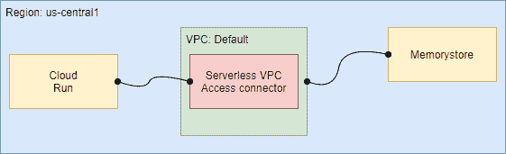

# 通过云运行使用 Memorystore

> 原文：<https://medium.com/google-cloud/using-memorystore-with-cloud-run-82e3d61df016?source=collection_archive---------0----------------------->


Google 的 Memorystore 服务提供了一个完全托管的 Redis 环境。Cloud Run 提供了一个完全托管的容器托管环境，具有自动扩展功能。这为设计由 Cloud Run 托管的、利用 Memorystore 服务的解决方案提供了机会。在本文中，我们将研究如何设置它。

每当我们创建一个 Memorystore 实例时，它将被赋予一个私有 IP 地址，该地址将对单个 VPC 网络可见。此外，Memorystore 只允许来自包含在同一区域内的资源的连接。这提供了使用 VPC 对等从同一地区/VPC 的计算引擎对内存存储的即时访问:



从云运行访问 Memorystore 需要一些额外的步骤。这是因为 Cloud Run 是一个受管理的无服务器环境，与任何特定的 VPC(例如与 Memorystore 对等的 VPC)都没有关联。对此的解决方案是使用无服务器 VPC 访问。

我们在与 Cloud Run 和 Memorystore 相同的区域创建一个无服务器 VPC 访问连接器，并与 memory store 相同的 VPC 相关联。有了这些，我们就可以指示云运行利用连接器来访问 Memorystore。



现在让我们通过一个例子来说明这个故事。首先，我们创建一个 Memorystore 实例:

```
gcloud redis instances create redis1 --region us-central1
```

该实例将被称为“redis1 ”,并存在于“us-central1”区域。该命令需要几分钟才能完成。创建实例后，我们需要记下分配给我们的 IP 地址。

```
gcloud redis instances describe redis1 --region us-central1
```

在显示的信息中，我们将找到一个带有标签“host”的条目。记下 IP 地址，因为这是我们将用来连接 Redis 实例的地址。现在，我们可以创建 VPC 访问连接器:

```
gcloud compute networks vpc-access connectors \
  create my-vpc-connector \
  --network default \
  --region us-central1 \
  --range 10.8.0.0/28
```

这将创建一个名为“my-vpc-connector”的访问连接器，它与默认的 vpc 网络和美国中部 1 地区相关联。连接器的 IP 地址将取自 CIDR 范围 10.8.0.0/28。

我们现在可以创建一个利用 Redis 的云托管应用程序。这里有一个例子:

```
**const** express = require('express');
**const** cors = require('cors')
**const** redis = require("redis");

**const** app = express();

**const** client = redis.createClient({
  "host": process.env.REDIS_IP
});
client.on("error", **function**(error) {
  console.error(error);
});

app.use(cors());

app.get('/', (req, res) => {
  res.set('Cache-Control', 'no-store');
  client.set("key", "value!", redis.print);
  client.get("key", (err, reply) => {
    res.send(`
    <html>
      <head>
      </head>
      <body>
        <p>Connecting to Redis at: ${process.env.REDIS_IP}</p>
        <p>Value of key just read: ${reply}</p>
      </body>
    </html>
    `);
    });
  });

**const** port = process.env.PORT || 8080;
app.listen(port, () => {
  console.log(`Listening on port ${port}`);
});
```

请注意使用了一个名为 REDIS_IP 的环境变量，该变量预计会被提供。这将包含要使用的 Memorystore 实例的 IP 地址。

然后，我们构建一个容器映像(未显示)。一旦构建了容器映像，我们就可以部署到云运行:

```
gcloud run deploy cloud-run-app \
  --image gcr.io/[PROJECT_ID]/cloud-run-app \
  --max-instances 1 \
  --platform managed \
  --region us-central1 \
  --vpc-connector my-vpc-connector \
  --allow-unauthenticated \
  --set-env-vars "REDIS_IP=[IP_ADDRESS]"
```

注意，我们将名为 REDIS_IP 的环境变量设置为 REDIS 实例的 IP 地址。还要注意，我们提供了之前创建的 VPC 连接器，以提供云运行和内存存储之间的链接。

这里有一个 GitHub 存储库[,其中包含了刚刚显示的完整示例。](https://github.com/kolban-google/accessing-memorystore-from-cloud-run)

以下视频进一步展示了这些步骤。

**参考文献**:

*   [Redis-Networking 的存储库](https://cloud.google.com/memorystore/docs/redis/networking)
*   [配置无服务器 VPC 访问](https://cloud.google.com/vpc/docs/configure-serverless-vpc-access)
*   [(云运行)连接到 VPC 网络](https://cloud.google.com/run/docs/configuring/connecting-vpc)