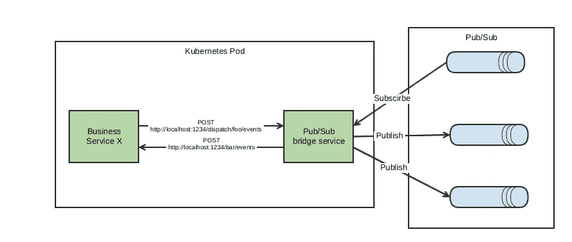

# 使用微服务和 Kubernetes Pods 隐藏谷歌发布/订阅

> 原文：<https://medium.com/google-cloud/using-microservice-and-kubernetes-pods-to-hide-google-pub-sub-f00a18fa3159?source=collection_archive---------1----------------------->

我们的[事件驱动系统](/citerus/microservices-events-and-cqrs-at-klarity-f9ca6c0855eb)运行在谷歌云上，使我们能够传递所有这些事件的核心是谷歌的消息服务 [Pub/Sub](https://cloud.google.com/pubsub/docs/overview) 。从很多方面来说，这都是一次很棒的经历，但是有些事情让我们很恼火。其中之一是它使用起来有点麻烦，SDK(在我们的例子中是 Java)并不那么直观，它还处于测试阶段(当我们开始使用它的时候是 Alpha 版本)，而且事情还在不断变化。

我们试图通过创建一个库来解决这个问题，在这里我们创建了一些抽象来隐藏 Pub/Sub SDK 的本质细节。这使它稍微好了一点，但我们仍然有其他问题。例如传递依赖(远离库的好理由)。我们的发布/订阅 SDK 的测试版与我们的[数据存储](https://cloud.google.com/datastore/docs/concepts/overview) SDK 的 1.0 版本冲突。

一天在上班的公交车上，我有一个想法，为什么不把这个(发布/订阅集成)放在微服务中呢？我们已经在几乎所有的事情上这样做了，为什么不呢？我们使用 [Kubernetes 引擎](https://cloud.google.com/kubernetes-engine/)并将我们所有的服务部署为 Docker 容器。在 Kubernetes 中有一个概念叫做 Pod，它是一组共享网络和存储的容器。Pod 中的两个容器可以通过本地主机相互通信。很好，那么让我们给所有与 Pub/Sub 对话的服务一个伙伴，以 Pub/Sub 桥服务的形式运行在同一个 Pod 中。不再与 Pub/Sub 直接交互，只需 http。



Pub/Sub bridge 服务可以配置任意多的订阅或发布者(但对我们来说，通常只有一个订阅或一个发布者，我们的服务毕竟很小)。

事实证明，这种方法给我们带来了很多好处。

*   松散耦合意味着没有传递依赖性的噩梦。
*   这也意味着我们可以很容易地切换出 Pub/Sub，并使用其他东西进行消息传输。
*   我们变得与语言无关，为 out Node.js 服务添加发布/订阅集成将变得轻而易举。
*   黑盒测试业务服务变得更加容易和确定，因为我们现在可以使用同步 http 而不是异步消息传递。
*   我们可以使用内置在 web 应用程序框架中的基于路径的路由逻辑，这使得订阅更加容易。

为了支持最后一点，我们在配置订阅者时可以在 url 中使用发布/订阅消息属性，因此您可以使用类似于[http://localhost:8080/{ attribute:aggregate type }/events/{ attribute:event type }](http://localhost:8080/{attribute:aggregateType}/events/{attribute:aggregateType})的内容，这些占位符将替换为相应的消息属性值。

所以我们现在可以有:

```
@PostMapping("/case/events/case_created_event")
fun caseCreated(@RequestBody event: CaseCreatedEvent) {
    // Do something
}

@PostMapping("/case/events/description_added_event")
fun descriptionAdded(@RequestBody event: CaseDescriptionAddedEvent) {
    // Do something
}
```

而不是像这样:

```
override fun receiveMessage(message: PubsubMessage, consumer: AckReplyConsumer) {
    val eventType = message.getAttributesOrThrow("eventType")
    when(eventType) {
        "case_created_event" -> handleCaseCreated(consumer, message.*attributesMap*, convert(message.*data*, CaseCreatedEvent::class.*java*)) 
        "description_added_event" -> handleDescriptionAdded(consumer, message.*attributesMap*, convert(message.*data*, DescritionAddedEvent::class.*java*)) 
    }
}
```

干净多了！

发布/订阅桥服务将根据它从 http POST 到业务服务的响应来确认/否定消息。Http 503 或连接问题，它将否定它(因此消息将在以后重新传递)，对于任何其他错误，它将只记录它并确认消息。当你拒绝信息时，你应该始终保持警惕，如果信息实际上已经损坏，并且永远无法处理，它会阻塞你的话题。发生在我们身上…

好了，这就是我们所做的，让 Pub/Sub 提供我们想要的所有价值，同时减少我们的负担。到目前为止，我们很高兴，但我们只是刚刚实施它，我们将在一个月后看看我们的感觉。