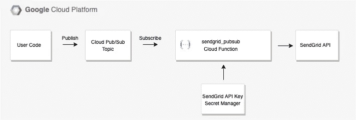
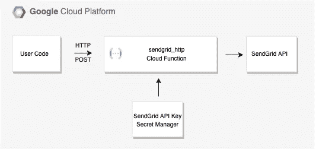

# 使用 Secret Manager 和 Cloud 函数通过 SendGrid 发送邮件

> 原文：<https://medium.com/google-cloud/using-secret-manager-and-cloud-functions-to-send-mail-with-sendgrid-f2f1df684278?source=collection_archive---------1----------------------->

为谷歌云工作，我最喜欢的一件事是有机会分享我学到的东西，并将其推广给他人。在之前的一篇文章中，我写了一个使用谷歌云功能从云发布/订阅发送电子邮件的项目。在这种特殊情况下，要求只使用本地 SMTP 功能，并且所有消息都必须来自静态 IP。

我有机会在没有这些要求的情况下重新审视这一点，并以不同的方式来做这件事。我仍然使用[云功能](https://cloud.google.com/functions)，但是调用 SendGrid 来完成这项工作。SendGrid 是 Google Cloud Marketplace 上可用的电子邮件服务之一。

注册 SendGrid 后，我必须生成一个 API 密匙。像任何种类的凭证一样，API 密钥需要受到保护。我决定用[的秘密经理](https://cloud.google.com/secret-manager)来做这件事。您使用 Secret Manager 来存储*秘密*(比如密码、密钥等等)。Secret Manager 对信息进行加密，并支持版本控制和资源许可。您只需创建一个服务帐户，并在 Secret Manager 控制台中添加 [Secret Accessor](https://cloud.google.com/secret-manager/docs/access-control) 权限，然后将该服务帐户附加到云功能。

我开发了两个云函数，一个处理来自云发布/订阅的消息，另一个处理来自 HTTP 调用的消息。云函数解析消息，从 Secret Manager 获取 API 密钥，然后调用 SendGrid。这是两个用例的图表。

使用 Secret Manager 从云发布/订阅中调用 SendGrid 的云函数

如果你想了解更多这方面的信息，可以看看 GitHub repo 。此外，请注意，虽然我为谷歌云工作，但我是以个人名义写作，而不是以任何官方身份。

编码快乐！