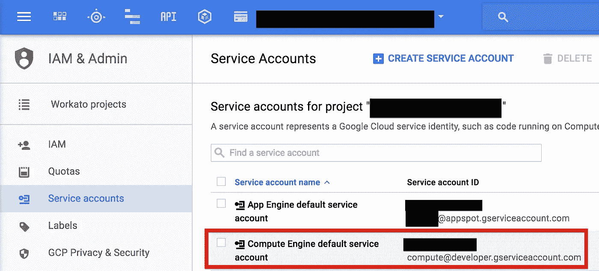
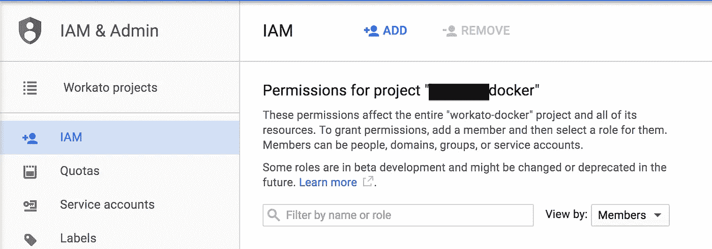
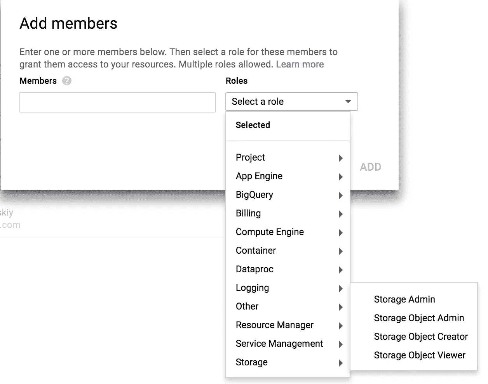

# 在多个 GKE 项目中使用单个 Docker 存储库

> 原文：<https://medium.com/google-cloud/using-single-docker-repository-with-multiple-gke-projects-1672689f780c?source=collection_archive---------3----------------------->

在所有谷歌容器引擎(GKE)教程中，你会看到属于这个项目的 Docker 资源库:**gcr.io/<你-项目-名称> /** 。它的优点是开箱即用，不需要任何设置(当然除了启用 GKE 本身)。然而，如果你有多个 GKE 项目使用相同的 Docker 图像，你该怎么办？例如，使用 CI 系统构建的 Docker 映像的测试、试运行和生产环境。不得不推送到多个存储库，并且不得不在 Kubernetes YAML 文件中指定不同的存储库是很麻烦的。我们希望有一个单一的存储库，我们可以从中部署到多个项目。

拥有一个单一的存储库很容易——只需创建另一个专门的谷歌云项目，比如说<mycompany-docker>,现在你可以用**gcr.io/<my company-Docker>/**给你的 Docker 图片加标签，然后推送。然而，如果您试图从另一个项目引用这样的图像，您将得到 Kubernetes 的错误，而部署说，它不能拉图像。这是意料之中的，当然 GKE 库是受访问保护的，并且只能从同一个项目中获得。我们想要的是提供对这个 Docker 存储库的其他项目的读取权限。原来 Kubernetes 部署是在名为“计算引擎默认服务帐户”的特殊服务帐户下执行的，这就是我们想要授予读取权限的帐户。</mycompany-docker>

**第一步。获取服务帐户 ID。** 在云控制台转到你的 GKE 项目(一个使用 Docker 映像的项目)，转到“IAM & Admin”选项卡，在服务帐户中找到“计算引擎默认服务帐户”。记下帐户 ID，看起来像电子邮件格式。对所有可以访问 Docker 存储库的项目重复这个步骤。

**第二步。将帐户添加到访问列表。**
切换到你的 Docker repo 项目，进入“IAM 和管理标签”，选择“IAM”左侧标签，点击顶部的添加+按钮。

并将“存储对象查看者”权限授予您在步骤 1 中记录的所有服务帐户。将服务账户 ID 复制到“**成员**字段，并在如下所示的菜单中选择权限。

就是这样。现在，您可以在 Kubernetes YAML 配置文件中引用您的中央 Docker 存储库，并从登台和生产环境中访问它，同时保持该存储库的私有性。