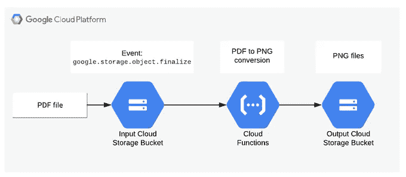

# 在 Google Cloud 函数中使用系统包和自定义二进制文件。

> 原文：<https://medium.com/google-cloud/using-system-packages-and-custom-binaries-in-google-cloud-functions-f2df7be926a3?source=collection_archive---------0----------------------->

Google Cloud Functions 是一个基于 Google Cloud Platform 的无服务器计算平台。它的主要原则是:“用 NodeJS、Python 或者 Go 写代码，部署好了就不用管其他的了”。这个流程非常适合小代码，一个响应 HTTP 请求或来自 PubSub、云存储、Firestore 等的各种事件的简单函数。虽然没有限制使用包管理器(npm，pip)为相关的编程语言安装任何第三方库，但有时即使这样也不够。

云函数建立在 Ubuntu 18.04 镜像之上，提供了一些有用的系统包，这是一个不常被提及的特性，也是我想在本文中重点讨论的主题。我个人在为一个客户做项目时遇到了这个问题，这个客户想要从 Adobe 文件格式进行转换，并要求使用云功能。

正如我提到的，云函数运行时已经预装了系统包[https://Cloud . Google . com/Functions/docs/reference/python-system-packages](https://cloud.google.com/functions/docs/reference/python-system-packages)。因为云函数运行时是基于 Ubuntu 18.04 镜像的，这就像让你的函数放在 Ubuntu 沙盒下面一样。

我设置了 GitHub repo 和一些用 Python 3.7 写的云函数作为例子[https://GitHub . com/zde nulo/Google-Cloud-Functions-system-packages](https://github.com/zdenulo/google-cloud-functions-system-packages)。

# 探索运行时

为了在 Python 程序中执行系统命令，我使用了**子流程**模块。一个通用的用例如下:

```
import subprocess

cmd = "ls -ltr /".split(' ')
p = subprocess.Popen(cmd, stderr=subprocess.PIPE, stdout=subprocess.PIPE)
stdout, stderr = p.communicate()
if stderr:
    print(f"there was error {stderr}")
if stdout:
    print(f"result: {stdout}")
```

要执行的命令在变量 **cmd** 中定义，然后在 **stdout** 中输出常规输出，如果 **stderr** 变量中有错误。

使用云函数 [cf_system](https://github.com/zdenulo/google-cloud-functions-system-packages/tree/master/cf_system) ，我正在执行几个命令来找出什么是环境变量以及 PATH 变量中的可执行文件。例如，这些是环境变量:

```
{'CODE_LOCATION': '/user_code',
 'DEBIAN_FRONTEND': 'noninteractive',
 'ENTRY_POINT': 'main',
 'FUNCTION_IDENTITY': 'gcp@appspot.gserviceaccount.com',
 'FUNCTION_MEMORY_MB': '256',
 'FUNCTION_NAME': 'system',
 'FUNCTION_REGION': 'us-central1',
 'FUNCTION_TIMEOUT_SEC': '60',
 'FUNCTION_TRIGGER_TYPE': 'HTTP_TRIGGER',
 'GCLOUD_PROJECT': 'gcp',
 'GCP_PROJECT': 'gcp',
 'HOME': '/tmp',
 'LC_CTYPE': 'C.UTF-8',
 'NODE_ENV': 'production',
 'PATH': '/env/bin:/usr/local/sbin:/usr/local/bin:/usr/sbin:/usr/bin:/sbin:/bin',
 'PORT': '8080',
 'PWD': '/user_code',
 'SUPERVISOR_HOSTNAME': '169.254.8.129',
 'SUPERVISOR_INTERNAL_PORT': '8081',
 'VIRTUAL_ENV': '/env',
 'WORKER_PORT': '8091',
 'X_GOOGLE_CODE_LOCATION': '/user_code',
 'X_GOOGLE_CONTAINER_LOGGING_ENABLED': 'false',
 'X_GOOGLE_ENTRY_POINT': 'main',
 'X_GOOGLE_FUNCTION_IDENTITY': 'gcp@appspot.gserviceaccount.com',
 'X_GOOGLE_FUNCTION_MEMORY_MB': '256',
 'X_GOOGLE_FUNCTION_NAME': 'system',
 'X_GOOGLE_FUNCTION_REGION': 'us-central1',
 'X_GOOGLE_FUNCTION_TIMEOUT_SEC': '60',
 'X_GOOGLE_FUNCTION_TRIGGER_TYPE': 'HTTP_TRIGGER',
 'X_GOOGLE_FUNCTION_VERSION': '2',
 'X_GOOGLE_GCLOUD_PROJECT': 'gcp',
 'X_GOOGLE_GCP_PROJECT': 'gcp',
 'X_GOOGLE_LOAD_ON_START': 'false',
 'X_GOOGLE_SUPERVISOR_HOSTNAME': '169.254.8.129',
 'X_GOOGLE_SUPERVISOR_INTERNAL_PORT': '8081',
 'X_GOOGLE_WORKER_PORT': '8091'}
```

这是可执行文件列表的一部分:

```
-rwxr-xr-x 1 root root    142608 Apr 24  2019 ffserver
-rwxr-xr-x 1 root root    161944 Apr 24  2019 ffprobe
-rwxr-xr-x 1 root root    137376 Apr 24  2019 ffplay
-rwxr-xr-x 1 root root    272528 Apr 24  2019 ffmpeg
-rwxr-xr-x 1 root root     43168 May  7  2019 apt-mark
-rwxr-xr-x 1 root root     27391 May  7  2019 apt-key
-rwxr-xr-x 1 root root     43168 May  7  2019 apt-get
-rwxr-xr-x 1 root root     22616 May  7  2019 apt-config
-rwxr-xr-x 1 root root     22688 May  7  2019 apt-cdrom
-rwxr-xr-x 1 root root     80032 May  7  2019 apt-cache
-rwxr-xr-x 1 root root     14424 May  7  2019 apt
lrwxrwxrwx 1 root root         0 May  7  2019 ps2txt -> ps2ascii
-rwxr-xr-x 1 root root       669 May  7  2019 ps2ps2
-rwxr-xr-x 1 root root       647 May  7  2019 ps2ps
-rwxr-xr-x 1 root root      1097 May  7  2019 ps2pdfwr
-rwxr-xr-x 1 root root      2752 May  7  2019 ps2epsi
-rwxr-xr-x 1 root root       631 May  7  2019 ps2ascii
-rwxr-xr-x 1 root root       395 May  7  2019 printafm
-rwxr-xr-x 1 root root       404 May  7  2019 pphs
-rwxr-xr-x 1 root root       516 May  7  2019 pfbtopfa
-rwxr-xr-x 1 root root       498 May  7  2019 pf2afm
-rwxr-xr-x 1 root root       909 May  7  2019 pdf2ps
-rwxr-xr-x 1 root root       698 May  7  2019 pdf2dsc
-rwxr-xr-x 1 root root       277 May  7  2019 gsnd
-rwxr-xr-x 1 root root       350 May  7  2019 gslp
```

正如你从列表中看到的(不完整)，有各种各样的程序，如 ffmpeg(视频/音频转换)或各种 ps2* (postscript 转换)，awk，sed，grep 等等。在下一节中，我们将看到一些使用这些程序的实际例子。

我在研究云函数系统和执行命令期间实现的最后一个案例是执行任意命令(管道不工作)。当我在我的云函数命令**apt list-installed**中为**选项**参数设置时，我会得到一个已安装包的列表。

```
Listing...
adduser/bionic,now 3.116ubuntu1 all [installed]
adwaita-icon-theme/bionic,now 3.28.0-1ubuntu1 all [installed,automatic]
apt/bionic-updates,now 1.6.11 amd64 [installed]
aspell/bionic,now 0.60.7~20110707-4 amd64 [installed,automatic]
aspell-en/bionic,now 2017.08.24-0-0.1 all [installed,automatic]
at-spi2-core/bionic,now 2.28.0-1 amd64 [installed,automatic]
base-files/bionic-updates,now 10.1ubuntu2.4 amd64 [installed]
base-passwd/bionic,now 3.5.44 amd64 [installed]
bash/bionic-updates,now 4.4.18-2ubuntu1.1 amd64 [installed]
bsdutils/bionic-updates,now 1:2.31.1-0.4ubuntu3.3 amd64 [installed]
bzip2/bionic,now 1.0.6-8.1 amd64 [installed]
ca-certificates/bionic,bionic-updates,now 20180409 all [installed]
coreutils/bionic,now 8.28-1ubuntu1 amd64 [installed]
cpp/bionic-updates,now 4:7.4.0-1ubuntu2.2 amd64 [installed,automatic]
cpp-7/bionic-updates,now 7.4.0-1ubuntu1~18.04 amd64 [installed,automatic]
curl/bionic-updates,bionic-security,now 7.58.0-2ubuntu3.7 amd64 [installed
```

可能还有其他的东西需要寻找和发现，但是让我们来看一些实际的用例。

# PDF 文档到图像的转换。

该示例实现了以下过程:当 PDF 文件被上传到云存储桶时，它触发云函数，该云函数将 PDF 文档转换为 PNG 图像(一页到一幅图像),并将它们存储到输出存储桶，然后可以对其进行进一步处理，例如进行 OCR。这是一个很好的图表，代表了整个过程。



如果我们想用纯 Python 来做这件事，那是不可能的。幸运的是 [Ghostscript](https://www.ghostscript.com/) 程序拯救了这一天。当然，它是预装在云函数中的，要将 PDF 转换为 PNG(或其他图像格式),需要使用以下命令:

```
gs -dSAFER -dNOPAUSE -dBATCH -sDEVICE=png16m -r600 -sOutputFile="output-%d.png" input.pdf'
```

全云功能代码:

```
def main(data, context=None):
    gcs = storage.Client(project=os.environ['GCP_PROJECT'])
    bucket_name = data['bucket']
    file_name = data['name']
    if file_name[-4:] != '.pdf':
        logging.error("input file is not pdf")
        return
    input_filepath = os.path.join(TMP_FOLDER, file_name)
    bucket = gcs.bucket(bucket_name)
    blob = bucket.blob(file_name)
    blob.download_to_filename(input_filepath)

    output_filename = file_name.rsplit('.', 1)[0]
    output_filename += '-%d'
    output_filename += '.png'
    output_filepath = os.path.join(TMP_FOLDER, output_filename)

    cmd = f'gs -dSAFER -dNOPAUSE -dBATCH -sDEVICE=png16m -r600 -sOutputFile="{output_filepath}" {input_filepath}'.split(
        ' ')
    p = subprocess.Popen(cmd, stderr=subprocess.PIPE, stdout=subprocess.PIPE)

    stdout, stderr = p.communicate()
    error = stderr.decode('utf8')
    if error:
        logging.error(error)
        return

    for filename in os.listdir(TMP_FOLDER):
        if filename[-4:] == '.png':
            full_path = os.path.join(TMP_FOLDER, filename)
            output_bucket = gcs.bucket(OUTPUT_BUCKET)
            output_blob = output_bucket.blob(filename)
            output_blob.upload_from_filename(full_path)
            logging.info(f'uploaded file: {filename}')
            os.remove(full_path)

    if os.path.exists(input_filepath):
        os.remove(input_filepath)
    return
```

由于云函数是由云存储中的事件触发的，在传入的数据中，提供了桶和文件的名称，因此在此基础上，从云存储中下载文件，然后通过调用 **gs** 命令执行转换，并将结果保存到/tmp 文件夹。将输出文件上传到输出存储桶后，将删除/tmp 文件夹中的文件以及输入文件，以清理所有内容。由于云函数最多支持一个并发请求，因此在处理过程中不会出现来自不同请求的文件混合在同一个实例中的情况，但是同一个实例可以处理下一个请求，这意味着不会创建实例，而是使用现有的实例，这就是为什么会从/tmp 文件夹中删除输入和输出文件。

这是云功能用例的一个很好的例子:一个简单明了的例子，几行代码做一件事(实际上是 3 件事:下载、转换、上传)。

# 在云函数中执行自定义程序

在前面的例子中，我们在云函数环境中使用了预装的 Ghostscript 程序。但是当然，当我们想使用我们自己编译的程序时，总会有一些边缘情况，这些程序在系统中或者在我们正在使用的语言中是不可用的。对于这个例子，我们将使用文本到 ASCII 转换器，即在 GET HTTP 请求中，有一个文本参数，其中应该定义输入文本，因此，将返回 ASCII 测试。我知道这有一个 Python 库，但是为了举例，我将使用一个名为 [figlet](http://www.figlet.org/) 的程序。这个例子的完整代码在这里[https://github . com/zde nulo/Google-cloud-functions-system-packages/tree/master/cf _ ascii](https://github.com/zdenulo/google-cloud-functions-system-packages/tree/master/cf_ascii)。Figlet 是用 C 编写的程序，所以为了使用它，我需要编译它以获得二进制可执行文件。该过程如下:

源代码可以从本地计算机上的 FTP://FTP . fig let . org/pub/fig let/program/UNIX/fig let-2 . 2 . 5 . tar . gz 下载。

然后解包并编译(在 Linux 操作系统上):

```
tar -zxvf figlet-2.2.5.tar.gz 
cd figlet-2.2.5/
make
```

如果一切顺利，这将创建可执行的 **figlet** 。在云函数中执行此文件时，可能会出现权限问题，尤其是在 Windows 上编译代码时，因此以防万一，请执行以下命令:

```
chmod a+x figlet
```

要执行的一个常见命令是:

```
./figlet -d fonts hello
```

产生输出

```
_          _ _       
| |__   ___| | | ___  
| '_ \ / _ \ | |/ _ \ 
| | | |  __/ | | (_) |
|_| |_|\___|_|_|\___/
```

为了在云函数中使用，需要将 **figlet** 可执行文件以及 **fonts** 文件夹复制到云函数文件夹中，并与云函数代码一起上传。代码本身基本上是一个执行 figlet 并返回输出的包装器。

```
def main(request):
    text = request.args.get('text', '')
    if not text:
        return 'missing text parameter', 404
    logging.info(f'received url: {text}')

    cmd = f"./figlet -d fonts {text}".split(' ')
    p = subprocess.Popen(cmd, stderr=subprocess.PIPE, stdout=subprocess.PIPE)
    stdout, stderr = p.communicate()
    error = stderr.decode('utf8')
    if error:
        return error, 403
    out = stdout.decode('utf8')
    response = make_response(out)
    response.headers["content-type"] = "text/plain"
    return response
```

也可以使用 Cloud Run，但是因为我们是一次性编译，需要用几行代码来包装所有东西，所以 Cloud Function 也可以。因此，在本例中，使用 C 程序的源代码，在本地计算机上编译它，并上传二进制代码以及云函数代码及其使用位置。这样，我们就有了一个简单的 API 来读取输入文本并转换成 ASCII 文本。

在本文中，我展示了除了云函数运行时提供的程序之外，使用各种程序的可能性。我猜在 90%的云功能中，你不需要这个，但对于那 10%，它可能是有用的。

如果你对谷歌云感兴趣，看看 GCP 周刊，这是我每周一发布的关于谷歌云的每周时事通讯。