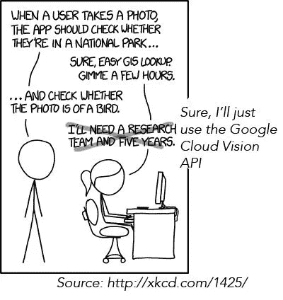
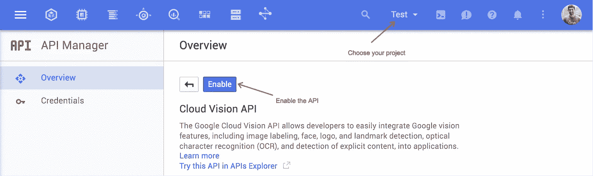
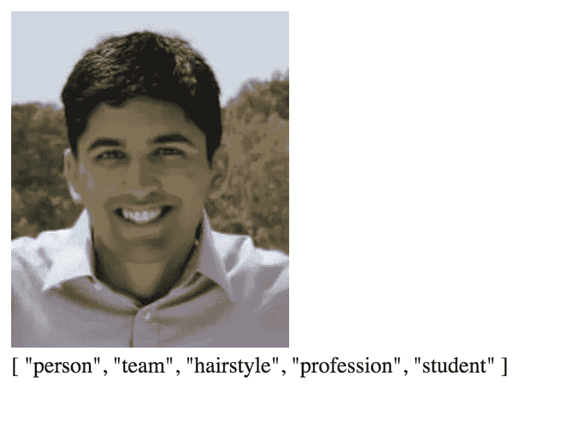

# 通过 Node.js 使用 Google Cloud Vision API

> 原文：<https://medium.com/google-cloud/using-the-google-cloud-vision-api-with-node-js-194e507afbd8?source=collection_archive---------0----------------------->

你可能听说过新的 Google [云视觉 API](https://cloud.google.com/vision/) 。如果你没有，你应该去看看。它让你上传一张图像，并从中获得大量基于机器学习的信息，包括地标检测、人脸检测、情感检测、成人内容检测，甚至 OCR。

我最喜欢的功能是标签检测。给云视觉一个图像，它会告诉你图像里有什么！

这使得以前不可能的事情变得超级容易！

# 启用 Vision API

要使用 API，您需要启用 API:

1.  [确保你有一个谷歌云项目](https://www.youtube.com/watch?v=76IHbUMwz9k)
2.  [点击此链接](https://console.cloud.google.com/apis/api/vision.googleapis.com/overview)
3.  选择您的项目并启用 API

# 使用 gcloud npm 模块

最容易使用的云视觉 API 是 [gcloud npm 模块](https://github.com/GoogleCloudPlatform/gcloud-node)。

[确保创建一个服务帐户并下载 JSON 密钥文件](https://www.youtube.com/watch?v=tSnzoW4RlaQ)。

是啊，说真的，就是这样！有针对云视觉 API 的所有不同特性的函数，还有通用的“检测”函数，可以一次进行多种类型的检测！

# 创建“真正的”应用程序

这是我做的一个示例应用程序。它创建了一个 little Express 服务器，让您上传图像，并让云视觉 API 对其进行分析。

 [## 桑德兰/样品

### 样品-我做的样品和例子的一般报告

github.com](https://github.com/thesandlord/samples/blob/master/cloud-vision-nodejs/index.js) 

[看一下第 52 行。](https://github.com/thesandlord/samples/blob/master/cloud-vision-nodejs/index.js#L52)您可以指定云视觉 API 应该检测哪些内容，例如人脸、地标、标签、徽标、属性、成人内容和文本！这使您能够通过只检测您需要的功能来节省成本。

我上传了一张自己几年前的照片:

哦耶，看那个发型！

疯了！

[查看文档了解更多信息。](https://googlecloudplatform.github.io/gcloud-node/#/docs/v0.30.2/vision)API 给你很多你想要的详细信息；我只触及了表面！