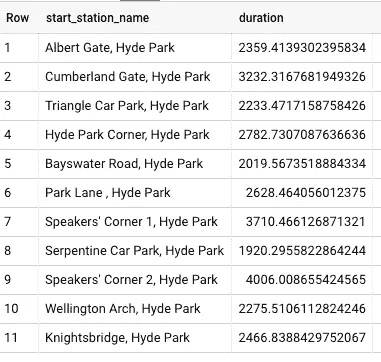

# 使用 ASSERT 验证 BigQuery 脚本的成功执行

> 原文：<https://medium.com/google-cloud/validating-successful-execution-of-bigquery-scripts-using-assert-c82f7ff9cfa8?source=collection_archive---------1----------------------->

## 使用 ASSERT 验证前置和后置条件

当您编写 BigQuery 脚本时，通常会希望确保数据符合您的期望。有多少次你写的脚本在你部署的时候是有效的？然后，有人在上游更改了您的输入数据，几个月后您才发现脚本正在悄悄地创建错误的/空的表？如果剧本失败了你得到了提醒不是更好吗？


使用断言构建可靠的脚本！图片来自[皮克斯拜](https://pixabay.com/?utm_source=link-attribution&utm_medium=referral&utm_campaign=image&utm_content=4752149)

## 剧本

假设您的脚本(您可能正在计划它，或者它可能在触发器上运行)为一些车站创建了一个自行车骑行平均持续时间表:

```
CREATE OR REPLACE TABLE ch07eu.hydepark_rides AS
SELECT
  start_station_name,
  AVG(duration) AS duration
FROM `bigquery-public-data`.london_bicycles.cycle_hire
WHERE
  start_station_name LIKE '%Hyde%'
GROUP BY start_station_name;
```

结果是:



## 后置条件

您如何知道脚本正确执行了呢？一种简单的检查方法是输出表存在并且包含对应于已知站的数据。您可以使用 ASSERT 实现这一点:

```
ASSERT EXISTS(
   SELECT duration FROM ch07eu.hydepark_rides
   WHERE start_station_name = 'Park Lane , Hyde Park'
);
```

基本上，您调用 ASSERT 并在其后跟随一个返回 TRUE 或 FALSE 的 SQL 语句。如果返回 FALSE，脚本将失败。这样，如果输入表的 start_station_name 列由于某种原因不包含海德公园站(可能存在网络问题)，您就会知道。

如果没有 ASSERT，脚本会自动创建一个空表，并说它成功了。

您并不局限于检查表中行的存在。您甚至可以应用数据质量检查。例如，最小可能持续时间是 60 秒，因此我们可以验证输出表不包含任何损坏的值:

```
ASSERT (SELECT min(duration) FROM ch07eu.hydepark_rides) > 60;
```

## 先决条件

确认你正在做的任何假设是一个好主意。例如，我们可以验证我们获得的电台名称是否正确:

```
ASSERT EXISTS (
   SELECT name 
   FROM `bigquery-public-data`.london_bicycles.cycle_stations
   WHERE name LIKE '%Hyde%'
);
```

这样，如果有人决定更改表格，从车站名称中删除海德公园，我们将得到一个警告，因为脚本将失败。

## 完整脚本

以下是带有前置和后置条件的完整脚本:

```
ASSERT EXISTS (
   SELECT name 
   FROM `bigquery-public-data`.london_bicycles.cycle_stations
   WHERE name LIKE '%Hyde%'
);CREATE OR REPLACE TABLE ch07eu.hydepark_rides AS
SELECT
  start_station_name,
  AVG(duration) AS duration
FROM `bigquery-public-data`.london_bicycles.cycle_hire
WHERE
  start_station_name LIKE '%Hyde%'
GROUP BY start_station_name;ASSERT EXISTS(
   SELECT duration FROM ch07eu.hydepark_rides
   WHERE start_station_name = 'Park Lane , Hyde Park'
);ASSERT (SELECT min(duration) FROM ch07eu.hydepark_rides) > 60;
```

尽情享受吧！