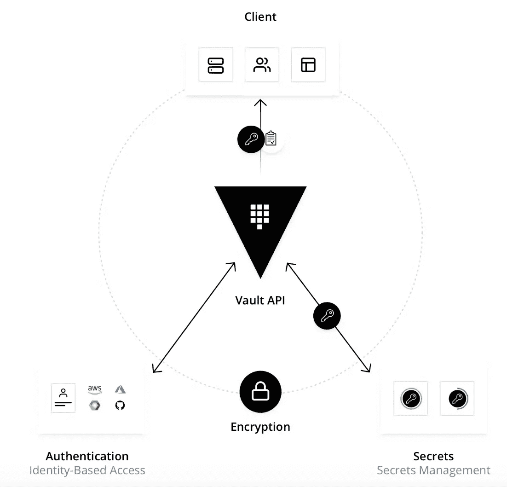

# 通过舵轮图在 GKE 上跳马

> 原文：<https://medium.com/google-cloud/vault-ha-on-gke-via-helm-charts-687899ddfd08?source=collection_archive---------0----------------------->

现代系统需要访问大量秘密，包括数据库凭证、外部服务的 API 密钥、面向服务架构通信的凭证。如今，大多数企业的凭证遍布其组织。密码、API 密钥和凭证存储在纯文本、应用程序源代码、配置文件和其他位置。因为这些凭证无处不在，这种蔓延使得真正知道谁有权访问和访问什么变得困难和令人生畏。以纯文本形式保存凭据还会增加内部和外部攻击者进行恶意攻击的可能性。

很难了解谁在访问哪些机密，如果没有定制的解决方案，添加密钥滚动、安全存储、详细的审计日志几乎是不可能的。这就是 Vault 介入的地方。Vault 获取所有这些凭据，并将它们集中在一个位置进行定义，这样可以减少不必要的凭据暴露。但 Vault 更进了一步，它确保用户、应用和系统经过身份验证并明确授权访问资源，同时还提供审计跟踪，可捕获和保存客户端操作的历史记录。

# 什么是跳马？

Vault 是一个基于身份的秘密和加密管理系统。



# 跳马是如何工作的？

核心 Vault 工作流程包含四个阶段:

*   **认证:**Vault 中的认证是客户端提供信息的过程，Vault 使用该信息来确定他们是否是他们所声称的身份。一旦根据 auth 方法对客户端进行了身份验证，就会生成一个令牌并将其与策略相关联。
*   **验证:** Vault 根据第三方可信来源(如 Github、LDAP、AppRole 等)来验证客户端。
*   **授权**:客户端匹配金库安全策略。此策略是一组规则，用于定义客户端可以使用其保管库令牌访问哪些 API 端点。策略提供了一种声明性的方式来授予或禁止对 Vault 中特定路径和操作的访问权限。
*   **访问** : Vault 通过基于与客户端身份相关的策略发布令牌来授予对秘密、密钥和加密功能的访问权。然后，客户端可以将它们的存储令牌用于将来的操作。

# 通过 Helm 将 Vault 安装到 Google Kubernetes 引擎

谷歌 Kubernetes 引擎(GKE)可以在标准或自动驾驶模式下在其安全和管理的 Kubernetes 服务中运行 Vault。标准模式为您提供了配置集群底层基础架构的灵活性，而自动驾驶模式为您提供了无需干预的优化集群体验。

# 先决条件

你需要一个[谷歌云账户](https://console.cloud.google.com/)、[谷歌云命令行界面](https://cloud.google.com/sdk/docs/quickstart)、 [Kubernetes CLI](https://kubernetes.io/docs/tasks/tools/install-kubectl/) 和 [Helm CLI](https://helm.sh/docs/helm/) 。

**OS X 家酿:**

1.  用[自制](https://brew.sh/)安装`gcloud`。

```
$ brew install google-cloud-sdk
```

2.用自制软件安装`kubectl`。

```
$ brew install kubernetes-cli
```

3.用自制软件安装`helm`。

```
$ brew install helm
```

接下来，将`gcloud` CLI 与您的 Google 帐户连接起来。

```
$ gcloud auth login
```

该命令启动浏览器，并要求您使用 Google 帐户凭据进行身份验证。

接下来，初始化`gcloud`命令行界面。

```
$ gcloud init
```

这个初始化过程可能会要求您创建一个 Google Cloud 项目。项目是组织所有 Google 云资源的唯一标识的名称空间。如果您已经有一个与您的帐户相关联的项目，创建一个新项目可能很重要。

如果需要，创建一个具有唯一标识符的 Google Cloud 项目。

```
$ gcloud projects create PROJECT_ID
```

`gcloud` CLI 为您选择作为当前项目的项目管理 Google 云资源。

如果您创建了一个项目，则需要将该项目设置为当前项目。

```
$ gcloud config set project PROJECT_ID
```

从列表中设置一个默认计算区和区域，其状态为 UP。

```
$ gcloud config set compute/region us-west1
```

# 启动集群

对于创建 Kubernetes 集群的项目，需要启用容器服务。

启用 Google 容器服务。

```
$ gcloud services enable container.googleapis.com
```

以高可用性启动的 Vault 集群需要一个具有三个节点的 Kubernetes 集群。您可以手动创建这些节点或使用自动驾驶模式。

# 自动驾驶仪

在自动驾驶模式下创建一个名为`learn-vault`的集群。

```
$ gcloud container clusters create-auto CLUSTER_NAME \
    --region REGION \
    --project=PROJECT_ID 
```

```
...
Creating cluster learn-vault in us-west1...done.
Created [https://container.googleapis.com/v1/projects/learn-hashicorp-UNIQUE_ID/zones/us-west1/clusters/learn-vault].
To inspect the contents of your cluster, go to: [https://console.cloud.google.com/kubernetes/workload_/gcloud/us-west1/learn-vault?project=learn-hashicorp-UNIQUE_ID](https://console.cloud.google.com/kubernetes/workload_/gcloud/us-west1/learn-vault?project=learn-hashicorp-UNIQUE_ID)
kubeconfig entry generated for learn-vault.
NAME         LOCATION  MASTER_VERSION   MASTER_IP      MACHINE_TYPE  NODE_VERSION     NUM_NODES  STATUS
learn-vault  us-west1  1.21.5-gke.1302  34.82.120.195  e2-medium     1.21.5-gke.1302  3          RUNNING
```

集群被创建、部署，然后进行运行状况检查。当集群准备就绪时，该命令会修改`kubectl`配置，以便针对该集群执行您发出的命令。

显示集群的节点。

```
$ kubectl get nodes
NAME                                         STATUS   ROLES    AGE   VERSION
gk3-learn-vault-default-pool-c4d4759d-w5g2   Ready    <none>   7m13s   v1.21.5-gke.1302
gk3-learn-vault-default-pool-dbb32d2b-qcl7   Ready    <none>   7m13s   v1.21.5-gke.1302
gk3-learn-vault-default-pool-bd170fcf-0vqg   Ready    <none>   7m13s   v1.21.5-gke.1302
```

Autopilot 显示一组较小的节点，但会根据需要提供更多的节点。

集群准备就绪。

> 注意:如果您需要配置集群底层基础设施的灵活性，您也可以创建一个标准的 GKE 集群

# 安装保险库舵图

在 Kubernetes 上运行跳马的推荐方式是通过[头盔图](https://developer.hashicorp.com/vault/docs/platform/k8s/helm)。

添加 HashiCorp Helm 存储库。

```
$ helm repo add hashicorp https://helm.releases.hashicorp.com
"hashicorp" has been added to your repositories
```

更新所有的库以确保`helm`知道最新的版本。

```
$ helm repo update
Hang tight while we grab the latest from your chart repositories...
...Successfully got an update from the "hashicorp" chart repository
Update Complete. ⎈Happy Helming!⎈
```

搜索所有的保险库舵图表版本。

```
$ helm search repo vault --versions
NAME            CHART VERSION   APP VERSION DESCRIPTION
hashicorp/vault 0.18.0          1.9.0       Official HashiCorp Vault Chart
hashicorp/vault 0.17.1          1.8.4       Official HashiCorp Vault Chart
hashicorp/vault 0.17.0          1.8.4       Official HashiCorp Vault Chart
hashicorp/vault 0.16.1          1.8.3       Official HashiCorp Vault Chart
```

Vault 舵图包含在几种不同模式下运行 Vault 的所有必要组件。

> 默认行为:默认情况下，它使用文件存储后端以独立模式在单个 pod 上启动 Vault。启用 Raft 集成存储的高可用性要求您覆盖这些默认值。

在具有集成存储的 HA 模式下安装最新版本的 Vault Helm chart。

```
$ helm install vault hashicorp/vault \
    --set='server.ha.enabled=true' \
    --set='server.ha.raft.enabled=true'
```

存储库窗格和存储库代理注入器窗格部署在默认名称空间中。

获取默认名称空间中的所有窗格。

```
$ kubectl get pods
NAME                                    READY   STATUS    RESTARTS   AGE
vault-0                                 0/1     Running   0          30s
vault-1                                 0/1     Running   0          30s
vault-2                                 0/1     Running   0          30s
vault-agent-injector-56bf46695f-crqqn   1/1     Running   0          30s
```

部署的`vault-0`、`vault-1`和`vault-2`吊舱运行一个保险库服务器，并报告它们是`Running`，但是它们没有准备好(`0/1`)。这是因为在 [readinessProbe](https://kubernetes.io/docs/concepts/workloads/pods/pod-lifecycle/#container-probes) 中定义的状态检查返回一个非零退出代码。

部署的`vault-agent-injector`吊舱是一个 Kubernetes 突变 Webhook 控制器。控制器截获 pod 事件，如果请求中存在特定的注释，就对 pod 应用突变。

在`vault-0`盒上检索保险库的状态。

```
$ kubectl exec vault-0 -- vault status
Key                Value
---                -----
Seal Type          shamir
Initialized        false
Sealed             true
Total Shares       0
Threshold          0
Unseal Progress    0/0
Unseal Nonce       n/a
Version            n/a
HA Enabled         false
command terminated with exit code 2
```

[状态命令](https://developer.hashicorp.com/vault/docs/commands/status)报告保险库未初始化且已[密封](https://developer.hashicorp.com/vault/docs/concepts/seal#why)。要使 Vault 与 Kubernetes 进行身份验证并管理机密，需要对其进行初始化和解封。

# 初始化并解封一个存储区盒

保险库开始[未初始化](https://developer.hashicorp.com/vault/docs/commands/operator/init)并处于[密封](https://developer.hashicorp.com/vault/docs/concepts/seal#why)状态。初始化之前，集成存储后端不准备接收数据。

用一个密钥份额和一个密钥阈值初始化保管库。

```
$ kubectl exec vault-0 -- vault operator init -key-shares=1 -key-threshold=1 -format=json > cluster-keys.json
```

`[operator init](https://developer.hashicorp.com/vault/docs/commands/operator/init)`命令生成一个根密钥，将其分解成密钥份额`-key-shares=1`，然后设置解封保险库`-key-threshold=1`所需的密钥份额数量。这些密钥份额以 JSON 格式`-format=json`作为解封密钥写入输出。这里，输出被重定向到一个名为`cluster-keys.json`的文件。

显示在`cluster-keys.json`中找到的解封密钥。

```
$ cat cluster-keys.json | jq -r ".unseal_keys_b64[]"
rrUtT32GztRy/pVWmcH0ZQLCCXon/TxCgi40FL1Zzus=
```

> 不安全的操作:不要使用单个密钥共享和单个密钥阈值在生产环境中运行未密封的存储库。此处使用这种方法只是为了简化本演示的解封过程。

创建一个名为`VAULT_UNSEAL_KEY`的变量来捕获保险库解封密钥。

```
$ VAULT_UNSEAL_KEY=$(cat cluster-keys.json | jq -r ".unseal_keys_b64[]")
```

初始化后，Vault 被配置为知道在何处以及如何访问存储，但不知道如何对其进行解密。[解封](https://developer.hashicorp.com/vault/docs/concepts/seal#unsealing)是构建读取解密密钥以解密数据所需的根密钥的过程，允许访问保险库。

开启`vault-0`舱上运行的保险库。

```
$ kubectl exec vault-0 -- vault operator unseal $VAULT_UNSEAL_KEY
Key                     Value
---                     -----
Seal Type               shamir
Initialized             true
Sealed                  false
Total Shares            1
Threshold               1
Version                 1.5.4
Cluster Name            vault-cluster-4752e6ca
Cluster ID              de2b0fe9-ce24-59e5-c766-a4e2ac7df643
HA Enabled              true
HA Cluster              n/a
HA Mode                 standby
Active Node Address     <none>
Raft Committed Index    24
Raft Applied Index      24
```

`operator unseal`命令报告存储库已初始化且未密封。

> 不安全的操作:使用命令提供解封密钥会将密钥写入 shell 的历史记录中。此处使用这种方法只是为了简化本演示的解封过程。

在`vault-0`盒上检索保险库的状态。

```
$ kubectl exec vault-0 -- vault status
Key                     Value
---                     -----
Seal Type               shamir
Initialized             true
Sealed                  false
Total Shares            1
Threshold               1
Version                 1.5.4
Cluster Name            vault-cluster-4752e6ca
Cluster ID              de2b0fe9-ce24-59e5-c766-a4e2ac7df643
HA Enabled              true
HA Cluster              https://vault-0.vault-internal:8201
HA Mode                 active
Raft Committed Index    29
Raft Applied Index      29
```

Vault 服务器已初始化并解除密封。

# 将其他保管库加入保管库群集

在`vault-0` pod 上运行的 Vault 服务器是一个具有单个节点的 Vault HA 集群。要显示节点列表，您需要使用根令牌登录。

显示在`cluster-keys.json`中找到的根令牌。

```
$ cat cluster-keys.json | jq -r ".root_token"
```

创建一个名为`CLUSTER_ROOT_TOKEN`的变量来捕获保险库解封密钥。

```
$ CLUSTER_ROOT_TOKEN=$(cat cluster-keys.json | jq -r ".root_token")
```

使用`vault-0` pod 上的根令牌登录。

```
$ kubectl exec vault-0 -- vault login $CLUSTER_ROOT_TOKEN
```

```
Key                  Value
---                  -----
token                s.fgoUNVHDrdwlxftvM48A0yxa
token_accessor       vmPnI3OT0mxrI7UEa8RfJvvr
token_duration       ∞
token_renewable      false
token_policies       ["root"]
identity_policies    []
policies             ["root"]
```

> 不安全的操作:login 命令将根令牌存储在容器用户的文件中。后续命令使用该令牌执行。此处使用这种方法只是为了简化集群配置演示。

列出`vault-0`窗格的存储集群中的所有节点。

```
$ kubectl exec vault-0 -- vault operator raft list-peers
Node                                    Address                        State     Voter
----                                    -------                        -----     -----
09d9b35d-0336-7de7-cc94-90a1f3a0aff8    vault-0.vault-internal:8201    leader    true
```

这将显示存储集群中的一个节点。该集群可通过 Helm chart 创建的 Kubernetes 服务`vault-0.vault-internal`进行寻址。其他 pod 上的 Vault 服务器需要加入该集群并被解封。

将`vault-1`上的 Vault 服务器加入 Vault 集群。

```
$ kubectl exec vault-1 -- vault operator raft join http://vault-0.vault-internal:8200
Key       Value
---       -----
Joined    true
```

此 Vault 服务器密封地加入群集。要解封 Vault 服务器，需要提供给第一个 Vault 服务器的相同解封密钥`VAULT_UNSEAL_KEY`。

用解封密钥解封`vault-1`上的保险库服务器。

```
$ kubectl exec vault-1 -- vault operator unseal $VAULT_UNSEAL_KEY
Key                Value
---                -----
Seal Type          shamir
Initialized        true
Sealed             true
Total Shares       1
Threshold          1
Unseal Progress    0/1
Unseal Nonce       n/a
Version            1.5.4
HA Enabled         true
```

`vault-1`上的 Vault 服务器现在是 Vault 集群中的一个功能节点。

将`vault-2`上的 Vault 服务器加入 Vault 集群。

```
$ kubectl exec vault-2 -- vault operator raft join http://vault-0.vault-internal:8200
Key       Value
---       -----
Joined    true
```

用解封密钥在`vault-2`解封保险库服务器。

```
$ kubectl exec vault-2 -- vault operator unseal $VAULT_UNSEAL_KEY
Key                Value
---                -----
Seal Type          shamir
Initialized        true
Sealed             true
Total Shares       1
Threshold          1
Unseal Progress    0/1
Unseal Nonce       n/a
Version            1.5.4
HA Enabled         true
```

`vault-2`上的 Vault 服务器现在是 Vault 集群中的一个功能节点。

列出`vault-0` pod 的存储集群中的所有节点。

```
$ kubectl exec vault-0 -- vault operator raft list-peers
Node                                    Address                        State       Voter
----                                    -------                        -----       -----
09d9b35d-0336-7de7-cc94-90a1f3a0aff8    vault-0.vault-internal:8201    leader      true
7078a8b7-7948-c224-a97f-af64771ad999    vault-1.vault-internal:8201    follower    true
aaf46893-0a93-17ce-115e-f57033d7f41d    vault-2.vault-internal:8201    follower    true
```

这将显示存储集群中的所有三个节点。

获取默认名称空间中的所有窗格。

```
$ kubectl get pods
NAME                                    READY   STATUS    RESTARTS   AGE
vault-0                                 1/1     Running   0          5m49s
vault-1                                 1/1     Running   0          5m48s
vault-2                                 1/1     Running   0          5m47s
vault-agent-injector-5945fb98b5-vzbqv   1/1     Running   0          5m50s
```

`vault-0`、`vault-1`和`vault-2`pod 报告它们是`Running`并准备就绪(`1/1`)。

# 在保险库中设置一个秘密

您部署的 web 应用程序希望 Vault 在路径`secret/webapp/config`中存储用户名和密码。要创建这个密码，您需要使用根令牌登录，启用键-值密码引擎，并在定义的路径中存储一个密码用户名和密码。

首先，在`vault-0` pod 上启动一个交互式 shell 会话。

```
$ kubectl exec --stdin=true --tty=true vault-0 -- /bin/sh
/ $
```

您的系统提示被替换为新的提示`/ $`。

注意:本部分中的提示显示为`$`，但命令旨在在`vault-0`容器上的交互外壳中执行。

在路径`secret`启用 kv-v2 保密。

```
$ vault secrets enable -path=secret kv-v2
Success! Enabled the kv-v2 secrets engine at: secret/
```

用`username`和`password`在路径`secret/devwebapp/config`创建一个秘密。

```
$ vault kv put secret/devwebapp/config username='giraffe' password='salsa'
Key              Value
---              -----
created_time     2020-12-11T19:14:05.170436863Z
deletion_time    n/a
destroyed        false
version          1
```

验证密码是否在路径`secret/data/devwebapp/config`中定义。

```
$ vault kv get secret/devwebapp/config
====== Metadata ======
Key              Value
---              -----
created_time     2020-12-11T19:14:05.170436863Z
deletion_time    n/a
destroyed        false
version          1
```

```
====== Data ======
Key         Value
---         -----
password    salsa
username    giraffe
```

您成功地为 web 应用程序创建了密码。

最后，退出`vault-0`舱。

```
$ exit
```

# 配置 Kubernetes 身份验证

初始的[根令牌](https://developer.hashicorp.com/vault/docs/concepts/tokens#root-tokens)是特权用户，可以在任何路径执行任何操作。web 应用程序只需要能够读取在单个路径上定义的秘密。该应用程序应该进行身份验证，并被授予一个具有受限访问权限的令牌。

> 最佳实践:我们建议[根令牌](https://developer.hashicorp.com/vault/docs/concepts/tokens#root-tokens)仅用于身份验证方法和策略的初始设置。之后，它们应该被撤销。本教程不会向您展示如何撤销根令牌。

Vault 提供了一种 [Kubernetes 身份验证](https://developer.hashicorp.com/vault/docs/auth/kubernetes)方法，使客户端能够使用 Kubernetes 服务帐户令牌进行身份验证。

首先，在`vault-0` pod 上启动一个交互式 shell 会话。

```
$ kubectl exec --stdin=true --tty=true vault-0 -- /bin/sh
/ $
```

您的系统提示被替换为新的提示`/ $`。

> 注意:这个部分中的提示显示为`$`，但是这些命令将在`vault-0`容器上的这个交互式 shell 中执行。

启用 Kubernetes 身份验证方法。

```
$ vault auth enable kubernetes
Success! Enabled kubernetes auth method at: kubernetes/
```

Vault 接受来自 Kubernetes 群集中任何客户端的服务令牌。在身份验证过程中，Vault 通过查询令牌审查 Kubernetes 端点来验证服务帐户令牌是否有效。

配置 Kubernetes 身份验证方法以使用 Kubernetes API 的位置。当查询令牌审查 API 时，它将自动使用 pod 自己的身份向 Kubernetes 进行身份验证。

```
$ vault write auth/kubernetes/config \
    kubernetes_host="https://$KUBERNETES_PORT_443_TCP_ADDR:443"
```

环境变量`KUBERNETES_PORT_443_TCP_ADDR`被定义并引用 Kubernetes 主机的内部网络地址。

为了使保险库服务器的客户端读取在[中定义的秘密数据，在保险库](https://developer.hashicorp.com/vault/tutorials/kubernetes/kubernetes-google-cloud-gke#set-a-secret-in-vault)中设置秘密的步骤需要为路径`secret/data/devwebapp/config`授予读取能力。

写出名为`devwebapp`的策略，为路径`secret/data/devwebapp/config`上的机密启用`read`功能

```
$ vault policy write devwebapp - <<EOF
path "secret/data/devwebapp/config" {
  capabilities = ["read"]
}
EOF
```

创建一个名为`devweb-app`的 Kubernetes 认证角色。

```
$ vault write auth/kubernetes/role/devweb-app \
        bound_service_account_names=internal-app \
        bound_service_account_namespaces=default \
        policies=devwebapp \
        ttl=24h
```

该角色将 Kubernetes 服务帐户`internal-app`(在下一步中创建)和名称空间`default`与 Vault 策略`devwebapp`连接起来。身份验证后返回的令牌在 24 小时内有效。

最后，退出`vault-0`舱。

```
$ exit
```

# 部署 web 应用程序

web 应用程序窗格要求创建在 Vault Kubernetes 身份验证角色中指定的`internal-app` Kubernetes 服务帐户。

创建一个名为`internal-app`的 Kubernetes 服务帐户。

```
$ kubectl create sa internal-app
```

用 web 应用程序定义一个名为`devwebapp`的 pod。

```
$ cat > devwebapp.yaml <<EOF
---
apiVersion: v1
kind: Pod
metadata:
  name: devwebapp
  labels:
    app: devwebapp
  annotations:
    vault.hashicorp.com/agent-inject: "true"
    vault.hashicorp.com/role: "devweb-app"
    vault.hashicorp.com/agent-inject-secret-credentials.txt: "secret/data/devwebapp/config"
spec:
  serviceAccountName: internal-app
  containers:
    - name: devwebapp
      image: jweissig/app:0.0.1
EOF
```

这个定义创建了一个 pod，它具有使用`internal-app` Kubernetes 服务帐户运行的指定容器。pod 中的容器不知道存储区群集。Vault Injector 服务读取[注释](https://developer.hashicorp.com/vault/docs/platform/k8s/injector#annotations)以找到存储在 Vault 中的`secret/data/devwebapp/config`和文件位置`/vault/secrets/secret-credentials.txt`处的秘密路径，从而将该秘密与 pod 一起挂载。

创建`devwebapp` pod。

```
$ kubectl apply --filename devwebapp.yaml
```

获取默认名称空间中的所有窗格。

```
$ kubectl get pods
devwebapp                               2/2     Running   0          6s
vault-0                                 1/1     Running   0          8m48s
vault-1                                 1/1     Running   0          8m48s
vault-2                                 1/1     Running   0          8m48s
vault-agent-injector-56bf46695f-gdpsz   1/1     Running   0          8m48s
```

等待直到`devwebapp` pod 报告正在运行并准备就绪(`2/2`)。

在`devwebapp`盒上显示写入文件`/vault/secrets/secret-credentials.txt`的秘密。

```
$ kubectl exec --stdin=true --tty=true devwebapp -c devwebapp -- cat /vault/secrets/credentials.txt
data: map[password:salsa username:giraffe]
metadata: map[created_time:2020-12-11T19:14:05.170436863Z deletion_time: destroyed:false version:1]
```

结果显示容器上存在的未格式化的机密数据。

> 格式化数据:可以应用一个[模板](https://developer.hashicorp.com/vault/tutorials/kubernetes/kubernetes-sidecar#apply-a-template-to-the-injected-secrets)来构造该数据，以满足应用的需要。

# 打扫

摧毁集群。

```
$ gcloud container clusters delete learn-vault
```

集群被摧毁了。

可以通过 Helm Charts 跨 DIY Kubernetes 集群、AWS EKS、AWS EKS Anywhere、Azure AKS 和 Redhat Openshift 托管产品设置 Vault。