# Liquibase 对 BigQuery 模式更改的版本控制

> 原文：<https://medium.com/google-cloud/version-control-of-bigquery-schema-changes-with-liquibase-ddc7092d6d1d?source=collection_archive---------0----------------------->

> 万事万物都在变化，唯独没有改变自己。一切都在流动，没有什么是一成不变的……(**赫拉克利特**)。

这种说法非常普遍，即使对于软件应用程序也是如此。实际上，应用程序团队实现并发布了满足最终用户期望的新特性。新功能需要额外的代码，因此软件工程师已经掌握了版本控制，即跟踪和管理软件代码变更的实践。当变更得到适当管理时，持续集成和持续部署等 DevOps 流程将标准化和自动化新版本的部署，从而大大加快实现价值的时间。有些公司能够随时交付新版本(技术能力+发布过程灵活性)，这被称为持续交付。

> 一切都在变化，没有什么是失去的(**毕达哥拉斯)**

好吧，但那是关于代码的。数据怎么样？毫不奇怪，数据从业者试图转移这些技术和过程来跟踪和管理对数据库代码(用户定义的函数、存储过程……)、数据结构(表、视图……)和内容(数据)的更改。我想澄清的是，这里的“数据从业者”一词相当宽泛，既包括那些从事传统 web 应用程序后端工作的人，也包括那些从事数据仓库、分析项目工作的人，在这些项目中，最终应用程序通常被称为“数据产品”。后一种情况与本文更加相关，因为对于如何操作这些产品和以自动化的方式处理变更，绝对没有标准。最常见的方法是编写自定义框架，处理脚本排序、支持协作的约定(这样团队成员就不会覆盖彼此的更改)、等幂(您可以多次运行脚本，只有在尚未应用更改时才会应用更改)等。替代方法是重用开源社区中已经可用的内容。一个很好的例子就是叫做 Liquibase 的项目。

在本文中，我将展示如何将 **Liquibase** 与来自 **Google** 的 **BigQuery -** 完全托管的无服务器数据仓库结合使用，该数据仓库能够对 Pb 级数据进行可扩展的**分析**([https://cloud.google.com/bigquery](https://cloud.google.com/bigquery))。

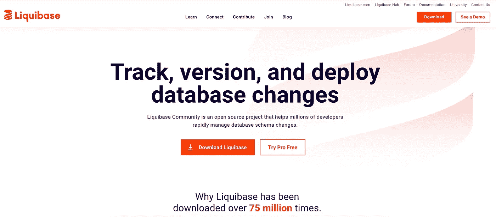

# Liquibase —工作原理

在 Liquibase 中，数据库的更改由一个名为**的分类帐管理，即 changelog** 。对数据库的单个更改称为变更集，因此 changelog 是变更集的集合。

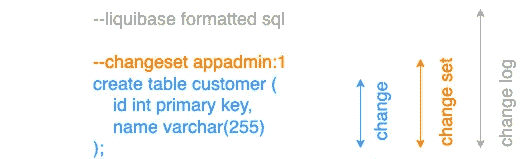

Liquibase 跟踪哪些变更集已经或者还没有在[跟踪表](https://docs.liquibase.com/concepts/databasechangelog-table.html?__hstc=94692481.9079d0f405f55159f55c8b6a827b8214.1643615966600.1643615966600.1643615966600.1&__hssc=94692481.1.1643615966601&__hsfp=1918197977)中部署。因此，他们知道哪些更改已经部署到数据库中，哪些更改尚未部署。

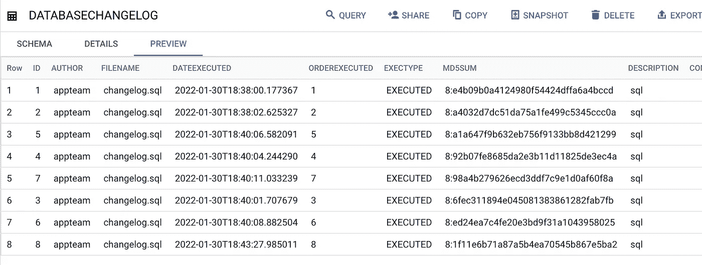

具有 8 个已部署变更集的辅助跟踪表(DATABASECHANGELOG)

Liquibase 将当前的 changelog 与其辅助跟踪表进行比较，并且只部署尚未部署到数据库的更改——这使得部署变得幂等。 [Liquibase](https://www.liquibase.org/) 还将支持应用团队撤销已部署的变更，或者自动撤销，或者通过定制的回滚 SQL。

**所有这些将帮助您将数据库代码放入版本控制系统，并为您的应用程序/数据产品实施完整的端到端 CI/CD 流程，这需要所有代码(我们应用程序的所有组件，包括数据库代码)可用。Liquibase 可以帮助处理这种 CI/CD 管道中数据库模式更改的部署。**

# **2。准备好把手弄脏了吗？**

开始烹饪前，我们需要配料。以下是我们应该收集的物品清单:

1.  **Liquibase** —您可以从[https://www.liquibase.org/download](https://www.liquibase.org/download)下载并安装 liquibase-cli:

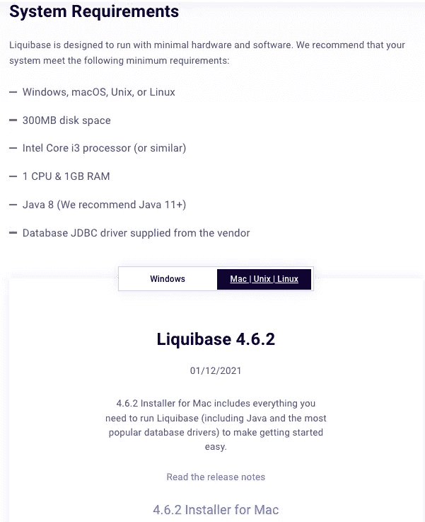

然而，在我们的演示中，我们将使用普通的 Liquibase jar 文件，它可以从[https://mvnrepository . com/artifact/org . liqui base/liqui base-core/4 . 6 . 2](https://mvnrepository.com/artifact/org.liquibase/liquibase-core/4.6.2)下载

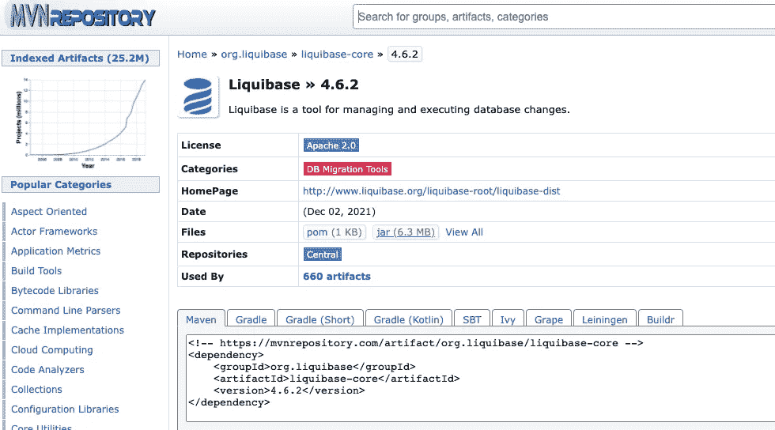

在我们的工作目录中有**liqui base-core-4 . 6 . 2 . jar**jar 文件将满足第一个要求。

**2。BigQuery 的 JDBC 驱动程序**

您还需要 BigQuery 的 JDBC 驱动程序。BigQuery 文档会将您重定向到可以下载受支持的 JDBC/ODBC 驱动程序的位置:

 [## BigQuery |谷歌云的 ODBC 和 JDBC 驱动程序

### Google 与 Magnitude Simba 合作提供 ODBC 和 JDBC 驱动程序，这些驱动程序利用了 BigQuery 的强大功能…

cloud.google.com](https://cloud.google.com/bigquery/docs/reference/odbc-jdbc-drivers) 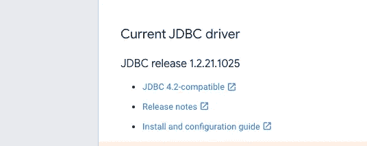

点击**兼容 JDBC 4.2 的**开始下载相应的 zip 文件。当你解压它时，你会发现相当多的 jar，其中一个名为 GoogleBigQueryJDBC42.jar 的 jar 将代表我们的 BigQueryJDBC 驱动程序。

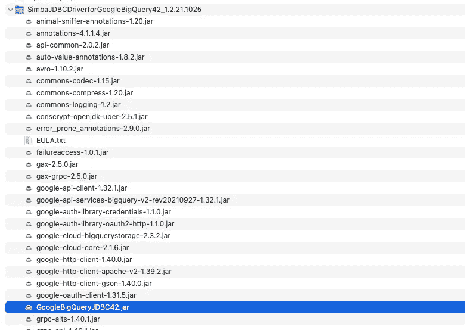

3.BigQuery 的 Liquibase 扩展

Liquibase 通过所谓的扩展支持不同的数据库。可用扩展的完整列表可以在以下位置找到:[https://liqui base . jira . com/wiki/spaces/CONTRIB/pages/1998865/Available+Extensions](https://liquibase.jira.com/wiki/spaces/CONTRIB/pages/1998865/Available+Extensions)。

您可能会感到惊讶，BigQuery 不在这个列表中。然而，如果你使用谷歌搜索，你会很容易地在 Liquibase 组织中找到 git 存储库，它对应于 liquibase-bigquery 扩展:【https://github.com/liquibase/liquibase-bigquery 

您应该能够下载与最新版本(**liqui base-big query-4 . 7 . 0 . jar**)相对应的 jar 文件，并将其放入上一步中下载的 liquibase-core jar 文件旁边的工作目录中。

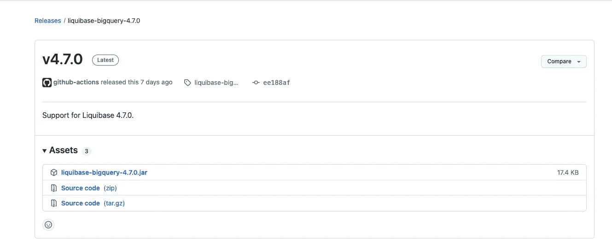

> **liqui base-big query-4 . 7 . 0 . jar**扩展以及打包到 BigQuery JDBC zip 存档中的所有 jar 必须位于 liquibase-core 的 java 类路径中。然而，将所有这些 jar 添加到类路径中可能会非常痛苦。为了帮助您完成本教程，而不面临主要的配置问题，我分叉了 liquibase-bigquery 扩展存储库，并修改了它的打包方式，以便已经包括来自 BigQuery JDBC zip 的所有 jar 文件，除了 BigQuery JDBC 驱动程序(GoogleBigQueryJDBC42.jar)本身。相应的 git 库可以在[https://github.com/lolejniczak-shared/liquibase-bigquery](https://github.com/lolejniczak-shared/liquibase-bigquery)上获得，而生成的名为**liqui base-big query-0 . 0 . 1 . jar**的 uber-jar 文件可以从[这里](https://github.com/lolejniczak-shared/liquibase-bigquery/releases/download/0.0.1/liquibase-bigquery-0.0.1.jar)下载:

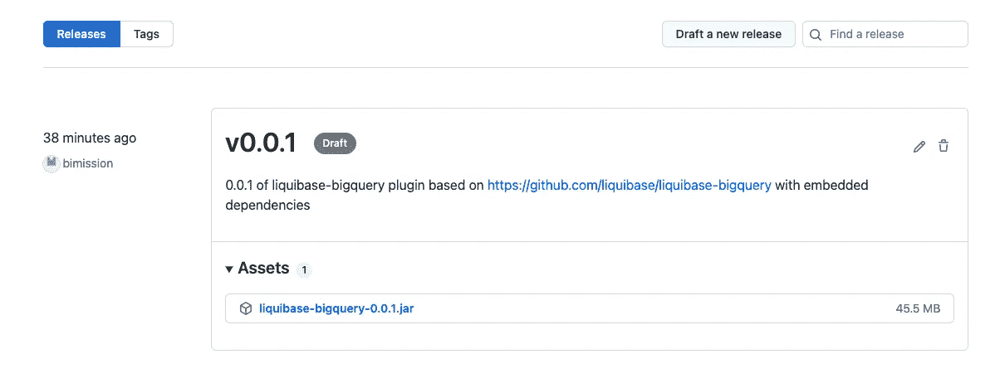

在我的演示中，我将使用**liqui base-biq query-0 . 0 . 1 . jar**文件，而不是**liqui base-big query-4 . 7 . 0 . jar(后者因此不需要继续演示步骤)。**

收集完所有三个组件后，工作目录中应该有以下文件:

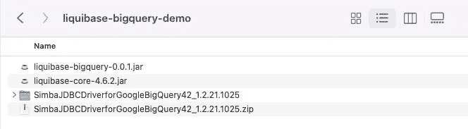

我们准备好出发了。为了更新数据库模式，liquibase 使用**更新**命令:

Java-jar liqui base-core-4 . 6 . 2 . jar—change log file =<db_change_log>—URL =<jdbc_connection_string>**更新**</jdbc_connection_string></db_change_log>

changeLogFile 是 changelog 的一个位置，它包含了对 BigQuery 数据集的所有更改。Liquibase 支持 XML、YAML、JSON 和 SQL 格式的变更日志。对于前三种格式，liquibase 将生成与声明的更改相对应的 SQL 代码(用于更新和回滚)。在 SQL 格式中，所有更改都用普通 SQL 声明。

3.1 **创建配置文件**

我们将从命令行执行 Liquibase，这意味着每次我们想要运行新命令时，我们必须提供代表所有必需的数据库连接细节的命令行参数。这可能是典型错误的来源，并使我们的命令冗长，因此难以处理。

另一种方法是定义名为 **liquibase.properties** 的基于文本的配置文件，它聚集了所有不经常改变的属性。

如果您想了解 Liquibase 配置文件的可能属性，请查看以下链接:

[https://docs . liqui base . com/workflows/liqui base-community/creating-config-properties . html](https://docs.liquibase.com/workflows/liquibase-community/creating-config-properties.html)

我们的配置文件将包括以下属性:

**网址:**

**驱动程序:**

**liqui base . liquibaseschemaname:**

**类路径:**

**3.1.1 网址**

url 表示 JDBC 连接字符串。在官方文档之后，下面是 Simba Google BigQuery JDBC 连接器的连接 URL 的格式:

JDBC:big query://[Host]:[Port]；ProjectId =[Project]；OAuthType =[auth value]；[属性 1]=[值 1]；[属性 2]=[值 2]；…

其中:

*   [主机]是服务器的 DNS 或 IP 地址。将其设置为[**https://www.googleapis.com/bigquery/v2**](https://www.googleapis.com/bigquery/v2)
*   [Port]是要连接的 TCP 端口号。将其设置为 **443。**
*   [Project]是您的 BigQuery 项目的 id。
*   [AuthValue]是指定连接器使用的身份验证类型的数字。

Simba Google BigQuery JDBC 连接器使用 OAuth 2.0 协议进行身份验证和授权。它通过 Google OAuth APIs 验证您的连接。您可以使用以下方法之一配置连接器，以提供您的凭据并验证与数据库的连接:

*   使用谷歌用户账户
*   **使用谷歌服务账户**
*   使用预先生成的访问和刷新令牌
*   使用应用程序默认凭据

我们将使用 Google 服务帐户进行身份验证，因此我们需要将 **OAuthType 属性设置为 0** 。我们还必须提供 Google 服务帐户的电子邮件地址和服务帐户私钥文件的完整路径:

JDBC:big query://[Host]:[Port]；ProjectId =[Project]；**OAuthType = 0**；OAuthServiceAcctEmail =sa-liquibase@bigquerydemos-337515.iam.gserviceaccount.com；**OAuthPvtKeyPath =**saliquibase-2 CAD 75b 60187 . p12；

[属性 1..N]和[值 1..N]是连接器支持的附加连接属性。

我们将使用连接属性来定义要应用更改的默认 BigQuery 数据集。

**default dataset = liqui base demo；**

鉴于上述情况，在我们的演示中，我们将 url 设置为:

JDBC:big query://https://www . Google APIs . com/big query/v2:443；ProjectId = bigquerydemos-337515；OAuthType = 0；OAuthServiceAcctEmail = sa-liqui base @ bigquerydemos-337515 . iam . gserviceaccount . com；OAuthPvtKeyPath = saliquibase-2 CAD 75b 60187 . p12；DefaultDataset = liquibasedemo

**3.1.2 司机**

Simba JDBC BigQuery 连接器支持以下独立于 JDBC 版本的全限定类名(FQCNs):**com . Simba . Google big query . JDBC . driver**

3 . 1 . 3 liqui base . liquibaseschemaname

Liquibase 模式名称属性将允许用户为 Liquibase 辅助表指定 BigQuery 数据集，该表跟踪已经安装了哪些更改集。它不同于 DefaultDataset JDBC 连接字符串属性，该属性表示我们要在其中安装更改集的 BigQuery 数据集(如果在更改集定义中未指定)。

我们将该属性设置为:

**liqui base . liqui base schemaname:liqui base demo _ aux**

**3.1.4 classpath 属性**用于指定 liquibase 将在哪里找到以下 jar 文件:

*   BigQuery JBDC 驱动程序 jar
*   Liquibase BigQuery 扩展 jar

最后，我们的 **liquibase.properties** 文件将会是这样的:

**驱动:**com . Simba . Google big query . JDBC . driver
**URL:**JDBC:big query://https://www . Google APIs . com/big query/v2:443；ProjectId = bigquerydemos-337515；OAuthType = 0；OAuthServiceAcctEmail = sa-liqui base @ bigquerydemos-337515 . iam . gserviceaccount . com；OAuthPvtKeyPath = saliquibase-2 CAD 75b 60187 . p12；DefaultDataset = liquibasedemo
**类路径:**。/simbajdbcdriverforgogooglebigquery 42 _ 1 . 2 . 21 . 1025/googlebigqueryjdbc 42 . jar:。/liqui base-big query-0 . 0 . 1 . jar
**log level:**DEBUG
**liqui base . liquibaseschemaname:**liquibasedemo _ aux

此时，我们已经具备了 Liquibase 能够与 BigQuery 通信所需的一切。

# 4.演示

我们在这里遗漏了最重要的元素，即我们的变更日志文件，它列出了对我们数据集的所有变更(变更集)。

让我们建造它！

假设你是一个新项目的成员，这个项目的目标是建立分析客户满意度的分析能力。您的团队在 sprint 中工作，第一个 sprint 的目标是构建代表客户的维度。

您必须了解您的源系统，构建 ETL(或 ELT)管道，而且您还要设计数据结构来持久存储客户数据。

**冲刺 1**

Sprint 很短，所以您决定有一个名为 stg_customer 的临时表，最后一个名为 dim_customer。

现在您需要做的就是将这两个表的定义放入 sql 文件中。然而，要使这个文件与 Liquibase 一起工作，您需要用一些元数据来修饰几乎每个 DDL，这将把 DDL 语句变成 Liquibase 变更集。显然，我们需要记住三件事:

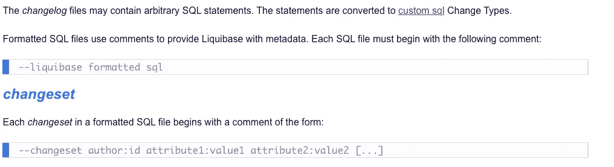

来源:[https://docs . liqui base . com/concepts/changelogs/SQL-format . html](https://docs.liquibase.com/concepts/changelogs/sql-format.html)

1.  **用**开始您的变更日志文件

— liquibase 格式的 sql

**2。单个变更集可以包含任意多的数据集变更**。出于演示的目的，我们将把每个表声明为一个不同的变更集。

**3。(可选)每个变更集还可能包括任意数字键:值属性、标签和标记**，当将我们的应用程序部署到不同的环境时，它们可以用作过滤器(例如，我们可能需要开发环境中的附加表来进行单元测试等)。)

因此，我们的 sprint 1 的变更日志文件应该是这样的(请注意，每个变更集必须有惟一的标识符。在我们的例子中，我们使用简单的整数，并且对于每个新的变更集 v0.0.1: **1** ，v0.0.1: **2** …，递增它。)

— liquibase 格式化 sql
—变更集 v0.0.1:1 ctx:customer
创建表 stg _ CUSTOMER(
CUSTOMER _ ID INTEGER，
FIRST_NAME STRING，
LAST_NAME STRING
)

—变更集 v0.0.1:2 ctx:customer
创建表 dim_customer (
DWH_UUID 字符串，
客户 _ 服务标识整数，
客户 _ 名字字符串，
客户 _ 姓氏字符串
)

好了，我们准备好运行更新命令了。这里，我们将假设我们的平台管理员完成了他们的工作，并为我们的应用程序创建了:

*   我们的模式对象和辅助 Liquibase 跟踪表的“容器”,即 liquibasedemo(在 JDBC 连接字符串中配置为 **DefaultDataset** )和 liquibasedemo_aux(用**liqui base . liqui base schemaname**属性配置)BigQuery 数据集。
*   我们将用来与 BigQuery 通信的服务帐户。该帐户还应该具有创建和编辑数据集对象所需的权限。

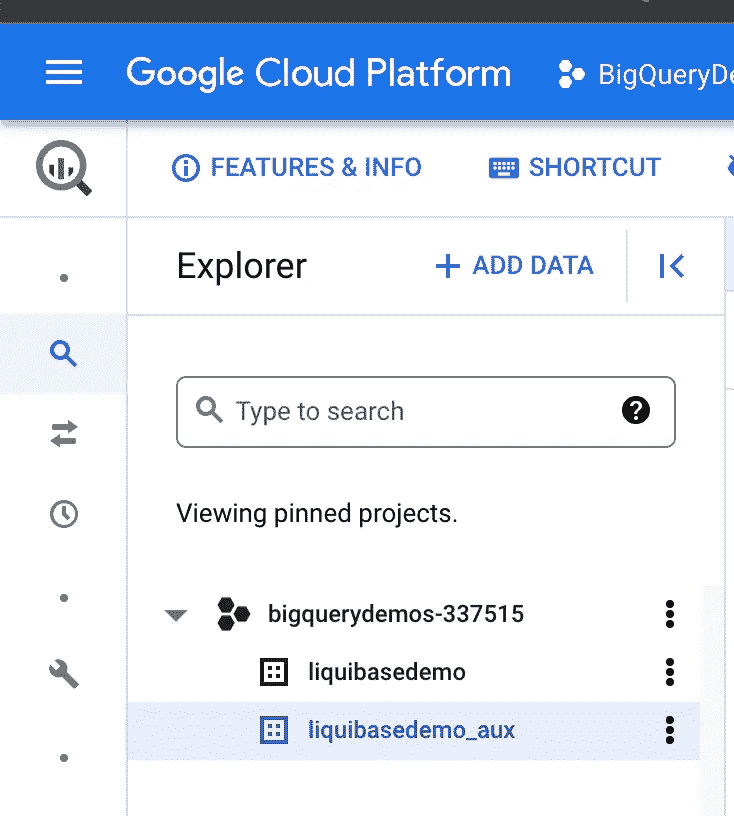

然后使用您的终端并执行以下命令:

Java-jar liqui base-core-4 . 6 . 2 . jar—changelolog file changelog . SQL**更新**

> **该步骤通常是您的应用程序的 CICD 管道的一部分，而更改日志文件将只是 git 中版本化的文件之一，以及使您的应用程序/数据产品正常运行所必需的其他内容(例如，对应于 ETL/ELT 管道的代码等)。**

当您的命令被执行时，您应该会看到类似这样的内容:

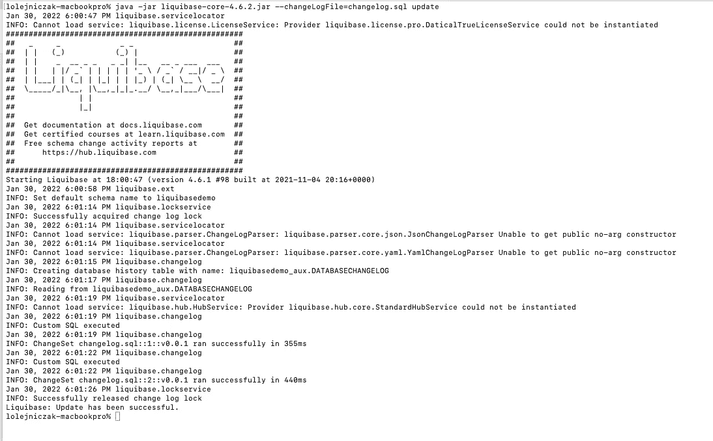

这里需要注意一些事情:

1.  Liquibase 使用 liquibasedemo BigQuery 数据集作为默认数据集，这符合我们的需求。

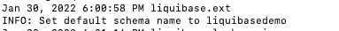

2.Liquibase 检测到 liquibase_aux BigQuery 数据集中没有跟踪已安装的更改集所需的辅助表。因此，Liquibase 创建了它们:

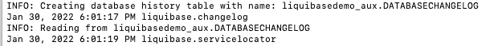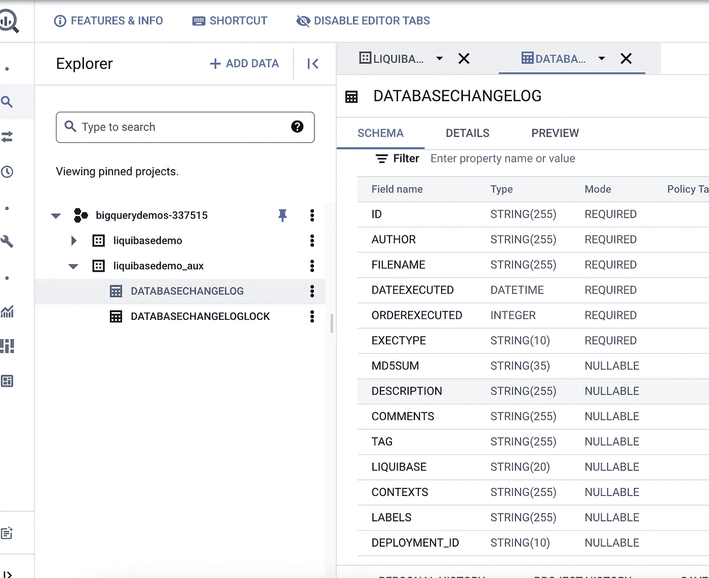

3.Liquibase 能够部署我们的变更集:

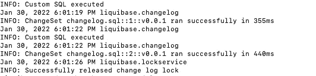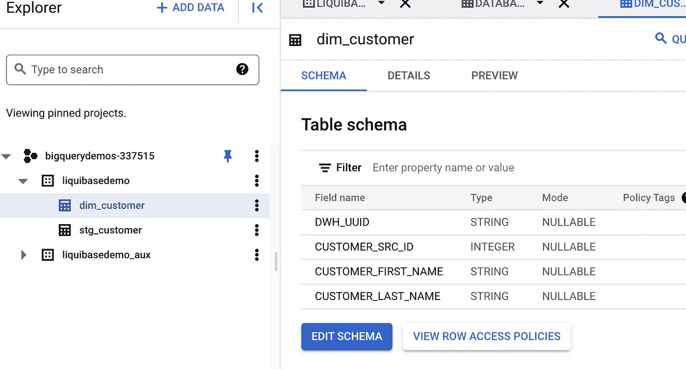

当我们检查 Liquibase DATABASECHANGELOG 表时，我们会发现其中有两个新条目:

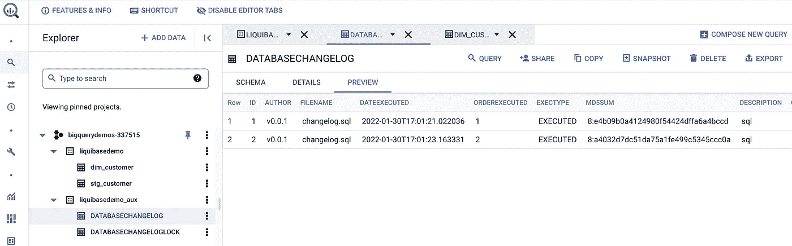

为了显示这些条目的值，让我们再次运行 update 命令。

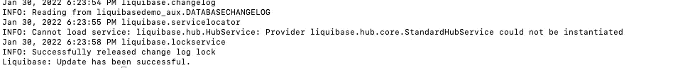

Liquibase 检查了 DATABASECHANGELOG 表，并推断所有的更改集都已经安装，因此这里不需要做什么。**这意味着得益于 Liquibase，我们的部署是幂等的，因此即使您需要重启 CI/CD 管道，您仍然是安全的，因为 Liquibase 不会尝试应用已经部署的更改**

**冲刺 2:**

在 Sprint 1 中，我们让数据分析师能够处理基本的客户数据。例如，他们能够了解有多少顾客购买了他们的产品，这只会刺激更多顾客的欲望。

在 Sprint 2 中，他们希望:

*   了解每天有多少客户注册
*   能够计算每天登录应用程序的客户数量
*   有用户定义的功能，计算从上次登录的天数。
*   除此之外，一位分析师要求添加一个表，他可以在这个表中进行一些试验，并构建支持服务的字典。

我们需要做的就是更新我们的 changelog 文件(新的变更集以粗体显示):

— liquibase 格式化 sql
—变更集 v0.0.1:1 ctx:customer
创建表 stg _ CUSTOMER(
CUSTOMER _ ID INTEGER，
FIRST_NAME STRING，
LAST_NAME STRING
)

—变更集 v0.0.1:2 ctx:customer
创建表 dim_customer (
DWH_UUID 字符串，
客户 _ 服务标识整数，
客户 _ 名字字符串，
客户 _ 姓氏字符串
)

**—变更集 v 0 . 0 . 2:3 CTX:customer** ALTER TABLE stg _ customer ADD COLUMN REGISTRATION _ DATE DATE；

**—变更集 v0.0.2:4 ctx:客户**

ALTER TABLE stg_customer 添加列 LASTLOGIN _ DATE

**—变更集 v0.0.2:5 ctx:客户**

ALTER TABLE dim_customer ADD 列 CUSTOMER _ REGISTRATION _ DATE DATE；

**—变更集 v0.0.2:6 ctx:客户**

ALTER TABLE dim _ CUSTOMER ADD COLUMN CUSTOMER _ last log in _ DATE；

**—变更集 v0.0.2:7 ctx:客户**

创建函数 udfdaysfromlastlog in(lastLoginDate Date)

返回 INT64

AS (DATE_DIFF(CURRENT_DATE()，lastLoginDate，DAY))

**—变更集 v0.0.2:8 ctx:字典**

创建表 ref_services (
DWH_UUID 字符串，
服务名字符串，
SLA 十进制
)；

运行 update 命令后，Liquibase 应用了新的更改集。我们有了新的用户定义函数，更新了与客户相关的表定义，以包括新的列…

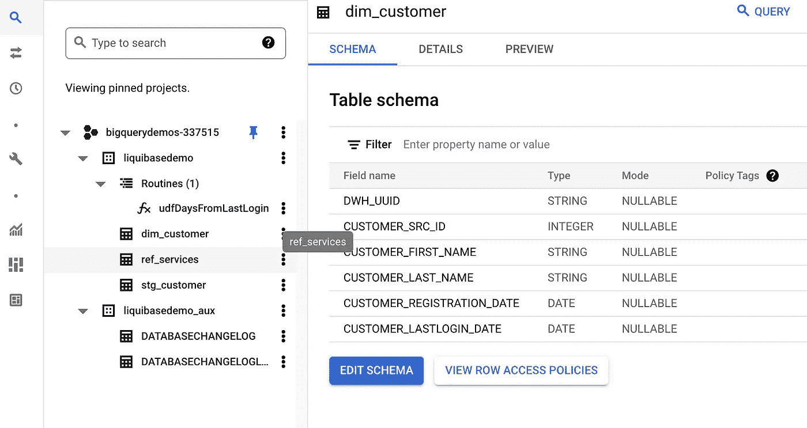

# 总结:

本文解释了如何设置 Liquibase，并使用它对 BigQuery 中的模式更改进行版本控制。将这一步骤嵌入您的 CICD 管道将有助于标准化和自动化您的数据产品的部署，并缩短价值实现时间。我们介绍了 Liquibase 的基本功能，还有许多值得一试的功能(例如回滚、从数据库生成更改日志等)。Liquibase BigQuery 扩展目前并不支持所有这些功能，因此非常欢迎您将您的拉取请求贡献给[**【https://github.com/liquibase/liquibase-bigquery】**](https://github.com/liquibase/liquibase-bigquery)**项目。**

请注意，Liquibase 只是 BigQuery 中模式管理的可能选项之一。其他值得检查的是:

*   用数据形式进行模式管理([https://dataform.co/](https://dataform.co/))
*   使用 terraform 进行模式管理([https://registry . terra form . io/modules/terra form-Google-modules/big query/Google/latest](https://registry.terraform.io/modules/terraform-google-modules/bigquery/google/latest))
*   使用 BQMan 进行模式管理([https://github . com/Google cloud platform/professional-services/tree/main/tools/bq man](https://github.com/GoogleCloudPlatform/professional-services/tree/main/tools/bqman))

> ***本文由*** [***卢卡什***](https://www.linkedin.com/in/lukasz-olejniczak-1a75a613/) ***和***[*斯坦尼斯劳【马吉尔斯基】*](https://www.linkedin.com/in/stanis%C5%82aw-magierski-1258507/) ***合著。所表达的观点是作者的观点，不一定反映谷歌的观点。***

如果你喜欢这篇文章，请为它鼓掌。更多 google 云端数据科学、数据工程、AI/ML 关注我[***LinkedIn***](https://www.linkedin.com/in/lukasz-olejniczak-1a75a613/)***。***