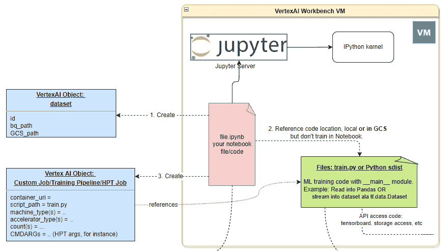
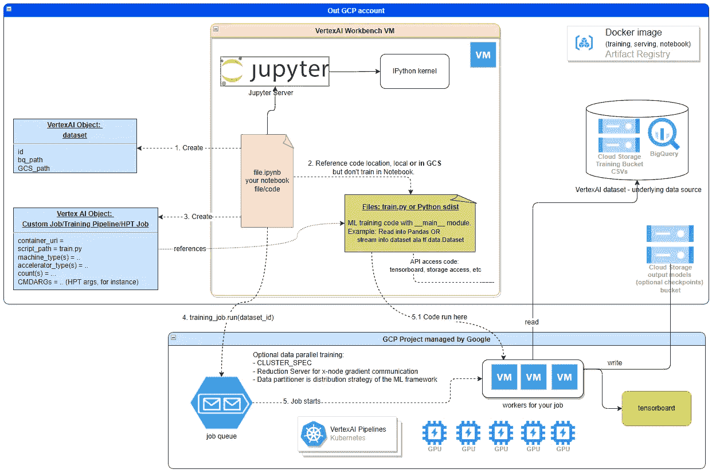

# VertexAI 定制培训部署

> 原文：<https://medium.com/google-cloud/vertexai-custom-training-deployment-7ad185411a93?source=collection_archive---------3----------------------->

Vertex AI 是 Google Cloud 中统一的 ML 平台，类似于 AWS 中的 SageMaker。

当我第一次看 [VertexAI](https://cloud.google.com/vertex-ai) 的时候，我错过了一个快速的可视化展示，展示了定制训练是如何工作的。例如，理解大部分代码应该在由 Google Cloud 管理的*不同的*项目中运行，或者如何向 VertexAI 报告[血统/元数据](https://storage.googleapis.com/gweb-cloudblog-publish/images/beans.max-2200x2200.png)是很重要的。

目的是在这里展示它，并辅以简短的解释。

# 概观

## 第一天——我们如何看待 VertexAI 的定制培训

用于培训的 VertexAI 工作台

每当我们在 UI 工作台中打开一个新的笔记本时，就会在计算引擎中启动一个 VertexAI VM。我们可以在这个 VM 中运行的 Jupyter 笔记本中进行训练，或者使用 Google 云资源来训练模型。本演练假设后一种情况。

步骤:

1.  笔记本中的代码创建了一个 VertexAI [数据集](https://cloud.google.com/vertex-ai/docs/datasets/datasets)，它是 GCP 位置或 BigQuery 关系的包装器。
2.  我们使用`%%writefile` Jupyter 宏来生成`train.py`训练脚本。大部分网上的例子都是这样显示的。但是您最好在 VM 中使用 GIT，或者将您的训练代码上传到云存储中。而且，这里最好用 [Python 源码分发](https://docs.python.org/3/distutils/sourcedist.html)。
3.  创建培训渠道，并
4.  使用步骤 1 中的特定`dataset_id`运行它。下面显示了这里发生的情况。

## ML 建筑师如何看待 VertexAI 的定制培训

用户管理的笔记本电脑部署示例。
图中未显示网络细节:

VertexAI 定制训练

VertexAI 提供管理培训。这是在另一个项目中完成的，由 GCP 管理。一旦我们在步骤 4 中运行了培训作业，该作业就会进入 GCP 项目中的作业队列。
GCP 用上面步骤 2 中提供的`train.py`或 Python 软件分发代码开始工作。命令参数被传递给每个 worker，如 Job 对象中所述。由 VertexAI 数据集对象包装的数据位置通过[环境变量](https://cloud.google.com/vertex-ai/docs/training/using-managed-datasets#access_a_dataset_from_your_training_application)传递给每个工人的训练脚本。

一旦作业完成，它通常会将结果写入项目中的 GCS。

作业可以指定几个工作池，每个工作池有不同的机器/参数。 [CLUSTER_SPEC](https://cloud.google.com/vertex-ai/docs/training/distributed-training#cluster-spec-format) 包含一个工人的`index`。在这篇简介中我们不会深入探讨数据并行训练。

# 为什么要在维特赛训练

如果我的模型是在小数据上训练的，并且不需要 GPU，我应该使用本地 Jupyter 笔记本吗？

一旦我们沿着脊椎动物的方式，我们得到:

*   [元数据](https://cloud.google.com/vertex-ai/docs/ml-metadata/introduction)，特别是使用[维兹尔](https://cloud.google.com/vertex-ai/docs/vizier/overview)进行超参数调谐
*   元数据中的沿袭信息
*   带库伯流量/TFX [管道的多点作业](https://cloud.google.com/vertex-ai/docs/pipelines)
*   整合日志记录/监控
*   [车型注册处](https://cloud.google.com/vertex-ai/docs/model-registry/introduction)
*   [可解释的人工智能](https://cloud.google.com/vertex-ai/docs/explainable-ai/overview)
*   [数据标注](https://cloud.google.com/vertex-ai/docs/datasets/data-labeling-job)工作岗位
*   用于培训、服务和 Jupyter 笔记本的 Docker 图像

此外，将实际的训练代码从笔记本中分离出来会给你的代码提供更好的结构。

缺点是 VertexAI Workbench VM 的价格。

对于小型的一次性研究项目，你可能不需要上面的。对于更大/大数据/复杂/资源饥渴的项目，你可能应该使用 VertexAI 或类似的 GCP 培训解决方案。

VertexAI 定制培训介绍到此结束。