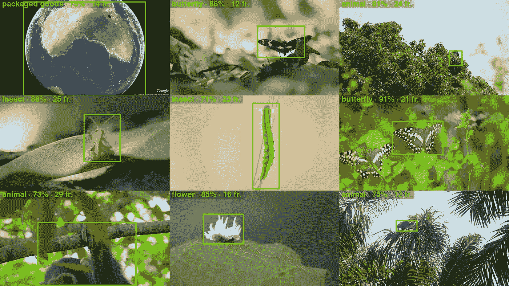
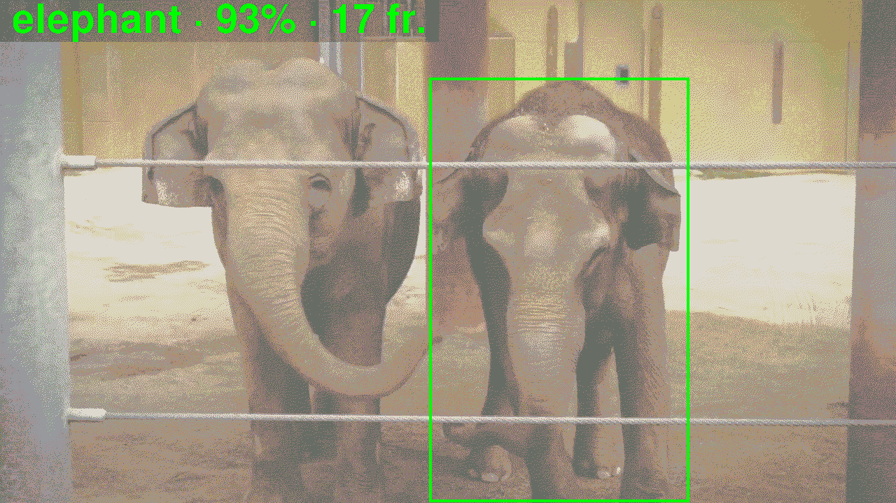

# 用 300 行代码跟踪视频对象

> 原文：<https://medium.com/google-cloud/video-object-tracking-as-a-service-18eb4227df34?source=collection_archive---------0----------------------->

# ⏳2021 年 10 月 8 日更新

*   更新 [**GitHub 版本**](https://github.com/PicardParis/cherry-on-py/tree/main/gcf_object_tracking) 最新库版本+ Python 3.7 → 3.9

# 👋你好！

在本文中，您将看到以下内容:

*   如何跟踪视频中出现的对象，
*   有了自动化处理流水线，
*   不到 300 行 Python 代码。

以下是视频<[animals.mp4](https://storage.googleapis.com/cloud-samples-data/video/animals.mp4)>自动生成的对象摘要示例:

# 🛠️工具

一些工具就可以了:

*   视频和结果的存储空间
*   运行代码的无服务器解决方案
*   用于分析视频的机器学习模型
*   从视频中提取帧的库
*   呈现对象的库

# 🧱建筑

下面是一个使用 3 个谷歌云服务([云存储](https://cloud.google.com/storage/docs)、[云功能](https://cloud.google.com/functions/docs)和[视频智能 API](https://cloud.google.com/video-intelligence/docs) )的可能架构:

处理管道遵循以下步骤:

1.  你上传了一个视频
2.  上传事件自动触发跟踪功能
3.  该函数向视频智能 API 发送请求
4.  视频智能 API 分析视频并上传结果(注释)
5.  上传事件触发渲染功能
6.  该功能下载注释和视频文件
7.  该函数呈现并上传对象
8.  你知道哪些物体出现在你的视频里！

# 🐍Python 库

## 视频智能 API

*   来分析视频
*   [https://pypi.org/project/google-cloud-videointelligence](https://pypi.org/project/google-cloud-videointelligence)

## 云存储

*   管理下载和上传
*   [https://pypi.org/project/google-cloud-storage](https://pypi.org/project/google-cloud-storage)

## OpenCV

*   提取视频帧
*   `OpenCV`提供了一个无头版本(没有 GUI 功能，非常适合服务)
*   [https://pypi.org/project/opencv-python-headless](https://pypi.org/project/opencv-python-headless)

## 枕头

*   渲染和注释对象图像的步骤
*   `Pillow`是一个非常流行的图像库，既广泛又易于使用
*   [https://pypi.org/project/Pillow](https://pypi.org/project/Pillow)

# 🧠视频分析

## 视频智能 API

视频智能 API 是一个预先训练好的机器学习模型，可以分析视频。它的多种功能之一是检测和跟踪物体。对于第一个云函数，这里有一个调用具有`OBJECT_TRACKING`特性的`annotate_video()`的可能核心函数:

## 云函数入口点

> 注意:
> 当一个视频被上传到定义为触发器的桶中时，该函数将被调用。
> 使用环境变量使代码更具可移植性，并允许您使用不同的触发器和输出桶部署完全相同的代码。

# 🎨对象渲染

## 代码结构

有趣的是将代码分成两个主要的类:

*   `StorageHelper`用于管理本地文件和云存储对象
*   `VideoProcessor`对于所有图形处理

下面是第二个云函数的一个可能的核心函数:

## 云函数入口点

> 注意:当一个注释文件被上传到定义为触发器的桶时，这个函数将被调用。

## 帧渲染

`OpenCV`和`Pillow`可让您轻松提取视频帧并进行合成:

> 注意:只使用`OpenCV`可能是可行的，但是我发现用`Pillow`开发效率更高(代码可读性更强，更直观)。

# 🔎结果

以下是视频中发现的主要物体<[JaneGoodall.mp4](https://storage.googleapis.com/cloud-samples-data/video/JaneGoodall.mp4)>:

> 注意:
> 机器学习模型已经正确识别了不同的野生动物物种:那些是“真正的阳性”。它还错误地将我们的星球认定为“包装商品”:这是一个“误报”。机器学习模型通过用新样本进行训练来保持学习，因此，随着时间的推移，它们的精度会不断提高(从而减少误报)。
> 当前代码过滤掉置信度低于 70%或少于 10 帧的检测对象。降低阈值以获得更多结果。

# 🍒Py 上的樱桃🐍

现在，锦上添花(或者我们用法语说的“馅饼上的樱桃”)，你可以丰富架构来增加新的可能性:

*   触发来自任何桶(包括外部公共桶)的视频的处理
*   生成单个对象动画(与对象摘要并行)

## 架构(第 2 版)

*   答:视频对象跟踪也可以通过 HTTP GET 请求手动触发
*   B —相同的渲染代码部署在两个兄弟函数中，用一个环境变量来区分
*   c-对象摘要和动画是并行生成的

## 云函数 HTTP 入口点

> 注意:这是与`gcf_track_objects()`相同的代码，带有调用者通过 GET 请求指定的视频 URI 参数。

# 🎉结果

以下是视频<[animals.mp4](https://storage.googleapis.com/cloud-samples-data/video/animals.mp4)的一些自动生成的轨迹:

*   左边的大象(一个大物体；)被检测到:

*   右边的大象也被完全隔离了:

*   兽医被正确识别:

*   他喂养的动物也是:

移动镜头中的移动物体或静止物体也被跟踪，就像在<beyond-the-map-rio.mp4>中一样:</beyond-the-map-rio.mp4>

*   移动镜头中的建筑:

*   邻近的建筑也被跟踪:

*   移动镜头中的人物:

*   一个冲浪者穿越镜头:

以下是其他一些视频<[JaneGoodall.mp4](https://storage.googleapis.com/cloud-samples-data/video/JaneGoodall.mp4):

*   一只蝴蝶(容易？):

*   一种昆虫，处于幼虫阶段，正在爬一根移动的树枝:

*   远处树上的猿猴(硬？):

*   一只猴子从树顶上跳下来(用力？):

*   现在，一个陷阱！如果我们可以被愚弄，当前的机器学习技术也可以:

# 🚀源代码和部署

# 源代码

*   Python 源代码不到 300 行代码。
*   查看 GitHub 上的[源。](https://github.com/PicardParis/cherry-on-py/tree/main/gcf_object_tracking)

# 部署

*   您可以在不到 8 分钟的时间内部署此架构。
*   见[从头部署](https://github.com/PicardParis/cherry-on-py/tree/main/gcf_object_tracking/DEPLOY.md)。

# 🖖再见

你想要更多，你有问题吗？我很乐意阅读[您的反馈](https://bit.ly/feedback-video-object-tracking)。你也可以[在 Twitter 上关注我](https://twitter.com/PicardParis)。

# ⏳更新

*   **2021–10–08**:更新 [GitHub 版本](https://github.com/PicardParis/cherry-on-py/tree/main/gcf_object_tracking)最新库版本+ Python 3.7 → 3.9

# 📜同样在这个系列中

1.  [总结视频](/google-cloud/️-auto-generate-video-summaries-with-a-machine-learning-model-and-a-serverless-pipeline-c2f261c8035c?source=friends_link&sk=f94ff51885c51dd52539848ce04654ab)
2.  跟踪视频对象
3.  [人脸检测与处理](/google-cloud/face-detection-and-processing-in-300-lines-of-code-38dc51a115d4?source=friends_link&sk=cc252ab86eab9ed2e8583963d0598661)
4.  [处理图像](/google-cloud/deploy-a-coloring-page-generator-in-minutes-with-cloud-run-bff59e59d890?source=friends_link&sk=a3d6e22e7e77828e411592f46025531e)