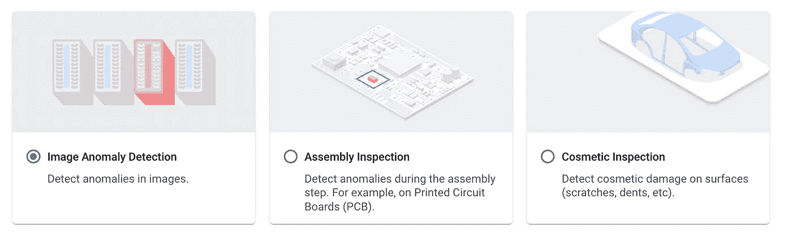
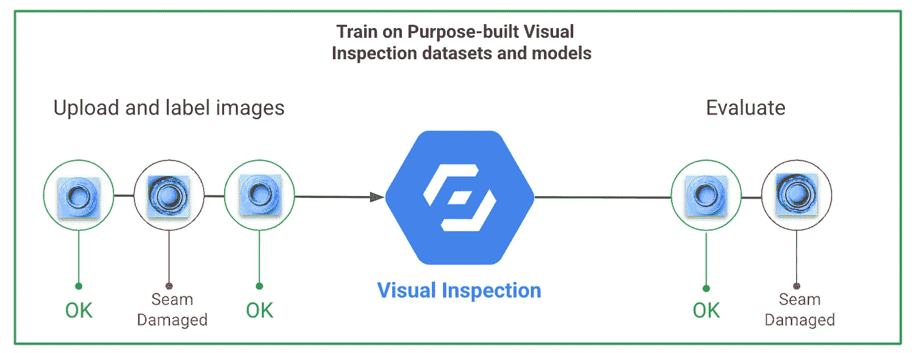

# 视觉检测人工智能|制造业的差异化服务|谷歌云

> 原文：<https://medium.com/google-cloud/visual-inspection-ai-a-differentiated-service-for-manufacturing-industry-google-cloud-d2ac14ff600d?source=collection_archive---------1----------------------->

# 背景:

**工业 4.0** 正在彻底改变企业制造、改进和交付产品的方式。制造商正在将包括物联网(IoT)、边缘计算、人工智能和机器学习在内的前沿新技术集成到他们的生产设施和整个运营中。

**生产质量**和**产量**是两项行业顶级绩效指标。不良的生产质量控制会导致大量的运营和财务成本，表现为低产量、库存增加、高召回率、索赔率和维修率。事实上，美国质量协会估计，对于许多组织来说，**质量成本高达年度销售收入的 15%—**[**—20%**](https://asq.org/quality-resources/cost-of-quality)**，对于较大的制造商来说，每年高达数十亿美元。**

**因此，对于制造商来说，拥抱新时代的技术进步并寻找新的方法来提高产品质量和产量是极其重要的。**

# **什么是视觉检测 AI？**

****目视检查** (VI)是用肉眼检查一个部件或一件设备以寻找缺陷的过程。**

****视觉检测人工智能**是一门计算机科学学科，它训练机器以与人类相同的方式理解图像和视觉数据。视觉检测 AI 使用最好的**深度学习技术**来模仿人类的视觉能力，并建立对图像属性的认知理解，以指出其中的异常，就像人一样，但速度更快，精度更高。**

# **当前的目视检查方法存在哪些问题？**

*   ****手动:**大部分目视检查工作都是手动**完成**。这是耗时的，高度依赖于操作者的技能，容易出错，并且成本高。**
*   ****机器:**另一种方法是使用**专用检查机器**，这些机器使用**超声波、射线照相**等。这些都非常昂贵，而且只是为了解决非常具体的问题而专门构建的，并且不能跨各种用例进行扩展。**
*   ****AI:用于检查的通用计算机视觉模型**不是为解决制造用例而专门构建的。这些模型是在数据集上训练的，用于通用视觉人工智能用例，包括人脸、物体、情感、颜色、位置检测等，因此需要非常大的数据集来从头训练视觉检查用例，甚至还要努力达到所需的精度。**

# **介绍谷歌云视觉检测人工智能(VIAI)**

****

**谷歌团队在 pixel 手机的制造过程中面临着如上所述的挑战，并投入了数年时间来解决与质量相关的挑战。**视觉检测 AI** —一个基于深度学习的视觉检测 AI 平台，是上述努力的高潮，它提供了一个专门为解决制造问题而设计的基于 AI 的质量检测平台。**

**以下是视觉检测人工智能服务的一些重要亮点:**

*   ****卓越的计算机视觉和人工智能技术**:与通用的人工智能方法相比，VIAI 客户将**精确度提高了 10 倍**。它可以通过使用计算机视觉技术支持超高分辨率图像(高达 1 亿像素)来检测最微小的缺陷，Forrester 将该技术列为行业领导者。**
*   ****在内部自主运行**:制造商可以在网络边缘或内部运行检测模型。检查可以在谷歌云中运行，也可以在工厂车间完全自主运行。**
*   ****快速实现价值**:客户可以**在数周内**完成部署，而传统的机器学习(ML)解决方案则需要数月。专为过程和质量工程师打造，无需计算机视觉或 ML 经验。**
*   ****快速入门，不费吹灰之力** : VIAI 可以用比通用 ML 平台少 300 倍的人类标记图像来构建精确的模型。传统解决方案需要数千个带标签的图像。**
*   ****超越异常检测**:与使用简单异常检测的竞争解决方案不同，VIAI 的深度学习允许客户训练模型，在单个图像中检测、分类和精确定位**多种缺陷类型**。**
*   ****高度可扩展的部署**:制造商可以灵活地部署和管理 ML 模型的生命周期，跨生产线和工厂扩展解决方案。**

**像许多其他谷歌服务一样，视觉检查人工智能服务现在作为一项公共服务提供，正如上图所示，这项服务可以检查数百万部 pixel 手机。**

# **视觉检测 AI 解决了哪些用例？**

**谷歌云的视觉检测人工智能平台解决了 3 种不同的制造用例:**

****

## **1)图像异常检测:**

**异常检测模型在图像级别检测异常。训练需要包括具有和不具有异常的图像，并且模型将能够区分这些图像。异常检测可用于各种工业用例，如缺陷零件识别、零件磨损检测、变形、包装和标签异常等**

****

## **2)外观检查:**

**外观检查可以定位最微小和最复杂的缺陷(凹痕、划痕、裂纹、变形等)。)在任何一种表面上。它具有检测多种缺陷类型(划痕、凹痕)以及识别多种缺陷类型的能力，这是非常独特的。**

**外观检查可用于各种用例，如喷漆车间表面检查、车身车间焊缝检查、冲压车间检查(划痕、凹痕、裂纹、染色)、产品表面检查(胶水溢出、网格变形、划痕、气泡)等。**

****

## **3)装配检查**

**装配检测可以在装配过程的各个阶段检测出最细微的缺陷(错误、错位、缺失、旋转或变形的部件)。装配检验可用于工业生产的装配领域，以检查包装检验、板装配检验等**

****

# **等等！VIAI 与 Google Cloud Vision AI 或 AutoML Vision 有何不同？**

****视觉人工智能 Vs 视觉检测****

**Vision API 提供强大的**预训练视觉模型，由 Google** 托管和训练。它用于**通用视觉人工智能服务**，如通过 REST API 服务检测物体、面部、情绪、颜色、阅读文本等。它不是专门为解决制造用例而构建的，它也提供了一个类似视觉检测的平台，允许使用您自己的数据集来训练模型。**

****

****自动视觉与视觉检测****

**AutoML Vision 是一个允许训练您自己的定制机器学习模型的平台。然而，AutoML 图像/视频服务最适合创建通用视觉模型，用于人脸、异议、地点、情感检测等用例。**

****

**另一方面，视觉检测虽然类似于 AutoML 平台，但它利用工业数据集和模型，由 Google 首创，来解决上述三种特定的制造用例。与通用汽车视觉服务相比，这是一个基于领域的行业解决方案。**

****

## **好吧！那么，如何着手构建视觉检测服务呢？**

**VIAI platform 通过直观的用户界面提供了 4 个简单的步骤来构建 VIAI 服务，并且不需要任何代码。**

****

1.  ****图像采集:**第一步是采集图像，并保存到云存储中。这些图像适用于有缺陷和无缺陷的产品。**
2.  ****图像标签:**每张图像都必须进行标注，以识别和标记产品是否有缺陷或正确。对于外观检查，这可能包括注释多种缺陷类型和事件。**
3.  ****模特训练:**一旦贴标签完成，模特训练阶段开始。培训分为几个步骤。最初的训练使用人工智能的一个方面，称为**主动学习**，它有助于建议要贴标签的物品。第二步使用这些新标记的项目来提高准确性。**
4.  ****模型部署:**在完成训练后，一个新的 VIAI 模型被创建并存储在注册表中。该模型可以作为容器导出到工厂进行部署和实时预测。**

# **我们去做个模型吧！**

**我们将构建一个**外观视觉检查模型**来识别 Pixel 手机表面的**划痕**和**凹痕**，如下图所示。**

****

****第一步:图像收集:**导航至谷歌控制台中的视觉检测服务，点击创建数据集。**

****

**指定数据集名称→选择外观检查作为目标，边界框作为注释类型→单击创建。这将创建一个新的数据集集合。**

**接下来，通过直接从您的计算机上传或通过将图像加载到 GCS，创建一个 CSV 并在下面的导入文件路径中指定它，将训练图像上传到数据集。**

**完成后，所有图像都将上传到数据集中。**

****

****步骤 2:图像标签(注释)****

**在数据集屏幕上，选择浏览选项旁边的**缺陷**选项卡。**

****

**点击—添加缺陷类型，添加两种缺陷类型:**凹痕和划痕**。pixel 手机表面有这两种类型的缺陷，我们将注释并映射到相应的缺陷类型。**

****

**完成后，您会看到它们以不同的颜色列在左侧，如下所示。**

****

**我们现在将从图像注释开始。单击图像打开注释视图。从调色板中点击**添加边界框**图标。**

****

**在 pixel phone 上的缺陷周围绘制多边形，并将其映射到配置的缺陷类型。**

****

**对所有训练图像重复该步骤。**

****

**现在，我们已经准备好了训练数据集，所以让模型训练开始吧！**

****第三步模型训练:****

**点击右侧的**开始训练**按钮。这将在后台启动训练过程，根据图像的数量和复杂性，训练模型需要 24 到 48 小时以上。**

**完成培训后，一个用于检查 pixel 手机的新定制化妆品模型就创建完成了！**

**单击左侧菜单中的模型选项。深入模型标题，您将看到模型。**

****

****评估:**点击模型名称，将进入评估页面，该页面包含模型评估指标的详细信息，如精确度、召回率、混淆矩阵等，从而提供模型准确性的视图。**

****

****模型测试:****

**现在模型已经准备好了，让我们在将它部署到生产环境之前对它进行测试。**

**单击评估旁边的“测试和使用”选项卡，进入下一页。**

****

**为了测试视觉检查模型，需要创建一个**解决方案工件**。解决方案工件是包含我们训练好的模型的实际容器。**

**单击“创建解决方案架构师”选项。它提供了两种类型的资源调配。**

1.  ****在线测试:**该选项用于创建模型的在线版本，您可以使用该版本免费测试多达 20 幅图像。如下所示填写详细信息，然后单击继续。**

****

****2。部署:****

**这是为生产创建一个部署工件。它考虑了额外的细节，如相机流的数量和使用月数，以得出使用该模型的成本。**这是一项固定成本** **，允许通过型号**处理任意数量的图像，而不是按处理的图像数量收费。**

**部署模型通常会在上面创建的在线测试模型经过测试并准备就绪后创建。**

**填写适当的详细信息，然后单击继续。**

****

**完成上述活动后，平台将创建两个工件，如下所示。**

****

**点击屏幕上的“创建测试”选项。**

****

**在下拉列表中选择 online-testing 模型，并提供示例测试图像 CSV 和模型的输出路径，以编写输出。单击创建运行批处理。**

****

**批处理将拾取作为输入提供的每个测试图像，通过外观检查模型对其进行处理，并将输出 jsonl 文件和图像存储到指定的输出位置。**

**为了更加直观，该平台集成了一个输出页面，显示图像中识别的所有缺陷及其注释。**

****

**要看到这一点，点击“存储”栏中生成的路径，出现以下页面，展示测试图像上模型推断的结果，并在右侧标注了指定的缺陷类型。**

****

**点击“预览图像”以更改图像，并查看所有测试图像的化妆品检测模型的准确性，并查看模型如何正确识别最小的划痕和凹痕-太棒了！**

****第四步模型部署:****

**VIAI 模型既可以部署在 Google Cloud 上，也可以部署在内部。**

****本地部署:****

**让我们看看内部部署，因为这是客户最常要求的选项。**

****硬件要求:****

**在本地部署模型之前，需要完成所需的硬件配置。**

1.  ****边缘服务器**:我们推荐采用 GPU 的 Nexcom X300 Edge 工业电脑作为边缘分析的最佳硬件规格。它支持所有关键的摄像机流协议，如 Genicam，RTSP 等**

****

**2.**摄像头**:以下是摄像头的建议规格，它需要支持上述协议之一。**

****

**3.**照明**:照明是获得一致质量和清晰源图像的关键，有助于模型输出的整体成功。**

****

****端到端参考架构:****

****

****VIAI 边缘设置:****

**有了所需的硬件，VIAI 提供了一个可以安装在工业 PC 上的边缘服务器软件。软件堆栈由上面的绿色块表示。该软件通过自动化脚本在边缘上提供所有需要的组件，并且它还提供谷歌云后端服务。**

**我们的化妆品模特已经准备好了。我们通过上面的“创建解决方案工件”部署选项生成的模型存储在 Google Cloud 容器注册表中。使用配置，边缘服务器从注册表中取出容器，并将其部署到边缘服务器上的 K8s 集群。**

**摄像机从生产线上捕捉的图像可以通过 VIAI 服务器上的模型进行处理，推断可以用于自动化质量检测。**

**每隔一段时间，可以将推理细节和训练图像发送到云，用于重新训练模型，并且可以将改进的模型部署回边缘服务器，以不断调整和改进模型性能。**

****万岁！您已经成功创建并部署了一个外观检查模型！！****

# **结论:**

**人工智能和边缘计算的进步带来了全新的方式来看待制造业质量和检测领域的传统挑战。通过在视觉检测中采用尖端的深度学习技术，工业可以以更低的成本获得更高的精度、规模和吞吐量，并且几乎不需要人工干预。**

**谷歌是构建基于人工智能的技术解决方案(如视觉检测)的先驱。更多详情，请访问→[https://cloud.google.com/solutions/visual-inspection-ai](https://cloud.google.com/solutions/visual-inspection-ai)**

**快乐边缘分析！**