# 可视化 BigQuery 查询计划

> 原文：<https://medium.com/google-cloud/visualising-bigquery-41bf6833b98?source=collection_archive---------0----------------------->

Tldr:在[https://bqvisualiser.appspot.com](https://bqvisualiser.appspot.com)上可视化大查询的执行

BigQuery 是一个强大的工具，可以使用标准 SQL 查询非常大(万亿和千万亿字节规模)的数据集。它通过将查询并行化为多个分片的工作负载来实现这一点，从而实现惊人的规模和速度。

然而，有时查询比想象的要长。BigQuery UI 在理解查询是如何执行的方面提供了一些支持，但是理解发生了什么仍然是一个挑战

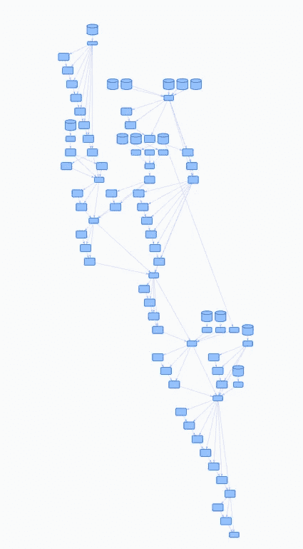

这是一个大问题

我有一个客户，他运行一个包含多个子查询和连接的复杂查询。查询需要几个小时才能完成，我们需要了解发生了什么。因此，我最终编写了一个工具，它接受查询计划并将其显示为一棵树，帮助我们跟踪正在发生的事情。BigQuery Visualiser 就是这样诞生的。

# BQVisualiser 是如何工作的？

BqVisualiser 显示 BigQuery 查询的 queryplan。queryplan 与每个查询一起存储，可以从 BigQuery 控制台访问。您可以从命令行将 queryplans 下载到您的 PC 上。BqVisualiser 使您能够通过 BigQuery REST API 直接检索项目的查询计划。

访问 https://bqvisualiser.appspot.com[上的 Bq 可视化器](https://bqvisualiser.appspot.com)

# BqVisualiser 帮助我们的一些用例

# 无意中使用了 WITH 子句

[WITH 子句是查询语法](https://cloud.google.com/bigquery/docs/reference/standard-sql/query-syntax#with-clause)的强大简化器。但是，需要理解的是，它相当于一个宏，在后续的 SELECT 中，每次引用 WITH 子句都会导致该 SQL 被单独执行。

下面是导致客户端问题的查询的概念结构:

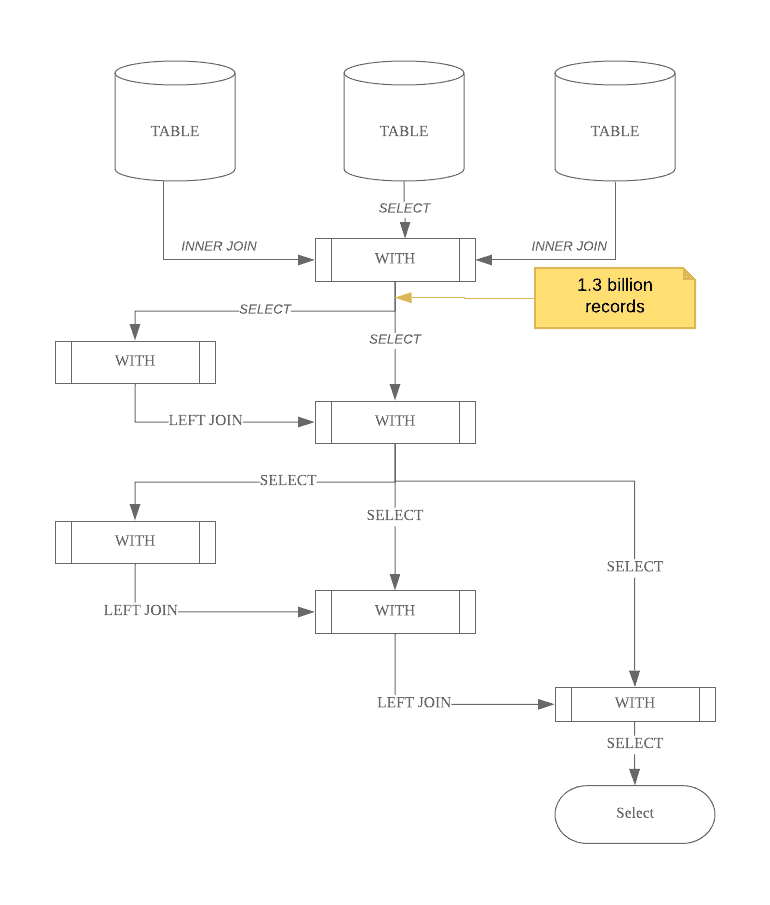

top WITH 子句导致 13 亿条记录被读取和传递。这个 WITH 子句被另外两个 WITH 子句引用，这两个子句又被引用。

查询分析器立即展开所有的 WITH 子句，实际的查询看起来更像这样:

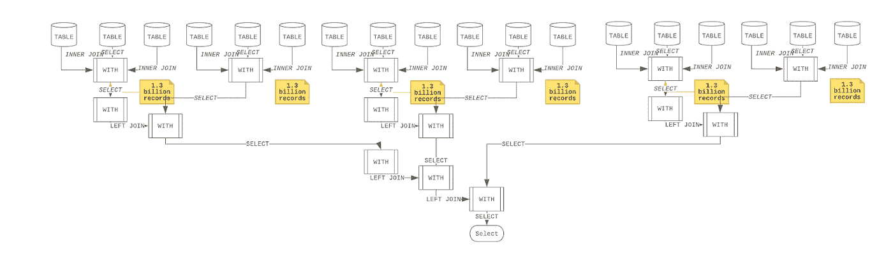

如您所见，13 亿条记录被读取了 6 次，这并不好。

将 queryplan 加载到 BigQuery Visualiser 显示了所有细节的复杂性:

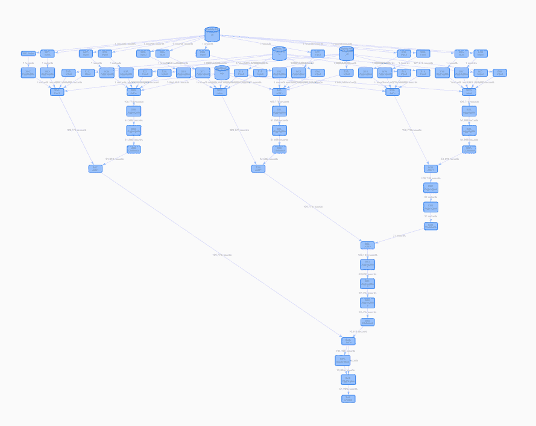

你可以看到查询图似乎重复了几次，它看起来像一个分形，尽管是一个均值…

基于这种认识，客户决定在中间表中具体化顶部的查询，这极大地改善了结果。

# 相同的查询突然需要更长时间

一个客户端每天晚上运行一个查询，只需不到 3 个小时即可完成。突然，同一个问题花了 4 个多小时。

BqVisualiser 提供了执行的甘特图。看一下，很明显，与旧的运行相比，新的运行中的大多数 join 步骤要多运行 30–40%。

特别是一个步骤，包含总共超过 16 列的连接和组，需要 1 小时 20 分钟，而以前需要 56 分钟。看看慢速游戏的平均等待时间是 36 分钟对 25 秒

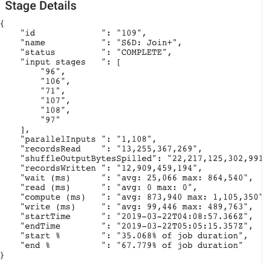

快速运行加入/分组方式

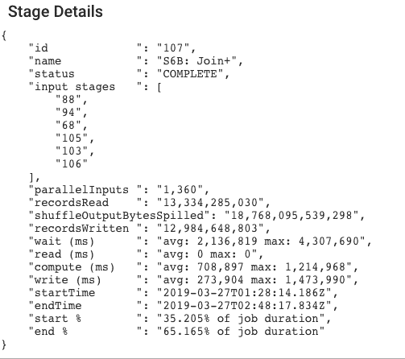

慢速运行加入/分组方式

这导致我们在 queryplan 的 execution statistics 选项卡中查看总的*槽毫秒*对 e *失效毫秒*:

最佳查询:

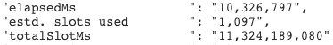

慢速查询

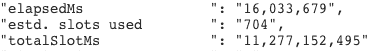

**totalSlotMs** 度量是对资源使用情况的测量。它提供了对多少计算容量使用了多长时间的洞察。

在这两个实例中，估计的槽的差异是一个严重的指标，表明存在对可用槽的争用，这也由工作人员过多的等待时间所支持。这位客户订购了 2000 个插槽的固定费率( [*把它想象成一个只为您的组织*](https://cloud.google.com/bigquery/pricing) 保留的查询集群)，结果是另一个作业在同一时间(大约午夜)运行。由于 BigQuery 服务试图为所有作业公平地分配插槽，这导致该查询的可用插槽较少，因此需要更长时间才能完成。

通过查看客户的查询时间表修复了此问题，因为此特定查询对其日常报告至关重要。

# 使用 BQVisualiser

使用 BqVisualiser 最简单的方法是在[https://bqvisualiser.appspot.com](https://bqvisualiser.appspot.com)上访问它

您需要登录 Google Cloud。

# 从 Google Cloud 打开一个查询计划

1.  选择标签为“选择作业”的选项卡
2.  点击“获取项目”按钮
3.  (可选)键入过滤器表达式
4.  在下拉选项卡中选择一个项目
5.  单击列出作业

注意:如果您不想在这里进行身份验证，您也可以上传一个 queryplan。可以使用 bq 命令下载查询计划:

```
bq - format=prettyjson show -j bquxjob_yourjobid > mybqjob.export.json
```

然后，您将看到下面的查询列表。单击要调查的查询的 Get 按钮。

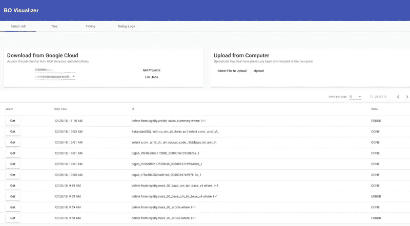

将打开带有查询计划的树选项卡

# 树形视图

主视图是树形视图:

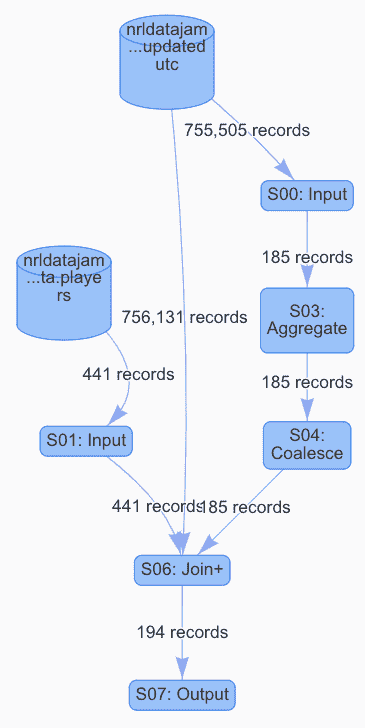

树形视图

顶部节点代表一个数据源。所有其他节点都是 BigQuery 处理阶段。

选择单个节点会给出该阶段的详细信息:

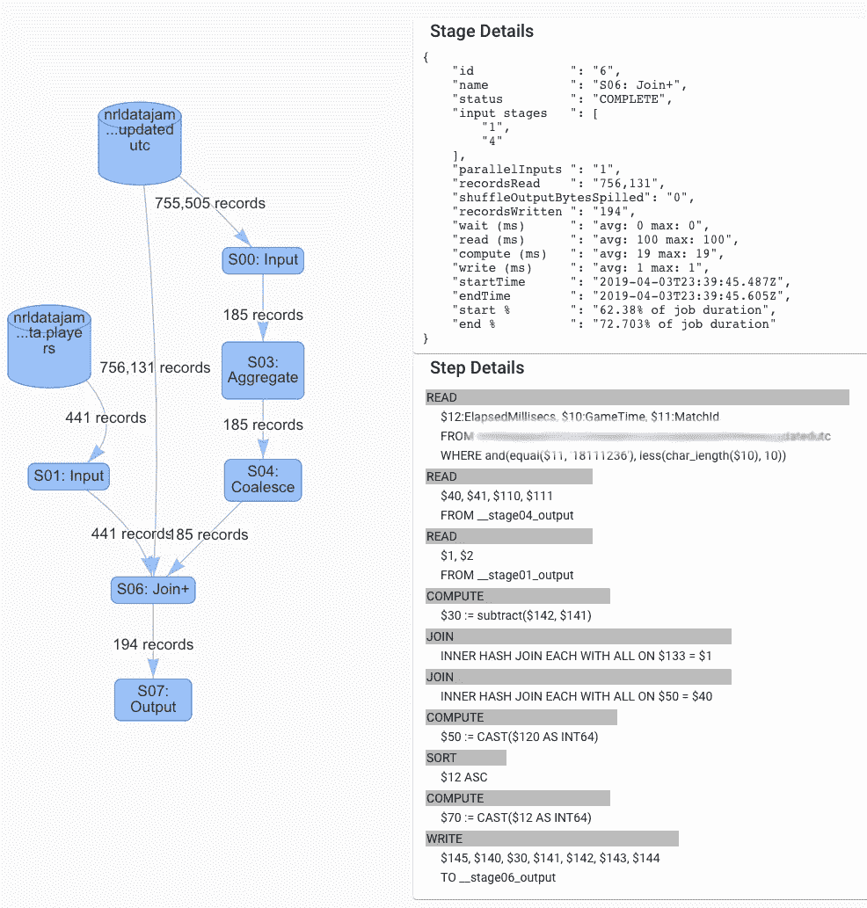

阶段详细信息显示

# 计时标签

该选项卡提供了执行时间的甘特图视图。

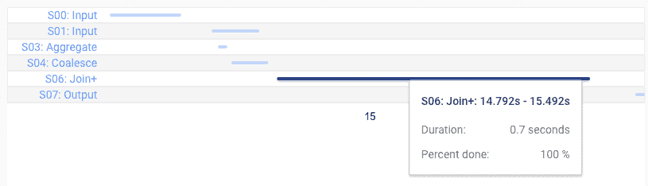

阶段执行时间的甘特图

在此示例中，Join+阶段运行了 0.7 秒

# 底部标签

底部是一组选项卡，显示整体查询的详细信息:

1.  概观
2.  状态
3.  使用的 SQL
4.  进度计时
5.  统计数字
6.  查询设置

# BqVisualiser 是开源的

BQVisualiser 是开源的。这是一个 Angular SPA，您可以在任何 appserver/webserver 上托管它。它可以在以下位置找到

[https://github . com/Google cloud platform/professional-services/tree/master/tools/bq-visualizer](https://github.com/GoogleCloudPlatform/professional-services/tree/master/tools/bq-visualizer)

我在自己的 github 回购上留了一个叉:[https://github . com/smeyn/professional-services/tree/master/tools/bq-visualizer](https://github.com/smeyn/professional-services/tree/master/tools/bq-visualizer)

(这一个倾向于有错误修正的较新版本)

# 了解关于 BigQuery 的更多信息

阅读 BigQuery 的 PM 写的这篇伟大的文章:[Google big query 的 12 个组成部分](/google-cloud/the-12-components-of-google-bigquery-c2b49829a7c7)