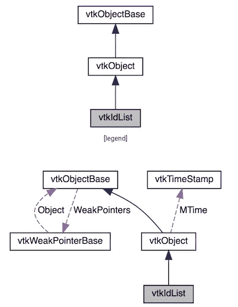
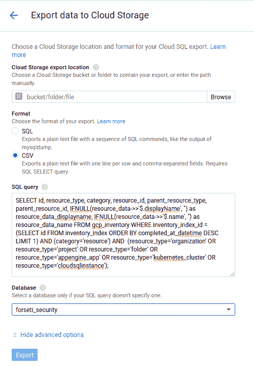

# 使用凡赛堤 2.0 和 D3.js 可视化 GCP 建筑！

> 原文：<https://medium.com/google-cloud/visualize-gcp-architecture-using-forseti-2-0-and-d3-js-ffc8fdf59450?source=collection_archive---------0----------------------->

***= = 2019-8-16 更新= =*=**

***我的好朋友 Garrett 10x 倍放大了下面的想法，并在***[***https://cloud . Google . com/blog/products/identity-security/understand-GCP-organization-resource-hierarchy-with-forse ti-visualizer***](https://cloud.google.com/blog/products/identity-security/understand-gcp-organization-resource-hierarchies-with-forseti-visualizer)

虽然下面的一切应该仍然可以工作(尽管有一些小的调整，因为凡赛堤版本)，我强烈建议你看看他正在做的伟大的东西！干杯！

***MZ***

***= =/更新==***

客户和同事通常很难创建他们的云应用程序架构的手绘图表，并且随着情况的变化保持这些图表的更新也不是一件有趣的事情…

但是现在，通过结合[凡赛堤安全](https://forsetisecurity.org/?utm_source=medium&utm_medium=blog&utm_campaign=q4_2018_gcp_visualization)的库存扫描器、一些聪明但相当粗糙的云 SQL 和 [D3.js](https://d3js.org/) 可折叠树，你可以自动生成代表你的 GCP 环境的交互式架构图，就像这个…

我已经记录了下面的冒险和说明，但是如果你想跳到好的东西，代码在 GitHub [这里](https://github.com/GoogleCloudPlatform/professional-services/tree/master/tools/gcp-arch-viz)上，在 web 上有一个工作版本[这里](https://storage.googleapis.com/forsetiviz-external/gcp-arch-viz.html) …干杯！

# 背景

我告诉你一个小秘密——我绝对讨厌写文档。我一直很讨厌它。好了，我说了。我不后悔…

当我以写代码为生时，那主要意味着连接类/继承图，而现在在我作为云工程师的角色中，是 GCP 架构图。当然，当你只有少量的课程、项目或资源时，这并不是那么糟糕。您可能可以将整个内容放在一个合理大小的白板上。但是，一旦事情开始变得更大、更严重，并开始改变以适应您的业务需求，事情就会很快失控(并且过时)!

对我来说，事实是这样的:在一个活生生的、呼吸的、不断变化的环境中保持手写文档的更新是一场必败的战斗，我只是不想再这样做了。你也不应该。依我看，最好的文档是自动文档，直接从你需要记录的东西中生成…

在之前的软件开发人员生涯中，我们通过一个在代码提交时触发的 [Jenkins](https://jenkins.io/) 作业来自动化这一点，运行 [doxygen](http://www.stack.nl/~dimitri/doxygen/) 和 [graphviz](https://www.graphviz.org/) 的组合来读取/分析我们的代码，并输出带有漂亮的类层次图的精美网页。有点像这样:

*来源:*[*https://www.vtk.org/doc/nightly/html/classvtkIdList.html*](https://www.vtk.org/doc/nightly/html/classvtkIdList.html)

在 GCP 的世界里，这应该是一样容易的，我想要建造它。但是，为了做到这一点，我需要几个不同的部分:

*   扫描一个 GCP 组织，并列出所有存在的东西。如果所述扫描器跟踪层级(父/子关系)和组织(哪些事物是另一事物的组件——想想网络中的虚拟机),则加分
*   一些以一种有用和动态的方式描绘 GCP 建筑的东西。加分这里我们可以用大幅面打印机把图片打印出来。
*   某种方式将第一件事的输出粘合到第二件事的输入中。

**剧透警告**——上面所有的部分都存在，我把它们连接在一起，看起来像这样:

*工作示例:*[https://storage . Google APIs . com/forsetiviz-external/GCP-arch-viz . html](https://storage.googleapis.com/forsetiviz-external/gcp-arch-viz.html)

这是 tl。我如何到达那里的博士(下面有更长的解释):

1.  使用[凡赛堤安全](https://forsetisecurity.org/?utm_source=medium&utm_medium=blog&utm_campaign=q4_2018_gcp_visualization)对所有 GCP 资源进行清点扫描
2.  连接到凡赛堤的云 SQL 数据库，并将最近的库存扫描导出到 CSV
3.  将 CSV 数据导入 HTML 网页，并使用 D3.js 将库存数据可视化为动态的交互式树
4.  利润！

**完全披露:**这个初步的解决方案远没有我和[瑞安·麦克道尔](https://medium.com/u/dc8042aba528?source=post_page-----ffc8fdf59450--------------------------------)不久前发表的[计费可视化报告](/google-cloud/visualize-gcp-billing-using-bigquery-and-data-studio-d3e695f90c08)那么完美，那是 100%故意的。我的第一个帖子的目的是快速展示我们今天已经获得的部分的可能性，并获得一个工作原型&代码(跳转到底部的 github 链接)。从那以后，我会在后续的文章中努力让架构查看器更好，因为我们都会学到更多…

我们开始吧，好吗？

# 使用凡赛堤 2.0 设置库存扫描

首先，我们需要扫描我们的 GCP 环境，列出那里存在的所有文件夹、项目和其他资源。幸运的是，[凡赛堤安全](https://forsetisecurity.org/?utm_source=medium&utm_medium=blog&utm_campaign=q4_2018_gcp_visualization) (2.0 或更高版本)为我们处理了所有的 GCP [库存扫描](https://forsetisecurity.org/docs/latest/use/cli/inventory.html)，并创建了一个漂亮、整洁的云 SQL 表，其中包含父子关系。这是一个很好的开始！

设置凡赛堤非常简单——这只是他们的 GitHub repo 的“git 克隆”并运行一个设置向导，但是在开始之前有几件事情需要注意:

1.  你很可能需要以组织管理员的身份运行这个向导(或者让一个组织管理员帮你运行它)，因为需要权限。根据您公司的结构，这可能是一件大事，所以我想在这里特别强调一下…
2.  与大多数云技术一样，你需要建立一个计费账户，并与你的项目相关联，以便为凡赛堤运行的基础设施付费。**注意:持续运行凡赛堤需要成本！**
3.  从我自己的凡赛堤项目估计大约每月 125 美元，并没有保证这个数字会是你在你的。您必须自行监控，并对由此产生的费用承担全部责任。也就是说，这些帖子的未来迭代完全有可能会研究定制设置和降低成本的方法，使其更容易为预算有限的人所接受…
4.  关闭凡赛堤的服务器是降低成本的好方法。考虑在不使用时停止虚拟机和云 SQL 实例。

好了，除了这些，你可以在这里找到官方的凡赛堤设置说明:

[https://forsetisecurity.org/docs/latest/setup/install.html](https://forsetisecurity.org/docs/latest/setup/install.html)

一旦您安装了凡赛堤，清单扫描器应该会自动运行，下面的步骤应该能够帮助您检查扫描的输出，并导出清单数据进行可视化…

# 导出 GCP 资源的快照

此时，我们应该有一个正在运行的凡赛堤实例，以及一些存储在云 SQL 数据库中的库存记录。让我们来看看…

首先，让我们连接到云 SQL 实例，这样我们就可以在本地运行查询。我用一个单独的谷歌计算引擎实例连接了[，但是你可以自由选择对你来说最容易的。最终，您只需要能够执行 SQL 查询，并看到结果。一旦你连接上了，这里有一些有趣的查询可以运行:](https://cloud.google.com/sql/docs/mysql/connect-compute-engine)

# 获取最新清单扫描的 id

[https://gist . github . com/mz inni/824 ed 1c 08 ba 8d 12d 096 fc 0111340 c 68 f](https://gist.github.com/mzinni/824ed1c08ba8d12d096fc0111340c68f)

# 查询最新的库存记录(使用上面的“id ”)

免责声明:下面的查询中有很多不太好的地方，这就是为什么我想把它拿出来，而不是让你自己找出答案。您将看到我从大文本 blob 字段中进行 JSON 查找、引号替换和 IFNULL()替换。所有这些都是使 CSV 输出与 JS 文本文件阅读器和 D3.js 处理配合得很好所需要的，所以要预先警告:如果你玩这个，[这里是龙](https://en.wikipedia.org/wiki/Here_be_dragons) …

[https://gist . github . com/mz inni/fa 67 f 6b 38 e 34d 488604 ebef 3 ECE 2 dee 9](https://gist.github.com/mzinni/fa67f6b38e34d488604ebef3ece2dee9)

# 将库存数据导出到 CSV

现在我们知道有数据可以处理，让我们导出最近的一组库存记录，并将该数据作为可视化实用程序的输入。方法如下:

1.  按照这里的云 SQL 文档中的说明来完成导出步骤。
2.  当到达输入 SQL 查询的部分时，直接使用上面的那个。它应该看起来像下面的图像。
3.  单击 Export，当数据导出操作在后台完成时，您将返回到主云 SQL 界面。注意:与上面的注意事项类似，这可能需要几分钟时间，具体取决于清单扫描中包括的 GCP 资源的数量。
4.  完成后，您应该将生成的 CSV 文件转储到 Google 云存储桶中。万岁。

# 让 D3.js 给你全部画出来！

也许是因为我从来都不是一个 UI 爱好者，也许是因为我对“交互式”网站的定义是在我可以使用`*<marquee>*`标签制作滚动文本时形成的，但这个项目是我第一次尝试使用[D3 . js 库](https://d3js.org/)作为可视化数据的方式。也就是说，既然我已经找到了，我想我再也不会用别的东西了。一旦你通过了最初的学习曲线，找到了一个很好的适合*如何*可视化你的数据的方法，并通过一些潜在的 lib 版本不匹配(*牢骚* v3/v4/V5 *牢骚*)，D3 库提供了无限的能力和灵活性来可视化地讲述你的故事。所以，不用说，虽然学习曲线很艰难(现在仍然如此)，但我是一个超级粉丝…

当我开始的时候，我知道这个项目非常适合树形结构(节点、叶节点、作为组织/文件夹/项目/资源的叶)，所以我的首要任务是找到一个合适的例子。幸运的是，稍微搜索一下就找到了这些工作示例，可以作为起点(谢谢！):

[https://bl.ocks.org/mbostock/4339083](https://bl.ocks.org/mbostock/4339083)

[https://wizardace.com/d3-collapsible-tree/](https://wizardace.com/d3-collapsible-tree/)

这些例子完成了我所寻找的大部分工作——绘制多层树，以及动态展开/折叠功能，但是我知道还需要一些“定制”工作。因此，与我启动大多数项目的方式类似，我抓取了一些代码作为起点，在本地复制它，将其添加到 github repo 以进行版本控制，并添加到一个“哦，废话，我毁了它”安全网，然后开始黑客攻击…

一旦我有了本地代码，我知道我将需要一个本地 web 服务器来检查我的更改。这里保持它的超级整洁，我只是选择使用作为默认 python 安装的一部分的 SimpleHTTPServer。因此，在我破解代码的目录中，我运行了以下代码:

`python -m SimpleHTTPServer 8000 &`

该命令完成并返回 cmd 提示符后，我启动了一个浏览器，指向:

`localhost:8000/gcp-arch-viz.html`

瞧，现在我已经有了“编辑代码->测试代码->提交代码”循环，我们可以自由地破解了，最安全的是我不会以不可恢复的方式破坏东西…

从那以后，我只需要找到我想添加的功能的例子，把它们分开来理解基本原理，然后把我找到的东西改编成我想要的。让我们一点一点的快速看一下，但是没有特别的顺序…

## 从 CSV 文件加载树数据

因为我想尽快将它发布出去，所以我最初选择从一个独立的 CSV 文件中加载库存数据，并严格要求该文件与呈现的 html/javascript 位于同一个目录中，并且符合非常严格的格式。这些需求使得[文件处理代码](https://github.com/GoogleCloudPlatform/professional-services/blob/c8dd9de62c5e645ac01599de9d1e843bcab4f73e/tools/gcp-arch-viz/gcp-arch-viz.html#L51-L58)非常标准，我遇到的唯一的复杂情况是:

1.  我必须记住浏览器是异步加载文件的，并且是需要的。然后()等待加载完成，并
2.  出于性能原因，浏览器通常会缓存一些东西，所以[在文件名](https://github.com/GoogleCloudPlatform/professional-services/blob/c8dd9de62c5e645ac01599de9d1e843bcab4f73e/tools/gcp-arch-viz/gcp-arch-viz.html#L53)后面添加了一个 cachebuster 参数，这样我就不会疯狂地想为什么刷新页面时我的本地更改没有显示出来…

## 将 CSV 库存数据转换为 D3 模型

使用 D3 最酷的一点是，一旦你将数据转换成库可以理解的格式，大部分事情都是开箱即用的。很可爱，对吧？嗯，算是吧…

让这个项目工作的最糟糕的部分之一是弄清楚如何解析输入 CSV 文件并以“正确”的方式填充 D3 树结构，以便 D3 lib 以我想要的方式绘制它。还记得我在上面讲输入 CSV 文件时提到的“非常严格的格式”吗？是的，所以，这种严格的格式与[非常紧密地耦合在一起，即解析每个库存行](https://github.com/GoogleCloudPlatform/professional-services/blob/c8dd9de62c5e645ac01599de9d1e843bcab4f73e/tools/gcp-arch-viz/gcp-arch-viz.html#L76-L89)的代码，将特定输入位置的值分配给相应的节点变量。

把它弄乱，哪怕是一点点，突然间[链接父母和孩子的代码](https://github.com/GoogleCloudPlatform/professional-services/blob/c8dd9de62c5e645ac01599de9d1e843bcab4f73e/tools/gcp-arch-viz/gcp-arch-viz.html#L93-L96)就被弄乱了，树根本不能渲染。美好时光…

## 添加 GCP 图标

在我冒险的这一点上，我有了一个工作的、交互式的树形图，它准确地反映了我的组织的根/文件夹/项目/资源层次结构，但是它看起来有点…咩…

那么，当你得到一个看起来“咩”的东西时，你会怎么做呢？当然是你加图！

在谷歌云网站上找到官方的谷歌云平台标识并不太难，一旦我在谷歌云存储上托管了我需要的标识，我所需要的就是[一点图像设置代码](https://github.com/GoogleCloudPlatform/professional-services/blob/c8dd9de62c5e645ac01599de9d1e843bcab4f73e/tools/gcp-arch-viz/gcp-arch-viz.html#L253-L292)来将树的无聊圆圈变成漂亮得多的 GCP 官方标识。

# 但是等等，为什么你的文件夹是这样摆放的？

很棒的问题！

简而言之，我最近无意中陷入了一场有点固执己见的精彩对话，围绕着组织 GCP 环境的“最佳”方式，以便适应不同的团队、业务单位、开发与生产等。所以，我想我会利用那里学到的知识来建立我自己的组织，并在这个过程中，写一些关于它的东西，并给出更多的代码。你现在看到的是我下一篇文章的第一步，可能会有一个吸引人的标题，比如“用这个奇怪的技巧启动你闪亮的新 GCP 组织”之类的…

所以，请继续关注！

# 不要重新发明轮子！用我的代码运行吧！…

尽管弄清楚所有 D3.js 的东西很有趣，但是没有理由让你一个人从头再来一遍所有的“乐趣”——这就是我在这里的目的！请随意叉下面的回购，并自行处理工作代码和 CSV 数据！

[https://github . com/Google cloud platform/professional-services/tree/master/tools/GCP-arch-viz](https://github.com/GoogleCloudPlatform/professional-services/tree/master/tools/gcp-arch-viz)

…当然，欢迎 github 问题和请求！我会尽最大努力定期回顾，添加评论，合并符合我对这件事的愿景/方向的 PRs。如果你想投稿，想知道我对未来的想法，看看下面的列表……:)

# …而这仅仅是开始…

这就是我让您的 GCP 环境自动绘制出来的 MVP，但这绝对不是我打算停止的地方…

我们希望在未来的版本中加入其他有趣的想法(排名不分先后，GitHub 即将发布！):

*   创建端点以从中提取清单数据(并替换 CSV 文件)？
*   水平与垂直绘图模式？
*   UI 上的资源过滤器？
*   在 UI 上全部展开/全部折叠？
*   图标的详细信息？
*   平滑一些动画过渡(展开/折叠图标)？
*   VPC/网络组织的实例？
*   每个网络的防火墙规则？