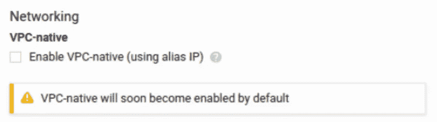
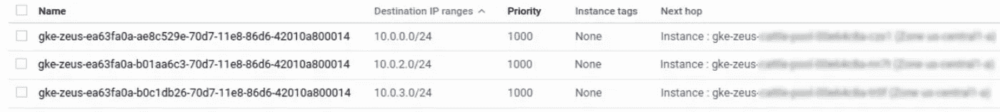
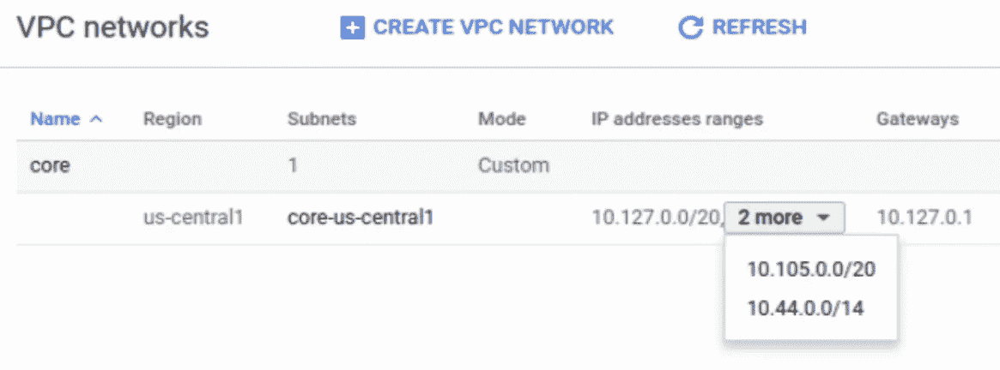
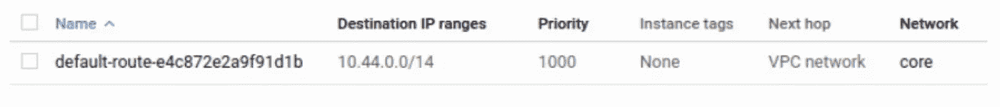

# Google Kubernetes 引擎上的 VPC 本地集群

> 原文：<https://medium.com/google-cloud/vpc-native-clusters-on-google-kubernetes-engine-b7c022c07510?source=collection_archive---------0----------------------->

如果您是一名 GKE 用户，并且在过去六个月左右的时间里创建了一个集群，您可能会注意到一个新选项:

你可能也已经看到了[五月份发布的宣布这一特性的新闻稿](https://cloud.google.com/blog/products/gcp/introducing-vpc-native-clusters-for-google-kubernetes-engine)，或者去年十月发布的[针对 GKE pods 的本地容器负载平衡](https://cloud.google.com/blog/products/containers-kubernetes/introducing-container-native-load-balancing-on-google-kubernetes-engine)，这是一个相关的事情。VPC 本地、容器本地、别名 IP:这些似乎都是相当吓人的术语，由于这种网络体系结构将“很快”成为新集群的默认架构，我认为基于在生产中创建和运行这两种类型的集群并比较它们的工作方式，将我们对它的了解联系起来会很有用。

首先，文章中减轻焦虑的部分:以 VPC 本地人的身份运行集群几乎不会改变集群本身。集群内其他工作负载部署、发现或连接您的工作负载的方式不会受到任何影响。事实上，如果你比较两个集群，一个使用 VPC 本地，另一个使用传统方法，现在莫名其妙地称为“高级路由”，你会发现它们从内部到启动时传递给 kubelet、kube-dns 和 kube-proxy 的命令行参数都非常相同。因此，将您的工作负载切换到 VPC 本地集群不会破坏任何东西，除非您正在做一些超乎我目前想象的事情。

那么它改变了什么呢？它改变了建立路由来处理节点之间的 pod 流量的方式。一点背景知识:如果你熟悉 kubernetes 网络，或者可能是我去年关于主题的文章[的读者，那么你知道分配给集群中的 pod 的默认网络是 a /14，每个节点被分成 1/24。为了使一个/24 中的 pod 与另一个中的 pod 通信，需要在项目级别设置路由。如果您使用旧的路由设置运行集群，那么当您查看包含集群的项目中的路由时，您将会看到如下内容:](/google-cloud/understanding-kubernetes-networking-pods-7117dd28727)

在谷歌云的说法中，这些被称为“定制路由”，具体来说，它们是“动态定制路由”，因为它们是在集群被更改以添加或删除节点时由控制平面建立和维护的。每个节点都有一个分配给其 pod 的/24，每个/24 都有一个为其创建的路由，因此流量将流向正确的实例。要点是 1)在这种情况下，pod 网络与 VPC 中的任何子网都没有关系，只有添加这些定制路由才允许 pod 业务流动；以及 2)这些定制路线计入项目的路线配额。

在 VPC 本地集群中，pod 网络不再是由自定义路由实现的抽象概念。相反，pod 网络以及 kubernetes 服务网络被设置为 VPC 上的子网。

如果您检查项目 VPC 中的路线，您会发现只有一条路线对 pod 流量至关重要:

因此，现在整个/14 可从 VPC 的任何地方进行本地路由，而不是拥有一堆覆盖集群中所有节点的动态自定义路由。我不是谷歌网络后端的专家，无法深入了解“原生可路由”在幕后意味着什么，但从用户的角度来看，这只是意味着我们在添加节点时不需要用完路由配额，正如我们将在下面看到的那样，它实现了一些很酷的功能，我认为随着时间的推移，这些功能将变得非常重要。

为什么他们还要将 kubernetes 服务网络添加到 VPC 作为子网？我上面提到的一个很酷的特性是 VPC 本地集群的 pod 网络被集成到 VPC 的 IP 地址管理系统中，这可以防止地址空间的双重分配。因此，尽管没有为服务网络建立项目级路由，但将其作为子网添加到 VPC 可以保护该范围，并防止空间的双重分配。为什么*不*也为服务网络添加路由？发送到服务 IP 的数据包目前被定向到起始节点上的 pod 网络，因此这些路由没有任何用处:从外部进入集群的方法仍然是使用入口。

但是，如果您利用 VPC 本地 pod 网络来利用上面提到的容器本地负载平衡特性，入口的工作方式将会改变。我还没有使用过这个功能，所以我不打算在这里详细介绍。承诺的功能很有趣，原因有几个，我鼓励你阅读[新闻稿](https://cloud.google.com/blog/products/containers-kubernetes/introducing-container-native-load-balancing-on-google-kubernetes-engine)来了解一下。简而言之，容器本地负载平衡意味着外部 GCP 负载平衡器(例如那些满足集群入口请求的负载平衡器)能够将负载平衡请求直接分配给一组正在运行的 pod，而不是分配给节点实例组中的整个实例集。这至少节省了一跳，并且应该会提高性能。当我有机会把它付诸实践时，我会对此说得更多。

将 pod 网络建立为 VPC 子网还会带来一些其他有用的东西:集群可以在对网络影响较小的情况下进行扩展，因为节点不使用路由配额；pod IP 网络可以通过[云路由器](https://cloud.google.com/router/docs/)、[云 VPN](https://cloud.google.com/vpn/docs/concepts/overview) 和[云互联](https://cloud.google.com/interconnect/docs/)进行广告，以支持混合连接用例；无需 NAT，VPC 本地 pods 可以直接连接到 googleapis.com 服务，如 BigQuery 默认情况下，VPC 子网地址通过了 Google 对实例的反欺骗检查，因此您获得了额外的一层安全保护；最后，如果你使用 VPC 对等来连接项目，谷歌将在对等项目中添加路由来处理 pod 网络上的流量。事实上，如果您想要连接到对等项目中的集群，那么您必须使该集群成为 VPC 本地集群，因为就我们所知，您不能在 VPC 对等连接上使用静态定制路由。

最后一点应该是在创建新集群时切换到使用 VPC 本地 pod 网络的足够动力(您不能切换现有集群)。即使我给出的例子不是您期望处理的其他特性和性能改进的用例，也值得一试。希望这篇文章将有助于提供伴随这种新架构的变化和可能性的概述，并减轻对它将对您当前的开发、部署和操作实践产生的影响的任何焦虑。