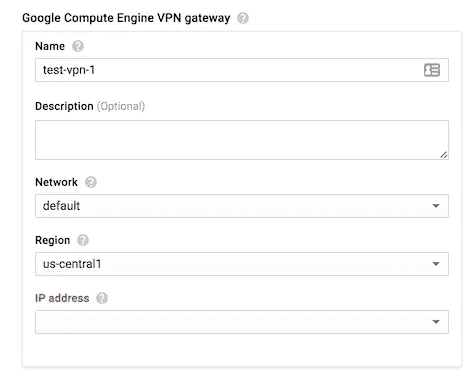
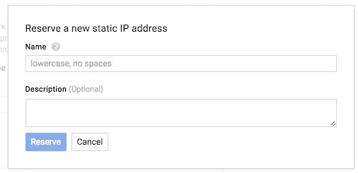
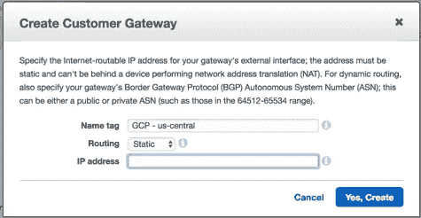
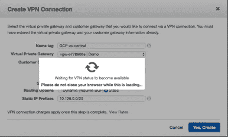
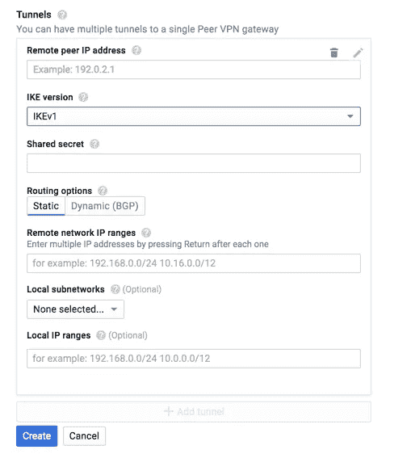
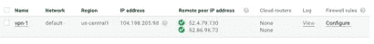
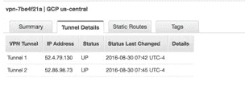

# 两个云之间的 VPN

> 原文：<https://medium.com/google-cloud/vpn-between-two-clouds-e2e3578be773?source=collection_archive---------2----------------------->

## 将 AWS 连接到谷歌的云

与连接一个 [AWS 区域到区域](https://www.websiteops.com/cloud/2015/05/13/connecting-aws-regions-with-openswan/)相比，通过 VPN 将 AWS VPC 连接到谷歌的云平台非常简单。* *披露者—要使此设置正常工作，您需要 AWS 和 Google 云平台的付费帐户。费用适用于 AWS 和 GCP

首先，你需要注册一个谷歌账户。从那里，您可以登录到 Google 开发者控制台(http://Console . developers . Google . com)。

从这里开始，你必须创建谷歌所说的项目。一个项目封装了大部分谷歌云产品。您的帐户中可以有多个项目。GCP 的一个项目可以比作 AWS 中的一个 VPC，但是没有完整的一对一的产品和功能映射。一个项目为您的 GCP 帐户提供一定程度的逻辑分离、认证和计费。你可以免费获得一个项目设置。在这篇文章中，我主要关注网络和 VPN 的设置。要使用这些功能，您必须为您的项目启用计费。谷歌以初始积分的形式提供免费试用。这将给你 300 美元在 90 天内用完【https://cloud.google.com/free-trial/. 

# 快速入门—使用静态路由

*   从 GCP 开始，创建一个谷歌计算引擎 VPN 网关。
*   给你的谷歌计算引擎 VPN 一个名字。

*   选择网络、区域和 IP 地址。如果您还没有 IP 地址，请选择新的静态 IP 地址。

*   转到 AWS VPC 仪表板。
*   使用刚刚创建的 Google 计算引擎静态 IP 地址创建一个新的客户网关。

*   转到 AWS VPN 仪表板
*   使用刚刚创建的 AWS 客户网关(CGW)创建一个新的 VPN 连接。为路由选项选择静态。然后输入您的 Google 计算机引擎网络的子网。
*   单击 Yes Create，您的 VPN 将开始在 AWS 端构建。

一旦构建了 AWS VPN 隧道，您就可以选择新构建的 VPN 连接并下载通用 VPN 配置。这应该作为一个用 AWS VPN ID 命名的文本文件下载。在这个配置文件中，您将需要 AWS 端点和 PSK。回到隧道下的 GCP 控制台

*   远程对等 IP 地址将是 AWS VPN 配置中的虚拟专用网关。

*   共享机密是来自 AWS VPN 配置的 PSK
*   为 IKE 版本选择 IKEv1
*   对于远程网络 IP 范围，请在 AWS 中输入 VPC 子网的 CIDR 范围
*   对于本地子网网络，添加选择您要连接的 GCP 网络。
*   单击创建

现在对 AWS 提供 AWS VPN 配置的第二个隧道再次执行这些步骤。

一旦你点击创建谷歌云平台将开始建立隧道，并试图连接到 AWS 远程对等 IP 地址。

AWS 不提供任何日志来帮助解决连接问题，幸运的是 GCP 提供了日志。

要解决 AWS 到 GCP 隧道的问题，请单击 GCP VPN 仪表板中的日志记录。这将带您到日志仪表板，从 VPN 隧道实时输出日志。