# 仓储云监控警报

> 原文：<https://medium.com/google-cloud/warehousing-cloud-monitoring-alerts-b648e3746d9?source=collection_archive---------1----------------------->


在监控仪表板中，我们可以定义警报策略，以便在事件发生时通知我们。警报策略可以触发给操作人员的通知(例如电子邮件)。我们还可以看到以前事件的历史。但是，如果我们想要一个永久的事件记录用于审计或进一步分析，该怎么办呢？

一种解决方案是认识到当我们定义一个警报策略时，我们也有能力定义多个通知通道。我们可以使用的通知渠道类型包括发布/订阅。这意味着当事件打开或关闭时，描述事件性质的消息会发布到指定的发布/订阅主题。从这里，我们可以注册一个可以处理这些事件的订阅者，并保存它们以备后用。然后，我们可以将它们写入数据仓库(如 BigQuery)或存储子系统(如 Google Cloud Storage)。

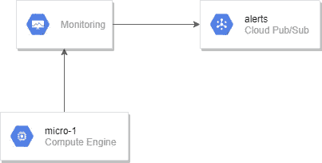

在本文的剩余部分，我们将描述如何完成这项任务。我们将通过教程来说明这个故事。我们假设有一个名为“micro-1”的计算引擎实例正在运行。我们将设置一个 CPU 使用警报。当 CPU 变高时，警报将被触发，这是我们人为造成的。当警报触发时，它会将消息发布到 Pub/Sub，我们将会看到这些消息。

1.  创建一个名为“提醒”的 GCP 发布/订阅主题。

转到发布/订阅页面，然后单击主题。

点击+创建主题。

输入名称“alerts”作为主题 ID。

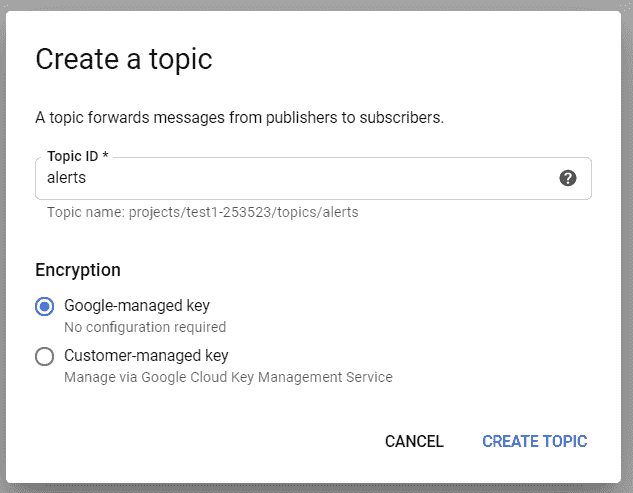

单击创建主题。

2.创建名为“提醒”的 GCP 发布/订阅。

仍在名为“alerts”的主题的“主题详细信息”页面上，单击“创建订阅”按钮。

对于订阅 ID，输入通知的名称。

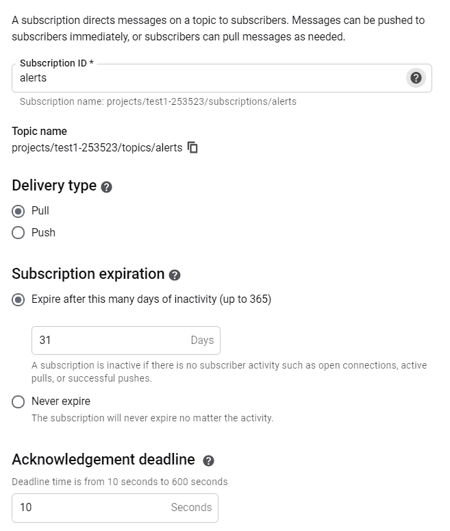

3.创建指向发布/订阅主题的云监控通知通道。

在“警报”选项卡的“监视”页面中，单击编辑通知通道。

找到云发布/订阅的条目，然后单击添加新项。

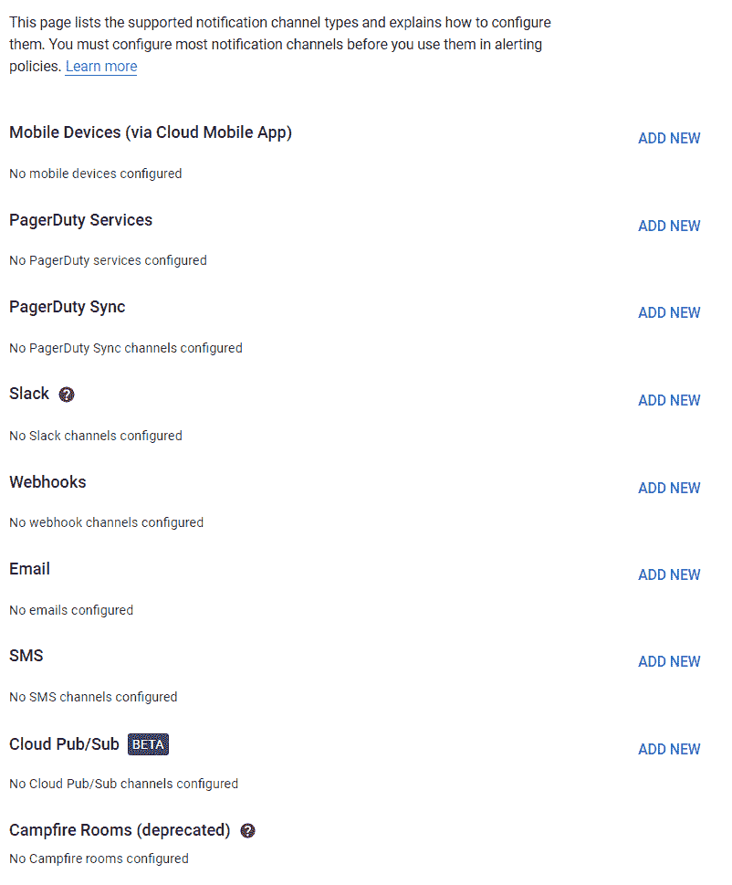

为新通道指定显示名称 alerts-pub-sub，并提供格式为的主题名称:

```
projects/[PROJECT_ID]/topics/alerts
```

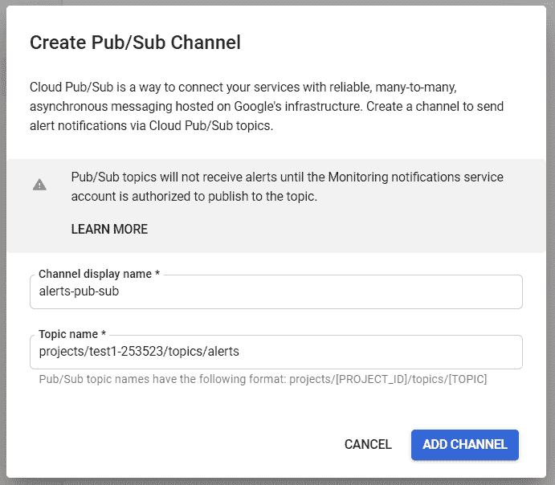

4.允许监控发布到主题。

在警报主题的发布/订阅页面中，单击显示信息面板。单击添加成员。

```
service-**PROJECT_NUMBER**@gcp-sa-monitoring-notification.iam.gserviceaccount.com
```

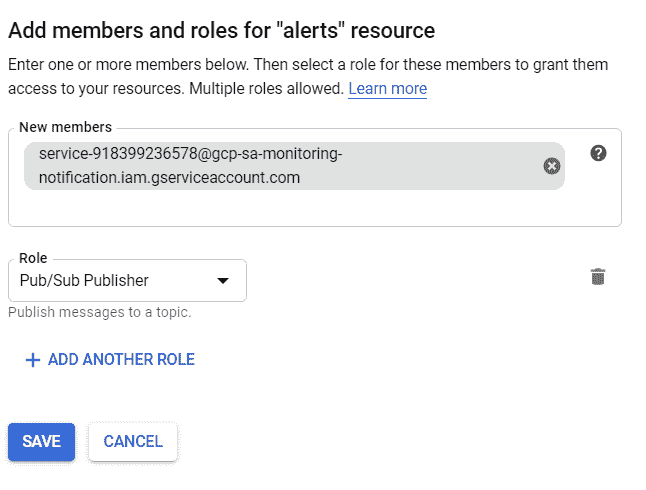

5.创建云监控警报策略。

点击警报。

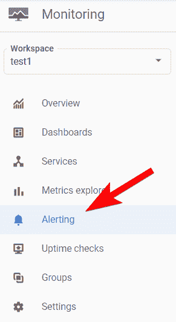

点击+创建策略

将该策略命名为“高 cpu”。

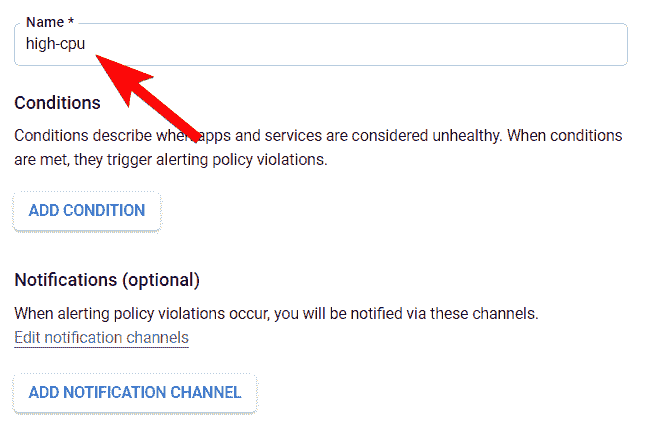

点击“添加条件”

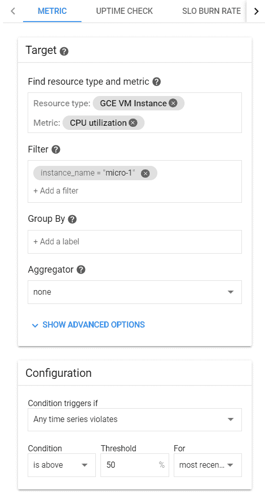

点击添加。

点击添加通知渠道:

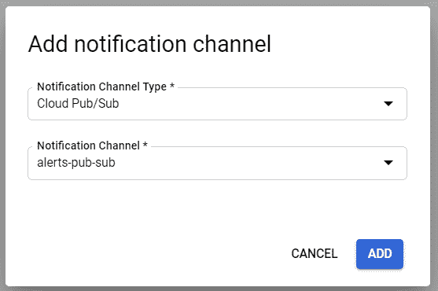

点击保存。

6.登录我们名为“micro-1”的计算引擎，并在其上运行 CPU 负载。

使用 SSH 登录计算引擎。安装 Linux 压力命令:

```
sudo apt-get install stress
```

将 CPU 负载运行至 100%

```
stress --cpu 1
```

此时，计算引擎上的 CPU 负载为 100%。如果我们连接了第二个 SSH 终端并运行 top，我们将看到 0%空闲。

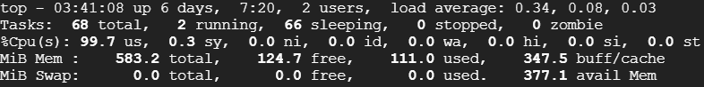

等待三到四分钟，直到触发警报。访问云监控中的警报页面，每隔几分钟刷新一次页面，直到您看到一个活动事件:

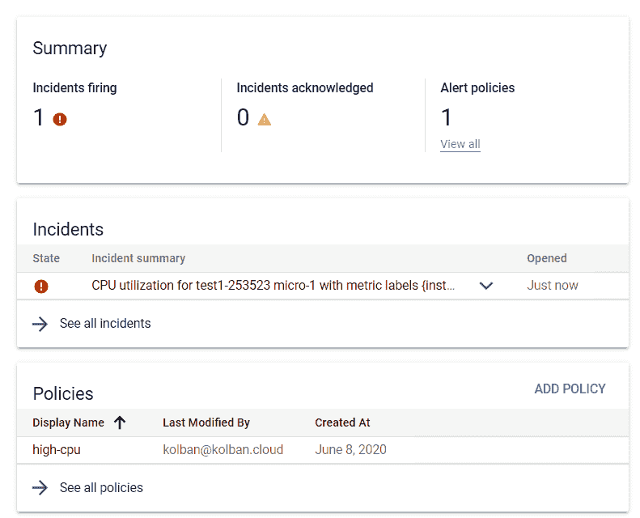

在我们查看发布的消息之前，我们现在将取消加载，并再次等待事件清除。在运行 stress 命令的终端中，用 CTRL+C 中断它。同样，在三到四分钟后不断刷新警报窗口，以查看事件消失。

我们现在可以访问发布/订阅页面，切换到订阅选项卡，查看警报订阅的详细信息。我们会发现有两条未确认的消息在等着我们。

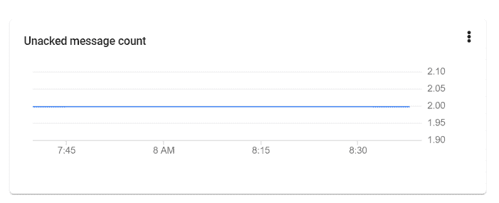

当 CPU 负载过高时，会打开一条事件消息。第二条消息是当 CPU 负载恢复正常时事件关闭。要查看这些消息，我们将从订阅中取出它们来查看它们的内容。从云 Shell 中，我们可以运行以下命令:

```
gcloud pubsub subscriptions pull alerts \
  --format="value(message.data)"
```

这将向我们显示消息的 JSON 内容。我们可以将它复制到一个 JSON 编辑器中，并重新格式化以提高可读性:

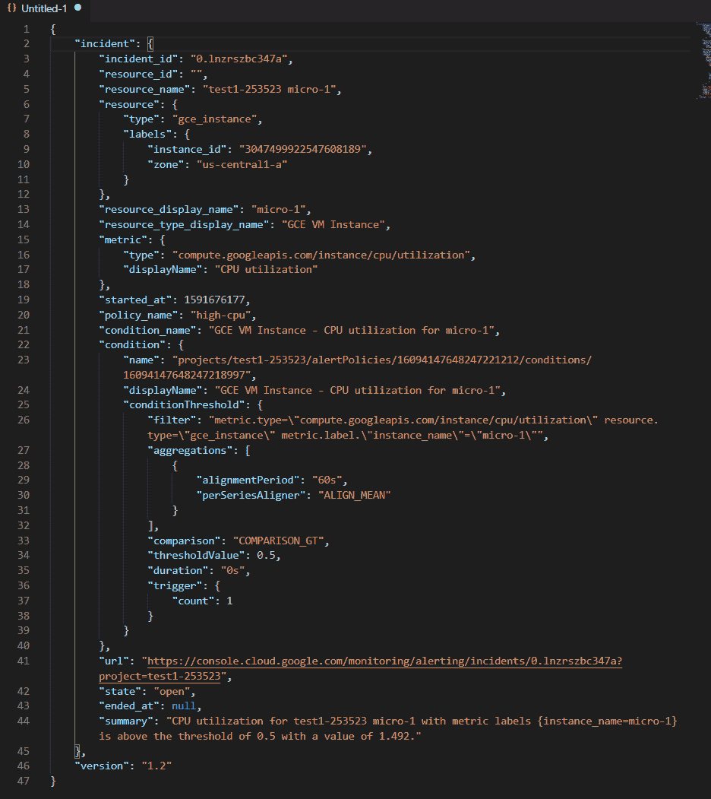

如果我们检查数据，我们会发现它包含了事件的所有细节。需要注意的一些事项是:

*   policy_name —导致事件生成的警报策略。
*   状态—事件的状态。在本例中，它是开放的。
*   started_at —检测到事件时的时间戳。
*   摘要—事件的可读描述。

我们现在已经到了这样一个阶段，云指标生成的警报被捕获为订阅消息中的数据。我们现在可以根据需要将这些消息作为记录存储在文件中，或者插入到 BigQuery 之类的数据仓库中。要插入到 BigQuery 中，一种可能是将消息以换行符终止的 JSON 记录导出到一个文件中，然后从该文件创建一个 BigQuery 表。

以下是创建该文件的脚本:

然后我们可以在大查询中创建一个表，使用:

最后，我们可以在 BigQuery 中看到数据:

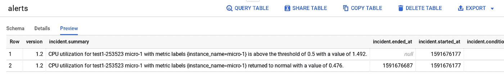

如果您想观看这项技术的演示，请点击这里: