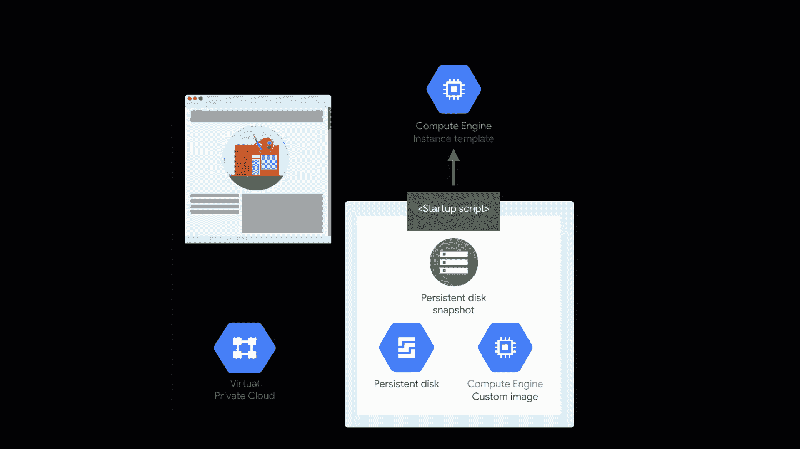
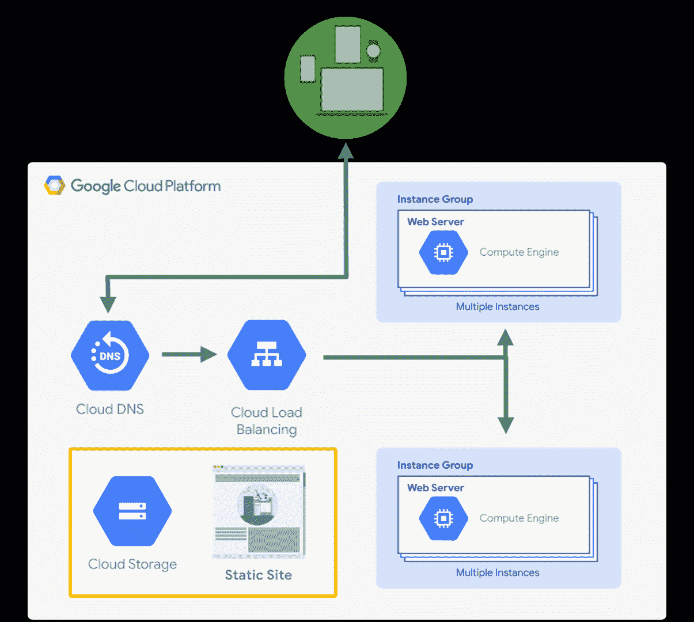
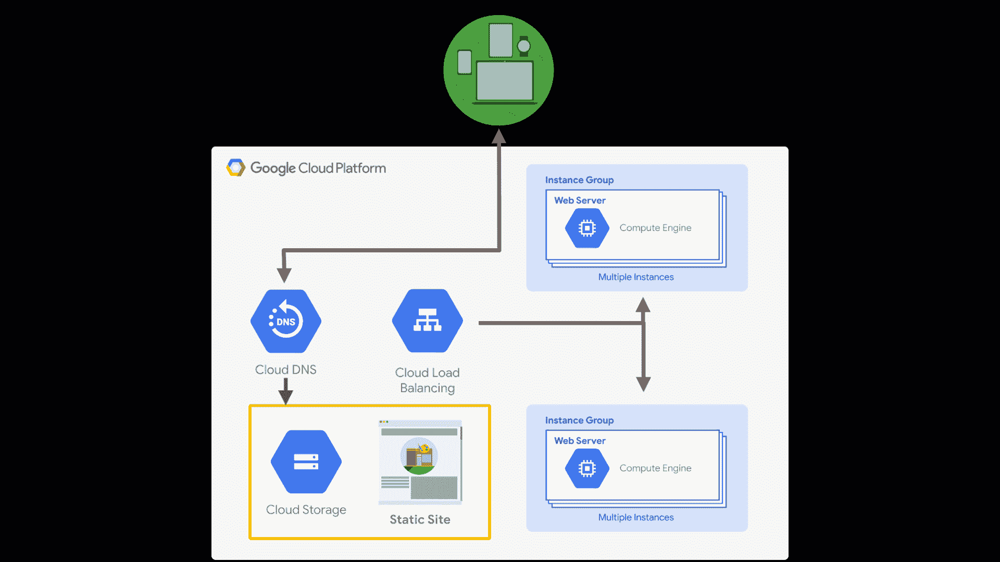

# Google Cloud 上应用程序的热灾难恢复

> 原文：<https://medium.com/google-cloud/warm-disaster-recovery-for-applications-in-google-cloud-9165b4ea8e2f?source=collection_archive---------0----------------------->

## 在云中烹饪

# 介绍

*[***云上做饭***](/@pvergadia/get-cooking-in-cloud-an-introduction-5b3b90de534e)*是一个[博客](/@pvergadia/get-cooking-in-cloud-an-introduction-5b3b90de534e)和[视频](https://www.youtube.com/playlist?list=PLIivdWyY5sqIOyeovvRapCjXCZykZMLAe)系列，帮助企业和开发者在 Google Cloud 上构建商业解决方案。在这第二个迷你系列中，我将介绍 Google Cloud 上的灾难恢复。当你在网上时，灾难可能很难处理。在接下来的几篇博客中，我们将详细阐述如何应对地震、停电、洪水、火灾等灾害。**

**这是这个系列的计划。**

1.  **[灾难恢复概述](/google-cloud/hosting-web-applications-on-google-cloud-an-overview-87d0962931a3)**
2.  **[基于谷歌云的本地应用冷灾难恢复](/@pvergadia/cold-disaster-recovery-on-google-cloud-for-applications-running-on-premises-114b31933d02)**
3.  **[针对内部部署应用程序的谷歌云热灾难恢复](/google-cloud/warm-disaster-recovery-on-google-cloud-for-applications-running-on-premises-7428b0f7db72)**
4.  **[基于 Google Cloud 的内部应用热灾难恢复](/google-cloud/hot-disaster-recovery-on-google-cloud-for-applications-running-on-premises-da7048d1a57b)**
5.  **[谷歌云中应用的冷灾难恢复](/google-cloud/cold-disaster-recovery-for-applications-in-google-cloud-5edeb32f2fc6)**
6.  **Google Cloud 中应用的热灾难恢复(**本文**)**
7.  **Google 云中应用程序的热灾难恢复**
8.  **Google Cloud 上的数据灾难恢复:第 1 部分**
9.  **Google Cloud 上的数据灾难恢复:第 2 部分**

**在本文中，您将学习为部署在 Google Cloud 上的应用程序设置一个热灾难恢复模式。所以，继续读下去吧！**

# **你会学到什么**

*   **Google 云应用程序的暖灾难恢复模式，带示例**
*   **灾难来袭前需要采取的步骤**
*   **发生灾难时需要采取的步骤**
*   **灾难发生后需要采取的步骤**

# **先决条件**

*   **谷歌云的基本概念和结构，这样你就可以识别产品的名称。**
*   **阅读[概述文章](/google-cloud/hosting-web-applications-on-google-cloud-an-overview-87d0962931a3)了解灾难恢复相关定义。**

# **看看这个视频**

# **让我们通过一个例子来学习 Warm DR 模式**

**Mane-street-art 目前在 Compute engine 上运行他们的 web 应用程序。它主要是一个静态网站，所以万一他们的网站不可用，他们可以使用故障转移到谷歌云存储上的静态网站。**

**Mane-Street-art 对成本非常敏感，因此他们选择了一个区域设置，如果该区域暂时不可用，这将会给他们带来问题，因此，这种方法为他们提供了一种经济有效的恢复方法。**

****

**Mane-street-Art 的当代建筑**

**他们的主要应用程序运行在计算引擎实例上。这些实例被分组到托管实例组中，这些实例组充当 HTTPs 负载平衡器的后端服务。HTTP 负载平衡器根据负载平衡器配置、每个实例组的配置以及每个实例的健康状况，将传入流量定向到实例。这提供了 HA，但是对于带和支架方法，这种方法值得讨论。**

***注意:如果您不熟悉这里使用的术语(RTO、RPO、灾难恢复模式),请查看之前的博客以获得概述。***

**在任何灾难恢复模式中，您都需要了解在灾难发生前需要采取什么步骤，灾难发生时会发生什么，以及灾难过去后需要发生什么。**

# **Warm DR 模式—它是如何工作的？**

## **灾难来袭前应采取的步骤**

****

**温暖的灾难恢复模式:灾难来临前应采取的步骤**

*   **他们必须建立一个 VPC 网络**
*   **创建使用应用程序服务配置的自定义图像。**
*   **使用该图像创建一个实例模板。**

****

**暖 DR 模式**

*   **使用此实例模板，配置具有运行状况检查和负载平衡的托管实例组**
*   **创建一个基于云存储的静态网站。查看本系列中的[前几篇文章](/@pvergadia/get-cooking-in-cloud-an-introduction-5b3b90de534e)来烹饪它吧！**
*   **然后最后配置云 DNS 指向主应用程序，备用静态站点处于休眠状态。**

## **灾难来袭时应采取的措施:**

**当灾难来袭时，Mane-street-art 所要做的就是配置云 DNS 指向这个静态站点。**

****

**温暖的灾难恢复模式:灾难来临前应采取的步骤**

## **灾难过去后应采取的步骤**

**当生产计算引擎恢复并再次运行，并且可以支持生产工作负载时，Mane-street-art 可以逆转恢复步骤:他们只需配置云 DNS，以指向面向实例的负载平衡器。**

****

**温暖的灾难恢复模式:灾难来临前应采取的步骤**

# **结论**

**如果您的 web 应用程序已经在 Google Cloud 上运行，并且您有特定的预算来满足这些 RTO 和 RPO 值，那么您可以使用热灾难恢复模式并故障转移到 Google 云存储上的静态网站！敬请关注即将发布的文章，在这些文章中，您将了解如何建立更多对您的业务有意义的灾难恢复模式。**

# **后续步骤**

*   **在[谷歌云平台媒体](https://medium.com/google-cloud)上关注这个博客系列。**
*   **参考[灾难恢复解决方案](https://cloud.google.com/solutions/dr-scenarios-planning-guide)。**
*   **关注[获取云端烹饪](https://www.youtube.com/watch?v=pxp7uYUjH_M)视频系列，订阅谷歌云平台 YouTube 频道**
*   **想要更多的故事？查看我的[媒体](/@pvergadia/)，[在 twitter 上关注我](https://twitter.com/pvergadia)。**
*   **请和我们一起欣赏这部迷你剧，并了解更多类似的谷歌云解决方案:)**