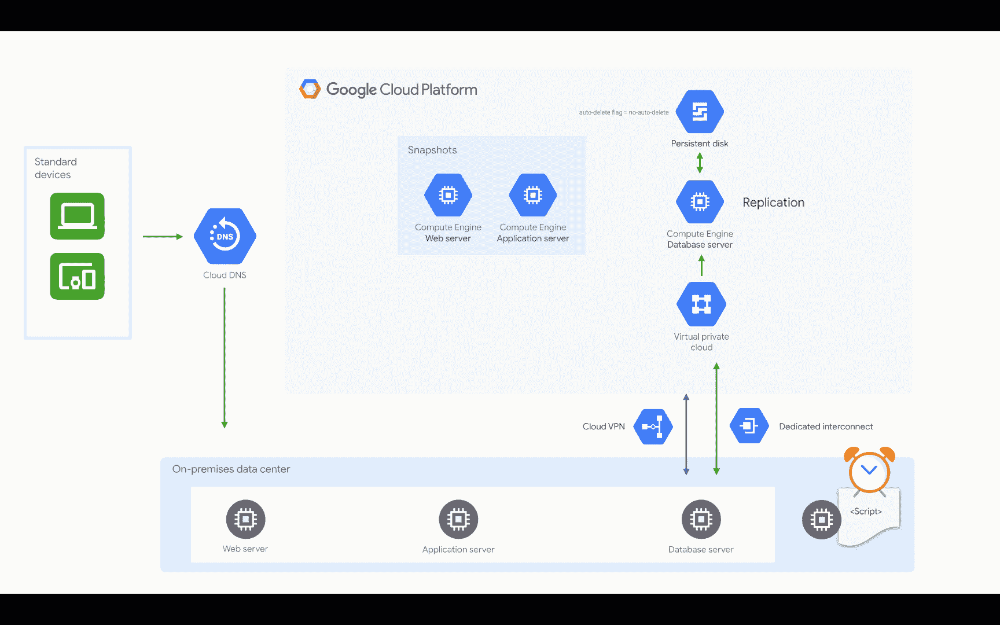
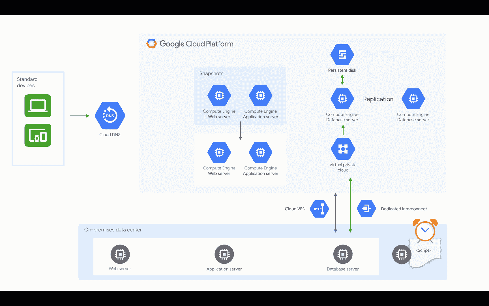

# 在 Google Cloud 上为内部运行的应用程序进行热灾难恢复

> 原文：<https://medium.com/google-cloud/warm-disaster-recovery-on-google-cloud-for-applications-running-on-premises-7428b0f7db72?source=collection_archive---------1----------------------->

## 在云中烹饪

# 介绍

***【在云端做饭】*** 是一个博客和视频系列，帮助企业和开发者在 Google Cloud 上构建商业解决方案。在这第二个迷你系列中，我将介绍 Google Cloud 上的灾难恢复。当你在网上的时候，灾难是很难处理的。在这一系列的博客中，我们将详细阐述如何应对地震、停电、洪水、火灾等灾害。如果你对之前的迷你系列感兴趣，请查看[的这个](/google-cloud/hosting-web-applications-on-google-cloud-an-overview-46f5605eb3a6)。

这是这个系列的计划。

1.  [灾难恢复概述](/google-cloud/hosting-web-applications-on-google-cloud-an-overview-87d0962931a3)
2.  [基于 Google Cloud 的本地应用冷灾难恢复](/@pvergadia/cold-disaster-recovery-on-google-cloud-for-applications-running-on-premises-114b31933d02)
3.  针对本地应用程序的 Google Cloud 上的热灾难恢复(本文)
4.  基于 Google Cloud 的内部应用热灾难恢复
5.  Google 云中应用程序的冷灾难恢复
6.  Google 云中应用程序的冷灾难恢复
7.  Google 云中应用程序的热灾难恢复
8.  Google 云中应用程序的热灾难恢复
9.  Google Cloud 上的数据灾难恢复:第 1 部分
10.  Google Cloud 上的数据灾难恢复:第 2 部分

在本文中，您将学习为部署在本地的应用程序设置一个**热灾难恢复模式**。所以，继续读下去吧！

# 你会学到什么

*   带示例的 Warm DR 模式
*   灾难来袭前需要采取的步骤
*   灾难发生时需要采取的步骤
*   灾难发生后需要采取的步骤

# 先决条件

*   谷歌云的基本概念和结构，这样你就可以识别产品的名称。
*   继续之前，请阅读[概述文章](/google-cloud/hosting-web-applications-on-google-cloud-an-overview-87d0962931a3)。

# 看看这个视频

# 让我们通过一个例子来学习 Warm DR 模式

在上一篇文章中，我们谈到了****Mane-street Art***在内部运行他们的应用程序，并在 Google Cloud 上构建灾难恢复基础架构。我们看到了他们如何建立冷灾难恢复计划。*

*自那以后，Mane-street Art 的情况发生了变化，他们现在需要设置热备用灾难恢复模式，以保持尽可能小的 RTO 和 RPO 值，而无需完全高可用性配置的工作量和费用。这意味着，为了应对灾难，他们需要一些内置的复制和冗余。*

**注意:如果您不熟悉这里使用的术语(RTO、RPO、灾难恢复模式),请查看之前的博客以获得概述。**

*在任何灾难恢复模式中，您都需要了解在灾难发生前需要采取什么步骤，灾难发生时会发生什么，以及灾难过去后需要发生什么。*

# *Warm DR 模式—它是如何工作的？*

## *灾难来袭前应采取的步骤*

**

*温暖的博士，灾难来临前应采取的步骤*

*   *创建一个 VPC 网络*
*   *配置内部网络和 Google Cloud 网络之间的连接*
*   *将本地服务器复制到计算引擎实例。*
*   *创建 web 和应用服务器实例的快照*
*   *然后在 Google cloud 上创建数据库服务器的自定义映像，使用与本地相同的**配置。***
*   *然后使用自定义映像在 google cloud 中启动一个数据库实例，并为数据库和事务日志将持久磁盘连接到该实例。*
*   *配置数据库服务器的复制。*
*   *将永久磁盘上的自动删除标志设置为 ***不自动删除*** 。我们这样做是为了我们的持久磁盘不会被无意中删除，因为那将是一场灾难*
*   *配置一个调度任务，为 Google cloud 上的数据库实例的持久磁盘创建定期快照*
*   *然后，通过创建 web 和应用服务器来测试从快照创建实例的过程*
*   *此外，创建一个脚本，每当相应的本地服务器更新时，该脚本会将更新复制到 web 应用程序和应用程序服务器。编写脚本来创建更新后的服务器的快照。*
*   *然后将云 DNS 配置为指向面向互联网的本地 web 服务。*

## *灾难来袭时应采取的措施*

**

*温暖博士，灾难来袭时应采取的步骤*

*   *当灾难发生时，所有街头艺术需要做的就是调整数据库服务器实例的大小，以处理生产负载。*
*   *使用 web 和应用服务器快照创建新的 web 和应用服务器实例*
*   *测试它是否一切正常*
*   *然后，最后，将云 DNS 指向他们在 Google Cloud 上的 web 服务*

## *灾难过去后应采取的步骤*

**

*温暖博士，灾难过去后要采取的步骤*

*当生产环境再次在本地运行并能够支持生产工作负载时，Mane-street art 必须逆转他们在故障切换期间遵循的步骤。通常是这样的:*

*   *备份运行在 Google cloud 上的数据库。*
*   *将备份文件复制并应用到生产环境中的数据库。*
*   *阻止连接到 Google Cloud 中的应用程序。*
*   *一种方法是通过修改防火墙规则来阻止与 web 服务器的连接。*
*   *从现在开始，在我们完成恢复生产环境之前，应用程序将不可用。*
*   *不要忘记将任何事务日志文件复制到生产环境中，并应用到生产环境中的数据库。*
*   *通过在生产环境中模拟用户场景，测试应用程序是否按预期工作。*
*   *将云 DNS 配置为指向本地 web 服务。*
*   *删除正在 Google Cloud 中运行的 web 服务器和应用服务器实例。让参考服务器保持运行。*
*   *将 Google cloud 上的数据库服务器的大小调整回最小实例大小，以接受来自本地生产数据库的复制数据。*
*   *按照特定数据库软件的说明，配置内部数据库服务器和 Google Cloud 中的数据库服务器之间的复制。*

# *结论*

*如果您正在内部运行应用程序，并且需要在不牺牲完全高可用性配置的情况下尽可能降低 RTO 和 RPO 值，那么**热灾难恢复模式**是一条不错的选择。我们学习了如何在热灾难恢复场景中从故障中恢复环境。敬请关注即将发布的文章，在这些文章中，您将了解如何建立更多对您的业务有意义的灾难恢复模式。*

# *后续步骤*

*   *在[谷歌云平台媒体](https://medium.com/google-cloud)上关注这个博客系列。*
*   *参考[灾难恢复解决方案](https://cloud.google.com/solutions/dr-scenarios-planning-guide)。*
*   *关注[获取云端烹饪](https://www.youtube.com/watch?v=pxp7uYUjH_M)视频系列，订阅谷歌云平台 YouTube 频道*
*   *想要更多的故事？查看我的[媒体](/@pvergadia/)，[在 twitter 上关注我](https://twitter.com/pvergadia)。*
*   *请和我们一起欣赏这部迷你剧，并了解更多类似的谷歌云解决方案:)*