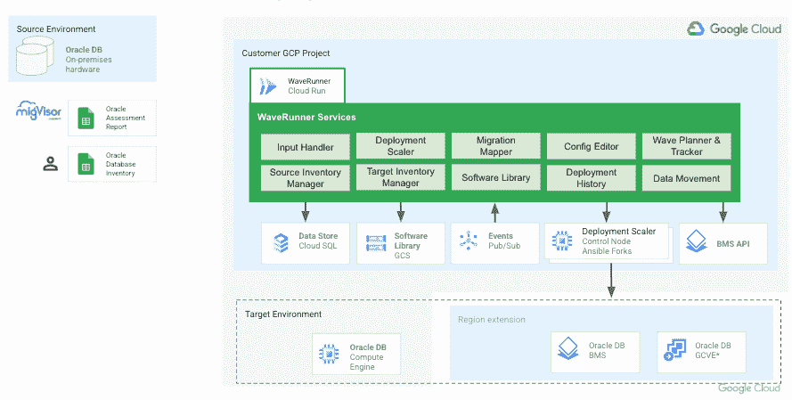
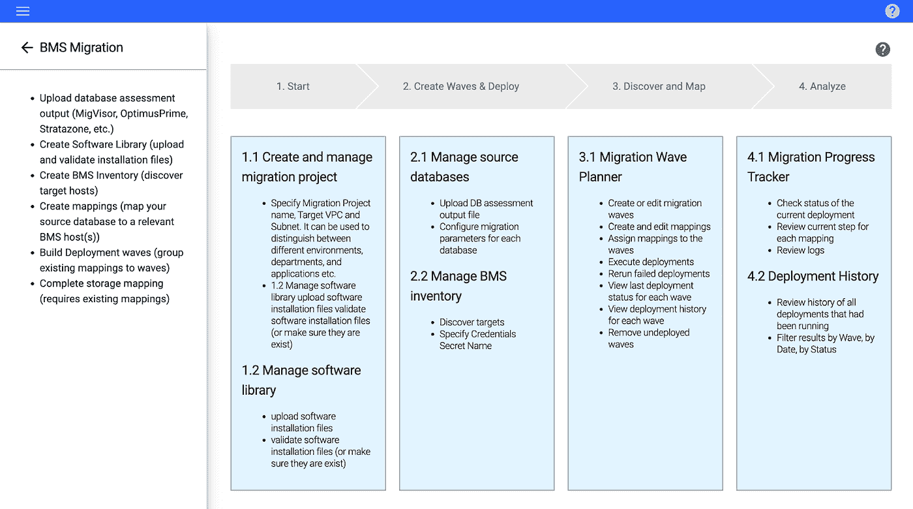

# Waverunner —大规模数据库迁移

> 原文：<https://medium.com/google-cloud/waverunner-data-migration-at-scale-58f909fa120d?source=collection_archive---------4----------------------->

介绍

Waverunner 是一个数据迁移框架，使企业客户能够以自动化、简单和及时的方式提升和转移 Oracle 工作负载。这是一个高度可扩展的部署框架，可以让他们的 Oracle 数据库更快地过渡到 Google Cloud。

Waverunner 提供:

*   Google 使用[裸机解决方案工具包](https://github.com/google/bms-toolkit)构建的标准化 Oracle 数据库迁移框架。
*   为每个 Oracle 迁移项目构建定制的解决方案
*   验证迁移成功的标准清单和验证步骤(数据库安装、配置、数据移动等)。)
*   与现有的[Google Cloud API](https://cloud.google.com/apis/)集成，实现许多步骤的自动化(如库存管理、状态跟踪等)。)

Waverunner 通过创建数据库清单、平台要求和技术设计来帮助构建迁移策略，并因此为基础架构供应和数据库迁移规划迁移浪潮。

下面让我们深入了解一下 Waverunner 的架构:

Waverunner 服务是该框架的核心，它:

*   支持与 MigVisor、Optimus Prime 和 Stratozone 集成，以获取数据库工作负载清单和配置。
*   查询 BMS 服务 API 并将目标部署服务器的详细信息加载到工具中
*   为管理参数更新提供用户友好的配置编辑器
*   支持将现有本地数据库映射到 Google Cloud 上的目标服务器
*   允许将映射的数据库分组到迁移波和调度中
*   生成可行的配置和清单文件、目标主机预检查、目标主机准备、软件安装
*   提供跟踪进度和接近实时的状态更新的能力

迁移路线图有 4 个阶段—创建和管理迁移项目、管理源和目标库存、迁移波规划器和迁移进度跟踪和分析—如下所示:

在[的 Waverunner Github 页面](https://github.com/GoogleCloudPlatform/database-migration-wave-orchestrator)中获得更多关于框架、代码库、组件和工件的细节。

如果你想了解更多关于 Wareunner 的信息，或者你对它感兴趣，请在下面的评论中告诉我。感谢阅读！！