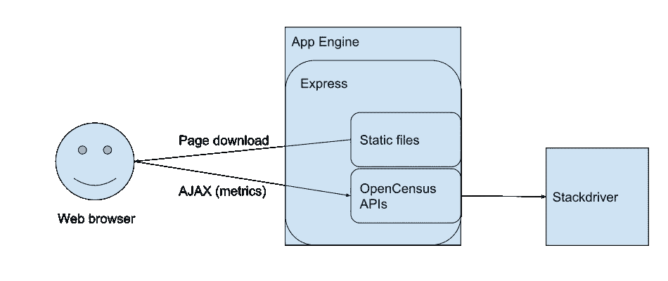
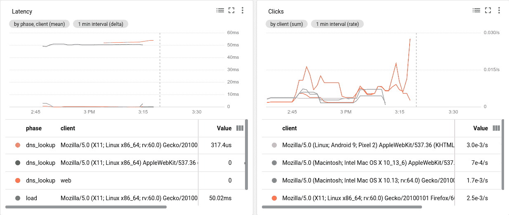

# 使用 OpenCensus 和 Stackdriver 的 Web 度量

> 原文：<https://medium.com/google-cloud/web-metrics-with-opencenus-and-stackdriver-525af8069ce6?source=collection_archive---------0----------------------->

# 介绍

这篇文章描述了一种接近实时地测量和理解 web 应用程序的用户所体验的应用程序健康的方法。它讨论了 OpenCensus Node.js 项目中使用 OpenCensus 和 Stackdriver 监控 web 指标的示例[，以及如何将其扩展到更复杂的 Web 应用程序。除了](https://github.com/census-instrumentation/opencensus-node/tree/master/examples/stats/web_client_monitoring) [OpenCensus](https://opencensus.io/) 项目库，示例解决方案还通过利用新的 JavaScript 功能来实现，这些功能是最近标准的一部分，包括 ES6 和 W3C 在 2017 年发布的[资源定时级别 1](https://www.w3.org/TR/resource-timing/) 候选推荐标准。该解决方案还展示了在 [Google 云平台](https://cloud.google.com/)上使用 Stackdriver 存储和可视化指标。同样的方法也适用于通过灵活的 OpenCensus [导出接口](https://opencensus.io/exporters/)监控来自其他云和开源系统的产品。

# **用例**

收集 web 应用程序的指标是 web 应用程序所有者了解性能、用户体验和用户参与度所必需的一项重要任务。有三种主要的用例以及三种相应的度量标准:

1.  业务的健康状况——由业务和用户参与度指标表示，如每日或每月的活跃用户数和“转化率”，可能是新注册或在线销售
2.  开发人员体验到的性能——在代码发布之前，开发人员从自己作为应用程序用户的角度出发，对延迟和资源使用数据的详细观察
3.  应用程序的运行状况—用户群经历的实时延迟，例如，不同地理位置的用户的资源加载时间，以及每分钟的错误和用户驱动事件的总数

第三个用例是本文的重点。

第一个用例的现有完全托管解决方案的例子包括 [Google Analytics](https://analytics.google.com) 和 [Google Marketing Platform](https://marketingplatform.google.com/about/) ，它们包括非常强大的业务指标分析功能。第二个用例由 Chrome 开发者工具等工具解决。此处描述的第三种使用情形的方法能够近乎实时地完全控制用户群体的指标数据的收集、存储、呈现和分析。例如，当检测到客户端错误增加或延迟增加时，您可以通过[stack driver Alerts](https://cloud.google.com/monitoring/alerts/)向 SRE 系统可靠性工程人员发出警报。

OpenCensus ，一个多语言跟踪和监控指标收集框架，是这里描述的解决方案的核心。该解决方案在客户机和服务器上都使用现代 JavaScript ( [ES6](http://www.ecma-international.org/ecma-262/6.0/index.html) )来检测、收集和保存 Stackdrvier 中的 web 指标，在 stack drvier 中可以查看持续更新的仪表板。选择 JavaScript 是因为 Node.js 在 web 应用程序开发人员中很受欢迎。除了作为服务器使用之外，Node.js 已经成为部署客户端应用程序框架(如 Angular 和 React)和用户界面组件库(如 [Material Web](https://material.io/develop/web/) )的核心。

如果这一切看起来对你的应用程序来说是多余的，你可能想要尝试一个正常运行时间服务，比如[stack driver uptime alerts](https://cloud.google.com/monitoring/uptime-checks/)。

# 体系结构

在示例中，服务器运行 [Express](https://expressjs.com/) ，并且可以部署到 [App Engine Flex](https://cloud.google.com/appengine/docs/flexible/) 或任何其他支持 Express 的地方。OpenCensus APIs 还可以用于其他计算环境，包括其他云，以及 Stackdriver 之外的监控后端。示例代码使用了 [@opencensus/core](https://www.npmjs.com/package/@opencensus/core) 和[@ open census/exporter-stack driver](https://www.npmjs.com/package/@opencensus/exporter-stackdriver)node . js 模块。

本例中采用的另一种方法是直接从 web 浏览器调用 OpenCensus，跳过后端，这是一个需要管理的额外资源。您确实可以在 web 客户端中从 JavaScript 进行 GCP API 调用，就像这个针对 BigQuery 的[示例一样。然而，为了做到这一点，您将需要使用一个 API 密钥和用户凭证来通过](https://developers.google.com/api-client-library/javascript/samples/samples) [OAuth 2.0 流程](https://developers.google.com/api-client-library/javascript/features/authentication)。这是一种破坏性的用户体验，如果将数据保存到 Stackdriver，对于没有谷歌账户的用户来说根本不可能。因此，这种方法被排除了。

web 应用程序健康状况的另一个衡量标准是 HTTP 响应代码计数和服务器延迟的服务器端图表，例如 App Engine 提供的现成图表。但是，如果出现网络问题，您的用户可能无法访问您的服务器，尽管事实上它是健康的。因此，衡量用户群体的体验非常重要。

收集 HTML 相关的性能指标是另一个受益于 JavaScript 新发展的领域，特别是 2017 年发布的 W3C 的[资源定时](https://www.w3.org/TR/resource-timing/)候选建议和 2018 年发布的[导航定时级别 2](https://www.w3.org/TR/resource-timing/) 。资源计时接口显示了 DNS 查找时间、TLS 协商和总页面下载时间等指标，这些指标在以前的 JavaScript 中很难或不可能测量。

该解决方案的主要组件示意图如下所示。



**架构示意图**

# **运行示例**

运行该示例的代码和详细说明在 [GitHub README.md](https://github.com/census-instrumentation/opencensus-node/tree/master/examples/stats/web_client_monitoring) 中。部署后，应用程序显示如下所示的非常简单的 web 页面。


**示例网页截图**

当用户点击“刷新”按钮时，加载页面的计时语句和“点击我”按钮的点击次数被记录并发送给服务器。重新加载页面会刷新加载指标，并将点击计数清零。

部署应用程序后，尝试单击计数器按钮并保存指标几次。然后转到 Stackdriver 控制台并创建图表。传播指标数据可能需要几分钟时间。在 Stackdriver 菜单中，单击仪表板|创建仪表板。然后在新仪表板中单击添加图表。选择下面截图中显示的选项。


**在 Stackdriver 中向仪表板添加图表**

如果您键入指标名称的一部分，那么 Stackdriver 将帮助您提前键入。选择资源类型:全局，度量:网络度量/延迟，分组依据:阶段，客户端。为 webmetrics/click_count 创建另一个图表。创建仪表板后，您应该会看到类似下面的截图。


**stack driver 仪表盘截图**

请注意，DNS 查找时间和 TLS 连接时间的值大多为零。这本身就是一条重要的信息。当浏览器使用与域名匹配的缓存 IP 地址时，DNS 查找时间为零。如果浏览器已经与服务器建立了连接，或者使用的协议是 [QUIC](https://en.wikipedia.org/wiki/QUIC) ，则 TLS 连接时间可能为零。App Engine 和其他 Google 服务支持 QUIC，这是一种基于 UDP 的协议，数据通常可以立即发送到客户端。如果您尝试使用各种设备和浏览器，您应该会得到几个非零的 DNS 查找和 TLS 连接时间值。

# 按类别分解网络指标

该示例使用 OpenCensus [标签](https://opencensus.io/tag/)来提供上下文信息和组相关指标。延迟指标使用“阶段”标签，代表 HTTPS 请求的不同阶段:DNS 查找、TLS 连接建立和有效负载传输。“client”标记是发送信息的客户端类型的占位符。例如，移动客户端与 web 客户端。或者，我们可以为客户机使用浏览器用户代理，它可以用 [Express Request](https://expressjs.com/en/api.html#req.get) 对象来检索。例如，更换线路

```
const valueWeb = "web";
```

在 app.js 中

```
const valueWeb = req.header("User-Agent");
```

修改代码后，仪表板看起来像下面的屏幕截图。



**按用户代理细分的屏幕截图**

我们现在看到的一个小问题是，不同的浏览器有复杂的用户代理字符串。以更简单的形式查看不同的浏览器类型和操作系统会更令人愉快。用一些字符串解析代码提取不同的浏览器类型和操作系统，这不会太难。

由于互联网服务水平因地区而异，我们可能还希望按地理位置细分性能和用户参与度指标。此外，这将有助于识别本地网络中断的区域，例如数据包丢失。App Engine 和 Google Cloud Load Balancer (GCLB)提供了[额外的 HTTP 头](https://cloud.google.com/appengine/docs/standard/nodejs/reference/request-response-headers#app_engine-specific_headers)，允许你根据国家、地区和城市找到用户的地理位置。可以使用 OpenCensus 标记在 Stackdriver 中添加分组信息。

您可能还想研究其他属性，例如有效负载大小、协议(HTTP、HTTPS、HTTP/2 或 QUIC)和网络类型，其中每一项都会对延迟产生很大影响。可以从浏览器 JavaScript 属性 performance resource timing . transfer size 中找到有效负载大小。如果使用带有[用户定义头](https://cloud.google.com/load-balancing/docs/backend-service#user-defined-request-headers)的谷歌云负载平衡器，可以找到协议信息。tls_version 头包括 tls 版本或 QUIC(如果使用的话)。实验浏览器 JavaScript[navigator . connection](https://developer.mozilla.org/en-US/docs/Web/API/Navigator/connection)属性返回一个 [NetworkInformation](https://developer.mozilla.org/en-US/docs/Web/API/NetworkInformation) 对象，该对象给出网络类型，如“蜂窝”、“wifi”和“以太网”

错误计数是另一个需要记录的重要指标。具体来说，在检索 XMLHTTPRequests 的资源时出现 HTTP 错误，在浏览器 JavaScript 执行时出现错误。错误计数的突然增加表明应用程序健康问题需要立即关注。

# 扩展到更复杂的 Web 应用程序

示例 web 页面类似于用普通 HTML 或服务器端框架编写的网站，这些框架生成 HTML 页面，如 Java Server Pages、Python with Django 或 Go HTML 模板。在这些常规(多页面)web 应用程序中获取更多用户指标的一种方法是使用一个将返回多个 DOM 元素的 DOM 选择器。

示例代码使用 Fetch API 在 HTTP POST 中发回分析数据。然而，使用[navigator . send beacon()](https://developer.mozilla.org/en-US/docs/Web/API/Navigator/sendBeacon)API 可能更合适，它专门用于向服务器发送少量的分析数据。这可以避免文件卸载中的潜在问题。请注意，并非所有浏览器都支持 sendBeacon。

由于生成的 DOM 的动态特性，使用像 [AngularJS](https://angular.io/) 、React 或 Vue.js 这样的框架的单页面应用程序(spa)可能需要稍微不同的方法。对于 SPA，单个 HTML 页面将只加载一次。在 SPAs 中，通过 XMLHttpRequest (AJAX)与服务器之间传输的数据可以改变显示给用户的视图。在这种情况下，应该记录的相关指标是 XMLHttpRequest 调用的延迟。XMLHttpRequest 延迟也是在资源计时 API 中捕获的，因此相同的基本方法仍然适用。您可能希望定期将数据刷新到服务器，以便一旦出现问题就可以触发警报。

Web Fundamentals 文章[以用户为中心的性能指标](https://developers.google.com/web/fundamentals/performance/user-centric-performance-metrics)和[使用导航和资源计时评估现实生活中的加载性能](https://developers.google.com/web/fundamentals/performance/navigation-and-resource-timing/)以及 Mozilla Developer Connection 文章[使用资源计时 API](https://developer.mozilla.org/en-US/docs/Web/API/Resource_Timing_API/Using_the_Resource_Timing_API) 给出了浏览器 JavaScript 编码这些方面的更多细节。