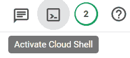
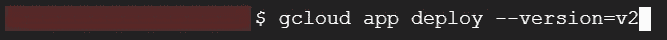

# 应用引擎的网站部署

> 原文：<https://medium.com/google-cloud/website-deployment-to-app-engine-39a62da83a74?source=collection_archive---------4----------------------->


如果你是一个组织，希望更多地关注他们的应用程序逻辑，而不是管理端到端的基础设施，或者如果你是一个云初学者，但希望以最少的努力在云中托管你的应用程序，我认为 PAAS 是你可以利用的云中最好的产品模型之一。

在这篇博客中，我们将看到来自谷歌云的 PAAS 产品，即应用引擎。

## 什么是 [App 引擎](https://cloud.google.com/appengine/?utm_source=google&utm_medium=cpc&utm_campaign=japac-IN-all-en-dr-bkwsrmkt-all-super-trial-e-dr-1009882&utm_content=text-ad-none-none-DEV_c-CRE_504957113469-ADGP_Hybrid%20%7C%20BKWS%20-%20EXA%20%7C%20Txt%20~%20Compute%20~%20App%20Engine_app%20engine-KWID_43700037527390353-aud-1644542956068%3Akwd-11351923229&userloc_9301021-network_g&utm_term=KW_app%20engine&gclid=Cj0KCQjw4omaBhDqARIsADXULuWle8juG-HaNVmgd041UMmMf6Bj74Fphci1zzMB08hkLa10agDn9TgaAh2hEALw_wcB&gclsrc=aw.ds)？

一个 pp 引擎是一个由 GCP 提供的无服务器服务，是一个 PAAS 服务。您所需要的只是您的应用程序代码和一个 app.yaml 文件以及一个计费帐户。

GCP 在 2008 年推出了 App Engine，每个项目只能部署一次，但可以创建多个版本。此外，该服务有两种模式:灵活模式和标准模式。基本上，灵活类型允许用户获得与任何语言交互的应用引擎，而在标准类型中，你可以选择你的应用程序基于哪种语言，如 **Node.js、Java、Ruby、C#、Go、Python 或 PHP。**

如果你想要我的网站内容，那么点击[这里](https://github.com/guys-in-the-cloud/google-cloud-sample-projects/tree/main/compute%20offering%20projects/app-engine-projects)。那么我们就从如何在 app engine 上部署你的网站或者应用开始吧。


# 先决条件

1.  你应该带着你的网站。如果你没有任何网站，这里是我的样本网站的链接([点击这里](https://github.com/guys-in-the-cloud/google-cloud-sample-projects/tree/main/compute%20offering%20projects/app-engine-projects))。
2.  应该有一个激活计费的 GCP 帐户。

# **注**

1.  请记住，应用引擎在 GCP 项目中只能部署一次，因此请确保您有一个新项目，或者没有覆盖其他人的项目。
2.  我还没有在我的静态网站上使用任何 Python 代码。只使用基本的 HTML 和 CSS。要仅运行 HTML 和 CSS，您可以在应用程序引擎中选择任何语言类型。
3.  标准型 App 引擎仅支持 Python 2.7 及以上版本。

# **步骤总结**

*   制作您的网站/网络应用程序(先决条件)。
*   为网站或 web 应用程序创建 app.yaml
*   使应用程序引擎可访问。
*   网站或网络应用部署。
*   正在验证部署。
*   附加功能:版本控制，分流流量。

# 如何创建一个 app.yaml？

我来解释一下我静态网站的 app.yaml 文件([链接](https://github.com/guys-in-the-cloud/google-cloud-sample-projects/blob/main/compute%20offering%20projects/app-engine-projects/app.yaml))。

**运行时** —这是你指定你正在使用的语言版本的地方。

**api_version —** 是网站环境的版本；目前，应用程序引擎使用 Python 环境版本 1。

[**thread safe**](https://discuss.python.org/t/what-is-thread-safety-as-applied-to-python/13685/4)—考虑到你有复杂的代码，2 个变量将在第 3 个变量上实现它的输出，因此你的下一个完整代码可能无法阻止这个 python 有这个 threadsafe inbult，而且它只适用于 python 2.7 或更高版本。

**处理程序—** 在这里，你必须提到你的代码应该运行的方式。

**url —** 您可以在这里给出您要浏览的目录的位置。

**static _ files**—这是告诉应用引擎我的 index.html 是一个静态文件。

**上传**—app engine 不知道哪个静态文件是你的主文件，所以 upload 命令帮助他识别哪个是你的主静态文件。

**static_dir** —这表明 RedLotus 是包含我的静态文件的文件夹。

点击[这里](https://cloud.google.com/appengine/docs/legacy/standard/php/config/appref)了解更多关于这些类型的命令。

# **步骤**

1.确保你在正确的项目上。我正在创建一个名为**“App Engine”**的新项目(如果你不知道如何创建项目，点击[这里](https://cloud.google.com/resource-manager/docs/creating-managing-projects))。


2.在这里，您应该已经选择了正确的项目。

3.在**无服务器**下的**导航菜单**中，进入 **App 引擎**。


4.这里你会得到这样一条信息:


5.选择**“创建应用”**，你会看到这个。


6.选择您希望您的应用程序工作的地区，但在这里，我将选择**美国中部**，然后单击**“下一步”**。


7.在这里，您应该选择网站使用的语言类型。现在在我们上传我们的网站之前有一件事要检查。转到左侧面板中的**“设置”**。


8.这里应该显示**“禁用应用程序”。**如果它显示已启用的应用程序，则启用它。现在我们将激活云壳，所以点击这里。



9.你会看到一个这样的终端。


10.现在**打开编辑**这里。


11.等到它完全加载完毕。在这之后，你会看到这个。


12.现在把你的文件拖到这个区块。


13.它会被上传。


14.如果它不能传输所有文件，就再试一次，如果你想要我的网页文件，点击[这里](https://github.com/guys-in-the-cloud/google-cloud-sample-projects/tree/main/compute%20offering%20projects/app-engine-projects)。

15.App.yaml 文件是 App 引擎工作的必备文件，现在点击**“打开终端”**。


16.你会回到终点站。


17.添加此命令并授权提示。

```
**gcloud auth list**
```


18.你会得到这样的输出。


19.让我们部署我们的应用程序。

```
**gcloud app deploy**
```


20.输入**“y”**继续。文件将被上传到应用程序引擎，1/2 分钟后，它会给你一个这样的链接。


21.现在，您可以在全球范围内使用该链接。让我们在浏览器中检查该链接。


22.要创建第二个版本，请点击**“打开编辑器”**，对您的代码进行更改，然后点击**“全部保存”**。


23.现在**“打开终端”**再次输入，

```
**gcloud app deploy — version=<version name>**
```

例子，



24.如果要求您输入 y/n，请输入 y 并继续。您的 v2 应用程序现已上线，这可以从**应用引擎→版本**中看出。


25.所以你现在有两个版本可以在它们之间传输流量，点击**“分流”，**


26.你会看到这个，


27.在这里，您可以选择要分成哪种类型的流量。我为版本 1 选择了**“随机”**和，选择您的第一个版本并点击**“添加版本”**第二个版本，选择第二个版本，随心所欲拆分流量。


it 和您应该能够处理您的应用程序的部署、版本和流量。

恭喜你，你的网站已经开通了！！！

如果需要帮助，可以在评论区问我，或者通过 [LinkedIn](https://www.linkedin.com/in/siddhesh-patil-1b56ab134) 联系我。