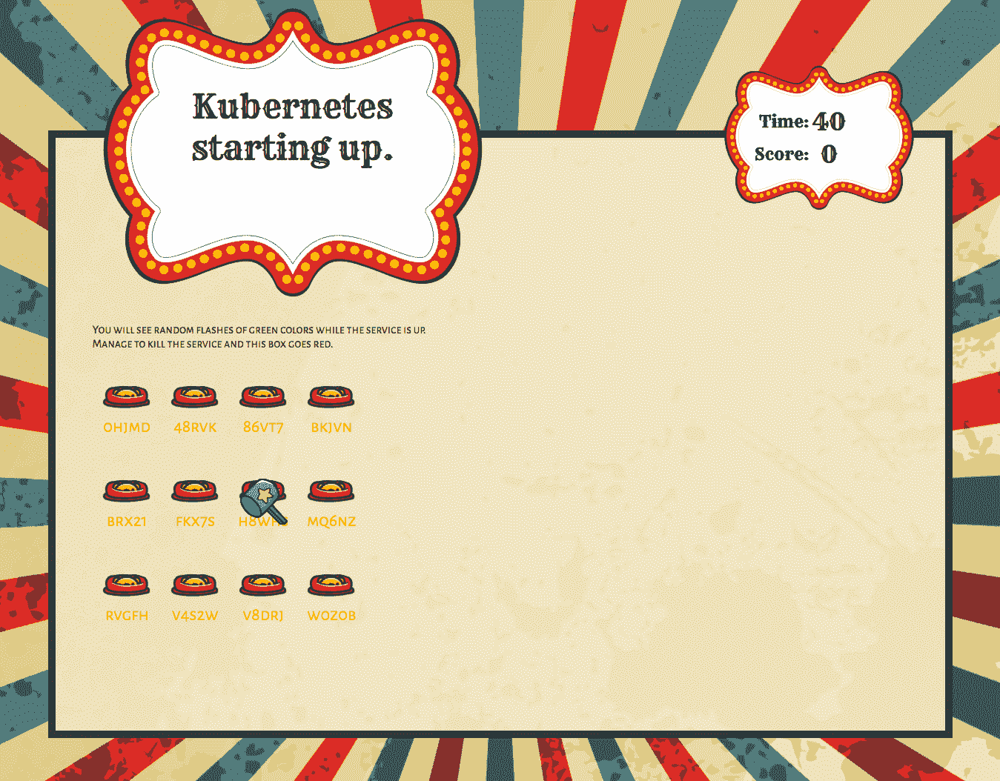
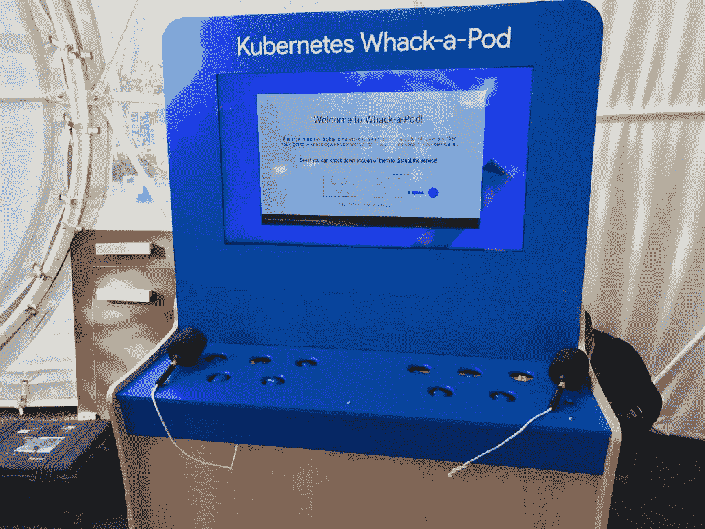
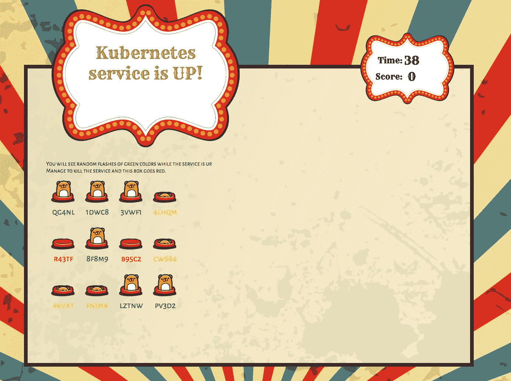
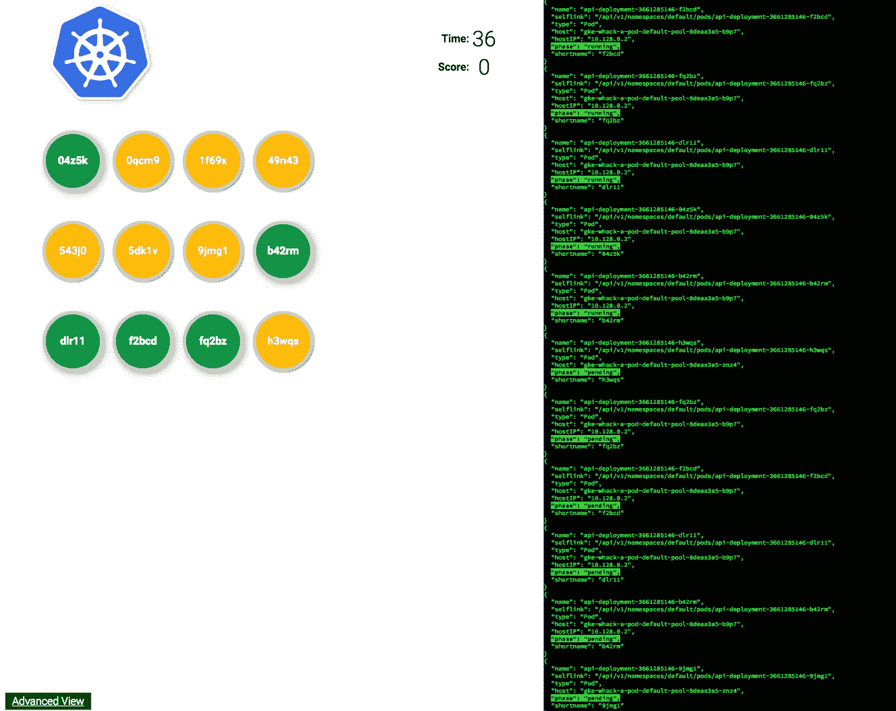
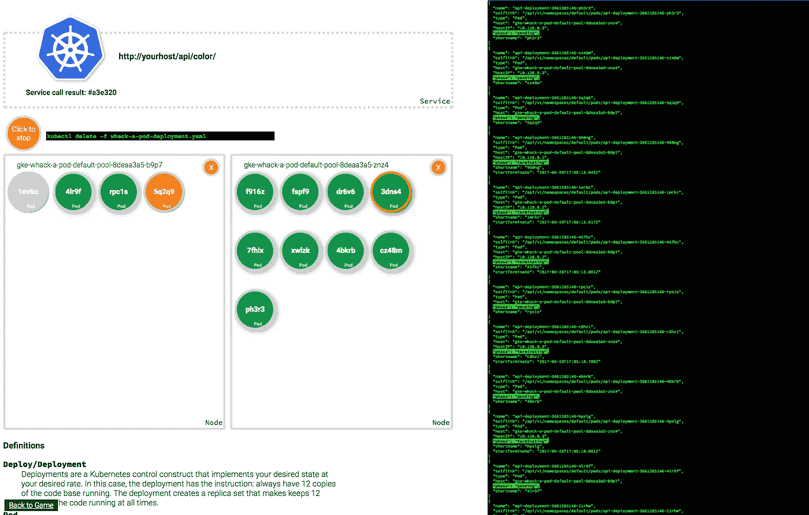

# 打地鼠:Kubernetes 集群打地鼠游戏

> 原文：<https://medium.com/google-cloud/whack-a-pod-359cbfb61662?source=collection_archive---------0----------------------->

本周早些时候，我发布了一个开源版本的“敲打一个豆荚”，这是一个演示，我在谷歌云的团队已经在[谷歌云 Next](https://cloudnext.withgoogle.com/) 、[谷歌 I/O](https://events.google.com/io/) 和各种地区活动中使用过。对于那些没有看过演示的人来说，它将一个 Kubernetes 集群变成了一个打地鼠游戏，其中 Kubernetes pods 是鼹鼠，并且您试图打倒足够多的 pod/鼹鼠来中断这些 pod/鼹鼠提供的服务。

我们在活动中使用的版本包括一个物理打地鼠机器，它连接到我们的游戏，所以你可以通过挥动锤子实际上杀死 Kubernetes 豆荚。物理钻机上的工作由 [Sparks](http://www.sparksonline.com/) 完成，不包括在本报告中。但是，您可以在任何地方运行这个版本，只需要最低的硬件要求——一个屏幕和一个界面，基于触摸屏或鼠标。

# 为什么要建？

我想要一种简单有趣的方式来解释 Kubernetes。我想要一个可以连接到真实事物上的东西，让你可以触摸云中的东西。我想让大家明白 Kubernetes 是有弹性的。

我还想制作一系列基于嘉年华的游戏，所有的游戏都和嘉年华版的 wha-a-pod 具有相同的外观和感觉。他们因过于异想天开而被拒绝。但那是后话了。

# 它是如何工作的？

整个应用程序由三个独立的应用程序组成，它们都托管在同一个 Kubernetes 集群上。我们还创建了三个服务来公开应用程序。

## 应用程序接口

这就是摩尔代表的应用。我们启动了一个部署，该部署创建了一个副本集，其中包含保持 12 个副本始终运行的指令。

[**http://【API-service】/API/color**](http://[api-service]/api/color)

这是圆荚体保持的基本服务。它非常简单——当轮询时，它返回一个随机的十六进制颜色值。

[**http://[API-service]/API/color-complete**](http://[api-service]/api/color-complete)

这是上面的颜色 api 的一个稍微调整的版本，用于高级界面。除了颜色之外，它还返回响应请求的 pod 的唯一的 Kubernetes 生成的名称。

## 管理

这是一组命令，允许我们的前端针对 Kubernetes 集群发出命令，而不需要凭证。它基本上是 Kubernetes API 的代理，具有一组有限的可能操作。

[**http://【管理服务】/api/k8s/createdeploy**](http://[admin-service]/api/k8s/createdeploy)

为运行提供 API 应用程序的 pod 创建部署。启动时在所有界面中使用。

[**http://【管理服务】/api/k8s/deleteallpods**](http://[admin-service]/api/k8s/deleteallpods)

删除 API 部署的所有窗格。

[**http://[admin-service]/API/k8s/delete deploy**](http://[admin-service]/api/k8s/deletedeploy)

删除 API 应用程序的部署。当游戏完成部署时，在所有界面中使用

[**http://[admin-service]/API/k8s/delete pod**](http://[admin-service]/api/k8s/deletepod)

删除单个 pod。当你重击一个豆荚的时候在所有的界面中使用。

[**http://[admin-service]/API/k8s/drain**](http://[admin-service]/api/k8s/drain)

封锁一个节点以防止任何 pod 在其上被调度，然后它杀死所有正在该节点上运行的 API pods。用于高级界面。

[**http://【管理服务】/api/k8s/getnodes**](http://[admin-service]/api/k8s/getnodes)

获取有关 Kubernetes 群集节点的信息。用于高级界面。

[**http://[admin-service]/API/k8s/get pods**](http://[admin-service]/api/k8s/getpods)

获取有关运行 API 服务的所有 pod 的信息。在所有界面中用于填充 pod/moles 列表。

[**http://[admin-service]/API/k8s/un cordon**](http://[admin-service]/api/k8s/uncordon)

重置一个节点，以便它可以开始接受新计划的单元。用于高级界面。

## 比赛

这个游戏由几个独立的 HTML/JS/CSS 应用程序组合而成。它们都以相同的方式工作。

演示开始时没有 pod 运行。每个版本都会提示您部署吊舱。部署会创建一个运行 12 个单元的副本集。

UI 定期轮询 API/颜色服务。如果它得到一个结果，服务就启动，如果它没有得到一个结果，服务就关闭。顶部有一个指示器，给玩家服务状态的反馈。

pod 显示在网格中，它们的状态由颜色差异(或摩尔位置差异)表示。状态包括:开始、运行、终止。起始和终止的 pod 不能被“重击”当你敲击一个正在运行的 pod 时，UI 调用 admin/api/k8s/deletepod/。pod 在终止后会保留一段时间，并被处于启动状态的 pod 所取代。

[**http://【游戏-服务】/**/](http://[game-service]/)

这是基本的游戏。它有一个有趣的嘉年华主题，旨在成为一个有趣的，分散注意力的游戏，而不是一个关于 Kubernetes 的真实课程。

[http://[游戏-服务]/next . html](http://[game-service]/next.html)

这是基本游戏，但没有嘉年华主题。这更符合谷歌云下一次活动的品牌。我们已经在一些地区性的云 Next 活动中在触摸屏上使用了这个版本。

它还有一个面板，显示 Kubernetes 命令的 JSON 响应的节略版本。为什么删节？因为 Kubernetes 的大部分单个回复都是超过 100 行的格式化 JSON。相反，该应用程序显示的是突出的细节。

[**http://【游戏-服务】/advanced.html**](http://[game-service]/advanced.html)

当在各种活动中展示演示时，我们发现自己希望在对话开始深入时获得另一种信息。高级视图是对此的回应。它去掉了时间元素，而是在 pod 填充集群节点时显示它们，而不是在固定的网格中显示。我们直接显示服务响应。我们还展示了哪个 pod 实际上正在响应服务请求。该界面包括排空集群节点的功能，以模拟节点停机。杀死一个实际的节点需要更长的时间，所以这似乎是模拟节点死亡的合理方式。

# 选择

## 为什么是三种服务？

我最初把它写成一个应用程序。当你关闭了所有的 pod，中断了服务，你也就关闭了用户界面。当您运行演示时，这与不一致的缓存行为相结合导致了非常奇怪的问题。把它们分开更有意义，这样在你玩游戏的时候就不会破坏游戏。

## 为什么选择 PHP？

首先，我为 Google Cloud 向 PHP 社区推广。但我也开始写这个快速和肮脏的原型。当我想快速完成某件事时，我会用 PHP 来写。这对我很有帮助。我使用了 App Engine flexible environment 的 PHP 运行时的 Docker 映像来让它工作。

当到了收紧一切的时候，我考虑重写所有的 API 来使用 Golang。但是选择 PHP 和 GAE 灵活运行时的一个副作用是启动服务有一点开销——与编写一个只做一件事的精益 go 应用程序相反。这种开销只有几秒钟，但有了它，演示就可以展示 pod 的整个生命周期。

## 为什么没有公开演示？

我还没有想出一种方法将这个演示转换成多租户演示。因此，它是一个 Kubernetes 集群的前端客户端。所以多个玩家会互相干扰。目前，它涉及到试图关闭一个与特定 IP 直接相关的服务。我肯定有办法重写它来做到这一点，我只是没有时间去做。

# 我学到了什么

## Kubectl 太棒了

在很多情况下，我只是试图重新创建一个 kubectl 命令来绑定到前端。具体的例子有 kubectl 删除部署和 kubectl 排出。在这两种情况下，它们实际上做了很多工作，但是隐藏在一个命令后面。在 kubectl delete deployment 的例子中，命令是删除部署，然后是副本集，然后是每个 pod，使之成为一件事。如果您只是通过 API 删除部署，那么所有的子节点都会保留下来——如果您没有预料到，您会感到困惑。

kubectl 可以用一个标志来调用，以揭示这些底层调用，这一点非常值得赞赏。标志是"-v=8 "，以防你需要。

## Kubernetes 是一个 weeble 而不是一个堡垒

我认为这是我学到的最令人惊讶的事情之一。我没有刻意让系统变得超级有弹性或超级脆弱，但是在大多数情况下，如果您能够直接删除所有的 pod，您可能会导致您的服务出现重大中断。但是，这些中断很少会持续很长时间。事实上，在 Google I/O，我们跟踪了人们关闭服务的时间，我们看到最多的是 50%的停机时间。这是两个非常积极的人在鼹鼠一出现时就打它们。大部分时间我们看到市中心不到 30%。再次提醒，记住游戏机制的要点是尽可能多地造成停机。

## 一个死了的豆荚只是大部分死了

在一些事件中，我们遇到了这样的问题:没有一个可见的 pod 处于“运行”状态，但是服务仍然在运行。我以为是因为 UI 怪异。原来这是由于运行 Kubernetes delete pod 命令将 pod 标记为“终止”,然后允许正常终止。因此，如果请求被路由到它们，而它们仍然在响应请求，它们仍然可以返回结果，即使标记为终止。如果我费心稍微仔细地阅读一下文档的话，我早就知道了。

## 当鼹鼠倒下时，打地鼠机器休息

当鼹鼠向上时，机器在工作，当他们向下时，机器在休息。当 Sparks 第一次将物理打地鼠机器连接到 Kubernetes 集群时(实际上，一个在我们的数据中心，另一个在活动现场)，鼹鼠一直在工作，因为，嗯，这就是 Kubernetes 所做的。长话短说，我们的第一台打地鼠机器烧坏了，因为当 21 世纪的云技术与 20 世纪 70 年代的街机技术发生碰撞时，云技术获胜。

# 结论

这是一个非常有趣的项目。它帮助我了解了很多关于 Kubernetes 的知识，同时也让我有了一次很好的关于 Kubernetes 的教育经历。另外，我让人造了一个打地鼠机器。太棒了。

[在 github 上获取源码](https://github.com/tpryan/whack_a_pod)。