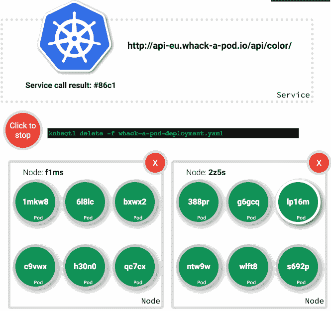

# 重击一个 Pod 更新

> 原文：<https://medium.com/google-cloud/whack-a-pod-update-c4fa33c84cf1?source=collection_archive---------0----------------------->

一些人问我关于在 Minikube 上运行 what-a-Pod 的问题。为了做到这一点，我需要对项目的各个部分进行一些修改。实际上，what-a-Pod 假设您可以访问容器引擎、容器构建器和容器注册表。我认为你需要很多这些功能来运行它，我知道我不能指望 Minikube 的所有功能。所以事情必须改变。但是当我改变它的时候，我抓住机会做了一些调整…

# 变化 1:消除 YAML 文件

所有的配置都存储在 YAML 的文件中。这无疑使 kubectl 更容易处理，因为您不必学习它的所有排列。你只需要记住 kubectl apply -f 文件名。这很好，但它导致了一种情况，在这种情况下，为了处理可变的项目设置，我让用户在设置过程中动态地创建大量的 yaml 文件，而不是直接用 kubectl 命令使用变量。

除此之外，我还管理几个不同的集群。在集群之间切换意味着我每次都必须重新创建配置。如果我忘了做，我就搞砸了其他集群。将配置从 yaml 文件移动到从 Makefile 调用的 kubectl 命令中的设置，使我能够利用 Makefile 中的变量，而不是重新构建 yaml 文件。

这一变化消除了大量 Makefile 代码和 yaml。这导致较少的系统更改泄漏到代码库中，然后需要更新到映像中，然后推送到容器
注册表中。但不是全部——我仍然在基于我正在创建的各种服务端点创建一个 JavaScript 配置文件，并且每次我推送到不同的集群时，js 文件都需要更新、烘焙成一个映像并推送到容器注册表。

# 变化 2:从服务负载平衡器切换到入口

在演示亭运行后，我根据收到的反馈添加到 what-a-Pod 的一个功能是展示一些管道内部结构，以促进关于 Kubernetes 的更深入的对话。我制作了一个高级视图，展示了底层节点，增加了杀死和复活节点的能力(实际上是*警戒线*和*非警戒线*，因为杀死节点相对于游戏长度来说需要很长时间来重建)，并包括一种方法来显示我们的哪个 pod 实际上在服务请求。有一件事立刻变得很明显，那就是我不明白事情是如何进行的。我期望应答 pod 到处反弹，但是它没有——它一直粘在最后一个应答请求的 pod 上。

在进入之前重击一个荚荚行为

一天，凯尔西·海托华在办公室，我问他这件事。正如凯尔西所做的那样，他给了我一个经过深思熟虑的非常技术性的解释，解释了为什么会发生这种情况，并给出了一个处方:**切换到入口**。我能抓住第二部分。

[在容器引擎](https://cloud.google.com/container-engine/docs/tutorials/http-balancer)上切换到入口实际上非常容易。这是容器引擎大放异彩的地方之一，为您的集群做系统工作非常简单。

1.  将服务从负载平衡器更改为节点端口
2.  为入口请求一个全局 IP 作为其公共 IP。
3.  在 Kubernetes 上创建一个入口资源，将服务指向路径。

让我的容器端口、服务端口、节点端口和入口端口以及容器路径对齐有点困难。主要是因为我在容器上使用端口 8080 并输出到 80，但文档一直是 80。事情很相似，足以给我带来问题。但是经过一点点的试错(和 RTFM)，我让它运行起来了。这有两大优势:

1.  我可以在同一个主机上服务所有的服务，这意味着我不再需要像上面提到的那样将 JavaScript 配置放入图像中——一切都可以在 UI 中用相对路径来处理。
2.  答案框的行为改变了，正如我所料，它在所有的框中跳动。

进入后重击一个荚荚行为

这有一个缺点，它在设置中添加了一个 yaml 文件，因为除了 kubectl apply 之外，Ingress 不能通过直接的 kubectl 选项获得。为它给我买的东西付出的小小代价。

# 变化 3:使容器规范化

切换到 Ingress 有一个额外的好处，就是让容器更少地根据它们运行的项目进行定制。拥有一台主机意味着前端的所有 API 调用都可以指向/path，而不是 hostname/path。这反过来意味着游戏容器中不再有定制的 JavaScript。事实上，每个项目定制的所有容器中只有一个文件:/apps/admin/containers/deployment . JSON。定制位将它指向正确的 Docker 存储库——在我的例子中，是在 Google 容器注册表中。我将它改为一个在部署过程中注入的 env 变量。这要容易得多，因为我已经用 kubectl 命令而不是 yaml 完成了整个工作。现在容器是规范的——如果你愿意，你可以通过从我的容器图片中提取来运行 what-a-Pod。不要——你不应该相信我和我的 Docker 图片。但是如果你想的话你可以。

# 变化 4:收缩容器

在我第一次构建各种各样的应用程序时，我用 PHP 编写了管理和颜色 api 组件，用 HTML/JS/CSS 编写了游戏/ui。对于我的基本容器图像，我使用了谷歌云平台的[应用引擎 PHP 灵活 Docker 图像](https://github.com/GoogleCloudPlatform/php-docker)。这很容易上手，GCP 的 SDK 已经在上面了，我知道并且信任作者[松尾隆](https://twitter.com/tmatsuo)。这让我可以非常快速地构建一切。不利的一面是图像最终变得非常大:

*   游戏 181 MB
*   api 171 MB
*   管理 171 MB
*   总计 523 MB

考虑到 [PHP 的标准 Docker 镜像](https://hub.docker.com/r/library/php/tags/)的内存在 150-160 MB 的范围内，170-180 并不算太差。但这仍然意味着疯子接手了一半的工作。我觉得我可以做得更好。不仅仅是为了获得更小的数量，更重要的是，更小的映像意味着更快的部署，并且可能更容易在 Minikube 上运行 what-a-Pod。(因为这些 Minikube 机器可能会被安装在 Wi-Fi 经常出现问题的会议上。)

首先我接手了游戏部分。游戏全是 HTML/JS/CSS。因为没什么大不了的，所以我认为一个普通的 NGINX 服务器就能很好地处理它，事实也确实如此。这使得游戏容器从 181 MB 降到了 49 MB。还不错。

接下来，我负责管理服务。管理和 api 服务都只是 API——其中之一或两者都可以在 Go 中重写。这样做可以让我消除许多依赖。事实上，我应该能够在基于暂存映像的最小 Docker 容器中运行这些。然后你只需交叉编译一个 Go 可执行文件并附加。查看 Nick Gauthier 的指南[建造最小的码头集装箱](https://blog.codeship.com/building-minimal-docker-containers-for-go-applications/)。在 Go 中重写管理服务也意味着我可以利用 Kubernetes 的 [client-go。我期望它写起来超级简单(结果错了)。](https://github.com/kubernetes/client-go)

我用 Kubernetes 的客户端完全重写了它。这使我的图像下降到 4 MB。当我单独测试每个操作时，这个版本是有效的。但是当我运行游戏时，我开始在入口的负载平衡器上出现奇怪的错误。大部分翻译成“后端超时”。我摆弄了一下 client-go 的设置，但当我开始调整 QPS 的设置时，我在相关的库中遇到了错误。事实证明，我所做的重复轮询与限制客户端的设置不兼容。

我觉得 client-go 对我来说太聪明了。它在进行某种速率限制，文档不是那么容易被发现——也不是 stackoverflowable(那是一个词吗？).我想了很久，决定绕过 client-go，为 Kubernetes API 编写自己的客户端——认为至少这样我就能完全理解它。我只需要把我为之前版本写的 PHP 代码翻译成 Go。这最终变得更加容易和快速，并且因为它不依赖于 client-go，所以在构建容器时也更加轻便。我的管理容器从 4 MB 增加到 2MB。

最后，我采用了 API 服务，这非常简单。它有两个端点:一个只是给出了一个随机颜色，另一个给出了一个带有随机颜色和主机名的 JSON 对象，在 Kubernetes 上主机名是 pod 的名称。这个非常简单，将 API 容器从 171 MB 扩展到 2MB。

总之，通过切换到最简单的映像，我可以完成工作(在一种情况下是基于 NGINX，在 scratch Docker 映像上运行 Go 可执行文件)，我能够实现 Docker 映像大小的以下缩减:

*   游戏 181 MB -> 49 MB
*   api 171 MB ->2 MB
*   管理 171 MB ->2 MB
*   总计 523 MB ->53 MB

# 变化五:Minikube 和 Xhyve

我已经做好了准备，要让 what-a-Pod 在 Minikube 上工作，我必须做大量的工作。事实证明，这真的很容易做到。我不得不:

1.  安装 Minikube
2.  启用入口
3.  创建一个我已经拥有的入口 yaml 的副本:
    没有 GKE 注释
    ，引用主机“wap.io”
4.  编辑/etc/host 以将 Minikube 的外部可用 IP 地址指向 wap.io

我启动了它，但是遇到了一点小麻烦。表演有点慢。您可以轻松地关闭集群中的所有 pod，它们会停止运行并中断服务。我四处打听，我的同事 [Ahmet Alp Balkan](https://twitter.com/ahmetb?lang=en) 告诉了我关于 [xhyve](https://github.com/zchee/docker-machine-driver-xhyve) 的事情。Xhyve 是一个 hypervisor，它使得在 Mac 上运行 Linux 成为可能。它可以和 Minikube 一起使用，并且可以将吊舱部署速度提高 400%。有了 xhyve，现在的性能足够快，可以为重击一个 pod 提供合理的游戏体验。

我不得不改变 UI 来处理与 Minikube 的细微差别。完整的高级用户界面允许你杀死一个节点。(不完全是，您可以取消调度一个节点，然后杀死其上的所有 pod)。但是由于 Minikube 是一个单节点集群，您可能不应该取消它——因为应用程序的其余部分需要一个节点来运行——所以我在 UI 中禁用了这个功能。

# 结论

以一个目标开始的——在 Minikube 上运行 what-a-Pod——以一点点牦牛毛屑结束。但是所有的改变似乎都是值得的。我希望这些更新能让你更容易尝试自己动手。所有的改动目前都可以在 github 上的[重击一个 Pod 获得。](https://github.com/tpryan/whack_a_pod)