# 多美的小溪啊！！

> 原文：<https://medium.com/google-cloud/what-a-beautiful-stream-40319ac3aaff?source=collection_archive---------3----------------------->

近义词:小河，小溪，小溪

现在是印度的季风季节..大部分地方都下起了倾盆大雨..到处都是绿色..**到处都是溪水**..**湖泊**灌满了..该去野餐了！！

让人不禁想知道这些湖泊怎么会这么快被填满..是雨水，还是地下水，还是流入湖中的溪流！

“另一种类型”的湖泊也是如此..**数据湖**..所有这些都来自于从各种渠道获得的多种数据来源..

作为一名数据工程师，我总是发现数据抽取是一个非常棘手的问题。考虑延迟、提取类型(即 API)、基于文件的数据源推送、基于审计列等。特别是如果数据源是一个定制的应用程序，那么与应用程序数据库的数据库管理员之间的对话将会围绕提取方法无休无止地进行。**变更数据捕获(CDC)** 工具的确是解决这些挑战的救星。虽然 CDC 技术已经存在了一段时间，但是许多这类产品的设置&操作一直是一项繁琐的工作..

**再也不是了！**

谷歌云最近让[数据流](https://cloud.google.com/datastream) CDC 普遍可用！像许多其他数据分析产品一样，它也是无服务器的！最好的部分是数据流同时解决了**提取**和**摄取**。

让我们试着用 6 个简单的步骤创建一个流。

第一步:定义一个流。选择源和目标类型。目前源端支持 Oracle 和 MySQL，目标端支持云存储。

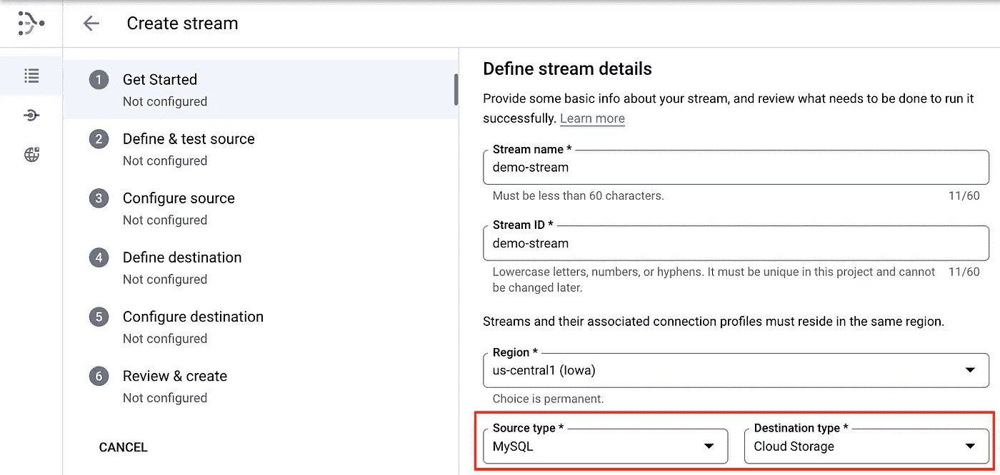

我们坚信在您所在的地方(您的数据)与您会面！MySQL 作为源代码在其他云上也受到支持。

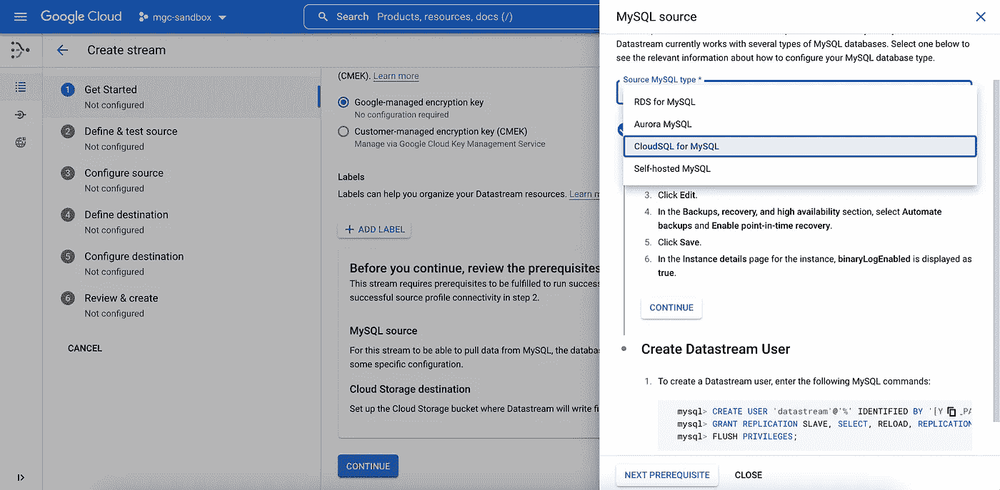

**步骤 2:** 创建一个到 MySQL 源代码的连接并测试它。

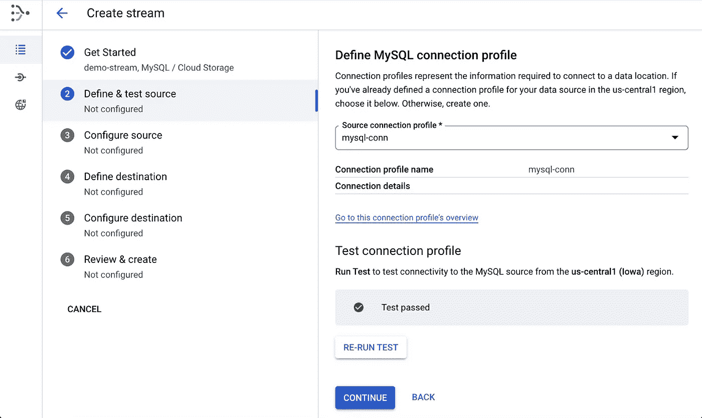

第三步:这里有一件有趣的事情..模式和表(包括未来的)的选择非常容易..简单..尽管这不是数据工程师的日常活动！

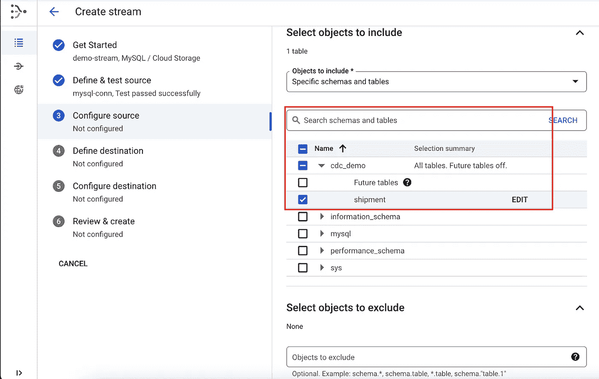

**步骤 4 & 5:** 创建一个到目标存储桶/文件夹的连接，增量数据将从该存储桶/文件夹中获取。目前，支持 avro 和 JSON(包括压缩功能)文件格式。这个桶/文件夹位置通常可以是数据湖上的原始区域。

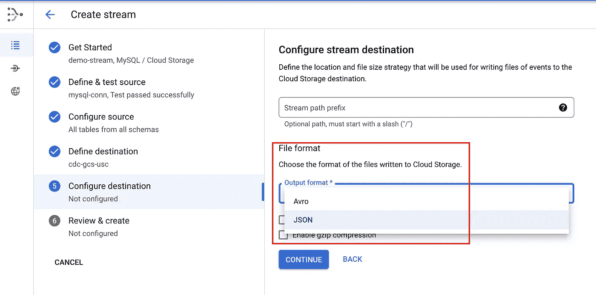

第六步:回顾流程..准备起飞！

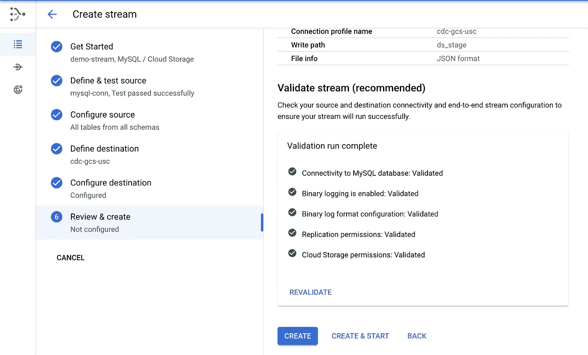

让我们看看巡航高度上的东西。

该流现在显示“运行”状态。

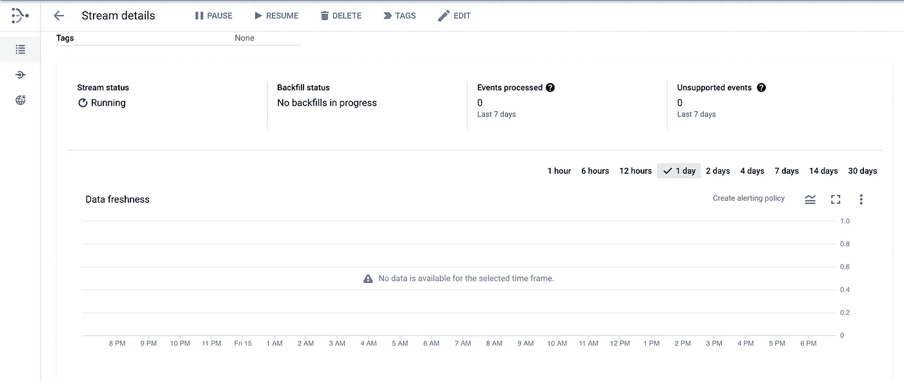

嘿，我们需要对现有数据进行初始加载！没问题，数据流确实支持带有**启动回填**功能的初始加载。

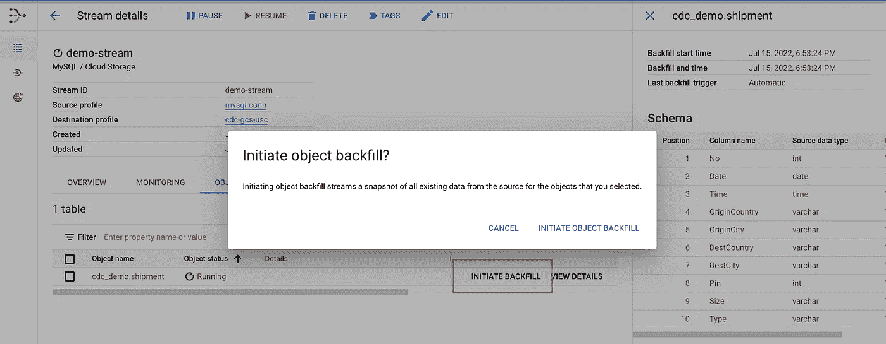

让我们对核心场景——插入、更新和删除——的数据流进行测试。在下面的例子中，我们为插入操作执行一个初始加载..这之后是对其中一个记录的更新..随后通过后端对同一记录进行删除操作。

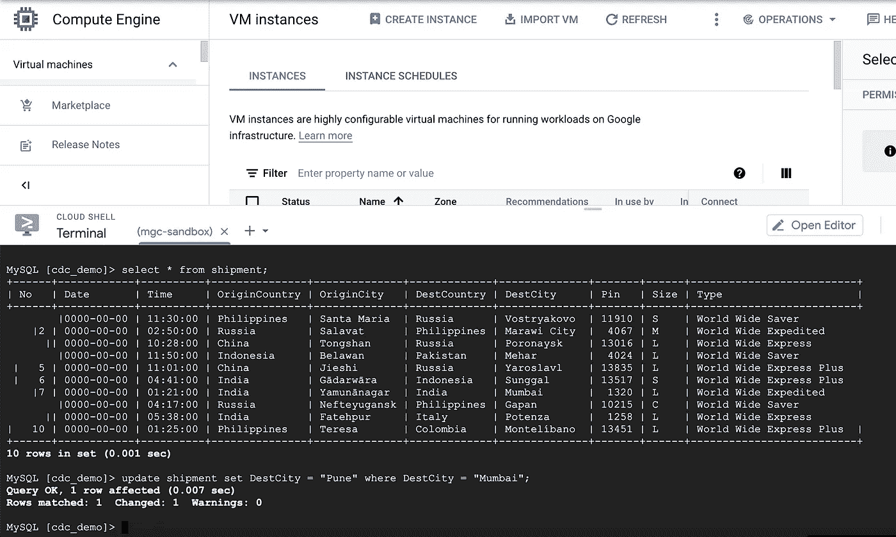

那么我们如何在目的端处理来自 MySQL 的**增量数据**？数据流按日期和时间在目标桶中创建分区文件夹结构。所有这三个数据库操作都被捕获为三个不同文件夹中的独立 JSON 文件。

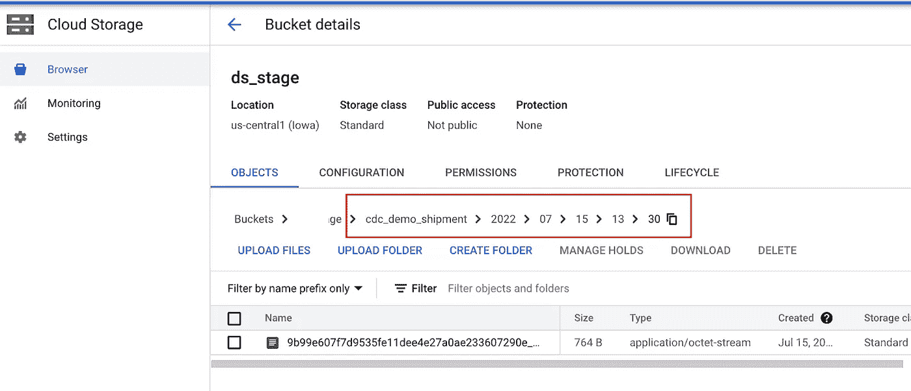

增量数据存放在**多个** **文件夹**中，对于目标加载/处理，是否有更简单的方法来处理这个问题？

有多种方法可以解决这个问题。我更喜欢这里的大湖。虽然 **BigLake** 本身是一个无所不包的平台，但这里我们有一个 BigLake 表，它覆盖了包含所有增量数据的根文件夹。

正如我们所看到的，有三行对应于三个不同的数据记录实例。CDC 的时间戳、变更类型和其他操作元数据进一步帮助**将**变更**捕获**和**传播到目标表上。**

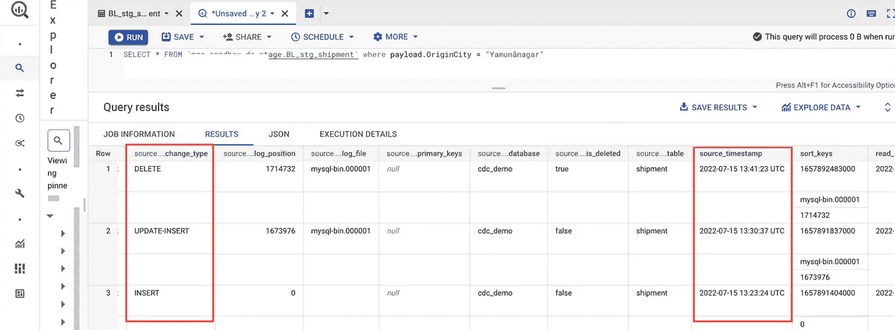

总之，Datastream 让 CDC 的实现变得极其简单、敏捷和直观(T21)。技术的无服务器方面已经封装了 ops 的整个复杂性。我内心的数据工程师无疑被赋予了权力；-)