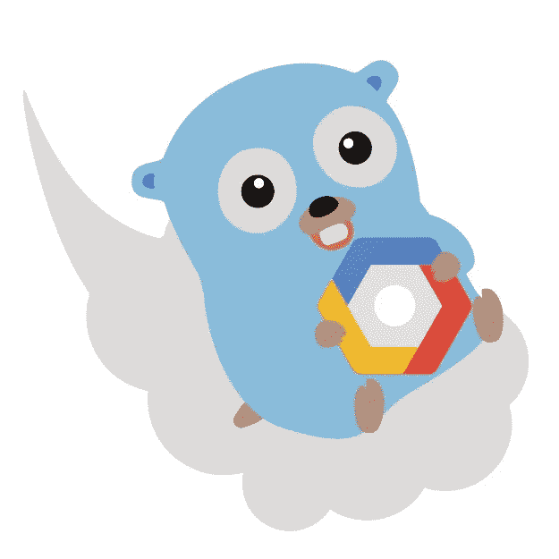
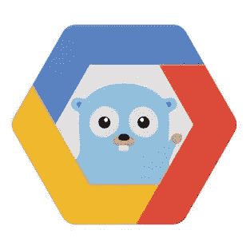

# Go 开发者需要了解谷歌云平台

> 原文：<https://medium.com/google-cloud/what-a-go-developer-needs-to-know-about-google-cloud-platform-e046c9e11abf?source=collection_archive---------0----------------------->

**更新(2018 . 10 . 16)**:自从我写这篇帖子以来，发生了很多变化。除了 GCE 和 GKE(见下文)，App Engine 已经[显著改进](https://blog.golang.org/appengine-go111)，并宣布支持 Go on Cloud 功能(撰写本文时为私有 alpha)。

在[谷歌云平台](https://cloud.google.com/) (GCP)上运行 Go 代码，有两个很棒的可移植代码选择:[谷歌计算引擎](https://cloud.google.com/compute/) (GCE)，和[谷歌 Kubernetes 引擎](https://cloud.google.com/kubernetes-engine/) (GKE)。让我们深入了解一下每一种方法，以及 Go 开发者的一些额外选择。

# 两个伟大的选择:GCE 和 GKE

GCE 被宣传为 Google 提供的“可扩展、高性能的虚拟机”，它是一个简单明了的产品，但也有一些细微之处。请参见此处的[快速入门](https://cloud.google.com/go/docs/tutorials/bookshelf-on-compute-engine)。它伴随着通常的成本和收益。作为一个很好的特性，GCE 做了[实时迁移](https://cloud.google.com/compute/docs/instances/live-migration)，这意味着 Google 为您执行安全更新，而不会对虚拟机的工作负载产生任何影响。不用说，以任何必要的配置创建机器和网络是用户的责任。GCE 有一个很好的特性，除了提供广泛的主机操作系统之外，还允许用户用容器创建虚拟机。

从围棋开发者的角度来看，GKE 几乎肯定是更令人兴奋的产品。请参见此处的[快速入门](https://cloud.google.com/go/docs/tutorials/bookshelf-on-kubernetes-engine)。您可以获得 Kubernetes 的所有功能，而没有在原始计算实例上运行它的困难(T21)。对于较小的系统来说，GKE 可能有些过头了，但是它确实为您提供了一个很好的故事，告诉您如何随着系统的增长来扩展系统。

您选择这两个选项中的哪一个完全取决于您的系统看起来像什么，您对正常运行时间和可伸缩性有什么样的要求，等等。使用 GCE 的一个原因是，对于小型服务来说，它要便宜得多，而带有负载平衡器入口的 GKE 集群可能要贵得多。对于一些人来说，最好是构建一个 Go 二进制文件，并使用简单的工具在 GCE 上运行，比如 [supervisord](http://supervisord.org/) 和 [scp](https://linux.die.net/man/1/scp) 。或者，创建一个 Kubernetes 集群并将部署转移到 GKE 也很容易。对其他人来说，从 GKE 开始可能是正确的选择。

# 关于应用引擎的思考

除了 GCE 和 GKE，谷歌云确实为 Go 开发者提供了第三个选择:[应用引擎](https://cloud.google.com/appengine/)。如果你接受[软件工程是随时间集成的编程](https://www.youtube.com/watch?v=tISy7EJQPzI&t=8m17s)的定义，你可能会发现很难将 App Engine 视为一个合理的选择。它当然有显著的优势，例如，“从零扩展到行星尺度”，但它也有一些主要的弱点。

App Engine 由[两个环境](https://cloud.google.com/appengine/docs/go/)组成:标准和灵活。标准环境打破了[十二因素 App](https://12factor.net/) 的“执行环境间最大的可移植性”的设计原则，并对[如何编写你的主函数](https://github.com/GoogleCloudPlatform/golang-samples/blob/f08cfc98f4c8e537114c8b1d02d7c32b235701bd/appengine/helloworld/hello.go#L16)提出了要求。当然，有合理的方法[来处理这个](https://blog.golang.org/the-app-engine-sdk-and-workspaces-gopath)。标准环境也倾向于在最新的 Go 版本之后运行一个次要版本。例如，Go 1.10 于 2018 年 2 月 16 日发布。同时，在撰写本文时，App Engine 支持的最新版本是 Go 1.9。自[2016 年 2 月 16 日](https://blog.golang.org/go1.6)起，Go 支持[卖身](https://golang.org/cmd/go/#hdr-Vendor_Directories)。两年多过去了，App Engine 依然不支持 vendoring。人们至少可以使用老的方法，即每个项目检入一个完整的 GOPATH，这是一种乏味而繁琐的做法，否则在支持 vendoring 的情况下，社区会放弃这种做法。

虽然标准环境对用户代码提出了一些苛刻的要求，但灵活环境更接近于许多人习惯的十二要素 PaaS。灵活的环境还支持部署 containizered 应用程序。唯一的问题是，部署到灵活的环境是痛苦的缓慢的。例如，部署 [Hello World 示例](https://github.com/GoogleCloudPlatform/golang-samples/blob/master/appengine_flexible/helloworld/helloworld.go)在一次全新部署中花费了 12 分钟，而在第二次部署中花费了 11 分钟，并且没有任何更改。对我来说，缓慢的部署违背了 PaaS 的目的。

如果你的用例[正好符合让 App Engine 强大的东西](https://open.nytimes.com/moving-the-new-york-times-games-platform-to-google-app-engine-e9337f2c9444)或者你正在寻找为[部署简单的](https://github.com/googleCloudPlatform/govanityurls) [GoDoc 重定向](https://github.com/rsc/swtch/tree/master/app/rsc-io)作为虚荣心导入路径，这可能是一个很好的选择。不过，总的来说，App Engine 要求您编写不可移植的代码，或者部署缓慢。对一些人来说，这些可能是合理的缺点。对许多人来说，他们可能会成为交易的破坏者。

# 支持谷歌云功能

目前[谷歌云功能](https://cloud.google.com/functions/) (GCF)上不支持 Go。我确信所有的 Go 开发者都希望这种情况能尽快改变。与此同时，有一个非官方的(不受支持的)原生 Go 运行时[，供那些可能喜欢尝试的人使用。或者，也可以在 Kubernetes 上运行 Go 函数。例如，参见](https://github.com/GoogleCloudPlatform/cloud-functions-go) [OpenFaaS](https://www.openfaas.com/) 或 [riff](https://github.com/projectriff/riff) 。

一旦 Go 在 GCF 上得到适当的支持，这里的整个故事很可能会改变。事实上，对于大多数请求/响应工作负载，我认为 GCF 将是开发人员开始部署 Go 代码的最佳地方。

# 一些值得了解的有用工具

虽然不是专门针对 Go 本身，但开发者会很乐意知道[云资源仓库](https://cloud.google.com/source-repositories/)、[容器注册中心](https://cloud.google.com/container-registry/)和[容器构建器](https://cloud.google.com/container-builder/)。还有许多其他开发工具，但是这里提到的三个特别有用。在 GCP 上部署应用程序时，最好将源代码、Docker 映像以及构建、测试和部署步骤整合在一起。容器构建器特别好，因为它支持[构建、测试和部署工件](https://cloud.google.com/container-builder/docs/configuring-builds/build-test-deploy-artifacts)。

最后，由于有了[Google Cloud Client Libraries for Go](https://github.com/googlecloudplatform/google-cloud-go)，Go 绑定提供了无数有用的 API。支持的 API 包括以下内容:

*   [云发布/订阅](https://cloud.google.com/pubsub/)，
*   [自然语言处理](https://cloud.google.com/natural-language/)，
*   [BigQuery](https://cloud.google.com/bigquery/) ，
*   [云扳手](https://cloud.google.com/spanner/)，
*   [云数据存储](https://cloud.google.com/datastore/)，
*   诸如此类。

详见[GoDoc](https://godoc.org/cloud.google.com/go)。此外，阅读用 4 个字或更少的字描述的 [GCP 产品很有帮助](/google-cloud/gcp-products-described-in-4-words-or-less-f3056550e595)，因为产品种类太多了。如果已经用[处理了认证](https://cloud.google.com/docs/authentication/production)，那么从 GCE 调用各种 API 就不需要特殊的步骤。在 GKE 的例子中，人们可以通过服务代理人使用 GCP API。

# 关键要点

在 GCP 部署 Go 代码时，GKE 是一个例外的选择。对于喜欢直接使用虚拟机的用户来说，GCE 是一个强大且相对便宜的选择。虽然 App Engine for Go 提供了各种优势和劣势，但大多数用户可能不会花太多时间考虑它，而是看看 GKE，因为 Kubernetes 有理由感到兴奋。最后，鉴于 GCP 强大的[机器学习 API](https://cloud.google.com/products/machine-learning/)，可以通过 Go 客户端库轻松访问，在评估 IaaS 选项时，GCP 值得考虑。