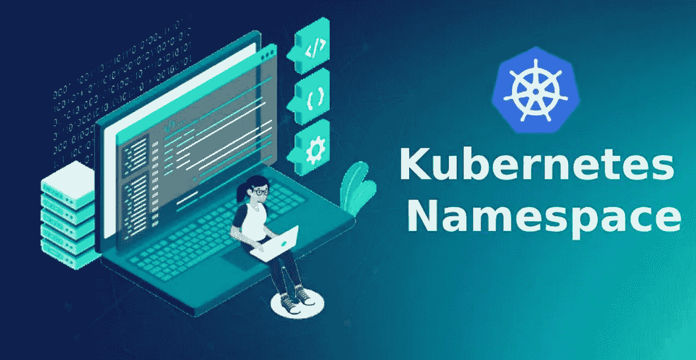

# Kubernetes 对象:名称空间☸☸

> 原文：<https://medium.com/google-cloud/what-are-namespaces-in-kubernetes-d03c76a83d04?source=collection_archive---------0----------------------->

# Kubernetes 中的名称空间是什么？？



Kubernetes 名称空间

***名称空间*** 是将单个 Kubernetes 集群划分为多个虚拟集群的 Kubernetes 对象。
在 Kubernetes 中， ***名称空间*** 提供了一种在单个集群中隔离资源组的机制。资源的名称在一个名称空间内需要是唯一的，但在不同的名称空间之间不需要。

> 让我们使用真实世界的例子，用非常简单的术语来理解复制集的概念。

## 让我们开始吧！！⛏️⛏️


让我们举一个非常简单的例子，我们有以下场景

假设办公室有三个团队

1.  设计组
2.  开发团队
3.  测试团队

所以在上面的场景中，会发生以下事情

*   每个小组将被分配到大楼的不同楼层去工作
*   每个团队都有自己的资源来完成工作
*   每个团队都有不同数量的成员，这取决于他们的工作量

团队中没有人会使用彼此的资源，也不会在彼此的楼层工作。
在这里，不同的楼层基本上有助于将团队彼此分开，并避免任何类型的混合。

现在让我们把上面的例子和库伯内特斯的世界联系起来

*   Kubernetes 集群也可以有多种资源。
*   资源将根据他们的工作量分配给不同的团队。

所以问题来了，我们如何将资源彼此分离，并像真实世界的团队一样将它们隔离在不同的楼层。

> 图片中的**名称空间**出现了。因此，名称空间只不过是我们在 Kubernetes 集群中创建的某些房间，只是为了将资源相互隔离。
> 这样这些不同的名称空间(房间)可以被不同的团队使用，而不会有任何一个团队弄乱和使用其他团队的资源。

例如，我们创建了三个名称空间

1.  设计团队名称空间
2.  开发团队名称空间
3.  测试团队名称空间

顾名思义，以上将由各自的团队使用，并将拥有该团队所需的资源。
这有助于用户保持一切隔离和清洁。

> 万岁！！🥳🥳:我们已经理解了什么是名称空间。
> 现在让我们理解为什么我们需要名称空间🤔 🤔

## 我们为什么要使用 Kubernetes 名称空间？😓 😓


埃文·丹尼斯在 [Unsplash](https://unsplash.com?utm_source=medium&utm_medium=referral) 上拍摄的照片

Kubernetes 名称空间有许多用例，其中一些如下:

*   使用名称空间， ***允许团队或项目存在于他们自己的虚拟集群中*** 而不用担心影响彼此的工作。
*   使用名称空间， ***通过将用户和进程限制到特定的名称空间，增强了基于角色的访问控制(RBAC)*** 。
*   使用名称空间， ***可以通过资源配额在多个团队*** 和用户之间划分集群的资源 ***。***
*   使用名称空间， ***提供了一种简单的方法来分离*** 容器化应用程序的开发、测试和部署，使整个生命周期在同一个集群上进行

## 我们如何创建名称空间？🤔🤔

我们可以使用 YAML 文件创建名称空间。要用 YAML 创建 Kubernetes 名称空间，首先要创建一个空文件，为它分配必要的访问权限，然后定义必要的键-值对。

下面是一个名称空间定义文件*(****namespace . YAML****)*的例子

```
**apiVersion**: v1
**kind**: Namespace
**metadata**:
  **name**: MyNamespace
```

这个文件中有很多方面和组件。让我们逐一分析😀

*   让我们从`apiVersion`(键值对)开始。这用于说明在创建名称空间时，您将在后台运行什么 API 服务器和版本。
*   接下来是`kind`,表示这是一种定义文件。在我们的例子中，它是一个“名称空间”。
*   接下来是`metadata`，这是一个包括项目名称和标签的字典。元数据存储分配给正在创建的名称空间的值。

我们已经完成了名称空间定义文件。现在我们可以保存并退出文件。

使用此命令基于上述 YAML 文件创建命名空间:

```
kubectl create -f namespace.yaml
```

***或者，你可以使用下面的命令创建名称空间:***

```
kubectl create namespace MyNamespace
```

## 使用名称空间🙌🙌

在这一节中，让我们看看不同的和最常用的 kubectl 命令，我们可以使用这些命令在 Kubernetes 集群中处理名称空间。


照片由[尹新荣](https://unsplash.com/@insungyoon?utm_source=medium&utm_medium=referral)在 [Unsplash](https://unsplash.com?utm_source=medium&utm_medium=referral) 拍摄

使用下面的命令从特定的名称空间(这里是“生产”)获取 pod 列表

```
kubectl get pods --namespace=production
```

使用下面的命令在特定的名称空间中创建 POD(这里是“development”)

```
kubectl create –f pod-definition.yml --namespace=development
```

使用下面的命令更改您所在/工作的名称空间(这里是“开发”)

```
kubectl config set-context $(kubectl config current-context)       
--namespace=development
```

使用下面的命令从 K8s 集群中存在的所有名称空间获取 pod

```
kubectl get pods --all-namespaces
```

## 接下来呢？👀 👀


> 非常感谢你来到这里！这是本文的结尾。
> 但我们只是触及了 K8s 生态系统的表面:)
> 还有很多，这将是一次有趣的旅程，我们将一起学习很多很酷的东西。
> 
> ***做拍手跟我来*** *🙈如果你喜欢我的作品，并希望在未来更多地阅读我的作品:)*

如果你对这篇文章有任何疑问，或者想聊聊天，请随时联系我的社交媒体账号

*推特—*[*https://twitter.com/ChindaVibhor*](https://twitter.com/ChindaVibhor)

*LinkedIn—*[*https://www.linkedin.com/in/vibhor-chinda-465927169/*](https://www.linkedin.com/in/vibhor-chinda-465927169/)

## 相关文章

[](https://faun.pub/kubernetes-object-deployments-1e09cd904963) [## Kubernetes 对象:☸☸部署

### Kubernetes 中有哪些部署？

faun.pub](https://faun.pub/kubernetes-object-deployments-1e09cd904963) [](https://faun.pub/kubernetes-objects-replicasets-35c07ba22d47) [## Kubernetes 对象:复制集☸☸

### Kubernetes 中的复制集是什么？

faun.pub](https://faun.pub/kubernetes-objects-replicasets-35c07ba22d47) 

我仍然会继续发表新的文章，涵盖我正在探索的一系列主题。

那都是乡亲们！！涂鸦:))