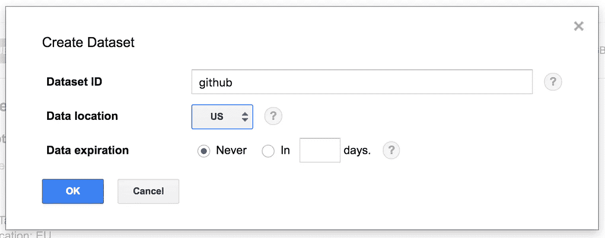

# 我们能从 Github 上的数百万行 Apache Groovy 代码中学到什么？

> 原文：<https://medium.com/google-cloud/what-can-we-learn-from-million-lines-of-apache-groovy-code-on-github-3151249a17b1?source=collection_archive---------0----------------------->

## 最初发布于 2016 年 7 月 6 日[glaforge.appspot.com](http://glaforge.appspot.com/article/what-can-we-learn-from-million-lines-of-groovy-code-on-github)


Github 和 Google 最近宣布并向 BigQuery 发布了 Github archive，解放了多种编程语言源代码的庞大数据集，并使查询它和发现一些见解变得更加容易。

Github 解释说[数据集包含超过 3tb 的数据](https://github.com/blog/2201-making-open-source-data-more-available)，对于 280 万个存储库，1.45 亿个提交超过 20 亿个文件路径！[的谷歌云平台博客](https://cloudplatform.googleblog.com/)给出了一些[附加指针](https://cloudplatform.googleblog.com/2016/06/GitHub-on-BigQuery-analyze-all-the-open-source-code.html)来提示 BigQuery 的查询功能可以做些什么。此外，您可以查看[入门指南](https://cloud.google.com/bigquery/public-data/github)，了解使用数据集的步骤。

我的同事 Felipe 给出了一些关于顶级编程语言或许可证的有趣统计数据，而 Francesc 对 Go 库做了一些有趣的分析。所以我很好奇自己调查这个数据集来运行一些关于 Apache Groovy 编程语言的查询！

事不宜迟，我们开始吧！

如果你还没有谷歌云平台的账户，你将能够获得免费试用版，价值 300 美元的信用点数来发现和享受该平台的所有产品和服务。然后，一定要看看我上面提到的 [Github 数据集入门指南](https://cloud.google.com/bigquery/public-data/github#github)，它可以给你一些尝试的想法，以及开始修补数据的相关步骤。

在 Google Cloud Platform [控制台](https://console.cloud.google.com/)中，我创建了一个空项目(对我来说，称为“github-groovy-files”)，它将托管我的项目和整个数据集的子集，只关注 Apache Groovy 源文件。

接下来可以去 BigQuery 上的 Github 公共数据集:
[https://big query . cloud . Google . com/dataset/big query-public-data:Github _ repos](https://bigquery.cloud.google.com/dataset/bigquery-public-data:github_repos)

我创建了一个名为“github”的新数据集，它的位置在美国(默认)。确保在美国保留默认位置，因为 Github 数据集已经在那个地区了。



我启动了以下查询来列出所有 Apache Groovy 源文件，并将它们保存在一个名为“files”的新表中，以供进一步查询:

```
SELECT * FROM [bigquery-public-data:github_repos.files] 
WHERE RIGHT(path, 7) = '.groovy'
```

现在我有了自己的数据集子集，其中只有 Apache Groovy 文件，我运行了一个 count 查询来了解可用的 Apache Groovy 文件的数量:

```
SELECT COUNT(*) 
FROM [github-groovy-files:github.files]
```

还有 Apache Groovy 源文件的 **743 070！**

我很好奇是否有一些 Apache Groovy 脚本和类的通用名称会比其他名称出现得更频繁:

```
SELECT TOP(filename, 24), COUNT(*) as n 
FROM ( 
  SELECT LAST(SPLIT(path, '/')) as filename 
  FROM [github.files] 
)
```


我惊讶地发现. groovy 是最常见的文件名！我还没有深入研究，但我很想看看那些 A.groovy 文件中有什么，以及分别位于第 4 位和第 13 位的 B.groovy 或 a.groovy。

Apache Groovy 经常用于各种自动化任务，我发现许多 Maven 或 Jenkins 脚本检查某个任务或作业是否正确终止，这要感谢名为 verify.groovy 的脚本。

像 BuildConfig.groovy、Config.groovy、UrlMappings.groovy、DataSource.groovy、BootStrap.groovy 这样的文件显然来自于在 [Grails framework](https://grails.org/) web 应用程序中找到的常见文件。

还可以看到类似 logback.groovy 的配置文件来配置 logback 日志库。

您在这里看不到 [Gradle](https://gradle.org/) 构建自动化工具的用法，因为我只选择了扩展名为. groovy 的文件，而没有选择扩展名为。格拉德扩展。但是我们一会儿会回到格雷尔。

到目前为止，我们只看了文件名，没有看它们的内容。这就是我们需要另一个表的地方，它来自数据集的“contents”表，我们将根据保存在“files”表中的文件名对它进行过滤，这要归功于以下查询:

```
SELECT * FROM [bigquery-public-data:github_repos.contents] 
WHERE id IN (
    SELECT id FROM [github.files]
)
```

由于这是大量的内容，我必须将查询结果保存在一个名为“contents”的新表中，并且我必须选中选项窗格中的“allow large results ”(允许大的结果),由于查询编辑器下方的“Show options”按钮，您可以打开该选项窗格。

从 743 070 文件中，你认为其中有多少行 Apache Groovy 代码？为此，我们需要将文件的原始内容按行分割，如下所示:

```
SELECT COUNT(line) total_lines 
FROM ( 
  SELECT SPLIT(content, '\n') AS line 
  FROM [github-groovy-files:github.contents] 
)
```

我们在 743，070 个 Apache Groovy 文件中有 16，464，376 行代码。每个文件平均 22 行，这是相当低的！绘制一些直方图来查看这些代码行的分布会更有趣。我们可以使用[分位数](https://en.wikipedia.org/wiki/Quantile)来更好地理解这个具有 10 个分位数的查询的分布情况:

```
SELECT QUANTILES(total_lines, 10) AS q 
FROM ( 
  SELECT COUNT(line) total_lines 
  FROM ( 
    SELECT SPLIT(content, '\n') AS line, id 
    FROM [github-groovy-files:github.contents] 
  ) 
  GROUP BY id 
)
```

这给出了这个结果表:


有 0 行代码的文件！而且最大的一个是 **9506 线长**！10%是 11 行或更少，一半是 37 行或更少，等等。10%长于 149 行。

现在让我们换换口味，看看包和导入。

你知道最常用的包是什么吗？

```
SELECT package, COUNT(*) count 
FROM ( 
  SELECT REGEXP_EXTRACT(line, r' ([a-z0-9\._]*)\.') package, id 
  FROM ( 
    SELECT SPLIT(content, '\n') line, id 
    FROM [github-groovy-files:github.contents] 
    WHERE content CONTAINS 'import' 
    HAVING LEFT(line, 6)='import' 
  ) 
  GROUP BY package, id 
) 
GROUP BY 1 
ORDER BY count DESC 
LIMIT 30;
```


[**Spock**](http://docs.spockframework.org/) **和 JUnit 测试框架是使用最广泛的包**，可见 Groovy 被大量用于测试！我们也看到了很多与 Grails 相关的包，还有一些日志，一些 Spring，Joda-Time，Java util-concurrent 或者 servlets 等等。

我们可以放大照片。*包含以下内容的包装:

```
SELECT package, COUNT(*) count 
FROM ( 
  SELECT REGEXP_EXTRACT(line, r' ([a-z0-9\._]*)\.') package, id 
  FROM ( 
    SELECT SPLIT(content, '\n') line, id 
    FROM [github-groovy-files:github.contents] 
    WHERE content CONTAINS 'import' 
    HAVING LEFT(line, 6)='import' 
  ) 
  GROUP BY package, id 
) 
WHERE package LIKE 'groovy.%' 
GROUP BY 1 
ORDER BY count DESC 
LIMIT 10;
```

毫无疑问,' groovy.transform '是赢家，因为它是所有 Apache Groovy AST 转换所在的地方，提供了有用的代码生成功能，使开发人员不必为常见任务编写乏味的重复代码(@Immutable、@Delegate 等)。)在转换之后是用于日志记录的“groovy.util.logging ”,用于处理 json 文件的“groovy.json ”,用于通过 JDBC 与数据库交互的“groovy.sql ”,用于解析和生成 xml 有效负载的“groovy.xml ”,以及用于模板引擎的“groovy.text ”:


由于 Apache Groovy AST 转换如此突出，我们还可以看看最常用的 AST 转换:

```
SELECT TOP(class_name, 10) class_name, COUNT(*) count 
FROM ( 
  SELECT REGEXP_EXTRACT(line, r' [a-z0-9\._]*\.([a-zA-Z0-9_]*)') class_name, id 
  FROM ( 
    SELECT SPLIT(content, '\n') line, id 
    FROM [github-groovy-files:github.contents] 
    WHERE content CONTAINS 'import' 
  ) 
  WHERE line LIKE '%groovy.transform.%' 
  GROUP BY class_name, id 
)
WHERE class_name != 'null'
```

我们得到了:


**@复杂的转化才是王道**！后面是@ToString 和@EqualsAndHashCode。但是后来@TypeChecked 是第四，说明 Apache Groovy 的静态类型化和编译支持真的用的很多。其他有趣的转换使用@Canonical、@PackageScope、@InheritConstructors、@Immutable 或@TupleConstructor。

在我研究导入时，我还想知道是否经常看到别名导入:

```
SELECT aliased, count(aliased) total 
FROM (
  SELECT REGEXP_MATCH(line, r'.* (as) .*') aliased
  FROM (
    SELECT SPLIT(content, '\n') AS line 
    FROM [github-groovy-files:github.contents] 
  ) 
  WHERE line CONTAINS 'import ' 
) 
GROUP BY aliased 
LIMIT 100
```

有趣的是，有 2719 个有别名的进口超过了 765281 个没有别名的进口，这大约是 0.36%，所以对于 300 个正常进口来说，大约是 1 个“进口…作为…”。

至此，我对 Github 上的 Apache Groovy 源文件的探索结束了！轮到你玩数据集了，看看有没有有趣的发现要揭开！你发现什么了吗？

*最初发表于*[*【glaforge.appspot.com】*](http://glaforge.appspot.com/article/what-can-we-learn-from-million-lines-of-groovy-code-on-github)*。*