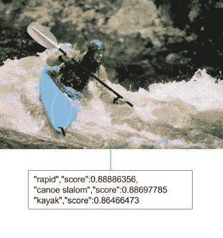

# Google Cloud Vision API 对深度学习创业公司意味着什么

> 原文：<https://medium.com/google-cloud/what-google-cloud-vision-api-means-for-deep-learning-startups-cd39226922e5?source=collection_archive---------0----------------------->

图片来源:[德尔菲德拉鲁阿](https://unsplash.com/delfidelarua7)

谷歌今天宣布了[云视觉 API](http://googlecloudplatform.blogspot.it/2015/12/Google-Cloud-Vision-API-changes-the-way-applications-understand-images.html) ，它向公众开放了他们用于图像识别、OCR、面部检测等的深度学习算法。

谷歌云视觉 API 结果示例(来源:[谷歌](http://googlecloudplatform.blogspot.it/2015/12/Google-Cloud-Vision-API-changes-the-way-applications-understand-images.html))

已经有许多深度学习初创公司提供这些服务，在我看来，谷歌可以轻松占领大部分市场。

深度学习复兴背后有 3 个原因，每个都是潜在的竞争优势，让我们来看看:

*   **算法**。每天都有新的发现发表在 arxiv 上。Google 在实现了 GFS/Map-Reduce 之后几年才发表论文的日子已经一去不复返了，让世界上的其他人在已经转向另一种技术之后再去构建 Hadoop。在一些算法上，我看不到其他算法在几个月内无法复制的可持续竞争优势。
*   **计算能力**。是的，云已经使计算能力的使用大众化了。但是深度学习需要 GPU，而 AWS 是唯一一个提供 GPU 的，而且它们都很老，性能也不是很好。当谷歌开源 Tensorflow 时，它很快被嘲笑为比其他开源库慢 10 倍。一些分析师的解释之一是，谷歌的计算能力如此强大，以至于他们可以使用他们的工程资源来构建新的东西，而不是专注于性能。
*   **数据**。很少有公司能在可用数据上与谷歌竞争，当然它们也不是初创公司。也许可以通过开放的共同努力来建立大型数据集，但这不会给任何一家公司带来竞争优势。

深度学习初创公司如何与谷歌竞争？

*   **价格**。他们可以给自己的 API 定价低于谷歌。突然间，一项热门的新兴技术变成了商品。
*   **找一个熟人**。他们可以尝试被收购，而不是建立一个可持续发展的企业。我怀疑构建一个公共 API 是 it 的最佳策略，像 DeepMind 那样致力于尚未解决的难题会更明智。
*   **专注一个利基**。Google API 将在一般问题上大放异彩，本质上可能不会去追逐特定的市场，如工业应用和医疗保健。出于同样的原因，一个公共的 SaaS API 商业模式可能对这个市场无效，它可能需要嵌入式或本地系统和一个更标准的 B2B 销售方法。

谷歌经常无法将他们的商业服务货币化，创业公司可能希望这种情况会再次发生。我不会在这个问题上睡得很好，竞争优势明显在谷歌这边，他们会继续改进他们内部服务的算法，不管 API 收入如何。

今天，谷歌进入了视觉市场，自然语言处理(NLP)也可能很快成为现实，这是另一个在深度学习方面有很多改进的领域。例如，大多数可用的服务都是英文的，这可能是因为有更多可用的这种语言的数据集和语料库。谷歌也是提供其他语言 NLP 服务的最佳选择。

虽然对于许多深度学习初创公司来说，这可能是糟糕的一天，但一旦他们克服了这一点并重新聚焦，我认为将会有很多非常聪明的人致力于新的难题，在这个过程中让世界变得更好。

*这是我的两分钱，你对这个话题有什么看法？*