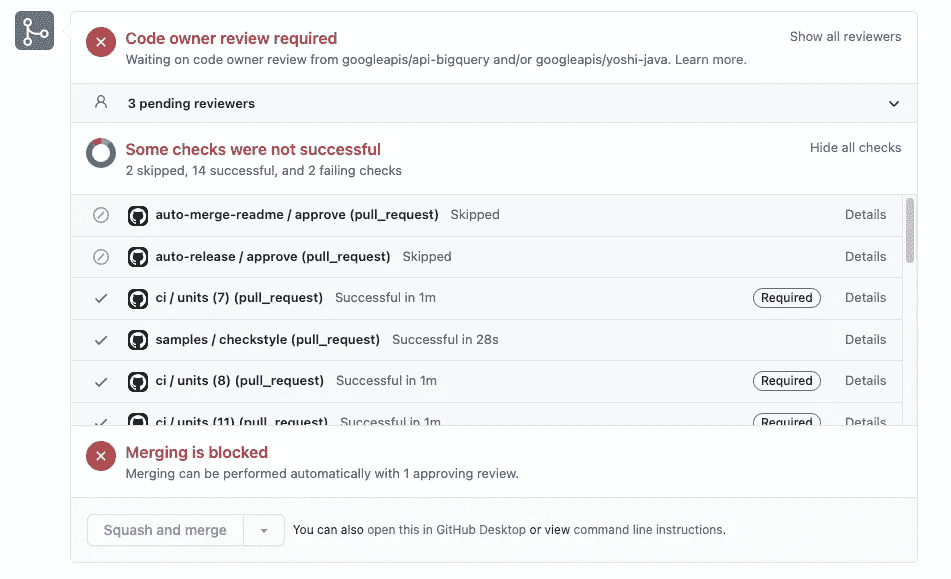
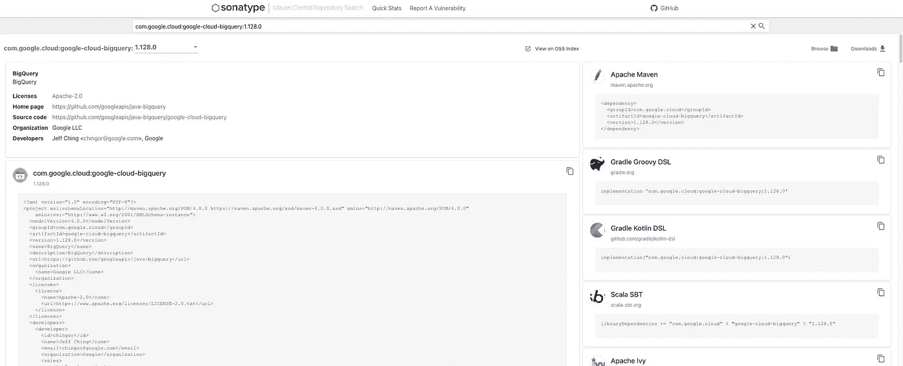
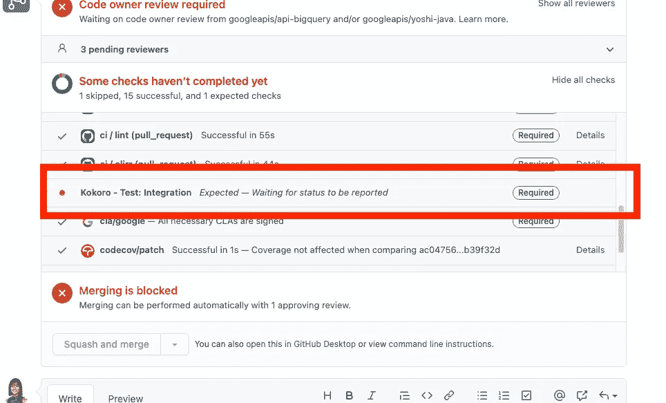
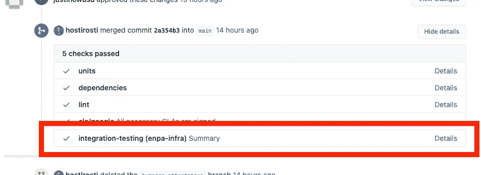
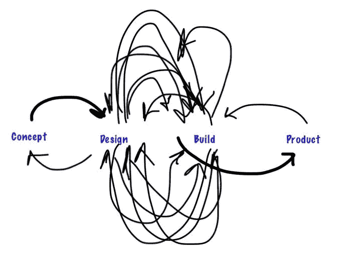
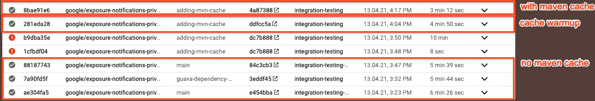
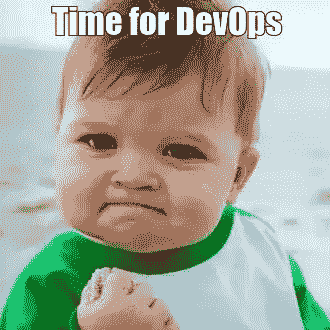

# 我从为新冠肺炎曝光通知开源项目设置 CI 中学到了什么

> 原文：<https://medium.com/google-cloud/what-i-learned-from-setting-up-ci-for-a-covid-19-exposure-notification-open-source-project-fee53896fae1?source=collection_archive---------0----------------------->

去年早些时候，在冠状病毒爆发期间，新冠肺炎暴露通知系统投入使用。谷歌和苹果联合创建并发布了可互操作的系统，以帮助公共卫生当局通知并指导可能接触过新冠肺炎病毒感染者的用户使用他们的应用程序。作为向卫生当局提供隐私保护分析的另一个项目的一部分，我参与了为 [ENPA 谷歌回购](https://github.com/google/exposure-notifications-private-analytics-ingestion)帮助设置持续集成(CI)。我们的项目团队由来自不同组织和背景的开发人员组成，包括 Android、Google Cloud、Security 等。ENPA 项目包含 Google ingestor 管道代码，CI 有助于确保代码开发期间的代码质量。以下是我在这个过程中学到的一些经验。

**了解目标和非目标**

传达给我的总体目标非常直接:设置 CI 在每个 pull 请求打开时运行测试，这样任何测试失败都会阻止 pull 请求被合并到代码库的主要分支中。然而，我脑海中立即闪现出几个问题:这些是什么样的测试？它们需要秘密才能运行吗？如果我们想保持代码质量，有没有其他的东西，比如 linter 或者代码格式化程序，我们也应该运行？

为了回答这些问题并阐明需求，我安排了一次与项目领导的会议，并且**确定了我们的目标和非目标**，这样我就可以决定要运行的 CI 作业以及如何运行它们。经过讨论，我们清楚地知道我们的目标是:

1.  **当开发人员对回购做出贡献时，确保**代码质量；
2.  **通过利用系统化 CI 来加强**代码质量。

我们*不*需要:

1.  从我们的 repo 向 Maven Central 发布工件；
2.  使用 Java 7、8 等多个 Java 版本运行测试；
3.  每晚在 presubmit 和综合测试套件上运行“轻量级”测试版本；虽然这是我们将来可能会考虑做的事情。

这些**目标**和**非目标**帮助我区分优先级并理解我选择使用的 CI 平台需要足够适应所有这些当前和潜在的需求，但不需要过于复杂。我需要交付 CI，最关键的是，当发出 pull 请求时，在 Java 11 中运行单元和集成测试。该设置需要能够在需要时支持连续作业。最重要的是，我们可以设置作业来运行[许可头检查](https://github.com/google/exposure-notifications-private-analytics-ingestion/blob/main/.github/header-checker-lint.yml)、 [linter](https://github.com/google/exposure-notifications-private-analytics-ingestion/blob/2802ed2a3f3b41ea95e9a74ae50fde2ee5b87ce0/.github/workflows/ci.yaml#L45) 和[依赖性检查](https://github.com/google/exposure-notifications-private-analytics-ingestion/blob/2802ed2a3f3b41ea95e9a74ae50fde2ee5b87ce0/.github/workflows/ci.yaml#L35)，以进一步确保代码质量。

通过预先定义目标和非目标，我能够理解什么是需要的。更重要的是，CI 设置不需要什么。这让我能够快速交付有影响力的解决方案。

**决定合适的竞争情报平台:面向未来，但不是包罗万象**

基于我们的目标，我需要选择合适的 CI 工具来构建我们的渠道。对于单元测试、linter、依赖性检查和代码格式化程序，它们不需要运行服务帐户和测试秘密，我决定使用 [Github 动作](https://github.com/features/actions)，因为从过去的经验来看，Github 动作很容易配置。它们也很快而且免费。在开发 ENPA 之前，我已经将所有 googleapis repos 的预提交[单元测试](https://github.com/googleapis/java-bigquery/blob/69974342628d1718ae79d810f9a89c264f77b878/.github/workflows/ci.yaml#L8)工作迁移到 Github Actions。

BigQuery Java 客户端库 repo 中的 Github 操作([https://github.com/googleapis/java-bigquery](https://github.com/googleapis/java-bigquery/pulls))

然而，对于集成测试，我需要做更多的研究。我所熟悉的大多数 GCP Java 客户端库都在谷歌的 Kokoro 上运行集成测试。例如，GCP [BigQuery Java 客户端库](https://github.com/googleapis/java-bigquery)拥有[三种类型的](https://github.com/googleapis/java-bigquery/tree/master/.kokoro)集成测试:持续测试、夜间测试和预提交测试，它们分别使用各自的触发器运行。此外，我们还有一个发布工作，处理 GCP [google-cloud-*工件](https://repo1.maven.org/maven2/com/google/cloud/)到 [Maven Central](https://search.maven.org/) 的发布，以便 GCP 客户可以访问客户端库并使用它们与 GCP API 进行交互。

在 Maven Central 发布的 google-cloud-bigquery 工件

使用 Kokoro 的好处是，我们可以安全地在内部存储服务帐户和测试秘密。它还允许我们通过在发布时向我们提供 OSS Sonatype 签名密钥，安全地将 [google-cloud-*工件](https://repo1.maven.org/maven2/com/google/cloud/)发布到 [Maven Central](https://search.maven.org/) 。Kokoro 的一个主要缺点是设置复杂。我们需要在 Google 代码库中内部配置作业，在 Github 中定义构建配置，然后配置 webhooks 将内部作业连接到外部构建配置。当回购是私有的时，设置变得更加复杂和缓慢，这是我们在开发投入生产的第一个版本的大部分时间里的情况。另一方面，ENPA Google Ingestor repo 不需要向 Maven Central 发布工件。因此，我们无需准备 OSS 签名密钥。考虑到建立 Kokoro 的所有必要条件和努力，我们决定反对它。

在 googleapis repos 中集成测试的 Kokoro 工作

我们调查了其他平台，最终决定采用[云构建](https://cloud.google.com/cloud-build)。云构建可以使用定制的工作流跨不同的编程语言进行构建和测试。这对于像 ENPA 这样的项目尤其重要，因为开发人员来自不同的团队和背景。我们需要迎合参与其中的开发人员的技能多样性，他们会选择自己喜欢的工具和语言。一些集成测试是用“mvn”运行的，而另一些是用“npm”运行的。该平台需要适应不同的测试环境。它还需要能够根据事件触发器运行不同类型的集成测试。例如，我们可能希望只在夜间运行处理 100k 数据份额的测试，但是为了更快的周转和更少的数据处理开销，我们希望在每个 pull 请求上运行处理 10k 数据份额的测试。

Google/exposure-notifications-private-analytics-ingestion repo 中集成测试的云构建作业

选择合适的 CI 平台不仅帮助我们成功完成手头的任务，还帮助我们节省了宝贵的工程时间。

**思考测试基础设施和更大的图景**

一旦我决定了云构建，我很快就投入了实施。我在我们的测试项目中创建了一个云构建管道，并允许默认的云构建服务帐户访问我们的测试秘密，以便运行集成测试。

这在代码审查期间立即被拒绝。事实证明，我没有意识到每个 GCP 项目只能有一个 Firebase 项目的限制，而且我们将来可以针对不同的 Firebase 项目运行集成测试。这意味着我最初的解决方案需要为每个新的 GCP 测试项目重新创建一个新的 CI 管道！

更好的方法是将 CI 管道从测试项目中分离出来。将 CI 渠道放在专门的基础设施项目中；允许其服务帐户在各种测试项目中运行集成测试。这允许更大的灵活性，并且需要更少的配置工作。从长远来看，集中构建和测试配置也意味着更容易维护。

考虑全局和整个基础设施有助于对如何设置做出更合理的决策，以便我们可以更容易地长期维护它。

既然我们已经有了满足我们基本需求的最小可行产品(MVP ),我们可以开始运行它，看看我们是否可以对 CI 渠道进行任何潜在的改进。

**应用通用软件工程原则和最佳实践**

一旦我们开始运行新的 CI 渠道，我们就开始观察到一些需要改进的地方。

例如，我们最初的 CI 管道运行`。/mvnw clean verify '用于每次集成测试。这意味着我们每次运行集成测试时都在下载 maven 包，因为默认情况下，Cloud Build 使用空的本地 Maven 存储库启动容器。作为改进，我们[开始在 Google 云存储中缓存这些包](https://github.com/google/exposure-notifications-private-analytics-ingestion/blob/main/container-build.yaml),这样我们的集成测试将需要三分钟而不是七分钟来运行。每次都从头开始运行当然有好处，但是在本地缓存这些包大大加快了我们的 CI:

我们还使用 Java 11 [gcr 容器](https://cloud.google.com/container-registry)来运行我们的 npm firebase 模拟器测试，因为 firebase 模拟器需要 Java 来运行，但这也意味着我们每次运行测试时都要安装 npm。为了解决这个问题，我们可以开始构建或获取一个同时包含 Java 和 npm 的 gcr 映像。然而，通过这样做，我们需要承担维护新容器的责任。

这些改进都不会阻碍我们 CI 渠道的推广。如果您已经知道如何快速使其中一些工作，这是很好的，但否则，快速配置和部署一个工作的 CI 管道，然后迭代地改进它，比等待推出它有更大的影响。

作为一般的经验法则，在进行改进或升级之前，尝试创建一个有效的 CI 渠道。快速失败，快速迭代经常失败。在测试之前配置一个高效且强大的 CI 管道是很诱人的，但事实是 CI 在代码提交中是不可或缺的。有必要运行一些东西来确保没有提交的代码破坏现有的代码库。启动和运行 CI 对于任何项目都是至关重要的。

**最后的想法**

DevOps 没有一个部分是简单的。在与其他软件工程师和相关的利益相关者进行了详尽的讨论之后，我发现关注什么是重要的事情要少得多。没有什么比设置好所有可以工作的东西，然后又不得不完全修改它更糟糕的了——光是凭证和权限管理就令人难以置信。所以总是从理解目标和非目标开始。我发现在软件工程中是这样，现在在 DevOps 中也是这样。如果你有任何问题，欢迎在推特上给我发消息。

*特别感谢*[*Robert Kubis*](/@hostirosti)*对这个项目和博文的指导和帮助。*