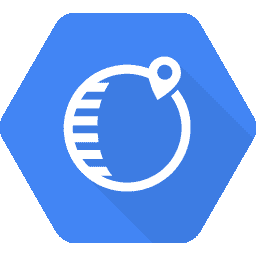
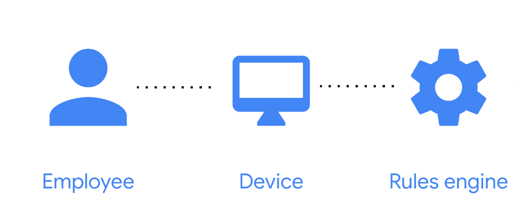
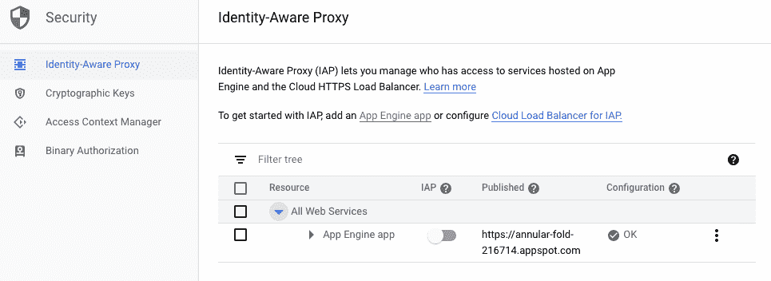
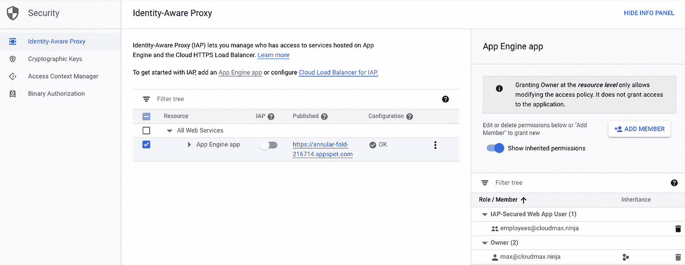
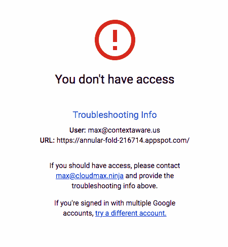

# 什么是 BeyondCorp？什么是身份感知代理？

> 原文：<https://medium.com/google-cloud/what-is-beyondcorp-what-is-identity-aware-proxy-de525d9b3f90?source=collection_archive---------0----------------------->

你的公司持有非常敏感的数据:关于你的客户，你的业务，你的员工。您的员工需要使用各种内部或外部应用程序来访问从合同和采购订单到地址和电话号码的所有内容。正确锁定应用程序、数据和人们访问的方式对您的成功和生存至关重要。然而，您还需要让您的员工能够访问这些应用程序，无论他们在哪里工作。

> 您将如何保护公司的命脉:数据？

作为回应，我倾向于看到更多的公司增加额外的 VPN 层、防火墙、限制和约束，导致可怕的体验和轻微的安全增益。我觉得有更好的方法。在谷歌内部，我们称之为 [BeyondCorp](http://cloud.google.com/beyondcorp) ，在谷歌云平台上，你可以通过一组补充的安全产品获得它；今天我们将关注[身份感知代理](http://cloud.google.com/iap) (IAP)。

# 周边安全问题

对于大多数 IT 专业人员来说，扩展基础设施安全性的唯一方法就是添加更多、更大的防火墙。你的城堡受到攻击，你会怎么做？更高的城墙肯定会击退入侵的野蛮人。这可能会阻挡只使用一种策略(梯子)的攻击者，但它实际上不会给你更好的安全性来抵御各种各样的攻击(如撞墙龙)。

攻击者变得[非常有创意](https://www.youtube.com/watch?v=1LjnPgHJw5w)。一旦一名间谍潜入你的城堡，藏在一辆“无辜”的商船车厢底部，你就完蛋了。他们越过你的墙，可以接触到任何东西。

> 大多数企业网络的结构都是一样的:高度加固的外围网络和高度脆弱的内部网络。

一旦攻击者通过破坏员工设备或利用您的一台服务器中的零日漏洞越过您的边界，他们就可以轻松地横向移动。

这些系统依赖于位置来确定信任度:要么你在坚固的边界内，在办公室或在 VPN 上，这样你就可以访问，要么你在外面，什么也得不到。信任来自您所在的位置，并根据您来自的子网或 IP 地址给予。这太容易规避了:攻击者可能会通过危及正在发出其他合法请求的计算机的安全来进行攻击。或者，他们可能会通过一名不知情的员工在周界内获得一个危险的设备。或者只使用互联网，因为随着越来越多的访问归结为 IP 地址，位置变得毫无意义。

> 事实证明，你可以信任互联网，至少和你信任自己的网络一样

强大的周界还将需要在旅途中完成工作、拜访客户以及只能使用电话或平板电脑的员工拒之门外。以 VPN 为中心的方法侧重于优化笔记本电脑和台式机，以牺牲越来越多的员工每天实际用来完成工作的设备为代价。

手机正在吞噬世界

# 零信任是上下文感知的访问

在谷歌，我们已经转向一种模式，将*超越*T2 企业网络。

博扬公司

这意味着我们的办公室内部不再有特权网络，也不再区分从办公室还是从家里连接到服务。

> 我们在谷歌不依赖 VPN，你也不应该依赖

我们已经停止使用 VPN 或特殊网络来控制对内部工具和服务的访问。相反，我们会查看用户身份和每个访问请求的上下文，并根据我们所了解的情况决定是否授予该单独会话的访问权限:

*   此人是否被授权使用此资源？
*   这个设备安全健康吗？
*   这个请求符合我的访问策略吗？

> 当我说零信任时，我的意思是我们在任何网络或会话中都没有固有的信任。

我们必须给予信任，否则没人会知道我们的财务状况、漏洞或代码库。但我们只有在知道有必要的时候才会给予信任。当满足上述标准时，该信任被给予特定的会话。

要做到这一点，我们需要知道每个人被授权访问什么，我们需要对他们的身份认证有信心，我们需要评估他们设备的健康状况。到公司资源的每个连接都必须加密，以防止任何中间监听器窃取信息。

# 设置对应用程序的上下文感知访问

让我们快速看一下如何使用身份感知代理实现对 web 应用的上下文感知访问，身份感知代理是谷歌云平台的访问控制工具，用于根据发出请求的*来控制访问。在以后的文章中，我将向您展示如何将相同的访问控制应用到您的 GCP 基础设施或第三方 SaaS 应用程序中。*

在 Slager Bank & Trust，他们希望复制这种模式，但对公共云并不熟悉。因此，他们从一个简单的培训应用程序开始，对所有员工进行法规遵从性培训。这个应用程序遍历金融法规的基础知识，检查员工的答案是否正确，然后每 12 个月对他们进行一次重新培训。

在将应用程序部署到 App Engine 后，Slager 的 IT 人员希望确保只有全职员工才能访问它，这样他们就不会从员工以外的地方获得大量无用的流量，并避免恶意入侵者的任何利用。

他们去他们的云控制台，安全，并前往[身份感知代理。](https://console.cloud.google.com/security/iap?_ga=2.101871048.-814743227.1538505488)由于这是他们第一次使用 IAP，他们需要配置一个同意屏幕，确认产品名称和电子邮件地址，以便提问。他们决定使用其支持团队的电子邮件别名，这样任何访问问题都会首先提交给他们的 IT 团队进行故障排除。

现在他们已经为 IAP 准备好了他们的 App Engine 应用，是时候决定访问了。对于这个应用程序，我们希望 Slager 的所有员工都能看到它，只有 Max 可以更改权限或更新它。轻松点。我们选择 Add Member 来附加一个所有者，然后再次添加 Member 并选择角色 IAP-Secure Web App User，将组 **employees** 放入其中，该组包含所有全职 Slager 雇员。

然后我们打开开关(在标题 IAP 下),我们就可以开始了。现在，此 App Engine 应用程序前面的负载平衡器将基于身份强制执行访问，因此不在 employees 组(获得 IAP-Secure Web App 用户访问权限)内的任何人都将看到以下内容:

# 更改信任模型的要求

在以后的文章中，我将深入探讨谷歌是如何做出这一改变的，并规划我们八年的旅程。但对你来说这并不需要付出巨大的努力。我们可以帮忙。

如果你有一个已经在谷歌云上运行的[应用引擎](https://cloud.google.com/iap/docs/app-engine-quickstart)或 [Kubernetes](https://cloud.google.com/iap/docs/enabling-kubernetes-howto) 应用，那么设置身份感知代理(我们帮助你创建自己的 [BeyondCorp](http://cloud.google.com/beyondcorp) 模型的工具之一)并[立即试用](http://cloud.google.com/iap)会非常快。即使你以前从未使用过谷歌云平台，你也可以快速启动一个伟大的[操作指南](https://cloud.google.com/iap/docs/how-to)。请继续关注后续的帖子，在那里我将介绍如何轻松地开始使用这些特性，同时提高安全性和可用性。