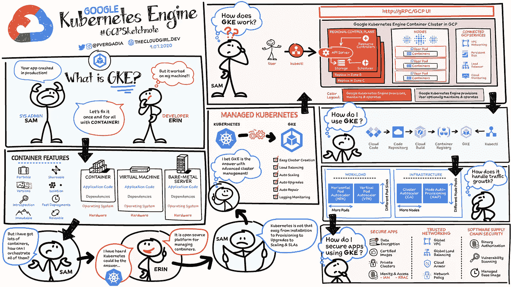

# 什么是谷歌 Kubernetes 引擎(GKE)？

> 原文：<https://medium.com/google-cloud/what-is-google-kubernetes-engine-gke-d2cb2d17178d?source=collection_archive---------1----------------------->

## 学习 GKE 的最佳小抄

## #GCPSketchnote

老实说，GKE 对我来说一直很酷，但直到几周前我在一个项目中使用它时，我才完全掌握了它的力量。我认为为他人创建笔记以利用我的研究可能是有用的。

## 以下是我为了解 GKE 而做的所有研究的笔记

谷歌 Kubernetes 引擎上的 GCP Sketchnote

你也可以查看解释者的视频，在那里我详细地介绍了这些概念

主题为“什么是 Google Kubernetes 引擎？”的讲解视频

# 后续步骤

如果你喜欢这个#GCPSketchnote，那就订阅我的 YouTube 频道👇我每周都会就一个话题发布一个草图！

 [## 云姑娘

### 我在这个频道分享云计算技术。您可以了解云基础架构、数据库、虚拟…

www.youtube.com](https://www.youtube.com/channel/UCfmz_Hi-G7sushJ_3mhLYvg?view_as=subscriber) 

跟随我的网站下载和打印👇

 [## 什么是 Google Kubernetes 引擎？#GCPSketchnote

### 了解所有关于集装箱和托管的 Kubernetes #GKE #GCPSketchnote

thecloudgirl.dev](https://thecloudgirl.dev/GKE.html) 

如果您对其他主题有想法或想法，并认为这种形式对您有帮助，请在下面的评论中提出！