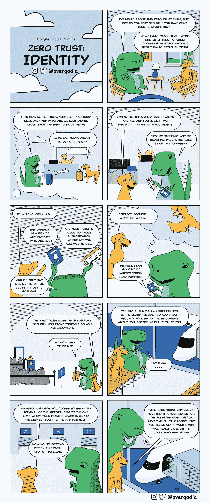

# 什么是零信任身份安全？

> 原文：<https://medium.com/google-cloud/what-is-zero-trust-identity-security-e6f58330a7a?source=collection_archive---------0----------------------->

## 什么是零信任身份安全？

## GCP 漫画#5 身份和零信任模型

权威人士:[普里扬卡·韦尔加迪亚](https://twitter.com/pvergadia) & [马克斯·萨隆斯托尔](https://twitter.com/maxsaltonstall)

 [## GCP 漫画

### 谷歌云漫画(GCP 漫画)

gcpcomics.com](https://gcpcomics.com/) 

一个*零信任*网络是一个没有人、设备或网络享有固有信任的网络。允许访问信息的所有信任都必须赢得，第一步是证明有效的身份。系统需要自信地知道你是谁，然后才能决定你应该访问什么。再加上对您可以访问的内容(授权)的理解，您就拥有了零信任安全的核心基础。

> 在谷歌，我们依靠一个被称为 beyond corp 的零信任系统，将*超越特权企业 T10 网络的概念。*

在本期 [**GCP 漫画**](https://gcpcomics.com/) 中，我们讨论了获得信任的方法，因为我们的朋友试图去拜访一些远房亲戚。

# 为什么要建立零信任模型？

以下是建立零信任系统的几个令人信服的理由:

*   保持您的员工在家、在办公室、在咖啡店或在任何其他地方工作的生产力
*   快速部署，比传统 VPN 系统更快，实现快速入职
*   快速启动新设备访问，以防意外的 latté应用于笔记本电脑和类似事件
*   为每个 web 应用程序提供自己的访问控制，以实现精确的安全性和较低的风险
*   根据身份、设备健康状况、位置、时间或其他因素决定访问

[Google 零信任工具](https://cloud.google.com/beyondcorp-enterprise)可以保护您在任何公共云或内部的工作负载，因此您无需移动应用程序来提高其安全性

# 零信任有什么好处？

## 更低的摩擦

零信任系统对你公司的员工来说是不可见的。他们登录，他们使用一个强大的第二因素，他们准备好了。

## 轻便

身份验证和授权与您的位置无关。以前的访问控制方法依赖于可信网络，向已建立的公司网络内的任何人授予特权访问权。在零信任模式下，在家工作并访问所有相同的系统和工具非常容易。

## 安全

转向零信任系统帮助谷歌和许多其他企业减少了暴露风险，最大限度地减少了安全事件，主动阻止了基于网络钓鱼的攻击和妥协后的横向移动。

# 资源

*   [BeyondCorp Remote Access](https://cloud.google.com/beyondcorp-enterprise) ，我们的企业级安全产品，用于保护 Google 云、其他云或内部的工作负载
*   [BeyondCorp 在谷歌](https://cloud.google.com/beyondcorp)，我们自己的零信任实现
*   [发表了关于谷歌如何创造、部署和发展 BeyondCorp 模式的研究论文](https://cloud.google.com/beyondcorp#researchPapers)。
*   [身份感知代理](https://cloud.google.com/iap)，谷歌云保护层，用于创建对应用、虚拟机和服务的基于上下文的访问。

想要更多的 GCP 漫画吗？请访问[**gcpcomics.com**](https://gcpcomics.com/)&关注我们的 medium[pvergadia](/@pvergadia/)&[max-salton stall](https://max-saltonstall.medium.com/)，并在 Twitter 上关注 [@pvergadia](https://twitter.com/pvergadia) 和 [@maxsaltonstall](https://twitter.com/maxsaltonstall) ，不要错过下一期！

 [## GCP 漫画

### 谷歌云漫画(GCP 漫画)

gcpcomics.com](https://gcpcomics.com/)