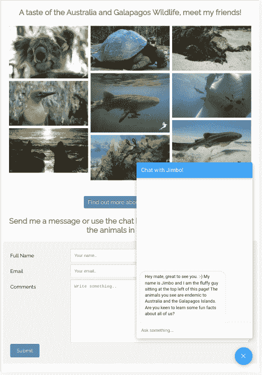
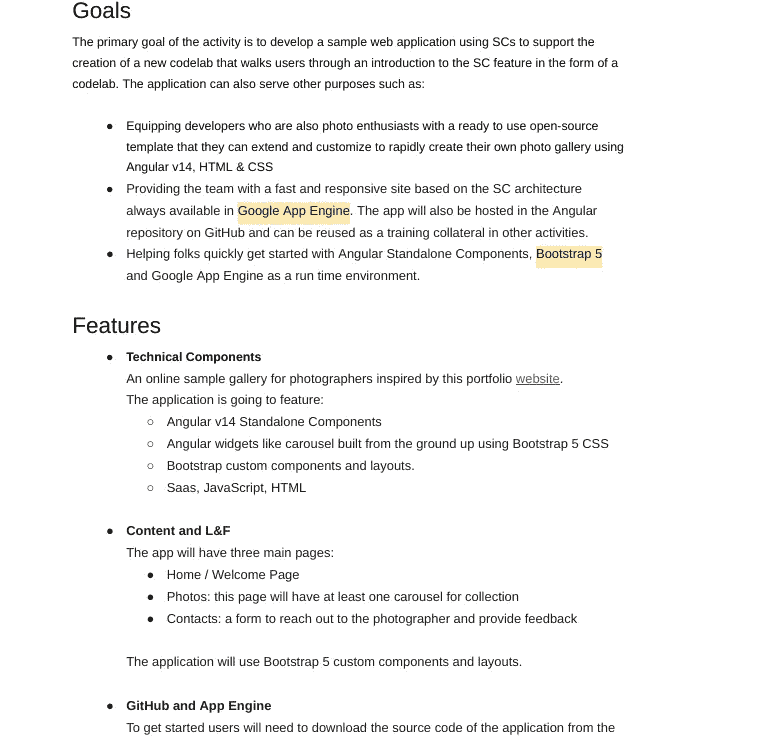
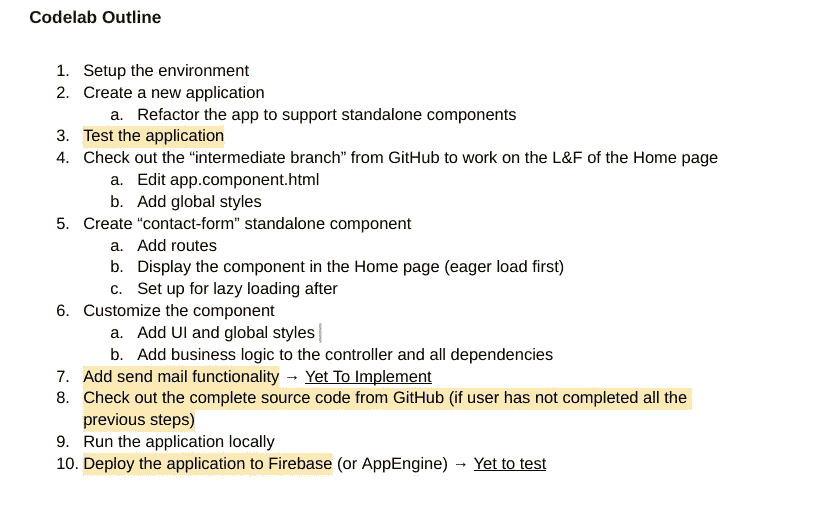

# 写代码实验室需要什么:我第一次体验开发者关系的幕后

> 原文：<https://medium.com/google-cloud/what-it-takes-to-write-a-codelab-behind-the-scenes-of-my-first-experience-in-developer-relations-5f6d4abecfa8?source=collection_archive---------2----------------------->

我一直对开发者关系很着迷。事实上，在我的职业生涯中，很多时候我都认为自己是一名 Dev Rel 工程师，然而我只是在 2020 年 6 月准备面试时才第一次发现 Dev Rel。那时候，在封锁期，我有足够的时间看 YouTube 视频和做 Qwicklabs:那正是我人生中第一次偶然发现开发者权益的时候。五月(差不多两年后)，Angular 开发人员关系团队给我提供了一个绝佳的机会，让我围绕 Angular v14 中独立组件的引入，支持现代“入门”之旅的开发。那是我的处女作:-)

注意:这篇博文是关于 Angular 独立组件的**而不是**。如果你在寻找资源了解它们的时候偶然看到了这篇博文，那就卷起袖子[去做代码实验室](https://codelabs.developers.google.com/angular-standalone-components?hl=en#0)！如果你决定继续阅读，你会了解它背后的旅程，以及在我看来，出版一部[谷歌开发者代码实验室](https://codelabs.developers.google.com/)需要的步骤。

如果你做 codelab，这就是你最终要构建的东西；-)

## 第 0 步:熟悉技术。学习、练习、实验。

作为独立组件 Angular v14 的一个全新特性，我需要自己弄清楚独立组件是如何工作的。这并不总是适用于每个 codelab，通常作者也是主题专家。我个人认为，与我们有时间消化的其他概念相比，我们倾向于更有效地解释我们最近刚刚吸收和理解的新鲜新概念。我的建议是，不管你的技术技能有多好，退一步想想那些会尝试你的代码实验室的人。在网上收集合适的资源，学习，实践，实验，学习。你觉得最难理解的是什么？你发现哪些技术/程序/方法是有益的？你认为主要的概念是什么？你经历的挑战很可能也是别人的痛点，把注意力放在那些上面。当你有信心时，进入下一步。在第一步中，你需要找到一种方法，使你经历的学习过程对其他人来说更容易。

## **第一步:仔细考虑你想要构建的应用程序**

代码实验室本身就是一次旅程，一个小时(或更长)的代码实验室将带用户进入一种身临其境的学习体验。

> “创造力是快乐的智力”(艾伯特·爱因斯坦)

想想过去在学校的美好时光:你取得最好成绩的科目不也是你最喜欢的科目吗？如果我们在开心的时候更有可能学习，那么你想写的代码实验室应该从头到尾都引人入胜。对于同一个主题，有多少示例和操作方法可用？成吨。当然，写作的清晰是最基本的，但是在我看来，有比这更重要的东西:你将要讲述的故事。

因为我个人在不忙的时候很难和任何人打交道，所以我花了相当多的时间考虑合适的应用程序。我希望 web app:1)直接而有效地让开发人员开始使用 Angular 独立组件功能 2)信息丰富和交互式 3)吸引人和新颖 4)与一些谷歌云平台服务集成 4)易于构建和测试。这个想法是在与 Mark 的一次会面中产生的，他是一位优秀的开发工程师，也是支持我这项计划的最佳导师。在谈论兴趣和爱好时，我向马克展示了我两年前制作的网上照片集，我记得看到他被这些照片所打动。这激发了一个简单的野生动物图片库应用程序的想法，它还具有一个“发送消息”表单来联系摄影师(我自己！)和一个聊天窗口来了解照片中动物的随机事实。我必须构建这个应用程序，最终目标是向他人强调和解释我之前学到的概念。之后，我打算在 Google Dialogflow CX 中创建聊天机器人“Jimbo ”,将其集成到应用程序中，并部署到 Google App Engine 中。我迫不及待地开始编码，尽管在此之前我需要写一页纸向团队描述整体想法并接收输入。

这是我写的一页纸的摘录，概述了照片库应用程序的目标和功能

## 第二步:建立一个 MVP，写一份代码实验室的大纲草案

一旦我从团队得到了普遍的积极反馈，我就继续前进，开发了应用程序的早期版本。我经历了几次迭代，例如在我最初的设计中，我想使用一个转盘来显示图像。在代码实验室工作时，要始终记住的一点是简单。一切都必须直观和简单，在我的情况下，目标不是让一个花哨的 UI 运行起来。时间是一个需要考虑的重要因素，codelabs 不应该花几个小时来完成。关注对开发者来说最重要的事情。例如，该应用程序的版本 1 使用了我从网上借来的非常漂亮的黑白 L&F(见下文)，结果是为了 codelab 而产生了复杂和不必要的 CSS。

应用程序的第 1 版

马克和我同意采用一个更轻便的用户界面，展示我自己的照片，因为它们没有版权。此外，根据 1 页和最初的设计，该应用程序将包括 3 页-主页，照片和联系人。这也不是一个好主意，但另一方面，我决定把所有内容都放在一个页面上:照片、一个“发送反馈”表单和聊天对话。更准确地说，表单和聊天窗口将成为同一个独立组件的一部分，只有当用户点击按钮时，该组件才会被加载和显示。Angular 中组件的延迟加载是一种常见的模式，因为它减少了加载页面的时间，提高了性能，增强了用户体验。简而言之，当创建一个 codelab 时，要期望多次迭代你的应用程序。当你开始构建它时，你会意识到必须包含的基本和必要的功能，以及相反可以省略的功能，以简化用户的学习工作。

随着应用程序的出现，写下 codelab 大纲的初稿，换句话说就是 codelab 本身的结构，是非常重要的。就像前者一样，后者将随着时间的推移而不断完善，并在编写 codelab 时进行调整。

在最初的 codelab 大纲中，这一点发生了相当大的变化。

## 需要考虑的事项

你需要做出决定，比如你是否想为开发者提供一个“中间分支”。通过给人们一个初始的 scheleton 来下载，他们将能够在 codelab 的核心主题上投入时间，而不用花太多时间在让早期应用程序启动和运行的初步步骤上。虽然这种方法从广义上来说是可行的，但是也有一些场景(比如这个)可能不是一个好主意或者根本不适用。在撰写本文时，独立组件是 Angular v14 的预览功能，因此您必须使用 Angular v14 创建一个全新的应用程序，然后删除“应用程序模块”。通过删除 app 模块，将不会留下任何模块，而是留下一个组件，即必须声明为独立的 app 组件。正如你所意识到的，重构最初的应用程序不仅仅是一个先决条件，也是 codelab 本身不可忽略的基本步骤。这就是为什么对于这个特定的 codelab，我们希望开发人员从头开始创建整个应用程序，codelab 将一步一步地帮助他们。已经说过，GitHub repo 包含完整的源代码，以便在遇到问题时可以使用，还包含图库页面上显示的图片。

## 步骤 3:编写代码实验室

一旦应用程序完成，我就开始创作代码实验室。每个 codelab 都应该以一个介绍开始，通常包括以下三个部分:你将构建什么，你将学习什么，你将需要什么(例如构建工件或现有帐户所需的开发环境，以及基础知识很重要的主题)。如果希望用户编写代码，介绍之后通常是环境设置(概述了完成实验所需的软件)和 GitHub 存储库。如前所述，根据目标和场景，存储库可能有两个独立的分支:一个分支包含完整的源代码，另一个“中间分支”通常提供初始的启动应用程序，开发人员将在此基础上构建应用程序的其余部分。codelab 的每一个主要部分都应该提供一个 racap，说明到那时为止已经做了什么，更重要的是简要介绍下一步要做什么以及为什么要做。“为什么”是必不可少的，否则代码实验室将变成一个没有方向感的步骤和行动的枯燥列表。请记住，最终目标是为用户简化和流线化一个非常复杂的主题的学习曲线。不要想当然，要清楚明白。正在阅读的人对事情和背景没有你同样的知识。使用正确的术语并提供图片来支持你的措辞，通常一张截图比一大堆文字更直观、更有力。此外，为了清晰起见，我总是建议在一系列代码片段的末尾展示完整的代码示例。最后，提醒用户尽可能频繁地保存更改和测试。最后但同样重要的是，你还记得之前我强调过在构建代码实验室时创造力和用户参与的重要性吗？找些能让它变得有趣的东西，把他们吸引过来。给开发者一些可以玩的东西，也许还可以与之互动。将游戏化添加到您的 codelab 中，这可以像通过考拉制作的聊天机器人学习关于鲨鱼和其他野生动物的酷事实一样简单！

## 第四步:测试然后再测试一遍！

测试是至关重要的，在创建 codelab 时和之后的评审过程中，多次测试 codelab 是绝对必要的。一旦我完成了第一个版本，我就假装是一个从未见过 codelab 的开发人员，开始测试每一个步骤。我一行一行地遵循它，从头开始创建和部署照片库应用程序，每当我发现一些不完整或不够清楚的东西时，就编辑 codelab。同行评审是必不可少的，我请马克为我测试所有的东西，以发现任何错误，并得到他对我的措辞的想法。谷歌开发人员代码实验室经历了一个非常勤奋的审查过程，其中包括工程和文案。产品工程师将改进和增强代码，而文案将专注于措辞和写作。对源代码或 codelab 的每一个更改都可能引入回归错误。作者有责任仔细合并任何修改以确保一致性。当 codelab 准备就绪并最终发布时，最后几个步骤需要将 codelab 从 gDocs 文档转换为 web 可视格式，并将源代码签入 Google 官方 GitHub 存储库。

总之，codelab 是想象力的产物，需要创造力、时间和奉献精神。它的主要目标是为开发人员学习一个特定的主题创造一条光明的前进道路。我相信为了成功，每一次学习经历都应该是鼓舞人心的。我写《独立组件入门》时牢记了这个原则。反馈是一份礼物，尝试一下，让我知道你的想法！