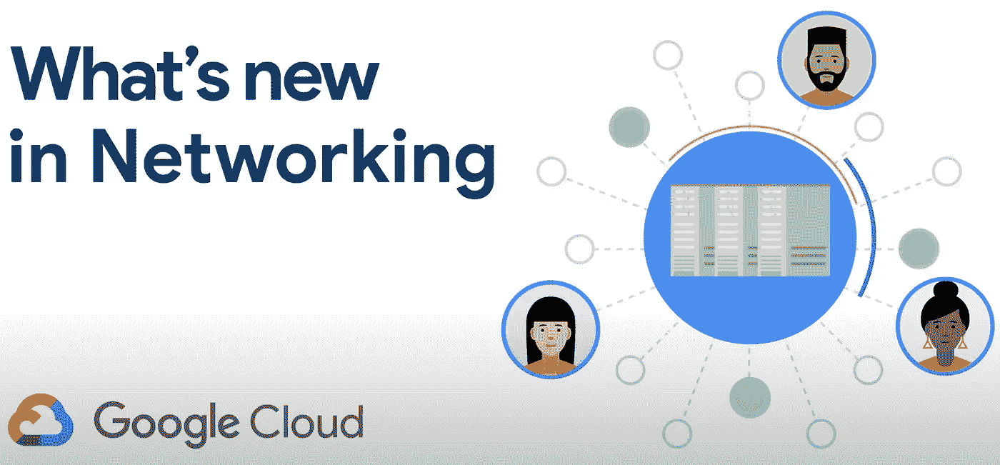
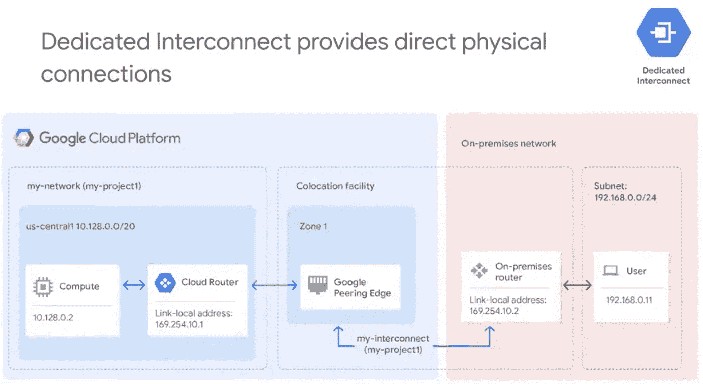
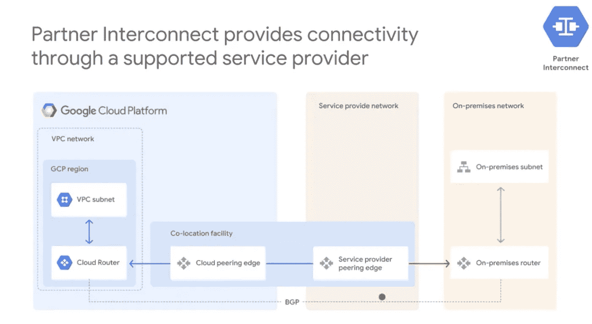

# GCP 的“网络”是什么

> 原文：<https://medium.com/google-cloud/whats-networking-in-gcp-9acd95cb78ef?source=collection_archive---------1----------------------->

正如我们所知，谷歌是全球性的，因此作为谷歌云平台(GCP)的客户，可以很容易地利用 GCP 的优势，让全球感受到它的存在，这也很容易。凭借谷歌提供的可靠、安全且高度可用的云平台，用户可以在 GCP 堆栈的基础上构建强大的服务。这不仅使他们能够拥有强大而可靠的基础设施，还让他们有机会轻松地将最新的解决方案&服务与其产品相集成。

网络是任何软件栈中最重要的组成部分，这个事实对于云计算也是如此。它是将你所有的资源和服务相互连接的网络。

GCP 使用的是建立在谷歌全球光纤基础设施之上的软件定义网络。在这篇文章中，我们计划分享一些最广泛使用的 GCP 组件。以下是本文所涵盖的项目列表:

1.  *虚拟私有云(通常称为 VPC)*
2.  *谷歌云中的负载平衡器*
3.  *云身份和访问管理*
4.  *混合连接*

让我们从任何云架构中最重要的部分开始，即建立网络基础。

# **虚拟私有云(VPC)**

GCP 由地区、区域和销售点(也称为 POP)组成。由于其广泛的全球网络，GCP 可以使其流量更接近其同行。这不仅降低了成本，还帮助用户获得更好的体验和更低的延迟。

VPC 只是你的物理网络的虚拟版本，在谷歌的生产网络中实现。VPC 为用户提供了一定程度的隔离，这种云中的隔离被称为虚拟私有云，其中云基础架构中调配的资源不会与任何其他用户共享。
VPC 的建筑资源为用户提供了一个构建安全环境的机会。

在谷歌云平台中，你可以创建你的 GCP 资源，将它们相互连接，并在虚拟私有云中将它们相互隔离。以下是您在创建新 VPC 时经常会遇到的 VPC 对象。

**1。** **项目-** 将保存您将要提供的所有对象和资源，如存储桶、计算引擎实例等。他们帮助我们组织 GCP 资源。项目通常包含整个网络。

**2。** **网络-**GCP 提供 3 种类型的网络。在设计用例时，每一个都有自己的选择理由。这 3 种类型描述如下:
2.1 **。** *默认*:除非禁用，否则每个新项目都以默认网络开始。默认网络是自动模式的 VPC 网络，带有预填充的 IPv4 防火墙 tules。
2.2。*自动*:自动模式 VPC 网络易于设置和使用。这些非常适合一般的用例，比如我们需要在每个区域自动创建子网。
自动模式网络有利于早期探索。但是，对于生产环境，建议使用自定义网络，这是更好的选择。
2.3 **。** *定制*:最灵活，也是生产的首选方式。它可以完全控制在您的 VPC 网络中创建的子网，包括区域和 IP 地址范围。

**3。** **子网-** 是区域性资源，每个子网定义一个 IP 地址范围。这允许您基于 IP 范围划分/隔离您的环境。

**4。** **地区/区域-** 代表谷歌数据中心，在这里将提供三种资源，它们提供安全、可靠和高可用性。

**5。** **IP 地址**(内部/外部) **-** 在 GCP，每个虚拟机可以分配两个 IP 地址:内部 IP 和外部 IP。
-*DHCP 分配的内部 IP* 。
- *外部 IP* 是可选的 IP，当应用是面向互联网的应用时最需要。
事实上，虚拟机的操作系统不知道外部 IP 地址。外部 IP 地址通过 VPC 透明地映射到虚拟机内部地址。
有时需要禁用互联网访问，但是您仍然需要访问 google api 来执行各种任务。在这种情况下，您可以在 vpc 中启用对私有 google api 的访问。

**6。****GCP 的资源**指的是谷歌云中的不同对象，如项目、文件夹、服务账户、计算引擎实例等。

**7。** **路由**:默认情况下，每个网络都有路由，让网络中的实例直接互相发送流量。仅仅确保路由并不能确保数据包的传输。您还必须有相应的防火墙规则。
可以通过设置适当的组织策略来禁用默认路线。

**8。** **防火墙**规则保护您的实例免受未经批准的入站和出站连接。防火墙规则作为一个整体应用于网络，但在实例级允许或拒绝连接。防火墙规则是有状态的，即如果一个连接被允许，则同一连接中的所有后续事务也将被允许。

以下是您在配置防火墙规则时应该记住的一些关键参数:
- *方向*:入口/出口
- *源或目的地* : ip 地址、标签或服务帐户
- *协议和端口*-
-*操作*-
-*优先级*-
-*规则分配*

**分级防火墙策略:**分级防火墙策略允许规则覆盖任何具有较低优先级或处于分级结构中较低级别的拒绝规则。

9。多个网络接口:您可以通过网络接口控制器或 NIC 创建附加的网络接口连接到您的虚拟机。多个网络接口使您能够创建配置，其中一个实例直接连接到多个 VPC 网络。每个实例还必须有一个内部 IP 地址。
多个网卡有助于解决不同网络之间需要通信的情况。

我们现在将讨论列表中的下一个重要项目，即 google Cloud 中的负载平衡器。

# **谷歌云中的负载平衡器**

负载平衡器位于您的服务器前面，将您的客户端请求路由到能够满足这些请求的不同配置的服务器。

它可以在多台服务器之间高效地分配传入流量。
云负载平衡允许您将您的资源放在一个 IP 地址之后，该 IP 地址可以从外部访问，也可以在虚拟专用云(VPC)网络内部访问。

1.  **全局负载平衡器:**全局负载平衡器的后端可以跨越不同的区域。以下是可用的全局负载平衡器的类型:
    -***HTTP(s)LB
    -SSL 代理
    - TCP 代理***
2.  **区域负载平衡器:**后端可以跨到同一区域但不同的区域。以下是 GCP 可用的区域负载平衡器的类型。
    **-** ***网络 LB
    -内部 L4 LB
    -内部 HTTP(S) LB***

# **云身份和访问管理(Cloud IAM)**

这是一种识别谁可以在哪些云资源上执行哪些操作的方式。本节重点介绍对 VPC 网络的访问控制。

身份和访问管理是识别在 GCP 资源上执行操作的用户/帐户的一种方式。借助 Cloud IAM，我们可以在不同级别设置策略，其中策略包含一组角色和成员。
你应该熟悉的另一个术语是“最小特权原则”,这通常被称为任何云环境中的最佳实践。

**成员:** 有 5 种不同类型的成员定义了**谁**部分:

***(i)*** *谷歌账户*:代表开发者/管理员或任何其他与 GCP 互动的个人。
***(ii)****服务帐户*:表示属于您的应用程序而不是个人用户的帐户。通常，为应用程序的不同逻辑组件创建不同的服务帐户，以确保更好地分离访问和逻辑。
***(iii)****Google groups*:这是一个命名的 Google 帐户和服务帐户的集合，每个组都有一个唯一的地址。
***(iv)****G Suite domains*:这代表了在一个组织 G Suite 帐户中创建的所有 google 帐户的虚拟组。
***(v)****云身份域*:类似于 G 套件域，因为它代表一个组织中所有 google 帐户的虚拟组。

**角色** :
在本节中，我们将更多地讨论云 IAM 的**和**部分。在云 IAM 中有 3 种类型的角色:
*1。基本角色*:提供访问不同资源的角色。有 4 个基本角色:查看者、编辑者、所有者和计费管理员
*2。预定义角色*:这些角色为特定服务提供粒度访问，由 google cloud 管理。
*3。自定义角色*:这些是用户定义的角色，允许您捆绑一个或多个受支持的权限，以满足您的特定需求。

**动作:** 虽然可以在云资源上执行的动作是一个有趣且更广泛的话题。但是为了简单起见，我试着把它放在一些常用的表示“动作”的词下面。
动作基本上涵盖了**什么**部分**。**这部分由动词组成，如创建资源、删除资源、编辑这些资源、查看资源。

# 混合连接

谷歌支持多种方式连接你的基础设施和 GCP。下面是我们已经介绍过的四种方法:
1。云 VPN
2。专用互连
3。合作伙伴互联
4。直联
5。运营商对等

*   *专用连接:*客户之间的直接连接就像直接对等网络一样，专用互连已经建立。
*   *共享连接:*间接连接，通过运营商对等、合作伙伴互连等合作伙伴提供与谷歌网络的连接。

**云 VPN :** 是谷歌自己的虚拟专用网，使用公共互联网，但所有通过该网络的流量都被加密。这是对运营商对等/直接对等的有益补充。
您也可以使用云 VPN 作为您自己的房屋和 GCP VPC 网络之间的主要连接。

云 VPN 是 GCP 提供的产品，使您的内部网络能够通过 VPN 隧道与 GCP VPC 网络建立网络。流量在一端加密，然后在另一端解密，从而确保数据在公共互联网上传输时保持加密形式。

有两个选项可以选择:
1。经典 VPN 网关
2。高可用性 VPN 网关

# 云互联

互连通过 SLA 提供对 VPC 中 RFC1918 IPs 的直接访问。有两种可用的云互连服务:

**1。专用互连:**提供内部网络和 google 网络之间的直接物理连接。这使您能够更高效地传输大量数据。
Google network 和 onpremise network 在一个公共托管设施上建立交叉连接。

专用 Inteconnect 可以配置为提供 99.9%或 99.99%的 SLA。

**2。合作伙伴互连:**通过受支持的服务提供商提供连接。当物理数据中心无法通过专用互连进行连接时，这非常有用。

这些受支持的服务提供商已经与谷歌网络建立了物理连接，供他们的客户使用。在内部客户和服务提供商之间的连接建立之后，用户可以向服务提供商请求伙伴互连连接。

# **云对等**

云对等仅提供对谷歌公共 IP 的访问，而不需要 SLA。GCP 提供两种云对等服务。当需要访问谷歌和谷歌云属性时，这些服务非常有用。

**1。直接对等:**提供您的企业网络和谷歌网络之间的直接连接。与 google 的直接对等是通过在 google 和对等实体之间交换 BGP 路由来实现的。

**2。运营商对等:**通过支持的伙伴提供连接。一旦建立了连接，你就可以访问所有的谷歌套件和服务。

理想情况下，这些主题中的每一个都值得单独写一篇文章来做适当的评价，但是这里的目的是提供一个简短的摘要，提供关于这些组件的总体想法。我们将计划在另一篇深入理解的文章中更详细地讨论这些单独的主题。

**参考文献:**

1.  Google cloud specialization(Coursera)中的联网:[https://www . Coursera . org/specializations/networking-Google-cloud-platform](https://www.coursera.org/specializations/networking-google-cloud-platform)
2.  云负载均衡器:[https://cloud.google.com/load-balancing/docs](https://cloud.google.com/load-balancing/docs)/
3.  云 https://cloud.google.com/vpc:/docs/
4.  云 IAM:[https://cloud.google.com/iam/docs/](https://cloud.google.com/iam/docs/)
5.  云 VPN:[https://cloud . Google . com/network-connectivity/docs/VPN/concepts/overview](https://cloud.google.com/network-connectivity/docs/vpn/concepts/overview)
6.  云互联:[https://cloud . Google . com/network-connectivity/docs/Interconnect # docs](https://cloud.google.com/network-connectivity/docs/interconnect#docs)