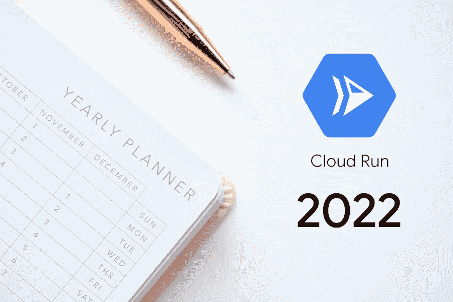

# 云运行 2022 的新功能

> 原文：<https://medium.com/google-cloud/whats-new-in-cloud-run-2022-fcaadb0a5e16?source=collection_archive---------0----------------------->

2022 年 Cloud Run 为我解决的 5 大问题。



自今年开始，云运行已在 6 个新区域启用，并实施了许多新功能。

> **问题 1:如何在不增加更多 CPU 内核的情况下更快地启动我的容器？**

考虑到成本节约措施，建议只为云运行容器分配必要的 CPU 核心。但是，如果我们能够更快地启动容器而不永久增加更多 CPU，那就太好了。

现在云运行中又多了一个新功能，[启动 CPU Boost](https://cloud.google.com/run/docs/configuring/cpu#startup-boost) 。这个特性允许您在启动时使用更多的 CPU 内核来启动容器。一旦您的容器开始监听请求，内核的数量就会减少到一个定义的限制。一旦容器实例[在配置的端口](https://cloud.google.com/run/docs/container-contract#port)上侦听，请求将被发送到容器实例。

*在容器启动期间，您需要为分配的提升 CPU 付费。例如，如果您的容器启动时间为 10 秒，并且您分配了 2 个 CPU 核心，并且您启用了启动加速，那么在这 10 秒的启动时间内，您将为 4 个 CPU 核心付费。*

```
**Existing Services:**
gcloud beta run services update **SERVICE** --cpu-boost**During Deployment:**
gcloud beta run deploy --image **IMAGE_URL** --cpu-boost
```

> **问题 2:如何在云运行中为我的容器配置健康检查？**

云运行提供了两种类型的运行状况检查。

*   **启动检查**

启动检查使用 HTTP 启动探测器来检查容器是否已正确启动以及是否正常。

配置启动探测器后，Cloud Run 向服务健康检查端点(例如，`/ready`)发出 HTTP GET 请求。`200`和`400`之间的任何响应都是成功的，其他的都表示失败。如果启动探测在指定时间(不能超过 240 秒)内没有成功，容器将被关闭。

*   **活性检查**

一旦我们启动了我们的应用程序，我们需要确保我们的应用程序是健康的，并且始终能够公平地响应。启动检查只能确定我们是否成功启动了应用程序。

我们可以定期进行活性检查。在配置了活跃度探测并且任何启动探测都成功之后，Cloud Run 向服务健康检查端点发出 HTTP GET 请求(例如，`/health`)。`200`和`400`之间的任何响应都是成功的，其他的都表示失败。如果启动探测在指定时间(不能超过 240 秒)内没有成功，容器将被关闭。

*注意:目前我们只能通过 YAML 文件配置运行状况检查。对文件的任何更改都会创建容器实例的修订版*

> **问题 3:我可以基于** [**OCI 标准**](https://github.com/opencontainers/image-spec) **部署容器吗？**

在非常高的层次上，映像由几个组件组成，包括映像清单、映像索引、工件清单、映像布局、文件系统以及包配置和描述符。

与包含关于一组可以跨越各种架构和操作系统的映像的信息的[映像索引](https://github.com/opencontainers/image-spec/blob/main/image-index.md)不同，映像清单为特定架构和操作系统的单个容器映像提供了一个配置和一组层。

最近，云运行采用了图像的 OCI 标准。这确保了云运行与开放标准更加兼容。

```
"mediaType": "application/vnd.oci.image.manifest.v1+json"
```

> **问题 4:有没有可能将来自给定客户端的顺序请求重定向到同一个修订容器实例？**

理想情况下，我们需要考虑无状态机器等实例，请求可以在应用程序的任何实例中处理。但是有些情况下，出于各种原因，比如优化性能、缓存、重用现有连接等，我们希望将顺序请求发送到同一个容器。

现在，我们可以将云运行中的**会话相似性**特性用于相同的用例。Cloud Run 使用 TTL 为 30 天的会话关联 cookie，并检查其值以识别同一客户端的多个请求，并将所有这些请求定向到同一实例。

```
gcloud beta run services update **SERVICE** --session-affinity
```

*但是，请注意容器实例可以接收来自不同客户端的请求。会话相似性并不意味着容器实例只专用于一个客户端。*

> **问题 5:有没有可能配置少于 1 个 CPU 的云运行实例？**

最近云跑更新了最低 CPU 限制为 **0.08。**换句话说，我们可以配置一个单核 CPU 8%功率的云运行实例。

*如果您想使用少于 1 个 CPU，您可以选择 0.08 到 1 之间的任何值，增量为 0.01。任何大于 1 的值都必须是整数值。*

参考资料:

[](https://cloud.google.com/run/docs/configuring/cpu#startup-boost) [## CPU 限制|云运行文档|谷歌云

### 本页描述了如何为每个云运行容器实例指定要使用的 CPU 数量。默认云…

cloud.google.com](https://cloud.google.com/run/docs/configuring/cpu#startup-boost) [](https://cloud.google.com/run/docs/configuring/healthchecks#liveness-probes) [## 容器健康检查(服务)|云运行文档|谷歌云

### 预览-在云运行中使用运行状况检查 Google Cloud 的正式发布前产品条款涵盖了此功能…

cloud.google.com](https://cloud.google.com/run/docs/configuring/healthchecks#liveness-probes) [](https://cloud.google.com/run/docs/configuring/session-affinity) [## 设置会话关联性(服务)|云运行文档| Google 云

### 预览-使用云运行会话相似性此功能包含在 Google Cloud 的预发布产品条款中…

cloud.google.com](https://cloud.google.com/run/docs/configuring/session-affinity)