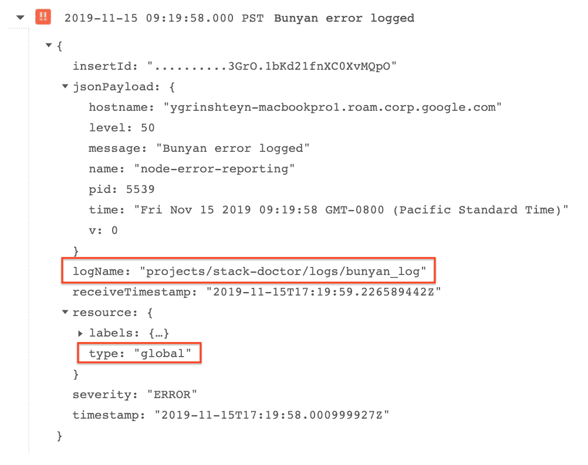
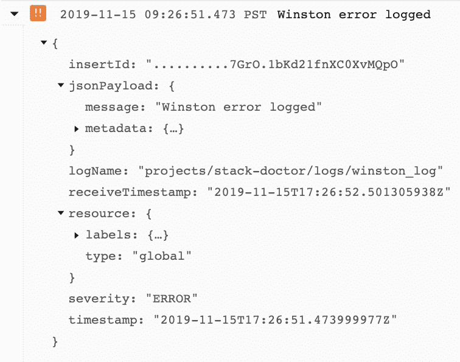
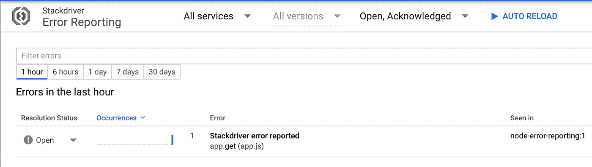
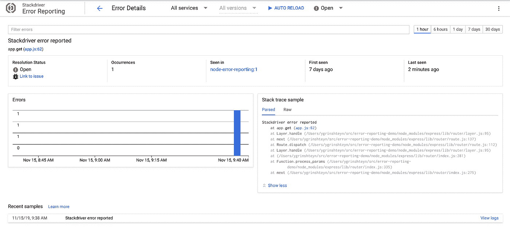
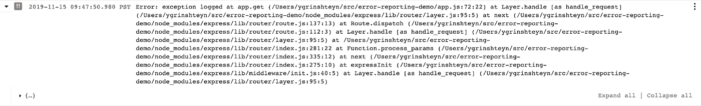
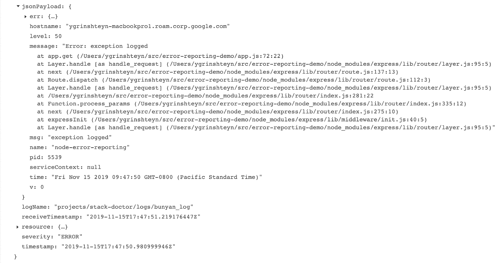
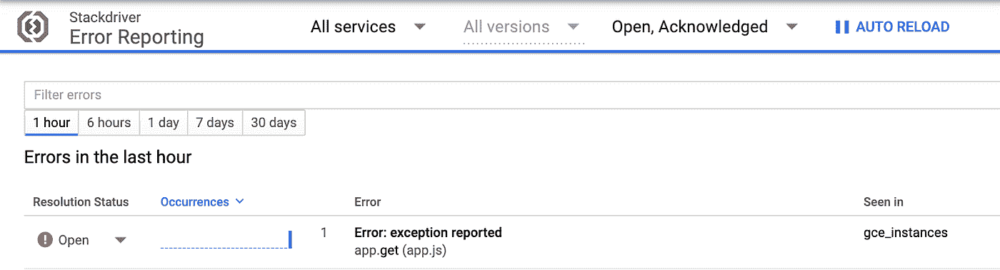
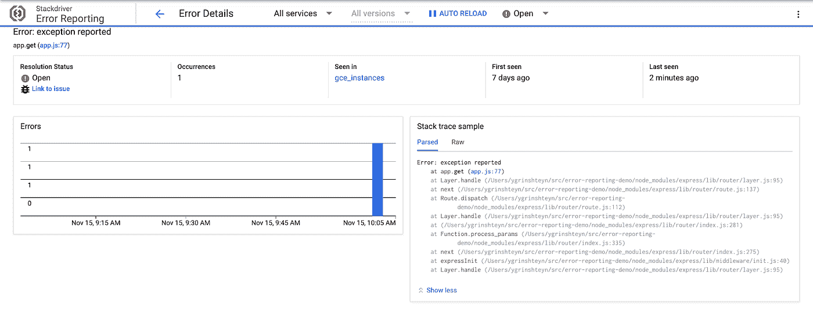
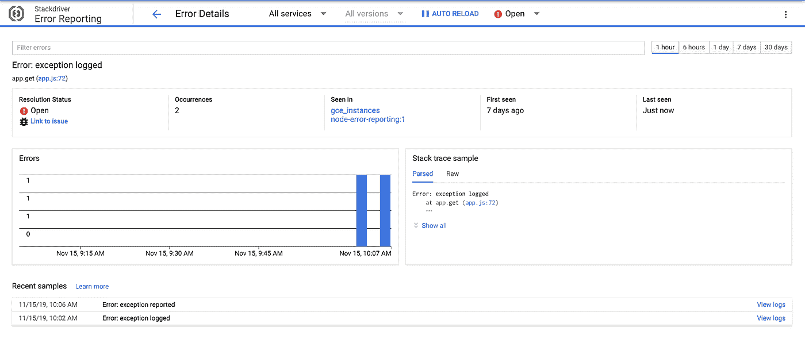
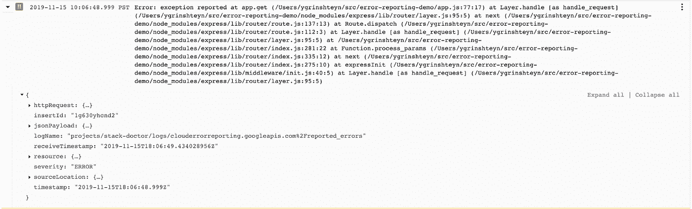

# 记录错误的最好方法是什么(在 Node.js 中)？

> 原文：<https://medium.com/google-cloud/whats-the-best-way-to-log-errors-in-node-js-b3dfd2fe07a7?source=collection_archive---------0----------------------->

我想回答另一个主要在我脑海中的系列问题，题目是“人们经常问我的事情”。本系列今天的内容是关于将错误记录到 Stackdriver 中。具体来说，我发现人们对错误日志记录的多种选项有些困惑，当他们想要了解如何记录和跟踪异常时，情况就更是如此。我的观点是，这部分是由于 Stackdriver 提供了支持这一点的多个特性——错误报告和日志记录。这更加令人困惑，因为错误报告在某种程度上是日志记录的一个子集。因此，当我试图在一个示例 Node.js [app](https://github.com/yuriatgoogle/stack-doctor/tree/master/error-reporting-demo) 中使用日志记录和错误报告来记录错误和异常时，我开始探索到底会发生什么。让我们看看我发现了什么！

# 记录错误

我认为人们面临的困惑始于这样一个事实，即 Stackdriver 实际上支持登录 Node.js 的三种不同的[选项](https://cloud.google.com/logging/docs/setup/nodejs)——Bunyan、Winston 和 API 客户端库。我想看看前两个是如何处理错误日志的。在这一点上，我不认为我们建议直接使用客户端库(就像我们建议使用 OpenCensus 进行度量遥测一样，而不是直接调用监控 API)。

# 用班扬语伐木

[文档](https://cloud.google.com/logging/docs/setup/nodejs)非常简单——在我的应用中设置班扬日志非常容易。

从此，记录错误消息就像下面这样简单:

当我运行我的应用程序时，我在控制台中看到了以下日志输出:

```
{"name":"node-error-reporting","hostname":"ygrinshteyn-macbookpro1.roam.corp.google.com","pid":5539,"level":50,"msg":"Bunyan error logged","time":"2019-11-15T17:19:58.001Z","v":0}
```

在 Stackdriver 日志中:



请注意，该日志条目是针对“全局”资源创建的，因为该日志条目是从我的本地机器发送的，该机器没有运行在 GCP 上，并且日志名是 bunyan_log。输出的结构很好，严重性设置为 ERROR。

# 与温斯顿一起记录

我再次按照文档设置 Winston 客户机:

然后我记录了一个错误:

这一次，控制台输出更加简洁:

```
{"message":"Winston error logged","level":"error"}
```

以下是我在日志查看器中看到的内容:



严重性再次被正确设置，但是这个条目中的信息要少得多。例如，我的主机名没有被记录。对于那些希望减少记录的数据量，同时仍然保留足够的有用信息的人来说，这可能是一个不错的选择。

# 错误报告

至此，我对记录错误的工作原理有了很好的理解。接下来，我想研究为此目的使用错误报告是否会提供额外的价值。首先，我在应用程序中设置了错误报告:

然后，我使用客户端发送了一个错误:

这一次，控制台中没有输出，也没有任何内容被记录到 Stackdriver 日志中。我去错误报告找到我的错误:



当我点击错误时，我能够得到很多细节:



这很好，因为我可以看到错误何时开始发生，如果错误继续发生，我会得到一个直方图，并且我会得到一个完整的堆栈跟踪，显示我的代码中错误发生的确切位置——这些都是非常有价值的信息，我无法通过简单地记录错误严重性来获得这些信息。

这里的权衡是，该消息永远不会到达 Stackdriver 日志。这意味着我不能使用通过错误报告报告的错误，例如，创建基于[日志的指标](https://dev.to/yurigrinshteyn/can-you-alert-on-logs-in-stackdriver-1lp8)，这可能会产生很好的 SLI 和/或警报策略条件。

# 记录异常

接下来，我想研究如果我的应用程序抛出一个异常并记录下来会发生什么——它会如何出现？我使用 Bunyan 记录了一个异常:

控制台输出包含整个异常:

```
{"name":"node-error-reporting","hostname":"<hostname>","pid":5539,"level":50,"err":{"message":"exception logged","name":"Error","stack":"Error: exception logged\n    at app.get (/Users/ygrinshteyn/src/error-reporting-demo/app.js:72:22)\n    at Layer.handle [as handle_request] (/Users/ygrinshteyn/src/error-reporting-demo/node_modules/express/lib/router/layer.js:95:5)\n    at next (/Users/ygrinshteyn/src/error-reporting-demo/node_modules/express/lib/router/route.js:137:13)\n    at Route.dispatch (/Users/ygrinshteyn/src/error-reporting-demo/node_modules/express/lib/router/route.js:112:3)\n    at Layer.handle [as handle_request] (/Users/ygrinshteyn/src/error-reporting-demo/node_modules/express/lib/router/layer.js:95:5)\n    at /Users/ygrinshteyn/src/error-reporting-demo/node_modules/express/lib/router/index.js:281:22\n    at Function.process_params (/Users/ygrinshteyn/src/error-reporting-demo/node_modules/express/lib/router/index.js:335:12)\n    at next (/Users/ygrinshteyn/src/error-reporting-demo/node_modules/express/lib/router/index.js:275:10)\n    at expressInit (/Users/ygrinshteyn/src/error-reporting-demo/node_modules/express/lib/middleware/init.js:40:5)\n    at Layer.handle [as handle_request] (/Users/ygrinshteyn/src/error-reporting-demo/node_modules/express/lib/router/layer.js:95:5)"},"msg":"exception logged","time":"2019-11-15T17:47:50.981Z","v":0}
```

日志条目如下所示:



jsonPayload 包含一个异常:



这绝对是很多有用的数据。接下来，我想看看错误报告是否像[宣传的那样有效，并在日志中将这个异常识别为一个错误。仔细阅读文档后，我意识到这个功能特别适用于 GCE、GKE、App Engine 和云函数，而我只是在本地桌面上运行我的代码。我尝试在 Cloud Shell 中运行代码，并立即在错误报告中获得了一个新条目:](https://cloud.google.com/error-reporting/docs/setup/nodejs)



详细视图中提供了异常的完整堆栈跟踪:



因此，记录一个异常给了我最好的**和**两个世界——我得到了一个日志条目，可以用于基于日志的度量，我还得到一个错误报告条目，可以用于分析和跟踪。

# 报告异常

接下来我想看看如果我使用错误报告来报告相同的异常会发生什么。

同样，没有控制台输出。我的错误立即出现在错误报告中:



令我有些惊讶的是，我还能在日志中看到一个条目:



事实证明，异常记录在错误报告和日志记录中——无论您使用哪一个来发送它们。

# 那么，现在怎么办？

以下是我从这个练习中学到的东西:

1.  Bunyan 日志记录比 Winston 日志记录更详细，如果成本是个问题，可以考虑这一点。
2.  **异常**可以通过日志或错误报告发送到 Stackdriver 它们将在两者中都可用。
3.  使用错误报告来报告**非异常**错误为开发人员增加了很多价值，但是对于需要使用度量或 sli 日志的 sre 或 ops 人员来说，却失去了价值。

感谢您的加入—欢迎再次光临！