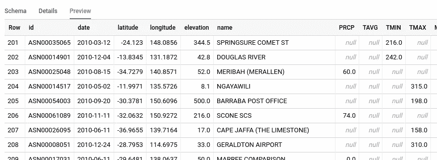
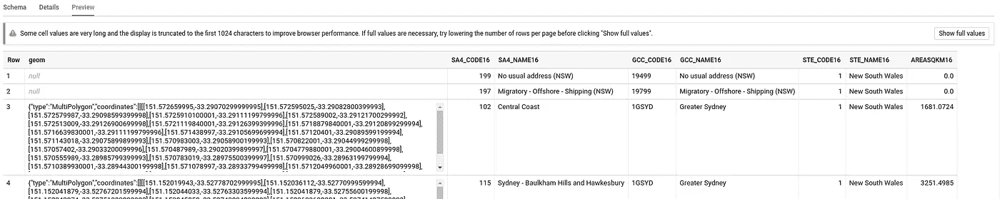
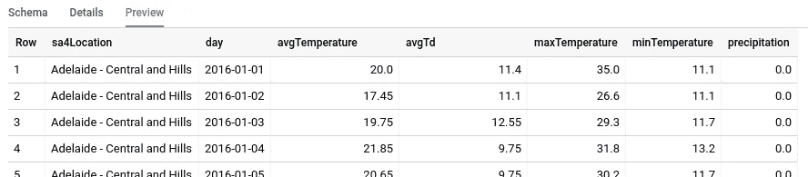
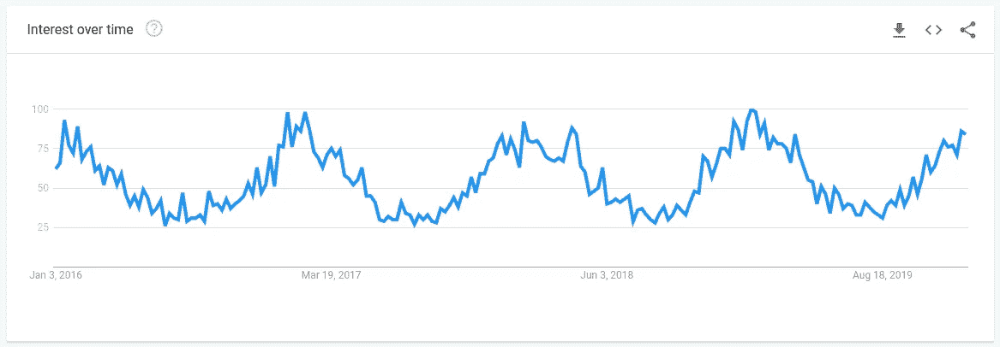
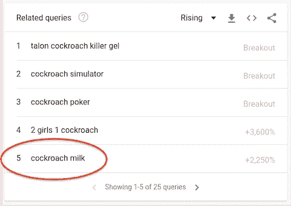

# 虫子什么时候来？BigQuery 中的 ML 建模预测下一次 bug 爆发

> 原文：<https://medium.com/google-cloud/when-are-the-bugs-coming-ml-modelling-in-bigquery-to-predict-the-next-bug-outbreak-656f16a0e199?source=collection_archive---------1----------------------->

首先，新年快乐🎉随着澳大利亚夏天的到来，我们带着一点乐趣开始了 2020 年，试图回答每个人在澳大利亚每年这个时候都在想的问题(尤其是我的妻子和孩子！)也就是——虫子什么时候来？！那就是预测蟑螂和蚊子(又名蚊子)的爆发。

bug 预测项目实际上早在十月份就已经开始了。在夏季到来之前，我们有足够的时间进行研究、迭代和测试——相应地，错误也进入了状态。在这篇博文中，我们将分享我们遵循的技术解决方案，以及一个高层次的解决方案会是什么样子。

全部使用 Google Cloud BigQuery，利用 BigQuery 的地理、分析和 ML 功能。

**简单介绍一下，给那些不认识我们的人**

我是[引来的](https://www.linkedin.com/in/drewjarrett/)。我已经在谷歌工作了一段时间。我目前的角色是客户解决方案工程师，帮助我们的广告客户充分利用他们的网站、应用和数据。全都来自我在美丽的悉尼的办公桌。

我是[丹尼斯](https://www.linkedin.com/in/dennis-jordan-11995b46/)。在过去的六年多时间里，我一直是悉尼谷歌的分析师和顾问，致力于利用数据为广告客户问题提供见解、策略和解决方案，在这个职位上，我对 ML 产生了真正的热情。

你说天气？


是的，天气！天气模式成为我们在这个模型中的主要特征，因为它们已经被证明对昆虫数量有影响。利用历史天气数据，我们可以寻找一段时间内的模式和病毒爆发之间的相关性。考虑到温度、降水/降雨量、湿度…(以及更多的潜在因素)。

**历史天气数据**

由于这是一个有趣的实验，我们将使用[全球历史气候网络(GHCN)](https://cloud.google.com/blog/products/gcp/global-historical-daily-weather-data-now-available-in-bigquery) BigQuery 公共数据集。NCAR 天气数据包含了 10 年来 180 个国家的 80，000 多个气象站的报告。它甚至已经过质量检查。在 BigQuery 中可用。完美。

此外，由于我们只关心澳大利亚的天气趋势，我们将大量减少这一集，只列出当地的气象站(尽管有一天在全球范围内看这个会很有趣)。

…瞧，这是一个*澳大利亚历史天气*数据表，大小约为 1.36 MB / 17，088 行，随时可用。



**澳大利亚州界**

通常，气象数据与气象站的纬度/经度位置相关联。NCAR 的数据就是这种情况。因此，第一个真正的挑战是将这些纬度/经度位置映射和滚动到更有意义的地理位置，如城镇、城市或州。

在本帖中，我们将选择状态级别(考虑到即将讨论的趋势信息)，来进行 bug 爆发预测。


澳大利亚统计局(abs.gov.au)网站维护“统计区”位置。使用 [ABS 地图](https://itt.abs.gov.au/itt/r.jsp?ABSMaps)我们可以下载“ESRI Shapefile 格式的州和地区(STE) ASGS Ed 2016 数字边界”。shp 文件，它详细描述了澳大利亚所有州的边界(类似于 Google Maps 中的州边界截图)。

该数据还包括每个州的面积(平方公里)。不错！让我们也确保保持这一点，它在以后会是一个有用的特性👍。

下载后，我们可以转换形状文件。shp)转换成 BigQuery 可以使用的. csv 文件。使用这种工具的一个例子是 [ogr2ogr](https://gdal.org/programs/ogr2ogr.html) ，例如…

```
ogr2ogr -f csv -dialect sqlite -sql “select AsGeoJSON(geometry) AS geom, * from SA4_2016_AUST” SA4_2016_AUST.csv SA4_2016_AUST.shp
```

Lak Lakshmanan 撰写的关于如何将 shapefiles 之类的地理数据加载到 BigQuery 的精彩文章很好地涵盖了这一点。

一旦 CSV 可用，就可以上传到 BigQuery，创建一个*Australia _ state _ boundaries*表来使用，大小为 87.9 MB / 107 行。

提示:当你上传数据到 CSV 时，不要使用自动检测。相反，请指定一个模式，以便 geometry 列可以是 GEOGRAPHY 类型。这将避免我们在下面的查询中使用 ST_GeogFromGeoJson。



**将天气数据映射到状态**

现在我们有了*Australia _ state _ boundaries*表，这是比较容易的部分。BigQuery 的地理功能简化了事情，允许我们聚集州边界内的天气数据。

```
WITH australia_state_boundaries AS (
  SELECT
    geom AS polygon,
    STATE_NAME_2016 AS stateLocation
  FROM `[project].[dataset].australia_state_boundaries`
)SELECT
  australia_state_boundaries.stateLocation,
  day,
  AVG(avgTemperature) AS avgTemperature,
  AVG(avgTd) AS avgTd,
  MAX(maxTemperature) AS maxTemperature,
  MIN(minTemperature) AS minTemperature,
  AVG(precipitation) AS precipitation
FROM
  `[project].[dataset].australia_historical_weather`,
  australia_state_boundaries
WHERE
  ST_WITHIN(
    ST_GEOGPOINT(longitude, latitude),
    australia_state_boundaries.polygon)
GROUP BY sa4Location, day
```

同时在 SQL 中创建最大值、最小值和平均值。让我们把这个新表叫做*澳大利亚 _ 州 _ 历史 _ 天气*。



**谷歌漏洞爆发趋势**

[Google Trends](https://trends.google.com/trends/explore?date=today%205-y&geo=AU&q=Cockroaches) 是一款分析谷歌搜索查询的工具。看看“蟑螂”这个词，很明显趋势数据是疾病爆发的一个有用指标，你可以看到(在这张来自谷歌趋势的截图中)随着澳大利亚接近夏天，这个主题的搜索量在增加。



因此，这是我们将尝试预测的值，即我们的 ML 模型中使用的标签。趋势工具允许您按州进行过滤，并按 CSV 下载信息。

再加上*Australia _ state _ historical _ weather*表，我们现在就有了一个包含最近几年天气和臭虫趋势的数据集。

顺便说一句。趋势工具还有一个“相关查询”部分，显示用户还搜索了什么(截图示例)…



但是无论你做什么，当你在蟑螂趋势页面上的时候，不要看这个部分…当你不看它的时候，绝对不要看蟑螂奶的相关查询！无论你做什么，不要让好奇心战胜你，去搜索发现这是一种新的健康热潮🙈！我永远不会以同样的方式看待世界[🤮](https://emojipedia.org/face-with-open-mouth-vomiting/)。

**训练我们的“小车”ML 模型**

那是[bug](https://www.google.com/search?tbm=isch&as_q=bugs)，不是[bug](https://en.wikipedia.org/wiki/Software_bug)，ML 车型。

我们将把数据集分解成多个窗口要素，然后汇总一段时间内的行为模式。要理解这个概念，请查看我的[结构化数据预测未来](/@drewjarrett/structuring-data-to-predict-the-future-aka-project-flux-capacitor-7133715d7e57)帖子。

由于数据相当简单，我们可以在 BigQuery 中完成所有工作。为此，我们将利用 BigQuery 的分析功能 [PARTITION BY](https://cloud.google.com/bigquery/docs/reference/standard-sql/analytic-function-concepts) 来聚合数据。

例如，下面的 SQL 为蚊子创建了一个数据集。

*   它每天聚集 1 周的数据，创建过去模式的特征。PARTITION BY sa4 location ORDER BY day 行位于 EN 7 之前和 0 之后。
*   它还展望了 4 周，以创建一个标签来训练模型展望未来。在 EN 29 之后和 29 之后之间按日行的 sa4 位置顺序进行分区。

```
SELECT
  state,
  EXTRACT(MONTH FROM day) AS month,
  EXTRACT(DAYOFYEAR FROM day) AS dayOfYear,
  EXTRACT(WEEK FROM day) AS weekOfYear, — Label
  SUM(mosquitoSearchVolume) OVER (PARTITION BY sa4Location ORDER BY day ROWS BETWEEN 29 FOLLOWING AND 29 FOLLOWING) AS mosquitoSearchVolume4WeekLabel, — 1 Week Volume Features
  mosquitoSearchVolume / AVG(mosquitoSearchVolume) OVER (PARTITION BY sa4Location ORDER BY day ROWS BETWEEN 7 PRECEDING AND 0 FOLLOWING) AS percentageChangeFromAvgMosquitoSearchVolume1Week,
  SUM(mosquitoSearchVolume) OVER (PARTITION BY sa4Location ORDER BY day ROWS BETWEEN 7 PRECEDING AND 0 FOLLOWING) / areaSize AS mosquitoSearchVolumePerAreaSize1Week, — 1 Week Weather Features
  AVG(avgTemperature) OVER (PARTITION BY sa4Location ORDER BY day ROWS BETWEEN 7 PRECEDING AND 0 FOLLOWING) AS avgTemperature1Week,
  AVG(avgTd) OVER (PARTITION BY sa4Location ORDER BY day ROWS BETWEEN 7 PRECEDING AND 0 FOLLOWING) AS avgTd1Week,
  MAX(maxTemperature) OVER (PARTITION BY sa4Location ORDER BY day ROWS BETWEEN 7 PRECEDING AND 0 FOLLOWING) AS maxTemperature1Week,
  MIN(minTemperature) OVER (PARTITION BY sa4Location ORDER BY day ROWS BETWEEN 7 PRECEDING AND 0 FOLLOWING) AS minTemperature1Week,
  AVG(precipitation) OVER (PARTITION BY sa4Location ORDER BY day ROWS BETWEEN 7 PRECEDING AND 0 FOLLOWING) AS avgPrecipitation1Week, — 1 Week Area Size Features (remember earlier we decided to keep this!)
  AVG(avgTemperature) OVER (PARTITION BY sa4Location ORDER BY day ROWS BETWEEN 7 PRECEDING AND 0 FOLLOWING) / areaSize AS avgTemperaturePerAreaSize1Week,
  AVG(avgTd) OVER (PARTITION BY sa4Location ORDER BY day ROWS BETWEEN 7 PRECEDING AND 0 FOLLOWING) / areaSize AS avgTdPerAreaSize1Week,
  AVG(precipitation) OVER (PARTITION BY sa4Location ORDER BY day ROWS BETWEEN 7 PRECEDING AND 0 FOLLOWING) / areaSize AS avgPrecipitationPerAreaSize1WeekFROM…
```

一些提示…

*   根据 Google Trends 数据的情况，去除 99%的分位数可能是有用的，以避免任何会混淆 ML 模型的疯狂峰值( [APPROX_QUANTILES](https://cloud.google.com/bigquery/docs/reference/standard-sql/approximate_aggregate_functions) 对此非常有用)。
*   不要仅仅停留在一次聚合一周(根据 SQL)。ML 模型可以发现其他时间段(例如 12 周)的天气聚合模式。
*   在 SQL 中，您将看到有机会创建和使用新功能，例如最大和最小降水量。看看你能找到什么来提高 ML 模型的准确性。
*   请记住，您正在聚合过去的数据，并且需要确保所考虑的最早日期之前有要聚合的数据，例如，WHERE 子句中的 1 周窗口确保日期>(SELECT DATE_ADD(MIN(day)，INTERVAL 7 DAY)。

这就是 ML 数据集。一个新表*Australia _ state _ historical _ weather _ dataset*准备训练一个 ML 模型。耶。

**BigQuery ML**

可以对它使用 BigQuery ML 来建立模型，并开始进行预测。通过几行 SQL 语句(从创建模型开始)，您将有一个可以使用的模型。

```
CREATE OR REPLACE MODEL `[project].when_are_the_bugs_coming`
OPTIONS(model_type=’linear_reg’,
        input_label_cols=[‘mosquitoSearchVolume4WeekLabel’]) ASSELECT *
FROM australia_state_historical_weather_dataset
```

这就是创建的模型。现在，您可以创建包含一周内新数据的*澳大利亚 _ 州 _ 历史 _ 天气 _ 数据集*的快照，并开始进行预测。

```
SELECT
  month,
  state,
  mosquitoSearchVolume4WeekLabel AS prediction
FROM
  ML.PREDICT(
    MODEL `[project].when_are_the_bugs_coming`
    (SELECT * EXCEPT mosquitoSearchVolume4WeekLabel
    FROM australia_state_snapshot_weather_dataset))
```

让我们知道你进展如何。

感谢阅读。