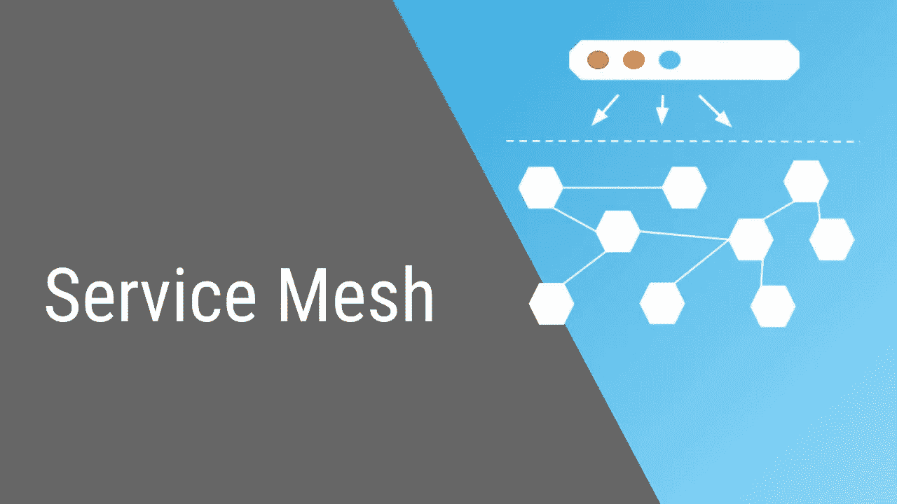

# 为什么不应该使用服务网格

> 原文：<https://medium.com/google-cloud/when-not-to-use-service-mesh-1a44abdeea31?source=collection_archive---------0----------------------->

来源:https://i.ytimg.com/vi/QiXK0B9FhO0/maxresdefault.jpg

**注意事项**

*   **在本文中，我假设您的实现是基于 Kubernetes 的，您可能会注意到我提到了 sidecars、clusters 或 pods。虽然从理论上讲，服务网格可以扩展到虚拟机中，但它们主要是为 Kubernetes 构建的。**
*   **在这篇文章中，我做了很多假设和归纳，这是故意的，也许一个服务网格工具不能满足其中的一些** …