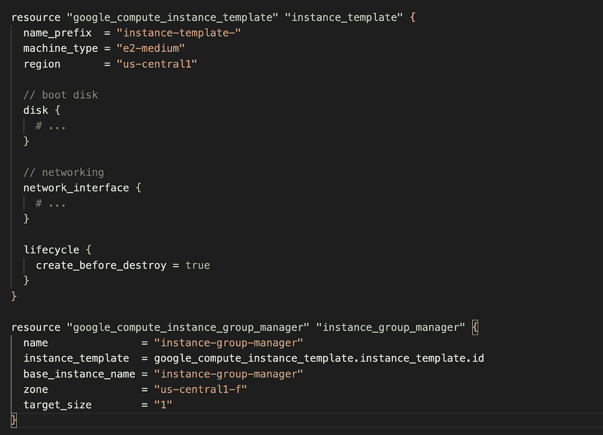

# 什么时候让你的环境随波逐流？以及地形的其他边缘情况。

> 原文：<https://medium.com/google-cloud/when-to-allow-your-environment-to-drift-and-other-edge-cases-for-terraform-a45b290bf013?source=collection_archive---------2----------------------->

Terraform 是在云中供应基础架构的行业标准，它之所以出色有很多原因——它是开源的，与云无关，支持单击实例化和不可变的基础架构。这给我们带来了手头的问题，这与 Terraform 的一个关键优势密切相关，即不变性和环境漂移。

先说环境漂移。环境漂移是基础设施代码和实时环境状态不匹配的现象。从而导致漂移。如果你在原生云领域工作，你会知道这是不可取的，因为它违背了原生云原则，即你的基础设施代码应该是你的环境的唯一真实来源。但是这有反模式吗？

让我们看一个我们不希望环境漂移被校正的场景。假设我们的基础设施代码声明我们有 3 个标签——LOB 名称、成本中心和计费 ID。*假设您正在公共云上运行一个自助服务平台，并使用这些标签向相应部门收取云消费费用。*这些标签是永久性的，是作为自动化基础设施实例化管道的一部分创建的。并因此在“terraform.tfstate”文件中被跟踪，该文件是 terraform 的真实世界资源到您的配置的映射，跟踪元数据；简而言之，它捕捉到了上次运行 Terraform“应用”或“刷新”时您的环境所处的真实状态。如果从控制台或 CLI 更新这些标签的键值对之一，环境状态将与“terraform.state”不匹配，从而导致漂移。

因此，如果您为环境重新运行 terraform，它将重写这些值以匹配基础设施代码。*这无疑是地形最强的能力之一，也是它被如此广泛接受的原因。*这也将我们带到了一个边缘案例，假设发生了重组(发生的次数超过了我们的期望，对吗？)因此，成本中心和计费 ID 已经更改。这是一个关键的更新，将决定谁为各自的资源计费，如果您的计费周期即将结束，它也可能是时间敏感的。还有一个因素要考虑，这些变化可能是频繁的。

我们有两个选择，通过控制台或 CLI 更新 Terraform 代码以反映更改或更新键值对。

在上述场景中，在 Terraform 之外更新值可能是有利的，在这些场景中，更新代码是一项开销，并且/或者管理成本中心和计费 ID 的资源希望能够自由地在云中管理这些资源，而不需要管理 Terraform 的团队参与。

幸运的是，Terraform 想到并接受了这种边缘情况，并为其构建了一个特性。

输入(请击鼓)“元论点”。`lifecycle`是可以出现在资源块中的嵌套块。`lifecycle`块及其内容是元参数。

***注:适用于所有*** `***resource***` ***块，不论类型。***

生命周期资源块中特定于我们的边缘案例的参数是`ignore_changes`元参数。

默认情况下，Terraform 会检测真实基础架构对象的当前设置中的任何差异，并计划更新远程对象以匹配配置

`ignore_changes`元变元旨在用于在创建资源时引用将来可能改变的数据，但在创建后不应影响所述资源。在一些罕见的情况下，远程对象的设置被 Terraform 之外的进程修改，Terraform 将在下次运行时尝试“修复”。为了使 Terraform 通过单独的进程分担单个对象的管理责任，`ignore_changes`元参数指定了 Terraform 在计划相关远程对象的更新时应该忽略的资源属性。

当计划一个*创建*操作时，对应于给定属性名的参数被考虑，但是当计划一个*更新*时，这些参数被忽略。参数是资源中属性的相对地址。映射和列表元素可以使用索引符号引用，分别像`tags["Name"]`和`list[0]`。" *—来自 Terraform 网页*

上面的文字表示，添加到 ignore_changes 元参数的属性仍将在“terraform 应用和销毁”时创建和销毁，但不会在随后的“terraform 应用”中更新(重写或修复)。这正好解决了我们的问题。每当业务事件导致“成本中心”和“计费 ID”发生变化时，相关的 FinOps 团队可以去更新这些标签的键:值对，而不必担心地形和相关的延迟。

这就是它想要的效果:

ignore_changes 元参数

在`lifecycle`块中可用的其他参数有`create_before_destroy`、`prevent_destroy`和`replace_triggered_by`。所有这些论点都有它们适合的独特的边缘情况。让我们从更高的层面来看待它们。

`create_before_destroy`:默认情况下，当 Terraform 必须更改由于远程 API 限制而无法就地更新的资源参数时，Terraform 会销毁现有对象，然后用新配置的参数创建一个新的替换对象。`create_before_destroy`元参数改变了这种行为，因此新的替换对象首先被创建*，*并且先前的对象在替换对象被创建后被销毁。这对于我们不希望停机的边缘情况非常有用，例如，我们总是希望资源的副本处于运行状态。

create_before_destroy 元参数

`prevent_destroy`:当设置为`true`时，该元参数将导致 Terraform 错误地拒绝任何会破坏与资源相关联的基础设施对象的计划，只要该参数仍然存在于配置中。这可以作为一种安全措施，防止复制成本高昂的对象(如业务关键型计算)被意外替换。`prevent_destroy`提供了一个额外的保护层，防止意外删除，或者为您想要在 Terraform 之外管理的资源提供保护。元参数设置为“true”的资源的销毁需要一个额外的步骤来确认您“真的”想要删除该资源。您可以对 Terraform 代码进行更改，在提交之前会经过一个 PR 过程，或者您必须到控制台手动删除资源(理想情况下只有少数人有权限这样做)。

防止 _ 销毁元参数

`replace_triggered_by`:当任何被引用的资源发生变化时，替换该资源。注意，这里的更改包括修改和删除。您可以提供引用多个资源的表达式列表。

在以下情况下，引用会触发替换:

*   如果引用具有多个实例的资源，更新或替换任何实例的计划将触发替换。
*   如果引用的是单个资源实例，更新或替换该实例的计划将触发替换。
*   如果引用的是资源实例的单个属性，对属性值的任何更改都将触发替换。

例如，在下面的场景中，我们希望负载平衡器和实例模板资源相互耦合。如果我们删除实例模板，我们肯定不再需要后端服务。

替换触发元参数

我之所以写这篇文章，是因为我觉得随着大型企业采用 Terraform，这些元论点所要解决的边缘情况变得越来越普遍。希望这篇文章有助于减少您发现您正在处理的边缘案例已经被想到的时间。

要了解关于生命周期元参数及其实现的更多信息，请访问下面的 Hashicorp 官方页面。

[https://developer . hashi corp . com/terra form/language/meta-arguments/life cycle](https://developer.hashicorp.com/terraform/language/meta-arguments/lifecycle)